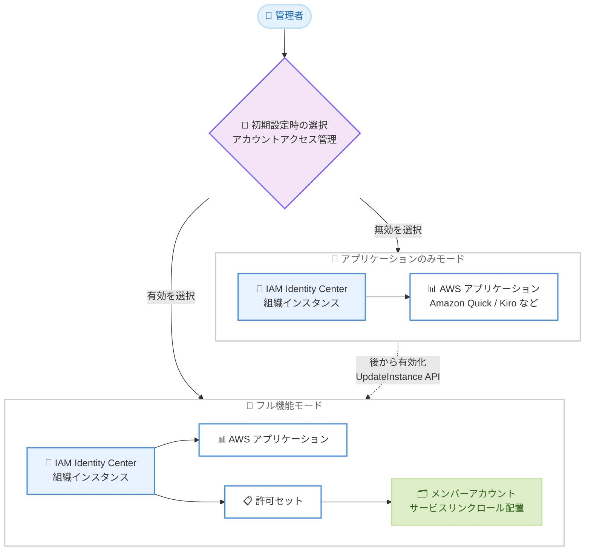

# AWS IAM Identity Center - 新規組織インスタンスにおける AWS アカウントアクセス管理のオプション化

**リリース日**: 2026 年 8 月 5 日
**サービス**: AWS IAM Identity Center
**機能**: 新規組織インスタンス作成時の AWS アカウントアクセス管理のオプション化

📊 [このアップデートのインフォグラフィックを見る](https://takech9203.github.io/aws-news-summary/20260805-aws-identity-center-accounts-optional.html)

## 概要

AWS IAM Identity Center の新しい組織インスタンスを作成する際に、AWS アカウントアクセス管理を有効化するかどうかを選択できるようになりました。これにより、AWS アカウントへのアクセス管理を行わずに、AWS アプリケーション (Amazon Quick、Kiro、Amazon Q Developer など) へのアクセス管理のみを目的として IAM Identity Center を利用できます。

IAM Identity Center は、ワークフォースのアイデンティティを AWS に接続するサービスであり、アプリケーション管理者にはシンプルなアクセス管理を、エンドユーザーにはシングルサインオン (SSO) と AWS アプリケーション全体で一貫した認証体験を提供します。これまでは、AWS アプリケーションのアクセス管理に IAM Identity Center を使用する場合、AWS アカウントアクセス管理も同時に有効化する必要がありました。

このオプションは組織インスタンスの初期設定時にのみ選択可能で、既存の IAM Identity Center インスタンスには影響しません。アカウントアクセス管理を無効のまま作成した場合でも、後からインスタンス設定または UpdateInstance API を使用して有効化できます。

**アップデート前の課題**

以前は、IAM Identity Center を AWS アプリケーションのアクセス管理に使用する場合、以下の課題がありました。

- AWS アプリケーションのアクセス管理のみが目的であっても、AWS アカウントアクセス管理機能が必ず有効化されていた
- IAM Identity Center のサービスリンクロールが組織内のすべてのメンバーアカウントにプロビジョニングされ、必要以上のアクセス面 (アクセスサーフェス) が生じていた
- 既存のフェデレーション基盤で AWS アカウントアクセスを管理している組織では、IAM Identity Center によるアカウントアクセス管理機能が重複し、セキュリティ統制上の懸念となっていた

**アップデート後の改善**

今回のアップデートにより、以下が可能になりました。

- 新規組織インスタンスの初期設定時に、AWS アカウントアクセス管理を有効化するかどうかを選択できるようになった
- アカウントアクセス管理を無効にした場合、サービスリンクロールがメンバーアカウントにプロビジョニングされず、環境のアクセス面を削減できるようになった
- AWS アプリケーションへのアクセス管理のみを目的とした、最小権限に沿った IAM Identity Center の導入が可能になった
- 必要になった時点で、インスタンス設定または UpdateInstance API により後からアカウントアクセス管理を有効化できる

## アーキテクチャ図



初期設定時にアカウントアクセス管理の有効・無効を選択できます。無効を選択した場合はメンバーアカウントへのサービスリンクロールの配置が行われず、後から UpdateInstance API などで有効化することも可能です。

## サービスアップデートの詳細

### 主要機能

1. **AWS アカウントアクセス管理のオプション化**
   - 新規組織インスタンスの作成時に、AWS アカウントアクセス管理 (許可セットによるマルチアカウントアクセス) を有効化するかどうかを選択可能
   - 無効を選択した場合、IAM Identity Center は AWS アプリケーションへのアクセス管理専用として動作
   - 初期設定時のみ選択可能で、既存インスタンスの動作には影響しない

2. **サービスリンクロールのプロビジョニング抑制**
   - アカウントアクセス管理を無効にした場合、IAM Identity Center のサービスリンクロールがメンバーアカウントにプロビジョニングされない
   - 組織内の各アカウントに配置されるロールが減ることで、環境全体のアクセス面を削減
   - 最小権限の原則に沿ったセキュリティ体制を構築可能

3. **後からの有効化に対応**
   - アカウントアクセス管理が必要になった場合、インスタンス設定画面または UpdateInstance API で有効化可能
   - UpdateInstance API の `PermissionSetsEnabled` パラメータに `true` を指定して有効化する
   - 一度有効化した後は無効化できない点に注意が必要

## 技術仕様

### インスタンスタイプと機能の比較

| 項目 | 組織インスタンス (アカウントアクセス管理: 有効) | 組織インスタンス (アカウントアクセス管理: 無効) |
|------|------|------|
| AWS アプリケーションのアクセス管理 | 対応 | 対応 |
| AWS アカウントアクセス管理 (許可セット) | 対応 | 非対応 (後から有効化可能) |
| メンバーアカウントへのサービスリンクロール | プロビジョニングされる | プロビジョニングされない |
| 選択可能なタイミング | 初期設定時 | 初期設定時 |
| 既存インスタンスへの影響 | なし | なし |

### UpdateInstance API によるアカウントアクセス管理の有効化

UpdateInstance API では、`PermissionSetsEnabled` パラメータを使用して許可セット (アカウントアクセス管理) を有効化できます。

```json
{
   "InstanceArn": "arn:aws:sso:::instance/ssoins-xxxxxxxxxxxxxxxx",
   "PermissionSetsEnabled": true
}
```

- `PermissionSetsEnabled` に指定できる値は `true` のみで、有効化後の無効化はできません
- `EncryptionConfiguration` と `PermissionSetsEnabled` は同一リクエストで指定できず、両方を設定する場合は個別に UpdateInstance を呼び出す必要があります

## 設定方法

### 前提条件

1. AWS Organizations が有効化されており、管理アカウントで操作できること
2. 組織で IAM Identity Center の組織インスタンスをまだ作成していないこと (本オプションは新規作成時のみ選択可能)
3. IAM Identity Center を有効化する権限 (管理アカウントの管理者権限) を持っていること

### 手順

#### ステップ1: IAM Identity Center の有効化とオプションの選択

AWS マネジメントコンソールで IAM Identity Center を開き、組織インスタンスの有効化を開始します。初期設定時に AWS アカウントアクセス管理を有効化するかどうかの選択肢が表示されるため、AWS アプリケーションのアクセス管理のみを利用する場合は無効を選択します。

#### ステップ2: アイデンティティソースの接続とアプリケーションの設定

外部 IdP (Okta、Microsoft Entra ID など) や Active Directory を接続するか、IAM Identity Center のディレクトリでユーザーを作成し、AWS アプリケーションへのユーザー・グループ割り当てを設定します。

#### ステップ3: 必要に応じてアカウントアクセス管理を後から有効化

```bash
# インスタンス ARN の確認
aws sso-admin list-instances

# アカウントアクセス管理 (許可セット) の有効化
aws sso-admin update-instance \
  --instance-arn arn:aws:sso:::instance/ssoins-xxxxxxxxxxxxxxxx \
  --permission-sets-enabled
```

`list-instances` で対象インスタンスの ARN を確認し、`update-instance` の `--permission-sets-enabled` オプションで許可セットを有効化します。有効化後は許可セットを作成し、AWS アカウントへのアクセス管理を開始できます。一度有効化すると無効化できない点に注意してください。

## メリット

### ビジネス面

- **段階的な導入が可能**: まず AWS アプリケーションの SSO 基盤として導入し、組織の準備が整った時点でアカウントアクセス管理へ拡張するといった段階的な採用戦略を取れる
- **既存のアクセス管理体制との共存**: 既存のフェデレーション基盤で AWS アカウントアクセスを管理している企業でも、体制を変更せずに Amazon Quick や Kiro などの AWS アプリケーションを利用できる
- **コンプライアンス対応の簡素化**: アカウントアクセスへの影響がないことを明確に示せるため、セキュリティ審査や導入承認プロセスを通しやすくなる

### 技術面

- **アクセス面の削減**: サービスリンクロールがメンバーアカウントにプロビジョニングされないため、組織全体の攻撃対象領域を最小化できる
- **最小権限の原則の徹底**: 利用目的 (アプリケーションアクセス管理) に必要な機能のみを有効化した構成を実現できる
- **可逆性のある設計**: 後から UpdateInstance API で有効化できるため、将来の要件変更にも対応可能

## デメリット・制約事項

### 制限事項

- 本オプションは IAM Identity Center インスタンスの初期設定時にのみ選択可能
- 既存の IAM Identity Center インスタンスでアカウントアクセス管理を無効化することはできない
- 一度アカウントアクセス管理 (許可セット) を有効化すると、無効に戻すことはできない
- UpdateInstance API では `EncryptionConfiguration` と `PermissionSetsEnabled` を同一リクエストで指定できない

### 考慮すべき点

- アカウントアクセス管理を無効にした場合、許可セットによるマルチアカウントアクセスや AWS アクセスポータルからのアカウントアクセスは利用できないため、AWS アカウントへのアクセスは別の仕組み (既存のフェデレーションなど) で管理する必要がある
- 将来的にアカウントアクセス管理を利用する可能性がある場合は、有効化のタイミングと影響範囲 (サービスリンクロールのプロビジョニングなど) を事前に計画しておくことが望ましい
- 組織インスタンスの再作成にはユーザー・グループ・アプリケーション割り当ての再設定が伴うため、初期設定時の選択は慎重に行う

## ユースケース

### ユースケース1: 既存フェデレーション基盤を維持したまま AWS アプリケーションを導入

**シナリオ**: 既に IAM フェデレーション (SAML 2.0) で AWS アカウントアクセスを管理している企業が、Amazon Quick や Amazon Q Developer などの AWS アプリケーションを利用したい。アカウントアクセス管理の二重化は避けたい。

**実装例**:
```
1. 新規組織インスタンス作成時にアカウントアクセス管理を無効で作成
2. 既存 IdP を IAM Identity Center のアイデンティティソースとして接続
3. Amazon Quick / Amazon Q Developer へのユーザー・グループ割り当てを設定
4. AWS アカウントアクセスは既存のフェデレーションを継続利用
```

**効果**: 既存のアクセス管理体制を変更せずに AWS アプリケーションの SSO を実現し、アカウントアクセス経路の重複によるガバナンス上の懸念を排除できる。

### ユースケース2: セキュリティ要件が厳しい組織での最小権限導入

**シナリオ**: 金融機関など厳格なセキュリティ統制が求められる組織で、メンバーアカウントへの不要なロール配置を避けつつ、AWS アプリケーションの利用を開始したい。

**実装例**:
```
1. アカウントアクセス管理を無効にして組織インスタンスを作成
2. サービスリンクロールがメンバーアカウントに配置されないことを確認
3. SCP と組み合わせて、アプリケーションの利用範囲を指定アカウントに限定
```

**効果**: 環境全体のアクセス面を削減し、最小権限の原則に沿った構成でセキュリティ審査を通過しやすくなる。

### ユースケース3: 段階的な IAM Identity Center への移行

**シナリオ**: 将来的には IAM Identity Center によるマルチアカウントアクセス管理へ移行したいが、まずはアプリケーションの SSO から小さく始めたい。

**実装例**:
```
1. アカウントアクセス管理を無効にして組織インスタンスを作成し、アプリケーション SSO を運用
2. 移行準備が整った段階で UpdateInstance API を実行:
   aws sso-admin update-instance \
     --instance-arn arn:aws:sso:::instance/ssoins-xxxxxxxxxxxxxxxx \
     --permission-sets-enabled
3. 許可セットを作成し、段階的にアカウントアクセスを移行
```

**効果**: 小さく始めて段階的に拡張するアプローチにより、移行リスクを抑えながら IAM Identity Center への統合を進められる。

## 料金

IAM Identity Center は追加料金なしで利用できます。今回のアップデートによる追加料金も発生しません。

## 利用可能リージョン

IAM Identity Center が利用可能なすべての AWS リージョンで利用できます。

## 関連サービス・機能

- **AWS Organizations**: 組織インスタンスの前提となるサービス。組織全体のアカウント管理と SCP による統制を提供
- **AWS IAM**: サービスリンクロールやフェデレーションなど、アカウントアクセスの基盤となるサービス
- **Amazon Quick / Amazon Q Developer / Kiro**: IAM Identity Center と連携する AWS マネージドアプリケーションの例
- **外部 IdP (Okta、Microsoft Entra ID など)**: IAM Identity Center のアイデンティティソースとして接続可能

## 参考リンク

- 📊 [インフォグラフィック](https://takech9203.github.io/aws-news-summary/20260805-aws-identity-center-accounts-optional.html)
- [公式発表 (What's New)](https://aws.amazon.com/about-aws/whats-new/2026/08/aws-identity-center-accounts-optional/)
- [ドキュメント: AWS managed applications (IAM Identity Center User Guide)](https://docs.aws.amazon.com/singlesignon/latest/userguide/awsapps.html)
- [API リファレンス: UpdateInstance](https://docs.aws.amazon.com/singlesignon/latest/APIReference/API_UpdateInstance.html)
- [料金 (IAM Identity Center は追加料金なし)](https://aws.amazon.com/iam/identity-center/)

## まとめ

今回のアップデートにより、IAM Identity Center を AWS アプリケーション専用の SSO 基盤として、AWS アカウントアクセス管理を有効化せずに導入できるようになりました。既存のフェデレーション基盤を持つ組織や、最小権限での導入を求める組織にとって採用の障壁が下がる重要な改善です。新規に組織インスタンスを作成する際は、自組織のアカウントアクセス管理方針に照らして本オプションの利用を検討することを推奨します。
