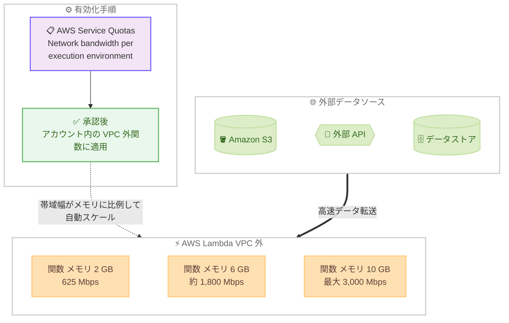

# AWS Lambda - VPC 外の関数向けスケーラブルネットワーク帯域幅 (最大 3,000 Mbps)

**リリース日**: 2026 年 8 月 5 日
**サービス**: AWS Lambda
**機能**: VPC 外の Lambda 関数向けスケーラブルネットワーク帯域幅

📊 [このアップデートのインフォグラフィックを見る](https://takech9203.github.io/aws-news-summary/20260805-aws-lambda-network-bandwidth.html)

## 概要

AWS Lambda は、VPC にアタッチされていない関数向けに、メモリサイズに比例してスケールするネットワーク帯域幅を発表しました。2 GB 以上のメモリを設定した関数は、2 GB で 625 Mbps から始まり、10 GB (10,240 MB) で最大 3,000 Mbps までネットワーク帯域幅が自動的にスケールします。これにより、従来の帯域幅上限がボトルネックとなっていたデータ転送処理を大幅に高速化できます。

本機能は、外部データソースから実行環境へ大容量データ (最大数テラバイト規模) を取り込むレイテンシセンシティブなデータ処理ワークロードを対象としています。転送スループットの向上により、関数の実行時間短縮、呼び出しあたりのコスト削減、エンドユーザー体験の改善が期待できます。

有効化は AWS Service Quotas の「Network bandwidth per execution environment」クォータに対する引き上げリクエストで行います。承認後は、アカウント内の VPC 外のすべての関数に対して、各関数のメモリ設定に基づき帯域幅が自動的にスケールします。追加料金は不要で、すべての商用 AWS リージョンで利用可能です。

**アップデート前の課題**

このアップデート以前は、Lambda 関数のネットワーク帯域幅に固定の上限がありました。

- 実行環境あたりのネットワーク帯域幅は 625 Mbps に制限されており、メモリを増やしても帯域幅は向上しなかった
- 大容量データ (数百 GB - 数 TB 規模) を外部ソースから取り込む処理では、帯域幅がボトルネックとなり実行時間が長期化していた
- 実行時間の長期化は Lambda の課金額 (GB - 秒) の増加とレイテンシ悪化に直結し、大容量データ処理に Lambda を採用しにくい要因となっていた
- 帯域幅を確保するために処理を分割・並列化するなど、アーキテクチャ側での回避策が必要だった

**アップデート後の改善**

今回のアップデートにより、メモリ設定に応じた帯域幅の自動スケーリングが可能になりました。

- 2 GB 以上のメモリを設定した VPC 外の関数で、625 Mbps (2 GB 時) から最大 3,000 Mbps (10 GB 時) まで帯域幅がメモリに比例してスケールするようになった
- 従来比最大約 4.8 倍のスループットにより、大容量データの取り込み・転送時間を短縮できるようになった
- 実行時間の短縮により、呼び出しあたりのコスト削減とエンドユーザー体験の改善が可能になった
- Service Quotas でのリクエストのみで有効化でき、関数コードやアーキテクチャの変更は不要

## アーキテクチャ図



Service Quotas でクォータ引き上げが承認されると、VPC 外の関数のネットワーク帯域幅がメモリ設定に比例して自動的にスケールします。

## サービスアップデートの詳細

### 主要機能

1. **メモリに比例した帯域幅の自動スケーリング**
   - メモリ 2,048 MB (2 GB) 以上の関数が対象
   - 2 GB で 625 Mbps から始まり、メモリに比例して増加
   - 10,240 MB (10 GB) で最大 3,000 Mbps に到達
   - 承認後は関数ごとの追加設定は不要で、メモリ設定に基づき自動適用

2. **Service Quotas によるオプトイン方式**
   - AWS Service Quotas の「Network bandwidth per execution environment」クォータで引き上げをリクエスト
   - 承認されると、アカウント内の VPC 外のすべての関数に適用される
   - デフォルトの帯域幅は従来どおり 625 Mbps

3. **追加料金なし**
   - 帯域幅のスケーリング自体に追加料金は発生しない
   - 帯域幅向上により実行時間が短縮されれば、GB - 秒ベースの課金額の削減につながる

## 技術仕様

### 帯域幅スケーリングの仕様

| 項目 | 詳細 |
|------|------|
| 対象関数 | VPC にアタッチされていない Lambda 関数 |
| 必要メモリ | 2,048 MB (2 GB) 以上 |
| 帯域幅の範囲 | 625 Mbps (2 GB 時) - 最大 3,000 Mbps (10,240 MB 時) |
| スケーリング方式 | メモリサイズに比例して自動スケール |
| デフォルト帯域幅 | 625 Mbps (クォータ引き上げ前) |
| 有効化方法 | Service Quotas の「Network bandwidth per execution environment」クォータの引き上げリクエスト |
| 適用範囲 | 承認後、アカウント内の VPC 外のすべての関数 |
| 追加料金 | なし |

### メモリ設定と帯域幅の目安

帯域幅はメモリに比例してスケールします。主なメモリ設定における帯域幅の目安は以下のとおりです。

| メモリ設定 | ネットワーク帯域幅 (目安) |
|------------|---------------------------|
| 2,048 MB (2 GB) | 625 Mbps |
| 4,096 MB (4 GB) | 約 1,200 Mbps |
| 6,144 MB (6 GB) | 約 1,800 Mbps |
| 8,192 MB (8 GB) | 約 2,400 Mbps |
| 10,240 MB (10 GB) | 最大 3,000 Mbps |

※ 2 GB と 10 GB の公表値からの比例計算による目安です。正確な値は [Lambda クォータのドキュメント](https://docs.aws.amazon.com/lambda/latest/dg/gettingstarted-limits.html)を参照してください。

## 設定方法

### 前提条件

1. 対象の Lambda 関数が VPC にアタッチされていないこと
2. 対象の Lambda 関数のメモリ設定が 2,048 MB 以上であること
3. Service Quotas でクォータ引き上げをリクエストする IAM 権限があること

### 手順

#### ステップ 1: Service Quotas でクォータ引き上げをリクエスト

```bash
# Lambda の「Network bandwidth per execution environment」クォータを確認
aws service-quotas list-service-quotas \
  --service-code lambda \
  --query "Quotas[?contains(QuotaName, 'Network bandwidth')]"

# クォータ引き上げをリクエスト (QuotaCode は上記コマンドの出力で確認)
aws service-quotas request-service-quota-increase \
  --service-code lambda \
  --quota-code <QuotaCode> \
  --desired-value 3000
```

Service Quotas API を使用して、Lambda の「Network bandwidth per execution environment」クォータの現在値を確認し、引き上げをリクエストします。[Service Quotas コンソール](https://console.aws.amazon.com/servicequotas/home/services/lambda/quotas)からも同様のリクエストが可能です。

#### ステップ 2: 関数のメモリ設定を調整

```bash
# 関数のメモリを 10 GB (10,240 MB) に設定して最大帯域幅を利用
aws lambda update-function-configuration \
  --function-name my-data-processing-function \
  --memory-size 10240
```

クォータ引き上げの承認後、関数のメモリ設定に比例して帯域幅がスケールします。必要なスループットに応じてメモリサイズを調整します。最大の 3,000 Mbps を利用するには 10,240 MB を設定します。

#### ステップ 3: 効果の確認

```bash
# CloudWatch Logs で関数の実行時間を確認
aws logs filter-log-events \
  --log-group-name /aws/lambda/my-data-processing-function \
  --filter-pattern "REPORT" \
  --limit 10
```

REPORT ログの Duration (実行時間) を有効化前後で比較し、データ転送処理の高速化効果を確認します。実行時間が短縮されていれば、コスト削減効果も得られています。

## メリット

### ビジネス面

- **コスト削減**: データ転送の高速化により関数の実行時間が短縮され、GB - 秒ベースの Lambda 課金額を削減できる。帯域幅のスケーリング自体は追加料金なし
- **ユーザー体験の向上**: レイテンシセンシティブなワークロードの応答時間が改善され、エンドユーザー体験が向上する
- **サーバーレス適用範囲の拡大**: 従来は帯域幅の制約で Lambda に不向きだった大容量データ処理ワークロードにも、サーバーレスアーキテクチャを適用しやすくなる

### 技術面

- **最大約 4.8 倍のスループット**: 従来の 625 Mbps 上限から最大 3,000 Mbps へ向上し、数テラバイト規模のデータ転送時間を大幅に短縮できる
- **コード変更不要**: Service Quotas でのリクエストとメモリ設定のみで有効化でき、関数コードやアーキテクチャの変更が不要
- **自動スケーリング**: 承認後はメモリ設定に基づき帯域幅が自動的に決まるため、関数ごとの個別設定や管理が不要

## デメリット・制約事項

### 制限事項

- VPC にアタッチされた関数は対象外 (VPC 内の関数は従来の帯域幅のまま)
- メモリ 2,048 MB (2 GB) 未満の関数では帯域幅はスケールしない
- 最大帯域幅は 3,000 Mbps (10,240 MB 設定時) が上限
- 事前に Service Quotas でのクォータ引き上げリクエストと承認が必要 (デフォルトでは有効化されない)

### 考慮すべき点

- 帯域幅はメモリに比例するため、高帯域幅を得るには高メモリ設定が必要となり、メモリ単価分の実行コストは増加する。転送時間短縮による課金時間の削減効果と合わせて総コストを評価する必要がある
- 承認後はアカウント内の VPC 外のすべての関数に適用されるため、関数単位での有効・無効の切り替えはできない
- 実際のスループットは、通信相手側 (S3、外部 API など) の性能やネットワーク条件にも依存する

## ユースケース

### ユースケース 1: 大容量ファイルの ETL 処理

**シナリオ**: Amazon S3 上の大容量ファイル (数十 GB - 数 TB) をダウンロードして変換し、別のバケットへアップロードする ETL 処理を Lambda で実行している。従来は 625 Mbps の帯域幅がボトルネックとなり、転送に時間がかかっていた。

**実装例**:
```bash
# メモリを 10 GB に設定し、最大 3,000 Mbps の帯域幅を利用
aws lambda update-function-configuration \
  --function-name etl-transform-function \
  --memory-size 10240 \
  --timeout 900
```

**効果**: データ転送スループットが最大約 4.8 倍に向上し、転送待ち時間が大幅に短縮。実行時間の短縮により呼び出しあたりのコストも削減できる。

### ユースケース 2: 機械学習モデル・大容量アセットのロード

**シナリオ**: 推論用 Lambda 関数の初期化時に、数 GB の機械学習モデルや大容量アセットを外部ストレージからダウンロードしており、コールドスタート時のロード時間が課題となっている。

**実装例**:
```python
import boto3

s3 = boto3.client("s3")

# 初期化フェーズで大容量モデルをダウンロード (帯域幅向上によりロード時間が短縮)
s3.download_file("model-bucket", "models/large-model.bin", "/tmp/large-model.bin")

def handler(event, context):
    # ロード済みモデルで推論を実行
    ...
```

**効果**: モデルダウンロードの所要時間が短縮され、コールドスタート時の初期化レイテンシが改善。レイテンシセンシティブな推論ワークロードの応答性が向上する。

### ユースケース 3: 外部 API・データソースからの高速データ取り込み

**シナリオ**: 外部の SaaS API やデータソースから大量のデータを定期的に取り込み、AWS 内のデータレイクへ格納するインジェスト処理を Lambda で実装している。取り込みデータ量の増加に伴い、帯域幅の制約で処理時間が SLA を圧迫していた。

**実装例**:
```bash
# インジェスト関数のメモリを 6 GB に設定し、約 1,800 Mbps の帯域幅を確保
aws lambda update-function-configuration \
  --function-name data-ingest-function \
  --memory-size 6144
```

**効果**: 必要なスループットに応じてメモリ設定を調整することで、SLA を満たす転送速度を確保。処理の分割・並列化などの回避策が不要になり、アーキテクチャがシンプルになる。

## 料金

スケーラブルネットワーク帯域幅の利用に追加料金は発生しません。Lambda の料金は従来どおり、リクエスト数と実行時間 (メモリ設定に応じた GB - 秒) に基づいて課金されます。

高帯域幅を得るために高メモリを設定するとメモリ単価分のコストは増加しますが、データ転送の高速化により実行時間が短縮されるため、大容量データ転送ワークロードでは呼び出しあたりの総コストが削減できる場合があります。

詳細は [AWS Lambda 料金ページ](https://aws.amazon.com/lambda/pricing/)を参照してください。

## 利用可能リージョン

すべての商用 AWS リージョンで利用可能です (東京・大阪リージョンを含む)。

## 関連サービス・機能

- **AWS Service Quotas**: 本機能の有効化に使用。「Network bandwidth per execution environment」クォータの引き上げをリクエストする
- **Amazon S3**: 大容量データの転送元・転送先として代表的なサービス。帯域幅向上により S3 との間のデータ転送が高速化される
- **Amazon CloudWatch**: 関数の実行時間 (Duration) をモニタリングし、帯域幅向上による効果測定に活用できる
- **Lambda メモリ設定**: 帯域幅はメモリに比例してスケールする。メモリは CPU 性能にも比例するため、メモリ・CPU・帯域幅を一体でチューニングする

## 参考リンク

- 📊 [インフォグラフィック](https://takech9203.github.io/aws-news-summary/20260805-aws-lambda-network-bandwidth.html)
- [公式発表 (What's New)](https://aws.amazon.com/about-aws/whats-new/2026/08/aws-lambda-network-bandwidth/)
- [ドキュメント: Lambda quotas](https://docs.aws.amazon.com/lambda/latest/dg/gettingstarted-limits.html)
- [Service Quotas コンソール (Lambda)](https://console.aws.amazon.com/servicequotas/home/services/lambda/quotas)
- [AWS Lambda 製品ページ](https://aws.amazon.com/lambda/)
- [料金ページ](https://aws.amazon.com/lambda/pricing/)

## まとめ

VPC 外の Lambda 関数のネットワーク帯域幅が、メモリに比例して最大 3,000 Mbps までスケールできるようになり、大容量データ転送を伴うワークロードでの実行時間短縮とコスト削減が期待できます。追加料金なしで Service Quotas からのリクエストのみで有効化できるため、S3 との大容量ファイル転送や外部データソースからのインジェストなどで帯域幅がボトルネックになっている場合は、クォータ引き上げのリクエストとメモリ設定の見直しを検討することを推奨します。
