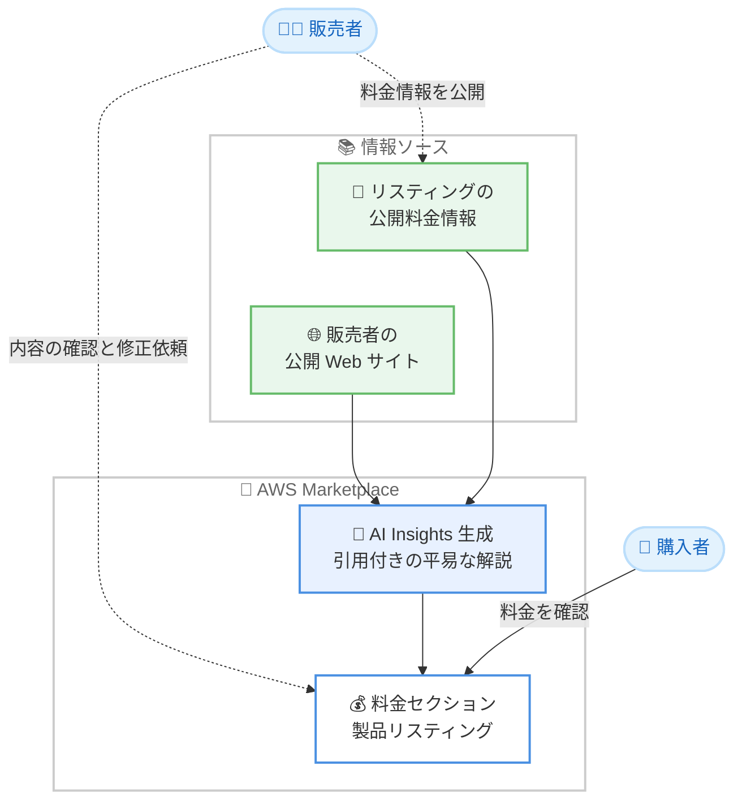

# AWS Marketplace - AI Insights による購入前の料金体系の理解支援

**リリース日**: 2026 年 8 月 5 日
**サービス**: AWS Marketplace
**機能**: AI Insights

📊 [このアップデートのインフォグラフィックを見る](https://takech9203.github.io/aws-news-summary/20260805-aws-marketplace-ai-insights.html)

## 概要

AWS Marketplace は、製品リスティングの料金セクションに AI Insights を追加しました。AI Insights は、各製品の料金体系を平易な言葉で解説する機能です。具体的には、料金単位 (pricing unit) が実際に何に対応するのか、使用量の増加に応じて請求額がどのように変化するのか、複数の料金ディメンションがどのように組み合わさって 1 つのコストになるのか、そして料金に何が含まれ何が含まれないのかを説明します。

AI Insights は説明の根拠となる情報源を引用付きで提示します。情報源は、販売者が Marketplace リスティングに公開している料金情報と、販売者の公開 Web サイト上の追加の料金コンテキストの 2 つです。これにより、購入者は説明の出典をたどって内容を検証できます。

本機能は発表当日から、外部の料金コンテキストが利用可能なほとんどのリスティングで有効になっており、AWS Marketplace が提供されているすべての商用 AWS リージョンで利用できます。SaaS 製品などの複雑な従量課金モデルを持つ製品の評価を行う購入者、および自社製品の料金を購入者にわかりやすく伝えたい販売者の双方にメリットがあります。

**アップデート前の課題**

このアップデート以前、購入者は料金体系の理解に手間がかかっていました。

- 以前は料金単位の意味や課金の仕組みを理解するために、複数の Web サイトを行き来して情報を自分で組み立てる必要があった
- 以前は複数の料金ディメンションが組み合わさる製品では、実際の請求額がどう決まるのかを把握しにくかった
- 以前は料金に含まれるもの・含まれないものの判断に、販売者への問い合わせや外部サイトの調査が必要だった

**アップデート後の改善**

今回のアップデートにより、購入前の料金理解が大幅に簡素化されました。

- リスティングの料金セクション内で料金体系の平易な解説を直接確認できるようになり、タブを切り替えることなく評価から購入まで進められるようになった
- 使用量のスケールに応じた請求額の変化や、複数ディメンションの組み合わせ方を平易な言葉で理解できるようになった
- 引用付きの説明により、情報の出典を確認しながら安心して購入判断ができるようになった

## アーキテクチャ図



AI Insights は、リスティング上の公開料金情報と販売者の公開 Web サイトの 2 つの情報源から、引用付きの平易な料金解説を自動生成し、製品リスティングの料金セクションに表示します。

## サービスアップデートの詳細

### 主要機能

1. **平易な言葉による料金体系の解説**
   - 料金単位 (pricing unit) が実際に何を意味するのかを説明
   - 使用量が増加した場合に請求額がどのように変化するのかを説明
   - 複数の料金ディメンションがどのように組み合わさって 1 つのコストになるのかを説明
   - 料金に含まれるもの・含まれないものを明示

2. **引用付きの情報提示**
   - AI Insights は説明の根拠となる情報源を引用として提示
   - 購入者は説明の出典をたどって内容を検証可能
   - 情報源は、リスティング上の販売者公開の料金情報と、販売者の公開 Web サイト上の追加コンテキスト

3. **自動生成と自動更新**
   - 公開料金情報が利用可能なリスティングに対して自動的に生成され、販売者側の有効化作業は不要
   - 料金や製品詳細が変更された場合、AI Insights は定期的に再生成され、最新情報を反映
   - ディメンションのサマリーとよくある質問 (FAQ) 形式の解説を含む

4. **販売者によるレビューと修正依頼**
   - 販売者は AWS Marketplace カタログで自社リスティングを表示し、AI Insights の内容をいつでも確認可能
   - 修正を希望する場合は Contact Us フォームからフィードバックを送信
   - AWS Marketplace チームが内容をレビューし、必要に応じて解説を修正

## 技術仕様

### 機能の仕様

| 項目 | 詳細 |
|------|------|
| 表示場所 | 製品リスティングの料金セクション |
| 生成方法 | AI による自動生成 (販売者の操作は不要) |
| 情報源 | リスティングの公開料金情報、販売者の公開 Web サイト |
| 引用 | 説明の根拠となる情報源を引用として提示 |
| 更新 | 料金や製品詳細の変更を反映するため定期的に再生成 |
| 対象リスティング | 外部の料金コンテキストが利用可能なほとんどのリスティング |
| 販売者側の制御 | 内容のレビューおよび Contact Us フォーム経由での修正依頼 |

## 設定方法

### 前提条件

1. 購入者: AWS Marketplace のサイトにアクセスできること (閲覧に AWS アカウントは不要)
2. 販売者: リスティングに公開料金情報が設定されていること
3. 販売者: 修正依頼を行う場合は AWS Marketplace Management Portal へのアクセス権限があること

### 手順

#### ステップ 1: 購入者として AI Insights を確認する

1. [AWS Marketplace](https://aws.amazon.com/marketplace/) にアクセスする
2. 任意の製品リスティングを開く
3. 料金セクションまでスクロールし、AI Insights の解説を確認する

外部の料金コンテキストが利用可能なリスティングでは、料金単位の意味や請求額の変化に関する解説が引用付きで表示されます。

#### ステップ 2: 販売者として自社リスティングの AI Insights をレビューする

1. AWS Marketplace カタログで自社の製品リスティングを表示する
2. 料金セクションに表示されている AI Insights の内容を確認する

AI Insights は公開料金情報が利用可能なリスティングに対して自動生成されるため、販売者側での有効化作業は不要です。

#### ステップ 3: 販売者として修正を依頼する

1. AWS Marketplace Seller Guide の [AI Insights ドキュメント](https://docs.aws.amazon.com/marketplace/latest/userguide/ai-insights.html)にアクセスする
2. リンクされている Contact Us フォームから、製品 ID と製品タイトルを添えて修正内容を送信する
3. AWS Marketplace チームによるレビューとフォローアップを待つ

送信されたフィードバックは AWS Marketplace チームがレビューし、必要に応じて AI Insights の内容が修正されます。

## メリット

### ビジネス面

- **購入判断の迅速化**: 料金体系の理解に必要な情報がリスティング上に集約されるため、購入者はタブを切り替えることなく評価から購入まで進められる
- **調達プロセスの透明性向上**: 料金に含まれるもの・含まれないものが明示されるため、予期しないコストの発生リスクを購入前に把握できる
- **販売者の問い合わせ負荷軽減**: 料金に関するよくある質問が AI Insights で解消されるため、販売者への基本的な料金問い合わせが減少する可能性がある

### 技術面

- **引用による検証可能性**: 説明の根拠となる情報源が引用として提示されるため、AI 生成コンテンツの内容を出典に基づいて検証できる
- **自動更新による情報の鮮度維持**: 料金や製品詳細の変更が定期的な再生成によって反映されるため、古い情報が表示され続けるリスクが低い
- **複雑な料金モデルの理解支援**: 複数の料金ディメンションの組み合わせなど、従来は理解が難しかった課金構造を平易な言葉で把握できる

## デメリット・制約事項

### 制限事項

- 外部の料金コンテキストが利用可能なリスティングが対象であり、すべてのリスティングに表示されるわけではない
- AI Insights は情報源の公開料金情報に依存するため、販売者が料金を公開していない製品では生成されない
- 販売者が AI Insights の内容を直接編集することはできず、修正は Contact Us フォーム経由での依頼と AWS Marketplace チームのレビューが必要

### 考慮すべき点

- AI が生成した解説であるため、正式な契約条件や見積もりの代替にはならず、最終的な購入判断では販売者の公式な料金情報を確認する必要がある
- 料金や製品詳細の変更後、AI Insights への反映は定期的な再生成のタイミングに依存するため、即時反映されない場合がある
- 販売者は自社リスティングの AI Insights を定期的にレビューし、意図しない解説が表示されていないか確認することが推奨される

## ユースケース

### ユースケース 1: SaaS 製品の従量課金モデルの評価

**シナリオ**: 企業の調達担当者が、複数の料金ディメンション (ユーザー数、API コール数、データ量など) を持つ SaaS 製品の導入を検討しており、月額コストの見通しを立てたい。

**実装例**:
```
1. AWS Marketplace で対象の SaaS 製品リスティングを開く
2. 料金セクションの AI Insights で以下を確認する
   - 各料金単位が何に対応するか
   - 使用量が増えた場合の請求額の変化
   - 複数ディメンションの組み合わせ方
3. 引用元をたどって販売者の公式情報を検証する
```

**効果**: 複数の Web サイトを調査することなく、リスティング上でコスト構造を理解し、社内稟議用のコスト見積もりを迅速に作成できる。

### ユースケース 2: 競合製品間の料金比較

**シナリオ**: アーキテクトが同一カテゴリの複数のセキュリティ製品を比較しており、各製品の料金に何が含まれているか (サポート、追加機能など) を正確に把握したい。

**実装例**:
```
1. 比較対象の各製品リスティングを AWS Marketplace で開く
2. 各リスティングの AI Insights で「料金に含まれるもの・
   含まれないもの」を確認する
3. 同一の使用量想定で各製品の課金構造を比較する
```

**効果**: 表面上の単価だけでなく、料金に含まれる範囲まで考慮した公平な比較が可能になり、導入後の想定外コストを回避できる。

### ユースケース 3: 販売者による自社リスティングの品質管理

**シナリオ**: ISV の製品マーケティング担当者が、自社製品の AI Insights が正確な料金説明を表示しているかを確認し、必要に応じて修正したい。

**実装例**:
```
1. AWS Marketplace カタログで自社リスティングを表示する
2. 料金セクションの AI Insights の内容をレビューする
3. 修正が必要な場合、Seller Guide の AI Insights ページから
   Contact Us フォームで製品 ID・製品タイトルとともに
   修正内容を送信する
```

**効果**: 購入者に表示される料金説明の正確性を維持し、誤解による商談の機会損失や購入後のトラブルを防止できる。

## 料金

AI Insights は AWS Marketplace の機能として提供され、購入者・販売者ともに追加料金なしで利用できます。表示される内容は各製品の料金説明であり、AI Insights 自体に課金は発生しません。

## 利用可能リージョン

AWS Marketplace が提供されているすべての商用 AWS リージョンで利用可能です。発表時点で、外部の料金コンテキストが利用可能なほとんどのリスティングに表示されています。

## 関連サービス・機能

- **AWS Marketplace**: 本機能が提供されるソフトウェア・データ・サービスのカタログ。サードパーティ製品の検索、購入、デプロイ、管理を一元化する
- **AWS Marketplace Seller Guide**: 販売者向けのドキュメント。AI Insights のレビューと修正依頼の手順が記載されている
- **AWS Marketplace Management Portal**: 販売者がリスティングを管理するポータル。Contact Us フォームによる修正依頼の窓口となる

## 参考リンク

- 📊 [インフォグラフィック](https://takech9203.github.io/aws-news-summary/20260805-aws-marketplace-ai-insights.html)
- [公式発表 (What's New)](https://aws.amazon.com/about-aws/whats-new/2026/08/aws-marketplace-ai-insights/)
- [ドキュメント (AI Insights - AWS Marketplace Seller Guide)](https://docs.aws.amazon.com/marketplace/latest/userguide/ai-insights.html)
- [AWS Marketplace](https://aws.amazon.com/marketplace/)

## まとめ

AWS Marketplace の AI Insights により、購入者はリスティングの料金セクションで製品の課金構造を平易な言葉と引用付きで理解できるようになり、複数サイトを調査する手間が不要になりました。ソフトウェア調達に関わる担当者は、製品評価の際に AI Insights を活用してコスト構造を素早く把握することを推奨します。また、AWS Marketplace に出品している販売者は、自社リスティングに表示される AI Insights の内容を一度確認し、必要に応じて修正を依頼することを推奨します。
