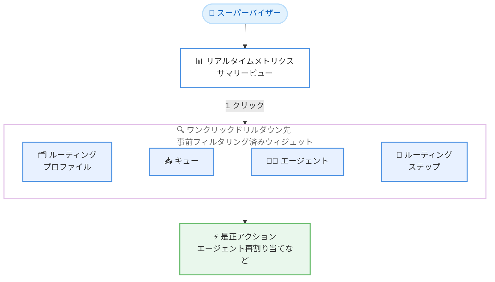

# Amazon Connect Customer - リアルタイムメトリクスダッシュボードのワンクリックドリルダウン

**リリース日**: 2026 年 8 月 6 日
**サービス**: Amazon Connect Customer
**機能**: リアルタイムメトリクスダッシュボードにおけるワンクリックドリルダウン

📊 [このアップデートのインフォグラフィックを見る](https://takech9203.github.io/aws-news-summary/20260806-amazon-connect-drill-down-metrics.html)

## 概要

Amazon Connect Customer のリアルタイムメトリクスダッシュボードが、ワンクリックでのドリルダウンをサポートしました。スーパーバイザーは、キューやルーティングプロファイルのパフォーマンスをサマリービューで確認した後、1 回のクリックで事前フィルタリングされた詳細ウィジェットへ移動できます。ドリルダウン先として、ルーティングプロファイル、キュー、エージェント、ルーティングステップの 4 種類のウィジェットが提供されます。

これまで、サマリービューで異常を検知した後に詳細を確認するには、対象のキューやエージェントを指定したフィルタ付きビューを手動で構成する必要がありました。今回のアップデートにより、たとえばキュー待ち時間の急増を確認したスーパーバイザーが、そのキューのエージェントアクティビティへ即座にドリルダウンし、エージェントを再割り当てしてバックログを削減する、といった運用上の問題の特定から対処までを迅速に行えるようになります。

本機能は、Amazon Connect Customer が提供されているすべての AWS 商用リージョンおよび AWS GovCloud (US-West) で利用可能です。

**アップデート前の課題**

- サマリービューで異常 (キュー待ち時間の急増など) を検知しても、原因調査のためにはフィルタ条件を手動で設定した詳細ビューを別途構成する必要があった
- キュー、エージェント、ルーティングプロファイルの各メトリクスを行き来する際に操作が多く、問題の特定に時間がかかっていた
- リアルタイムの運用対応 (エージェントの再割り当てなど) までのリードタイムが長くなりがちだった

**アップデート後の改善**

- サマリービューから 1 クリックで、対象エンティティに事前フィルタリングされた詳細ウィジェットへ直接移動できるようになった
- ルーティングプロファイル、キュー、エージェント、ルーティングステップの 4 種類のウィジェットへのドリルダウンが可能になった
- 問題の検知から根本原因の特定、エージェント再割り当てなどの是正アクションまでの時間が短縮された

## アーキテクチャ図



スーパーバイザーはサマリービューで異常を検知した後、1 クリックで事前フィルタリングされた詳細ウィジェットへ移動し、迅速に是正アクションを実行できます。

## サービスアップデートの詳細

### 主要機能

1. **ワンクリックドリルダウン**
   - リアルタイムメトリクスダッシュボードのサマリービューから、1 回のクリックで詳細ウィジェットへ移動可能
   - ドリルダウン先のウィジェットは、選択したエンティティ (特定のキューなど) で事前にフィルタリングされた状態で表示される
   - フィルタ条件を手動で設定する手間が不要

2. **4 種類のドリルダウン先ウィジェット**
   - ルーティングプロファイル: ルーティングプロファイル単位のパフォーマンス詳細
   - キュー: キュー単位の待ち時間や処理状況の詳細
   - エージェント: エージェントのアクティビティやステータスの詳細
   - ルーティングステップ: コンタクトのルーティング各段階の詳細

3. **リアルタイム運用への最適化**
   - リアルタイムダッシュボードは 15 秒ごとに更新される (時系列ウィジェットは 15 分ごと)
   - キュー待ち時間の急増などの兆候を検知した直後に、原因となるエージェントアクティビティを確認し、再割り当てなどの対処が可能

## 技術仕様

### ダッシュボードの主な仕様

| 項目 | 詳細 |
|------|------|
| 更新頻度 | リアルタイムダッシュボードは 15 秒ごと (時系列ウィジェットは 15 分ごと) |
| ドリルダウン先 | ルーティングプロファイル、キュー、エージェント、ルーティングステップ |
| フィルタリング | ドリルダウン時に対象エンティティで事前フィルタリング |
| カスタマイズ | ウィジェットのサイズ変更、再配置、時間範囲やベンチマーク比較期間の指定が可能 |
| エクスポート | CSV (全体または個別ウィジェット)、PDF のダウンロードに対応 |
| 共有 | 保存、共有、インスタンス全体への公開に対応 |

### 必要な権限

ダッシュボードの利用には、セキュリティプロファイルで適切な権限が必要です。

| 権限 | 用途 |
|------|------|
| Access metrics - Access または Dashboard - Access | ダッシュボードへのアクセス |
| 各ダッシュボード固有の表示権限 | 各ウィジェットのデータ表示 (例: フローデータには Flows - View 権限) |

## 設定方法

### 前提条件

1. Amazon Connect Customer インスタンスが作成されていること
2. ユーザーのセキュリティプロファイルに **Access metrics - Access** または **Dashboard - Access** 権限が付与されていること
3. 表示するデータに応じた各ダッシュボード固有の権限が付与されていること

### 手順

#### ステップ 1: ダッシュボードを開く

Amazon Connect Customer の管理 Web サイトにログインし、ナビゲーションメニューから **Analytics and Optimization** > **Dashboards and reports** を選択します。表示したいリアルタイムメトリクスダッシュボード (キューとエージェントパフォーマンスダッシュボードなど) を開きます。

#### ステップ 2: 時間範囲を指定する

ダッシュボード上部の必須フィルタで **Time range: Today** を選択し、リアルタイムの時間範囲を指定します。必要に応じて **Compare to** でベンチマーク比較期間 (前週の同時間帯など) を設定します。

#### ステップ 3: サマリービューからドリルダウンする

サマリービューでキュー待ち時間の急増などの異常を確認したら、対象のエンティティをクリックします。事前フィルタリングされたルーティングプロファイル、キュー、エージェント、ルーティングステップのウィジェットへワンクリックで移動し、詳細を確認します。必要に応じてエージェントの再割り当てなどの是正アクションを実行します。

## メリット

### ビジネス面

- **問題解決までの時間短縮**: 異常検知から原因特定、是正アクションまでのリードタイムが短縮され、顧客の待ち時間やコンタクトの放棄率の悪化を最小限に抑えられる
- **スーパーバイザーの生産性向上**: フィルタ設定などの手動操作が減り、監視業務の効率が向上する
- **顧客体験の維持**: キューのバックログに迅速に対応できるため、サービスレベルの維持につながる

### 技術面

- **事前フィルタリングによる操作簡素化**: ドリルダウン先のウィジェットが対象エンティティで自動的にフィルタリングされるため、設定ミスや確認漏れを防止できる
- **リアルタイムデータとの組み合わせ**: 15 秒ごとに更新されるリアルタイムメトリクスと組み合わせることで、鮮度の高いデータに基づく意思決定が可能
- **追加設定不要**: 既存のリアルタイムメトリクスダッシュボードでそのまま利用でき、導入コストがかからない

## デメリット・制約事項

### 制限事項

- ドリルダウン先は、ルーティングプロファイル、キュー、エージェント、ルーティングステップの 4 種類のウィジェットに限定される
- ダッシュボードの表示には、対象データに応じたセキュリティプロファイル権限が必要
- 時系列ウィジェットの更新間隔は 15 分であり、リアルタイムウィジェット (15 秒) とは更新頻度が異なる

### 考慮すべき点

- スーパーバイザーが是正アクション (エージェントの再割り当てなど) を実行するには、別途対応する権限と運用手順が必要
- ドリルダウンで得られる詳細情報を活かすには、キューやルーティングプロファイルの設計が適切に整理されていることが望ましい

## ユースケース

### ユースケース 1: キュー待ち時間急増への迅速な対応

**シナリオ**: スーパーバイザーがサマリービューで特定キューの待ち時間の急増を確認した。

**実装例**:
```
1. リアルタイムメトリクスダッシュボードのサマリービューで待ち時間の急増を検知
2. 対象キューをクリックし、事前フィルタリングされたエージェントアクティビティウィジェットへドリルダウン
3. 対応可能なエージェントの状況を確認し、エージェントを再割り当て
```

**効果**: バックログを迅速に削減し、顧客の待ち時間の悪化とコンタクト放棄を防止できる。

### ユースケース 2: ルーティングプロファイル単位のボトルネック分析

**シナリオ**: 複数のキューを扱うコンタクトセンターで、特定のルーティングプロファイルのパフォーマンス低下が疑われる。

**実装例**:
```
1. サマリービューでルーティングプロファイル別のメトリクスを比較
2. パフォーマンスが低下しているルーティングプロファイルへワンクリックでドリルダウン
3. 配下のキューとエージェントの状況を順に確認し、ボトルネックを特定
```

**効果**: ルーティングプロファイル設計の問題やスタッフィング不足を短時間で特定し、構成変更や増員の判断につなげられる。

### ユースケース 3: ルーティングステップの詳細確認

**シナリオ**: コンタクトが想定よりも長くルーティングに時間を要しており、どのステップで滞留しているかを確認したい。

**実装例**:
```
1. サマリービューで対象キューのルーティング状況を確認
2. ルーティングステップウィジェットへドリルダウン
3. 各ステップの滞留状況を確認し、ルーティング条件やエージェントのプロフィシェンシー設定を見直す
```

**効果**: ルーティング設定の問題箇所を具体的に特定し、コンタクトの割り当て効率を改善できる。

## 料金

本機能に追加料金は発生しません。リアルタイムメトリクスダッシュボードは Amazon Connect Customer の標準機能として提供され、Amazon Connect Customer の従量課金 (使用したサービスに応じた課金) の範囲内で利用できます。

## 利用可能リージョン

Amazon Connect Customer が提供されているすべての AWS 商用リージョンおよび AWS GovCloud (US-West) で利用可能です。対象リージョンの詳細は [リージョン一覧](https://docs.aws.amazon.com/connect/latest/adminguide/regions.html) を参照してください。

## 関連サービス・機能

- **Amazon Connect リアルタイムメトリクス**: 本機能の基盤となるメトリクス。エージェント、キュー、ルーティングプロファイルの状況を 15 秒ごとに更新して表示する
- **Amazon Connect キューとエージェントパフォーマンスダッシュボード**: ドリルダウンの起点となるサマリービューを提供するダッシュボード
- **Amazon Connect セキュリティプロファイル**: ダッシュボードや各メトリクスへのアクセス権限を制御する仕組み

## 参考リンク

- 📊 [インフォグラフィック](https://takech9203.github.io/aws-news-summary/20260806-amazon-connect-drill-down-metrics.html)
- [公式発表 (What's New)](https://aws.amazon.com/about-aws/whats-new/2026/08/amazon-connect-drill-down-metrics/)
- [ドキュメント: Connect Customer のダッシュボード](https://docs.aws.amazon.com/connect/latest/adminguide/dashboards.html)
- [ドキュメント: 利用可能リージョン](https://docs.aws.amazon.com/connect/latest/adminguide/regions.html)
- [Amazon Connect 製品ページ](https://aws.amazon.com/connect/)

## まとめ

Amazon Connect Customer のリアルタイムメトリクスダッシュボードにワンクリックドリルダウンが追加され、スーパーバイザーは異常の検知から原因特定、是正アクションまでを従来より大幅に短い時間で実行できるようになりました。追加料金や設定変更は不要のため、Amazon Connect Customer を利用中のコンタクトセンターでは、スーパーバイザーの監視業務フローに本機能を組み込み、キュー滞留時の初動対応の迅速化を図ることを推奨します。
