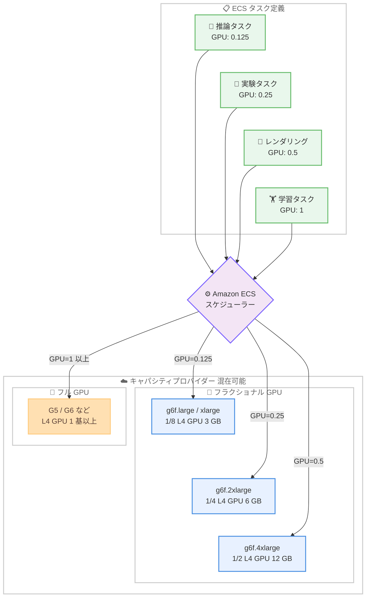

# Amazon ECS - Amazon EC2 G6f インスタンスによるフラクショナル GPU スケジューリングのサポート

**リリース日**: 2026 年 8 月 6 日
**サービス**: Amazon Elastic Container Service (Amazon ECS)
**機能**: Amazon EC2 G6f インスタンスを使用したフラクショナル GPU スケジューリング

📊 [このアップデートのインフォグラフィックを見る](https://takech9203.github.io/aws-news-summary/20260806-amazon-ecs-fractional-gpu.html)

## 概要

Amazon ECS が Amazon EC2 G6f インスタンスを使用したフラクショナル GPU (GPU の分割割り当て) スケジューリングをサポートしました。G6f インスタンスは NVIDIA L4 Tensor Core GPU をハードウェアレベルで分割したインスタンスで、最小 1/8 GPU (GPU メモリ 3 GB) の単位でワークロードを実行できます。タスク定義のコンテナ定義で `GPU=0.125`、`GPU=0.25`、`GPU=0.5` のように小数値を指定するだけで、ECS が要求された GPU 容量を提供する適切な G6f インスタンスにタスクを自動配置します。

このアップデートは、小規模モデルの AI 推論、モデルの実験・検証、グラフィックスレンダリングなど、GPU 1 基をフルに使用する必要がないワークロードを運用するユーザーに大きな価値をもたらします。従来はこうした軽量ワークロードにも GPU 1 基全体を割り当てる必要があり、GPU リソースの大部分が遊休状態となっていましたが、必要な分だけの GPU 容量を割り当てることでインフラコストを削減できます。

フラクショナル GPU スケジューリングは Amazon ECS Managed Instances と Amazon ECS on EC2 の両方で利用できます。Managed Instances を使用する場合は、インスタンスのプロビジョニング、スケーリング、パッチ適用、ライフサイクル管理が AWS によって行われるほか、CloudWatch Container Insights による GPU メトリクスの取得や、GPU ハードウェア障害を検出してインスタンスを自動交換するヘルスモニタリングも利用できます。

**アップデート前の課題**

- ECS のタスク定義では GPU 要求として整数値 (1、2、...) しか指定できず、軽量なワークロードでも GPU 1 基全体を占有する必要があった
- 小規模モデルの推論や実験用途では GPU 使用率が低く、コストに対して GPU リソースが無駄になっていた
- GPU を細分化して共有するには、Kubernetes の MIG / タイムスライシング構成など、別のオーケストレーション基盤や複雑な設定が必要だった

**アップデート後の改善**

- タスク定義に `0.125`、`0.25`、`0.5` の小数値を指定するだけで、1/8〜1/2 GPU の単位でタスクをスケジューリングできるようになった
- ワークロードの要求に合った GPU 容量のみを割り当てることで、GPU インフラコストを削減できるようになった
- フラクショナル GPU インスタンス (G6f) とフル GPU インスタンス (G5、G6 など) を同一のキャパシティプロバイダーに混在させても、ECS が GPU 値に基づいて適切なインスタンスタイプへ自動ルーティングするため、GPU ファミリーごとにキャパシティプロバイダーを分ける必要がない
- Managed Instances と組み合わせることで、GPU インスタンスの運用管理 (プロビジョニング、スケーリング、パッチ適用、障害時の自動交換) を AWS に任せられる

## アーキテクチャ図



タスク定義で宣言した GPU 値 (小数または整数) に基づいて、ECS スケジューラーがフラクショナル GPU インスタンス (G6f) またはフル GPU インスタンスへタスクを自動的にルーティングします。

## サービスアップデートの詳細

### 主要機能

1. **フラクショナル GPU のスケジューリング**
   - タスク定義のコンテナ定義 (`resourceRequirements`) で GPU 値として `0.125`、`0.25`、`0.5` の小数値を指定可能
   - ECS が要求された GPU 容量に対応する G6f インスタンスにタスクを配置
   - G6f インスタンスは NVIDIA L4 GPU をハードウェアレベルでパーティション分割しており、各インスタンスは専用の GPU メモリとコンピュートを持つ固定 GPU スライス (1/8、1/4、1/2) を提供

2. **フル GPU インスタンスとの混在キャパシティプロバイダー**
   - フラクショナル GPU インスタンス (G6f) とフル GPU インスタンス (G5、G6 など) を同一のキャパシティプロバイダーに含めることが可能
   - 整数値 (1、2 など) はフル GPU 要求、小数値 (0.125、0.25、0.5) はフラクショナル GPU 要求として扱われ、ECS が宣言された GPU 値に基づいて適切なインスタンスタイプにルーティング
   - GPU ファミリーごとに個別のキャパシティプロバイダーを用意する必要がない

3. **Amazon ECS Managed Instances との統合**
   - Managed Instances を使用する場合、インスタンスのプロビジョニング、スケーリング、パッチ適用、ライフサイクル管理を AWS が実施
   - CloudWatch Container Insights による GPU メトリクスの取得が可能
   - GPU ハードウェア障害を検出した場合にインスタンスを自動的に交換するヘルスモニタリング (GPU auto-repair) を提供

4. **幅広い起動タイプのサポート**
   - Amazon ECS Managed Instances と Amazon ECS on EC2 の両方で利用可能
   - AWS Management Console、CLI、SDK、CloudFormation などの IaC ツールから設定可能

## 技術仕様

### フラクショナル GPU 値と対応インスタンスタイプ

| GPU 値 | GPU 割合 | GPU メモリ | 対応インスタンスタイプ |
|--------|----------|------------|------------------------|
| 0.125 | 1/8 GPU | 3 GB | g6f.large、g6f.xlarge |
| 0.25 | 1/4 GPU | 6 GB | g6f.2xlarge |
| 0.5 | 1/2 GPU | 12 GB | g6f.4xlarge、gr6f.4xlarge |

### スケジューリングの動作

| 項目 | 詳細 |
|------|------|
| 小数値の指定 | `0.125`、`0.25`、`0.5` のみサポート。対応する GPU パーティションを持つ G6f インスタンスに配置 |
| 整数値の指定 | 従来どおりフル GPU 要求として扱われ、フル GPU を持つインスタンスにのみ配置 |
| `ALL` の指定 | コンテナインスタンス上のすべての GPU をコンテナに割り当て |
| タスク内の制約 | フラクショナル GPU を要求できるのは 1 タスクにつき 1 コンテナのみ。あるコンテナが小数値を指定した場合、同一タスク定義内の他のコンテナは GPU リソース要求を持てない |
| 対応起動タイプ | Amazon ECS Managed Instances、Amazon ECS on EC2 (Fargate と ECS Anywhere は非対応) |

### タスク定義の設定例

```json
{
  "family": "fractional-gpu-inference",
  "networkMode": "awsvpc",
  "executionRoleArn": "arn:aws:iam::account-id:role/ecsTaskExecutionRole",
  "containerDefinitions": [
    {
      "name": "inference",
      "image": "nvidia/cuda:12.0.0-base-ubuntu22.04",
      "essential": true,
      "command": ["nvidia-smi"],
      "resourceRequirements": [
        {
          "type": "GPU",
          "value": "0.25"
        }
      ],
      "logConfiguration": {
        "logDriver": "awslogs",
        "options": {
          "awslogs-group": "/ecs/fractional-gpu-inference",
          "awslogs-region": "region",
          "awslogs-stream-prefix": "ecs"
        }
      }
    }
  ],
  "requiresCompatibilities": [
    "MANAGED_INSTANCES"
  ],
  "cpu": "2048",
  "memory": "4096"
}
```

この例では、NVIDIA L4 GPU の 1/4 (GPU メモリ 6 GB) を割り当てた軽量推論コンテナを Managed Instances 上で実行します。

## 設定方法

### 前提条件

1. Amazon ECS クラスターが作成されていること
2. G6f インスタンスを含むキャパシティプロバイダー (Managed Instances または EC2 Auto Scaling グループ) が設定されていること
3. G6f インスタンスが利用可能なリージョンで作業していること
4. タスク実行ロール (`ecsTaskExecutionRole`) が用意されていること

### 手順

#### ステップ 1: G6f インスタンスを含むキャパシティプロバイダーの設定

```bash
aws ecs put-cluster-capacity-providers \
  --cluster my-gpu-cluster \
  --capacity-providers my-g6f-capacity-provider \
  --default-capacity-provider-strategy capacityProvider=my-g6f-capacity-provider,weight=1
```

作成済みのキャパシティプロバイダーをクラスターに関連付けます。フラクショナル GPU インスタンス (G6f) とフル GPU インスタンス (G5、G6 など) を同一のキャパシティプロバイダーに含めることができます。

#### ステップ 2: フラクショナル GPU を指定したタスク定義の登録

```bash
aws ecs register-task-definition \
  --cli-input-json file://fractional-gpu-inference.json
```

前述の設定例のように、コンテナ定義の `resourceRequirements` で `"type": "GPU"`、`"value": "0.25"` のように小数値を指定した JSON ファイルを使用してタスク定義を登録します。

#### ステップ 3: サービスまたはタスクの起動

```bash
aws ecs create-service \
  --cluster my-gpu-cluster \
  --service-name fractional-inference-service \
  --task-definition fractional-gpu-inference \
  --desired-count 4
```

タスク定義を指定してサービスを作成します。ECS が GPU 値 (0.25) に基づいて、対応する GPU パーティションを持つ g6f.2xlarge インスタンスへタスクを自動配置します。

#### ステップ 4: GPU メトリクスの確認

Managed Instances を使用している場合は、CloudWatch Container Insights で GPU 使用率などのメトリクスを確認できます。GPU ハードウェア障害が検出された場合は、インスタンスが自動的に交換されます。

## メリット

### ビジネス面

- **インフラコストの削減**: GPU 1 基をフルに使う必要のないワークロードに対して、必要な分 (最小 1/8 GPU) だけを割り当てることで、GPU インフラのコストを最適化できる
- **GPU 利用効率の向上**: 遊休 GPU リソースを削減し、投資対効果を高められる
- **小規模 AI ワークロードの導入障壁の低下**: 小規模モデルの推論や実験を低コストで開始できるため、AI 活用のスモールスタートが容易になる

### 技術面

- **シンプルな設定**: タスク定義の GPU 値を小数にするだけで利用でき、MIG やタイムスライシングのような複雑な GPU 分割設定が不要
- **ハードウェアレベルの分離**: G6f インスタンスは専用の GPU メモリとコンピュートを持つハードウェアパーティションを提供するため、ソフトウェアベースの GPU 共有と異なりワークロード間の干渉が起きにくい
- **柔軟なキャパシティ管理**: フラクショナル GPU とフル GPU のインスタンスを単一のキャパシティプロバイダーで管理でき、GPU 値に応じた自動ルーティングにより運用がシンプルになる
- **運用負荷の軽減**: Managed Instances と組み合わせることで、プロビジョニング、スケーリング、パッチ適用、GPU 障害時の自動交換まで AWS に任せられる

## デメリット・制約事項

### 制限事項

- サポートされる小数値は `0.125`、`0.25`、`0.5` の 3 種類のみ (対応する G6f インスタンスタイプの GPU パーティションに依存)
- フラクショナル GPU を要求できるのは 1 タスクにつき 1 コンテナのみ。小数値を指定したコンテナがある場合、同一タスク内の他のコンテナは GPU を要求できない
- AWS Fargate と Amazon ECS Anywhere はフラクショナル GPU スケジューリングをサポートしない
- 利用できるのは EC2 G6f / Gr6f インスタンスが提供されているリージョンに限られる

### 考慮すべき点

- G6f の GPU パーティションは固定サイズ (1/8、1/4、1/2) のため、ワークロードの GPU メモリ要件 (3 GB / 6 GB / 12 GB) を事前に見積もる必要がある
- 整数値の GPU 要求はフル GPU インスタンスにのみ配置されるため、既存タスクを G6f に移行する場合はタスク定義の GPU 値を小数に変更する必要がある
- GPU メモリが 3 GB / 6 GB / 12 GB に制限されるため、大規模モデルの推論や学習には引き続きフル GPU インスタンスが必要

## ユースケース

### ユースケース 1: 小規模モデルの AI 推論サービス

**シナリオ**: 数億〜数十億パラメータ規模の軽量モデル (画像分類、埋め込み生成、小規模 LLM など) を推論 API として提供したいが、フル GPU では容量が過剰でコストが見合わない。

**実装例**:
```json
"resourceRequirements": [
  { "type": "GPU", "value": "0.25" }
]
```

**効果**: 1/4 GPU (6 GB) で推論コンテナを実行し、フル GPU 比で必要容量に応じたコストに最適化。トラフィック増加時は ECS サービスのスケールアウトで対応できる。

### ユースケース 2: モデル実験・開発環境の集約

**シナリオ**: データサイエンスチームの複数メンバーがモデルの動作確認や軽量な実験を行うための GPU 環境を必要としているが、メンバーごとにフル GPU インスタンスを割り当てるとコストが高い。

**実装例**:
```json
"resourceRequirements": [
  { "type": "GPU", "value": "0.125" }
]
```

**効果**: 最小 1/8 GPU (3 GB) の実験用タスクを多数実行でき、開発・検証環境の GPU コストを大幅に削減。ハードウェアパーティションによりユーザー間の干渉も防止できる。

### ユースケース 3: フル GPU と混在した推論プラットフォーム

**シナリオ**: 大規模モデルにはフル GPU、軽量モデルにはフラクショナル GPU を使い分けたいが、キャパシティプロバイダーを分けて管理するのは運用負荷が高い。

**実装例**:
```
# 同一キャパシティプロバイダーに G6f と G6 を混在
# 軽量モデル用タスク定義: "value": "0.5"  → g6f.4xlarge に配置
# 大規模モデル用タスク定義: "value": "1"   → G6 などフル GPU に配置
```

**効果**: 単一のキャパシティプロバイダーで異なる GPU 要件のワークロードを管理でき、ECS が GPU 値に基づいて適切なインスタンスに自動ルーティングするため運用がシンプルになる。

## 料金

フラクショナル GPU スケジューリング機能自体に追加料金はありません。使用した EC2 G6f / Gr6f インスタンスの料金が発生します。G6f インスタンスは NVIDIA L4 GPU のフラクションを提供するため、フル GPU を搭載した同世代インスタンスよりも低い時間単価で GPU ワークロードを実行できます。

- Amazon ECS on EC2: EC2 インスタンス料金のみ (ECS 自体は追加料金なし)
- Amazon ECS Managed Instances: EC2 インスタンス料金に加えて Managed Instances の管理料金が発生

最新の料金は [Amazon EC2 G6 インスタンスのページ](https://aws.amazon.com/ec2/instance-types/g6/) および [Amazon ECS の料金ページ](https://aws.amazon.com/ecs/pricing/) を参照してください。

## 利用可能リージョン

Amazon EC2 G6f インスタンスが利用可能なすべての AWS リージョンで利用できます。

## 関連サービス・機能

- **Amazon EC2 G6f / Gr6f インスタンス**: NVIDIA L4 GPU をハードウェアレベルで分割 (1/8、1/4、1/2) したインスタンスファミリー。本機能の基盤となる
- **Amazon ECS Managed Instances**: インスタンスのプロビジョニング、スケーリング、パッチ適用などを AWS が管理する ECS のキャパシティオプション。GPU 障害時の自動交換にも対応
- **Amazon CloudWatch Container Insights**: ECS タスク・インスタンスの GPU メトリクスを含む詳細なモニタリングを提供
- **AWS CloudFormation**: キャパシティプロバイダーやタスク定義を IaC として管理可能

## 参考リンク

- 📊 [インフォグラフィック](https://takech9203.github.io/aws-news-summary/20260806-amazon-ecs-fractional-gpu.html)
- [公式発表 (What's New)](https://aws.amazon.com/about-aws/whats-new/2026/08/amazon-ecs-fractional-gpu/)
- [ドキュメント: Specifying fractional GPUs](https://docs.aws.amazon.com/AmazonECS/latest/developerguide/ecs-gpu-specifying.html#ecs-gpu-specifying-fractional)
- [ドキュメント: Managed Instances GPU auto-repair](https://docs.aws.amazon.com/AmazonECS/latest/developerguide/managed-instances-gpu-auto-repair.html)
- [ドキュメント: CloudWatch Container Insights メトリクス](https://docs.aws.amazon.com/AmazonCloudWatch/latest/monitoring/Container-Insights-enhanced-observability-metrics-ECS.html)
- [Amazon ECS Managed Instances](https://aws.amazon.com/ecs/managed-instances/)
- [Amazon EC2 G6 インスタンス](https://aws.amazon.com/ec2/instance-types/g6/)

## まとめ

Amazon ECS のフラクショナル GPU スケジューリングにより、タスク定義の GPU 値を小数 (0.125 / 0.25 / 0.5) にするだけで、G6f インスタンスの GPU パーティションを活用した低コストな GPU ワークロード運用が可能になりました。小規模モデルの推論や実験など GPU 1 基をフルに使わないワークロードを ECS で運用している場合は、タスク定義の GPU 値の見直しと G6f インスタンスを含むキャパシティプロバイダーの導入を検討することを推奨します。
