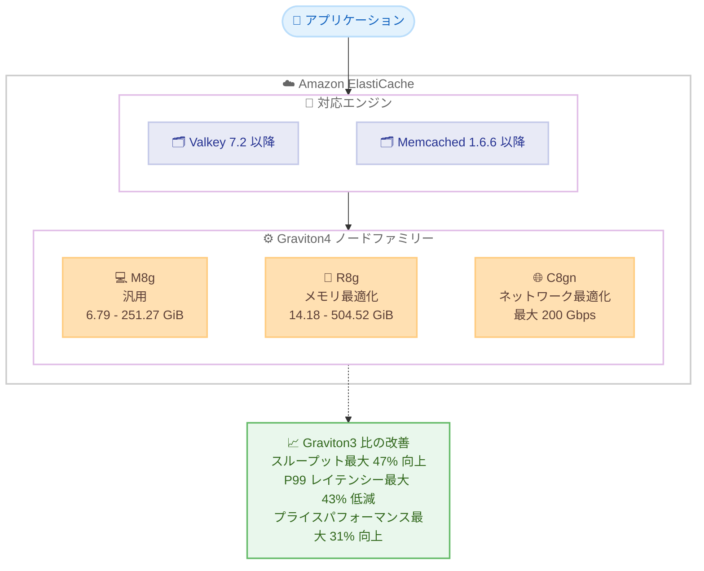

# Amazon ElastiCache - Graviton4 ベース M8g / R8g / C8gn ノードのサポート

**リリース日**: 2026 年 8 月 6 日
**サービス**: Amazon ElastiCache
**機能**: Graviton4 ベースの M8g、R8g、C8gn ノードタイプのサポート

📊 [このアップデートのインフォグラフィックを見る](https://takech9203.github.io/aws-news-summary/20260806-amazon-elasticache-graviton4-m8g-r8g-c8gn.html)

## 概要

Amazon ElastiCache が、AWS Graviton4 プロセッサを搭載した M8g (汎用)、R8g (メモリ最適化)、C8gn (ネットワーク最適化) の 3 つのノードファミリーをサポートしました。対象エンジンは Valkey と Memcached で、large から 16xlarge までのノードサイズを利用できます。

ElastiCache for Valkey において、同等の Graviton3 ベースノードと比較して最大 47% 高いスループット、最大 43% 低い P99 レイテンシー、オンデマンド料金で最大 31% 優れたプライスパフォーマンスを実現します (ノードファミリー、サイズ、ワークロード構成により結果は異なります)。また、Graviton4 ノードは同サイズの Graviton3 ノードよりも多くのメモリを搭載しており、たとえば m8g.8xlarge は 124.65 GiB と、m7g.8xlarge の 103.68 GiB に比べて約 20% 多いメモリを利用できます。

C8gn ノードは最大 200 Gbps のネットワーク帯域幅を提供し、ネットワーク集約型のキャッシュワークロードをコスト効率よくスケールできます。キャッシュのボトルネックが CPU やメモリではなくネットワーク帯域幅にあるユーザーにとって、有力な選択肢となります。

**アップデート前の課題**

Graviton4 ノードが利用できるようになる前は、以下の課題がありました。

- ElastiCache で利用できる最新の Graviton ノードは M7g / R7g / C7gn (Graviton3 / Graviton3E) 世代であり、EC2 で提供されている Graviton4 世代の性能向上をキャッシュレイヤーで活用できなかった
- 同一サイズのノードで利用可能なメモリ量に上限があり、キャッシュ容量を増やすにはより大きなノードサイズやシャード追加が必要だった
- スループットやレイテンシーの改善には、アプリケーション側のチューニングやクラスター構成の変更で対応する必要があった

**アップデート後の改善**

今回のアップデートにより、以下が可能になりました。

- Valkey / Memcached クラスターで Graviton4 の性能を活用し、最大 47% 高いスループットと最大 43% 低い P99 レイテンシーを実現できる
- 同サイズ比較で最大 20% 多いメモリにより、ノードサイズを上げずにより多くのデータをキャッシュできる
- オンデマンド料金で最大 31% 優れたプライスパフォーマンスにより、コスト効率が向上する
- C8gn の最大 200 Gbps 帯域幅により、ネットワーク集約型ワークロードを少ないノード数で処理できる

## アーキテクチャ図



Valkey または Memcached のクラスターで、ワークロード特性に応じて 3 つの Graviton4 ノードファミリーから選択できます。いずれも Graviton3 世代と比較して性能とコスト効率が向上します。

## サービスアップデートの詳細

### 主要機能

1. **M8g ノード (汎用)**
   - CPU、メモリ、ネットワークのバランスが取れた汎用ノードファミリー
   - large (6.79 GiB) から 16xlarge (251.27 GiB) までの 7 サイズを提供
   - m8g.8xlarge は 124.65 GiB のメモリを搭載し、m7g.8xlarge の 103.68 GiB に比べて約 20% 増加

2. **R8g ノード (メモリ最適化)**
   - vCPU あたりのメモリ量が多いメモリ最適化ノードファミリー
   - large (14.18 GiB) から 16xlarge (504.52 GiB) までの 7 サイズを提供
   - 大容量のキャッシュデータセットを保持するワークロードに最適

3. **C8gn ノード (ネットワーク最適化)**
   - 最大 200 Gbps のネットワーク帯域幅を提供するネットワーク最適化ノードファミリー
   - large (3.1 GiB) から 16xlarge (124.65 GiB) までの 7 サイズを提供
   - ネットワーク帯域幅がボトルネックとなるワークロードを、少ないノード数でコスト効率よく処理可能

4. **性能向上 (ElastiCache for Valkey、Graviton3 比)**
   - スループット: 最大 47% 向上
   - P99 レイテンシー: 最大 43% 低減
   - プライスパフォーマンス: オンデマンド料金で最大 31% 向上
   - 結果はノードファミリー、サイズ、ワークロード構成により異なる

## 技術仕様

### 対応エンジンと最小バージョン

| ノードファミリー | Valkey | Memcached | Redis OSS |
|------------------|--------|-----------|-----------|
| M8g | 7.2 以降 | 1.6.6 以降 | 非対応 |
| R8g | 7.2 以降 | 1.6.6 以降 | 非対応 |
| C8gn | 7.2 以降 | 1.6.6 以降 | 非対応 |

### 主要ノードサイズの仕様 (公式ドキュメントより抜粋)

| ノードタイプ | メモリ (GiB) | ベースライン帯域幅 (Gbps) | バースト帯域幅 (Gbps) |
|--------------|--------------|---------------------------|------------------------|
| cache.m8g.large | 6.79 | 0.937 | 12.5 |
| cache.m8g.8xlarge | 124.65 | 15 | N/A |
| cache.m8g.16xlarge | 251.27 | 30 | N/A |
| cache.r8g.large | 14.18 | 0.937 | 12.5 |
| cache.r8g.8xlarge | 251.27 | 15 | N/A |
| cache.r8g.16xlarge | 504.52 | 30 | N/A |
| cache.c8gn.large | 3.1 | 6.25 | 30 |
| cache.c8gn.8xlarge | 61.33 | 100 | N/A |
| cache.c8gn.16xlarge | 124.65 | 200 | N/A |

### Valkey 利用時の機能サポート

| 機能 | サポート状況 |
|------|--------------|
| Enhanced I/O | xlarge 以上でサポート (c8gn.large、m8g.large、r8g.large は一部制限あり) |
| TLS オフロード | xlarge 以上でサポート |
| Enhanced I/O Multiplexing | M8g / R8g は全サイズ、C8gn は xlarge 以上でサポート |

## 設定方法

### 前提条件

1. Valkey 7.2 以降または Memcached 1.6.6 以降のエンジンバージョンを使用していること
2. 利用するリージョンで M8g / R8g / C8gn ノードが提供されていること (料金ページで確認)
3. AWS CLI、AWS SDK、または AWS Management Console へのアクセス権限があること

### 手順

#### ステップ 1: 新規クラスターを Graviton4 ノードで作成する

```bash
aws elasticache create-replication-group \
  --replication-group-id my-valkey-cluster \
  --replication-group-description "Valkey cluster on Graviton4" \
  --engine valkey \
  --engine-version 8.0 \
  --cache-node-type cache.r8g.xlarge \
  --num-node-groups 3 \
  --replicas-per-node-group 1 \
  --cache-subnet-group-name my-subnet-group
```

Valkey エンジンを使用し、cache.r8g.xlarge ノードで 3 シャード、各シャードにレプリカ 1 台を持つクラスターモード有効のレプリケーショングループを作成しています。

#### ステップ 2: 既存クラスターを Graviton4 ノードに変更する

```bash
aws elasticache modify-replication-group \
  --replication-group-id my-valkey-cluster \
  --cache-node-type cache.r8g.xlarge \
  --apply-immediately
```

既存のレプリケーショングループのノードタイプを cache.r8g.xlarge に変更しています。`--apply-immediately` を指定すると即時に変更が適用され、指定しない場合は次のメンテナンスウィンドウで適用されます。

#### ステップ 3: 変更結果を確認する

```bash
aws elasticache describe-replication-groups \
  --replication-group-id my-valkey-cluster \
  --query "ReplicationGroups[0].CacheNodeType"
```

レプリケーショングループの現在のノードタイプを取得し、Graviton4 ノードへの変更が完了したことを確認しています。

## メリット

### ビジネス面

- **コスト効率の向上**: オンデマンド料金で最大 31% 優れたプライスパフォーマンスにより、同じワークロードをより低いコストで処理できる
- **ノード集約によるコスト削減**: メモリ増加と帯域幅向上により、より少ないノード数で同等の容量・性能を確保できる可能性がある
- **ユーザー体験の改善**: P99 レイテンシーの最大 43% 低減により、キャッシュに依存するアプリケーションの応答性が向上する

### 技術面

- **スループット向上**: Graviton3 比で最大 47% 高いスループットにより、リクエスト増加時の余裕が生まれる
- **メモリ容量の増加**: 同サイズ比較で最大 20% 多いメモリにより、ノードサイズを変更せずにキャッシュヒット率を改善できる
- **ネットワーク帯域幅の拡大**: C8gn の最大 200 Gbps により、大きな値の読み書きや高スループットのレプリケーションに対応できる
- **移行の容易さ**: コンソール、AWS CLI、AWS SDK から既存クラスターのノードタイプ変更だけで利用開始できる

## デメリット・制約事項

### 制限事項

- 対応エンジンは Valkey (7.2 以降) と Memcached (1.6.6 以降) のみで、公式ドキュメントの対応ノードタイプ一覧に Redis OSS 向けの M8g / R8g / C8gn の記載はない
- ノードサイズは large から 16xlarge までで、micro / small / medium などの小型サイズは提供されない
- 利用可能なノードタイプはリージョンにより異なるため、事前に料金ページでの確認が必要

### 考慮すべき点

- 性能向上の数値 (最大 47% / 43% / 31%) は ElastiCache for Valkey での Graviton3 比較値であり、ノードファミリー、サイズ、ワークロード構成により実際の結果は異なる
- Redis OSS を使用している場合は、Graviton4 ノードの利用にあたり Valkey への移行を検討する必要がある
- 既存クラスターのノードタイプ変更時は、適用タイミング (即時またはメンテナンスウィンドウ) と変更中の性能影響を考慮する
- リザーブドノードを利用している場合は、ノードファミリー変更に伴う予約の扱いを確認する

## ユースケース

### ユースケース 1: 大規模 Web アプリケーションのセッションストア高速化

**シナリオ**: EC サイトのセッション管理に ElastiCache for Valkey (r7g ノード) を使用しており、ピーク時のレイテンシー悪化が課題となっている。

**実装例**:
```bash
aws elasticache modify-replication-group \
  --replication-group-id session-store \
  --cache-node-type cache.r8g.2xlarge \
  --apply-immediately
```

**効果**: P99 レイテンシーが最大 43% 低減され、ピーク時でも安定した応答時間を維持できます。同サイズでメモリも増加するため、セッションデータの保持容量にも余裕が生まれます。

### ユースケース 2: ネットワーク集約型キャッシュのノード集約

**シナリオ**: 動画メタデータや大きなオブジェクトを配信するキャッシュレイヤーで、CPU 使用率は低いもののネットワーク帯域幅が飽和し、シャードを多数追加して帯域を確保している。

**実装例**:
```bash
aws elasticache create-replication-group \
  --replication-group-id content-cache \
  --replication-group-description "Network intensive cache" \
  --engine valkey \
  --cache-node-type cache.c8gn.4xlarge \
  --num-node-groups 2 \
  --replicas-per-node-group 1 \
  --cache-subnet-group-name my-subnet-group
```

**効果**: C8gn のベースライン 50 Gbps (4xlarge)、最大 200 Gbps (16xlarge) の帯域幅により、少ないシャード数で必要な帯域を確保でき、運用の簡素化とコスト削減を両立できます。

### ユースケース 3: Memcached クラスターの世代更新によるコスト最適化

**シナリオ**: データベースのクエリ結果キャッシュとして Memcached (m6g ノード) を利用しており、コスト効率と容量の改善を図りたい。

**実装例**:
```bash
aws elasticache create-cache-cluster \
  --cache-cluster-id query-cache \
  --engine memcached \
  --engine-version 1.6.22 \
  --cache-node-type cache.m8g.xlarge \
  --num-cache-nodes 4 \
  --cache-subnet-group-name my-subnet-group
```

**効果**: 同サイズ比較でより多くのメモリ (m8g.xlarge は 14.18 GiB、m6g.xlarge は 12.93 GiB) を利用でき、キャッシュヒット率の向上とプライスパフォーマンスの改善が期待できます。

## 料金

ElastiCache の標準的な料金体系 (オンデマンドノード、リザーブドノード) に従い、ノードタイプとリージョンごとの時間単価が適用されます。Graviton4 ノードはオンデマンド料金で Graviton3 ノード比最大 31% 優れたプライスパフォーマンスを提供します。

最新の料金はリージョンごとに異なるため、[Amazon ElastiCache 料金ページ](https://aws.amazon.com/elasticache/pricing/) を参照してください。

## 利用可能リージョン

AWS GovCloud (US) および中国リージョンを含む 30 以上の AWS リージョンで利用可能です。リージョンごとの対応ノードタイプは [Amazon ElastiCache 料金ページ](https://aws.amazon.com/elasticache/pricing/) で確認できます。

## 関連サービス・機能

- **Amazon EC2 M8g / R8g / C8gn インスタンス**: 本ノードタイプのベースとなる Graviton4 搭載 EC2 インスタンスファミリー
- **AWS Graviton4 プロセッサ**: AWS が設計した Arm ベースの第 4 世代プロセッサで、前世代比で性能とエネルギー効率が向上
- **Amazon MemoryDB**: 永続化を備えた Valkey / Redis OSS 互換インメモリデータベース。Graviton ベースノードの動向を合わせて確認したいサービス
- **ElastiCache for Valkey**: 今回の性能向上値の測定対象エンジン。Redis OSS からの移行先としても推奨される

## 参考リンク

- 📊 [インフォグラフィック](https://takech9203.github.io/aws-news-summary/20260806-amazon-elasticache-graviton4-m8g-r8g-c8gn.html)
- [公式発表 (What's New)](https://aws.amazon.com/about-aws/whats-new/2026/08/amazon-elasticache-graviton4-m8g-r8g-c8gn/)
- [ドキュメント: Supported node types (Amazon ElastiCache User Guide)](https://docs.aws.amazon.com/AmazonElastiCache/latest/dg/CacheNodes.SupportedTypes.html)
- [料金ページ](https://aws.amazon.com/elasticache/pricing/)

## まとめ

Amazon ElastiCache で Graviton4 ベースの M8g / R8g / C8gn ノードが利用可能になり、Valkey / Memcached ワークロードにおいてスループット、レイテンシー、プライスパフォーマンスのすべてで大幅な改善が期待できます。Graviton3 以前のノードを利用中の場合は、性能検証のうえノードタイプの変更を検討することを推奨します。特にネットワーク帯域幅がボトルネックのワークロードには、最大 200 Gbps を提供する C8gn が有力な選択肢となります。
