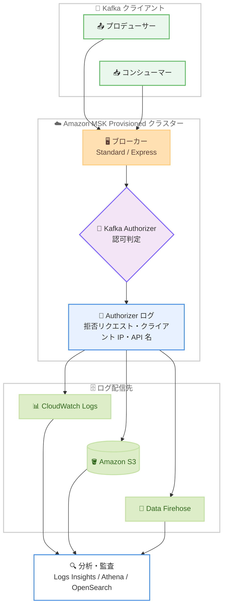

# Amazon MSK - Kafka Authorizer Logs 配信サポート

**リリース日**: 2026 年 8 月 6 日
**サービス**: Amazon Managed Streaming for Apache Kafka (Amazon MSK)
**機能**: Authorizer Log Delivery (認可ログ配信)

📊 [このアップデートのインフォグラフィックを見る](https://takech9203.github.io/aws-news-summary/20260806-amazon-msk-kafka-authorizer-logs.html)

## 概要

Amazon Managed Streaming for Apache Kafka (Amazon MSK) が、Provisioned クラスター (Standard ブローカーおよび Express ブローカーの両方) を対象に、Kafka Authorizer ログの配信 (Authorizer Log Delivery) を追加料金なしでサポートしました。Authorizer ログは、MSK クラスターが行った認可判定 (アクセス許可/拒否の決定) を記録するログであり、ユーザーやアプリケーションのアクセス状況を詳細に可視化できます。

拒否された認可リクエストには、クライアントの IP アドレスと、クライアントが実行しようとした API が記録されるため、認可エラーの根本原因を迅速に特定できます。ログの配信先として Amazon CloudWatch Logs、Amazon S3、Amazon Data Firehose の 3 種類を選択でき (複数指定も可能)、新規・既存どちらの Provisioned クラスターでも Amazon MSK コンソールまたは AWS CLI から有効化できます。

このアップデートは、Kafka クラスターへのアクセス制御を厳密に運用したいセキュリティチームや、クライアントの認可エラーのトラブルシューティングに時間を要していた運用チームにとって重要な機能強化です。

**アップデート前の課題**

- 以前は MSK のマネージド機能として認可判定ログを外部に配信する手段がなく、ブローカーログ (アプリケーションログ) を頼りに認可問題を調査する必要があった
- クライアントの認可エラー (ACL や IAM ポリシーによるアクセス拒否) が発生した際に、どのクライアントがどの API で拒否されたのかを特定することが困難だった
- 組織のセキュリティ要件 (アクセス監査、コンプライアンス) を満たすために、独自の仕組みで認可情報を収集する追加の作業が必要だった

**アップデート後の改善**

- 認可判定ログを CloudWatch Logs、S3、Data Firehose へマネージドに配信できるようになり、追加コストなしでアクセス可視性を確保できるようになった
- 拒否された認可リクエストごとにクライアントの IP アドレスと試行された API が記録されるため、認可問題の根本原因を迅速に特定できるようになった
- 新規・既存クラスターの両方でコンソールまたは CLI から簡単に有効化でき、組織のセキュリティ・監査要件への対応が容易になった

## アーキテクチャ図



Kafka クライアントからのリクエストに対して MSK ブローカーの Authorizer が認可判定を行い、その判定結果 (特に拒否されたリクエストの詳細) を CloudWatch Logs、S3、Data Firehose のいずれか、または複数の宛先に配信するアーキテクチャです。

## サービスアップデートの詳細

### 主要機能

1. **Authorizer ログのマネージド配信**
   - MSK クラスターの認可判定 (アクセス許可/拒否の決定) をログとして配信
   - 追加料金なしで利用可能 (配信先サービスの標準料金は別途発生)
   - Standard ブローカーと Express ブローカーの両方をサポート

2. **拒否リクエストの詳細な記録**
   - 拒否された認可リクエストごとにクライアントの IP アドレスを記録
   - クライアントが実行しようとした API (操作) を記録
   - 認可エラーの根本原因特定 (トラブルシューティング) に活用可能

3. **柔軟な配信先の選択**
   - Amazon CloudWatch Logs: リアルタイムの検索・分析・アラート
   - Amazon S3: 長期保管・コンプライアンス用アーカイブ
   - Amazon Data Firehose: OpenSearch Service など下流システムへのストリーミング配信
   - 3 種類の配信先を同時に複数指定することも可能

4. **新規・既存クラスター両対応の簡単な有効化**
   - 新規クラスター作成時: コンソールの「Monitoring」セクションの「Authorizer log delivery」で設定
   - 既存クラスター: 「Properties」タブの「Log delivery」セクションから編集
   - AWS CLI では `create-cluster` または `update-monitoring` コマンドの `logging-info` パラメータで設定

## 技術仕様

### Authorizer ログの仕様

| 項目 | 詳細 |
|------|------|
| 対象クラスター | Amazon MSK Provisioned クラスター (新規・既存) |
| 対象ブローカータイプ | Standard ブローカー、Express ブローカー |
| 記録内容 | 認可判定の結果 (拒否リクエストのクライアント IP アドレス、試行された API など) |
| 配信先 | Amazon CloudWatch Logs、Amazon S3、Amazon Data Firehose (複数指定可) |
| 設定方法 | MSK コンソール、AWS CLI (`create-cluster` / `update-monitoring`)、API (`CreateCluster` / `UpdateMonitoring`) |
| 追加料金 | なし (配信先サービスの標準料金は別途発生) |
| 前提条件 | 配信先リソース (ロググループ、S3 バケット、Firehose ストリーム) を事前に作成しておく必要がある |

### API 変更履歴

| 日付 | サービス | 変更内容 |
|------|----------|----------|
| 2026/08/06 | [kafka](https://awsapichanges.com/archive/changes/32fa45-kafka.html) | 10 updated api methods - MSK クラスターがブローカーログに加えて Authorizer ログを指定した宛先へ配信できるように、`LoggingInfo` に `AuthorizerLogs` 構造体が追加 |

主な更新対象 API は以下のとおりです。

- `CreateCluster` / `CreateClusterV2`: クラスター作成時に `LoggingInfo.AuthorizerLogs` を指定可能
- `DescribeCluster` / `DescribeClusterV2`: レスポンスに `AuthorizerLogs` の設定情報を含む
- `DescribeClusterOperation` / `DescribeClusterOperationV2`: クラスター操作の Source/Target 情報に `AuthorizerLogs` を含む
- `UpdateMonitoring` など: 既存クラスターのログ設定更新に対応

### LoggingInfo の設定例 (AuthorizerLogs)

```json
{
  "AuthorizerLogs": {
    "CloudWatchLogs": {
      "Enabled": true,
      "LogGroup": "ExampleLogGroupName"
    },
    "S3": {
      "Bucket": "amzn-s3-demo-bucket",
      "Prefix": "ExamplePrefix",
      "Enabled": true
    },
    "Firehose": {
      "DeliveryStream": "ExampleDeliveryStreamName",
      "Enabled": true
    }
  }
}
```

3 種類の配信先はすべてオプションであり、必要な宛先のみ有効化できます。

## 設定方法

### 前提条件

1. Amazon MSK Provisioned クラスター (Standard または Express ブローカー) が作成済み、または新規作成すること
2. 配信先リソース (CloudWatch Logs ロググループ、S3 バケット、Data Firehose 配信ストリームのいずれか) を事前に作成しておくこと。MSK は配信先リソースを自動作成しない
3. IAM アイデンティティに `AmazonMSKFullAccess` 管理ポリシー相当の権限があること。S3 へ配信する場合は `s3:PutBucketPolicy` 権限も必要
4. SSE-KMS (カスタマーマネージドキー) で暗号化された S3 バケットを使用する場合は、KMS キーポリシーで `delivery.logs.amazonaws.com` サービスプリンシパルに暗号化操作を許可すること
5. Firehose 配信ストリームを使用する場合は、ストリームに `LogDeliveryEnabled` タグを `true` で設定すること

### 手順

#### ステップ 1: 配信先リソースの作成

```bash
# CloudWatch Logs ロググループを作成する例
aws logs create-log-group \
  --log-group-name /msk/authorizer-logs/my-cluster
```

Authorizer ログの配信先となる CloudWatch Logs ロググループを作成しています。S3 バケットや Firehose 配信ストリームを使用する場合は、それぞれ事前に作成してください。

#### ステップ 2: 既存クラスターで Authorizer ログ配信を有効化

```bash
# 現在のクラスターバージョンを確認
aws kafka describe-cluster \
  --cluster-arn "arn:aws:kafka:ap-northeast-1:123456789012:cluster/my-cluster/xxxx" \
  --query "ClusterInfo.CurrentVersion"

# update-monitoring で Authorizer ログ配信を有効化
aws kafka update-monitoring \
  --cluster-arn "arn:aws:kafka:ap-northeast-1:123456789012:cluster/my-cluster/xxxx" \
  --current-version "K3AEGXETSR30VB" \
  --logging-info '{
    "AuthorizerLogs": {
      "CloudWatchLogs": {
        "Enabled": true,
        "LogGroup": "/msk/authorizer-logs/my-cluster"
      }
    }
  }'
```

`describe-cluster` でクラスターの現在のバージョンを取得し、`update-monitoring` コマンドの `logging-info` パラメータに `AuthorizerLogs` 構造体を指定して、CloudWatch Logs への Authorizer ログ配信を有効化しています。

#### ステップ 3: 新規クラスター作成時に有効化する場合

```bash
aws kafka create-cluster \
  --cluster-name "my-new-cluster" \
  --broker-node-group-info file://brokernodegroupinfo.json \
  --kafka-version "3.6.0" \
  --number-of-broker-nodes 3 \
  --logging-info '{
    "AuthorizerLogs": {
      "S3": {
        "Enabled": true,
        "Bucket": "amzn-s3-demo-bucket",
        "Prefix": "authorizer-logs"
      }
    },
    "BrokerLogs": {
      "CloudWatchLogs": {
        "Enabled": true,
        "LogGroup": "/msk/broker-logs/my-new-cluster"
      }
    }
  }'
```

クラスター作成時に `logging-info` パラメータで `AuthorizerLogs` (S3 配信) と `BrokerLogs` (CloudWatch Logs 配信) を同時に設定しています。Authorizer ログとブローカーログは独立して配信先を設定できます。

#### ステップ 4: コンソールでの設定

1. Amazon MSK コンソールでクラスターを選択し、「Properties」タブを開く
2. 「Log delivery」セクションの「Edit」ボタンを選択する
3. 「Authorizer log delivery」で配信先 (CloudWatch Logs、S3、Firehose) を指定して保存する

新規クラスター作成時は、「Monitoring」セクションの「Authorizer log delivery」見出しから同様に設定できます。

## メリット

### ビジネス面

- **セキュリティ・コンプライアンス要件への対応**: 認可判定の記録を S3 に長期保管することで、組織の監査要件やコンプライアンス要件を追加開発なしで満たすことができる
- **追加コストなしの可視性向上**: 機能自体は無料で提供されるため、コストを増やさずに Kafka クラスターのアクセス可視性を強化できる
- **運用工数の削減**: 認可エラーの調査時間が短縮され、開発チーム・運用チーム間の問い合わせ対応の負荷が軽減される

### 技術面

- **根本原因の迅速な特定**: 拒否された認可リクエストごとにクライアント IP アドレスと試行された API が記録されるため、どのクライアントのどの操作が拒否されたのかを正確に把握できる
- **柔軟な分析パイプライン**: CloudWatch Logs Insights によるアドホック分析、S3 + Athena による大規模分析、Firehose 経由の OpenSearch Service へのストリーミングなど、用途に応じた分析基盤を選択できる
- **既存クラスターへの容易な適用**: 新規クラスターだけでなく既存クラスターにもコンソールまたは CLI から有効化でき、移行作業が不要

## デメリット・制約事項

### 制限事項

- 対象は Provisioned クラスターのみであり、MSK Serverless クラスターは対象外
- AWS European Sovereign Cloud (eusc-de-east-1) リージョンでは利用できない
- 配信先リソース (ロググループ、S3 バケット、Firehose ストリーム) は事前に自分で作成する必要があり、MSK は自動作成しない

### 考慮すべき点

- 機能自体は無料だが、CloudWatch Logs の取り込み・保存料金、S3 のストレージ料金、Data Firehose の取り込み料金など、配信先サービスの標準料金が発生する
- S3 配信で SSE-KMS (カスタマーマネージドキー) を使用する場合は、KMS キーポリシーへの `delivery.logs.amazonaws.com` の許可追加が必要
- 大量の認可拒否が発生する環境では、ログ量が増加し配信先のコストに影響するため、ログ保持期間やライフサイクルポリシーの設計を推奨

## ユースケース

### ユースケース 1: クライアント認可エラーのトラブルシューティング

**シナリオ**: 新しいコンシューマーアプリケーションをデプロイしたところ、トピックからの読み取りに失敗する。IAM ポリシーまたは Kafka ACL のどの設定が原因かを特定したい。

**実装例**:
```
# CloudWatch Logs Insights で拒否された認可リクエストを検索
fields @timestamp, @message
| filter @message like /DENIED/
| sort @timestamp desc
| limit 50
```

**効果**: 拒否されたリクエストのクライアント IP アドレスと試行された API が特定できるため、対象クライアントの IAM ポリシーや ACL を的確に修正でき、調査時間を大幅に短縮できる。

### ユースケース 2: セキュリティ監査・コンプライアンス対応

**シナリオ**: 金融系システムで、Kafka クラスターへのアクセス制御が適切に機能していることを監査人に証明する必要がある。認可判定の記録を長期保管したい。

**実装例**:
```json
{
  "AuthorizerLogs": {
    "S3": {
      "Enabled": true,
      "Bucket": "audit-logs-bucket",
      "Prefix": "msk-authorizer-logs/"
    }
  }
}
```

**効果**: 認可判定の証跡を S3 に保管し、S3 ライフサイクルポリシーと組み合わせて規定期間の保持を自動化できる。Athena を使えば監査時の検索・集計も容易になる。

### ユースケース 3: 不審なアクセス試行のリアルタイム検知

**シナリオ**: 本番の MSK クラスターに対する想定外のアクセス試行 (権限のないクライアントからの接続) を早期に検知し、セキュリティチームへ通知したい。

**実装例**:
```bash
# 拒否された認可リクエストを検知するメトリクスフィルターを作成
aws logs put-metric-filter \
  --log-group-name /msk/authorizer-logs/my-cluster \
  --filter-name DeniedAuthRequests \
  --filter-pattern "DENIED" \
  --metric-transformations \
    metricName=MSKAuthDeniedCount,metricNamespace=Custom/MSK,metricValue=1

# しきい値超過でアラートを発報する CloudWatch アラームを作成
aws cloudwatch put-metric-alarm \
  --alarm-name msk-auth-denied-spike \
  --metric-name MSKAuthDeniedCount \
  --namespace Custom/MSK \
  --statistic Sum \
  --period 300 \
  --threshold 10 \
  --comparison-operator GreaterThanThreshold \
  --evaluation-periods 1 \
  --alarm-actions arn:aws:sns:ap-northeast-1:123456789012:security-alerts
```

**効果**: 認可拒否が急増した場合に SNS 経由でセキュリティチームへ即時通知され、不正アクセスの試行や設定ミスによる障害を早期に発見できる。

## 料金

Authorizer Log Delivery 自体は**追加料金なし**で利用できます。ただし、ログの配信先となる各サービスの標準料金が別途発生します。

| 配信先 | 発生する料金 |
|--------|------------|
| Amazon CloudWatch Logs | ログの取り込み料金、保存料金 |
| Amazon S3 | ストレージ料金、リクエスト料金 |
| Amazon Data Firehose | データ取り込み料金 |

詳細は [Amazon MSK 料金ページ](https://aws.amazon.com/msk/pricing/) および各配信先サービスの料金ページを参照してください。

## 利用可能リージョン

Amazon MSK Provisioned クラスターが利用可能なすべての AWS リージョンでサポートされます (AWS GovCloud (US) を含む)。ただし、AWS European Sovereign Cloud (eusc-de-east-1) リージョンは除きます。

## 関連サービス・機能

- **Amazon CloudWatch Logs**: Authorizer ログの配信先。Logs Insights によるアドホック検索や、メトリクスフィルター + アラームによるリアルタイム検知が可能
- **Amazon S3**: Authorizer ログの配信先。長期保管やコンプライアンス用アーカイブに適し、Athena と組み合わせた分析も可能
- **Amazon Data Firehose**: Authorizer ログの配信先。OpenSearch Service などの下流システムへのストリーミング配信に利用
- **MSK ブローカーログ**: 従来から提供されているブローカーのアプリケーションログ配信機能。Authorizer ログと同じ 3 種類の配信先をサポートし、独立して設定可能
- **AWS CloudTrail**: Amazon MSK の API 呼び出し (コントロールプレーン操作) の記録。Authorizer ログ (データプレーンの認可判定) と組み合わせることで包括的な監査が可能

## 参考リンク

- 📊 [インフォグラフィック](https://takech9203.github.io/aws-news-summary/20260806-amazon-msk-kafka-authorizer-logs.html)
- [公式発表 (What's New)](https://aws.amazon.com/about-aws/whats-new/2026/08/amazon-msk-kafka-authorizer-logs/)
- [Amazon MSK Logging ドキュメント (Authorizer ログ)](https://docs.aws.amazon.com/msk/latest/developerguide/msk-logging.html)
- [Amazon MSK Developer Guide](https://docs.aws.amazon.com/msk/latest/developerguide/what-is-msk.html)
- [Amazon MSK 料金ページ](https://aws.amazon.com/msk/pricing/)
- [AWS API Changes - Managed Streaming for Kafka](https://awsapichanges.com/archive/changes/32fa45-kafka.html)

## まとめ

Amazon MSK の Authorizer Log Delivery により、Provisioned クラスターの認可判定を追加料金なしで CloudWatch Logs、S3、Data Firehose へ配信できるようになりました。拒否リクエストのクライアント IP アドレスと試行 API が記録されるため、認可エラーのトラブルシューティングとセキュリティ監査が大幅に効率化されます。MSK Provisioned クラスターを運用しているチームは、まず既存クラスターで `update-monitoring` またはコンソールから有効化し、CloudWatch Logs Insights やメトリクスフィルターと組み合わせた監視体制の整備を検討することを推奨します。
