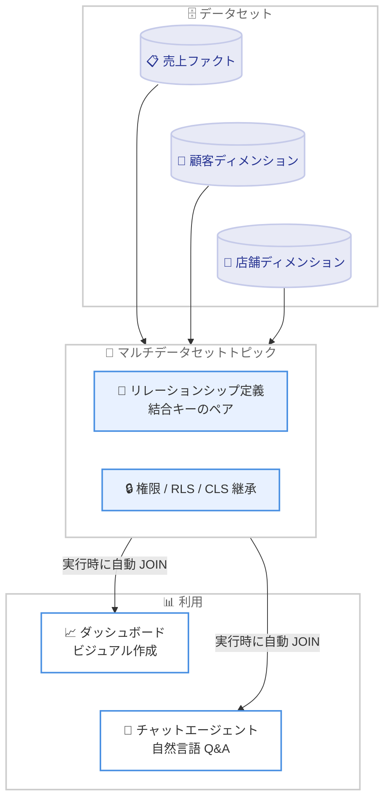

# Amazon Quick - マルチデータセット分析機能のサポート

**リリース日**: 2026 年 8 月 6 日
**サービス**: Amazon Quick
**機能**: マルチデータセットトピック (Multi-Dataset Topics) による横断分析

📊 [このアップデートのインフォグラフィックを見る](https://takech9203.github.io/aws-news-summary/20260806-amazon-quick.html)

## 概要

Amazon Quick が、1 つのトピック内で複数のデータセット間のリレーションシップ (結合関係) を定義できる「マルチデータセットトピック」をサポートしました。トピックが再利用可能なリレーショナルデータモデルとして機能し、ダッシュボード作成と自然言語での質問応答 (Q&A) の両方で、複数データセットを横断した分析が可能になります。

リレーションシップは一度定義するだけでよく、クエリ実行時に Quick が自動的に結合 (JOIN) を実行します。ダッシュボードのビジュアルと自然言語 Q&A の両方が同じトピックを参照するため、「人と AI エージェントの両方に対する単一の信頼できる情報源 (Single Source of Truth)」として、ガバナンスの効いたセマンティックモデルを提供できます。データセットに設定済みの権限や行レベルセキュリティ (RLS)・列レベルセキュリティ (CLS) はそのまま引き継がれます。

**アップデート前の課題**

- 複数データセットにまたがる質問やビジュアルを作成するには、データ準備の段階で事前に JOIN して 1 つの非正規化データセットを作る必要があった
- 事前結合した大きなテーブルは SPICE キャパシティを余分に消費していた
- ユースケースやデータモデルが変わるたびに、データセットを再構築する手間が発生していた
- ビジュアルごと・用途ごとに類似のデータモデルを重複して管理する必要があった

**アップデート後の改善**

- トピック内で複数データセット間のリレーションシップをモデル化し、実行時に Quick が自動で結合を実行するようになった
- 1 つのビジュアルで複数データセットのフィールドを組み合わせて使用できるようになった
- チャットエージェントがトピックに定義されたリレーションシップを読み取り、事前のデータ準備なしで横断的な質問に回答できるようになった
- セマンティックモデルを一度作成すれば、すべてのダッシュボードビジュアルと Q&A で再利用できるようになった

## アーキテクチャ図



複数のデータセットをトピックに登録し、リレーションシップを一度定義するだけで、ダッシュボードと自然言語 Q&A の両方がクエリ実行時の自動結合により横断分析を実行できます。

## サービスアップデートの詳細

### 主要機能

1. **マルチデータセットトピックによるセマンティックレイヤー**
   - 1 つのトピックに複数のデータセットを追加し、データセット間のリレーションシップ (結合キーのペア) を定義できる
   - トピックが再利用可能なリレーショナルデータモデルとして機能する
   - 説明文、シノニム、セマンティックタイプ (City、State、Currency、Date など)、計算フィールドによるデータセットのエンリッチメントに対応

2. **ダッシュボード作成での利用**
   - トピックをデータモデルとして使用し、1 つのビジュアルで複数データセットのフィールドを組み合わせ可能
   - 必要な結合は Quick が自動生成するため、事前のデータ準備が不要
   - セマンティックモデルを一度作成すれば、すべてのダッシュボードビジュアルで再利用できる

3. **自然言語 Q&A (チャットエージェント) での利用**
   - チャットエージェントをトピックに向けるだけで、定義済みリレーションシップを読み取り、実行時結合により横断的な質問に回答
   - 質問処理は「意図の解析 → リレーションシップの探索 (最短結合パスの特定) → SQL 生成 → 結果の提示」の 4 ステップで実行される
   - Explanation 機能により生成された SQL を確認できる

4. **ガバナンスの継承**
   - 既存のデータセット権限をそのまま再利用
   - 行レベルセキュリティ (RLS) と列レベルセキュリティ (CLS) をサポートし、横断ビジュアル・回答でもガバナンスを維持
   - Owner (質問・トピック変更・分析利用が可能) と Viewer (質問・分析利用のみ) の権限区分

## 技術仕様

### マルチデータセットトピックの仕様

| 項目 | 詳細 |
|------|------|
| データセット数 | 1 トピックあたり最大 12 データセット (プレビュー時点の情報) |
| データソース | SPICE、または Direct Query (Amazon Redshift、Athena、S3 Tables、Snowflake、Databricks) |
| 制約 | 同一トピック内で SPICE と Direct Query のデータセットは混在不可 |
| リレーションシップ定義 | データセットペア間の結合キー (列同士のペア) を JSON ファイルで定義・アップロード |
| 推奨スキーマ | スタースキーマ (ファクトテーブル + 共有ディメンション)。循環結合と多対多は避ける |
| カタログ連携 | AWS Glue Data Catalog、Databricks Unity Catalog |
| セキュリティ | データセットレベルの RLS / CLS をトピックのセマンティックレイヤーを通じて維持 |

### リレーションシップ定義の例

```json
{
  "datasetPairs": [
    {
      "datasetLeft": "SALES_FACT",
      "datasetRight": "CUSTOMER_DIM",
      "joinColumns": [
        {
          "columnLeft": "CUSTOMER_ID",
          "columnRight": "CUSTOMER_ID"
        }
      ]
    },
    {
      "datasetLeft": "SALES_FACT",
      "datasetRight": "STORE_DIM",
      "joinColumns": [
        {
          "columnLeft": "STORE_ID",
          "columnRight": "STORE_ID"
        }
      ]
    }
  ]
}
```

## 設定方法

### 前提条件

1. Amazon Quick (Enterprise Edition) を利用できる AWS アカウント
2. Author または Admin ロール
3. SPICE またはサポートされる Direct Query ソース上のスタースキーマ構成のデータセット
4. トピック作成とデータセット管理の権限

### 手順

#### ステップ 1: データセットのエンリッチメント

Quick Sight の [Data] からデータセットを選択して [Edit] を開き、出力タブでフィールドの説明、シノニム、セマンティックタイプを追加します。内部用フィールドは除外し、[Save and publish] で公開します。自然言語 Q&A の精度を高めるために重要なステップです。

#### ステップ 2: トピックの作成とデータセットの追加

[Data] → [Topics] タブ → [Create topic] を選択し、名前と説明を入力します。[Add dataset] で分析対象のデータセット (最大 12 個) をすべて選択し、[Create] でトピックを作成します。

#### ステップ 3: リレーションシップの定義

[Relationships] タブで [Upload file] を選択し、データセットペアごとの結合キーを記述した JSON ファイルをアップロードします。アップロード後に内容を確認し、必要に応じて [Edit] と [Save] で修正します。

#### ステップ 4: カスタムインストラクションの追加 (オプション)

[Custom instructions] タブの [Edit] から、ビジネスルール (例: 会計年度は 4 月 1 日開始、特定メトリクスの定義など) を追加し、[Save changes] で保存します。

#### ステップ 5: 公開と共有

[Publish] でトピックを公開し、メニューから [Share] を選択してユーザーやグループに Owner または Viewer 権限を付与します。その後、[Create analysis] からインタラクティブシートを作成するか、チャットアイコンからトピックをコンテキストに指定して質問できます。

## メリット

### ビジネス面

- **分析までのリードタイム短縮**: 事前のデータ準備や JOIN 作業なしで、横断的なビジネス質問にすぐ回答できる
- **単一の信頼できる情報源**: 人 (ダッシュボード) と AI エージェント (チャット) が同じガバナンス済みセマンティックモデルを参照するため、指標の不整合を防げる
- **コスト削減**: 事前結合した非正規化テーブルが不要になり、SPICE キャパシティの消費を抑制できる

### 技術面

- **データモデルの再利用性**: リレーションシップを一度定義すれば、すべてのビジュアルと Q&A で再利用できる
- **保守性の向上**: ユースケース変更時にデータセットを再構築する必要がなく、トピックのリレーションシップ定義の更新で対応できる
- **セキュリティの一貫性**: データセットレベルの権限・RLS・CLS がそのまま継承され、二重管理が不要

## デメリット・制約事項

### 制限事項

- 1 トピックあたりのデータセット数は最大 12 (プレビュー時点の情報。最新の上限は公式ドキュメントを確認)
- 同一トピック内で SPICE データセットと Direct Query データセットを混在させることはできない
- 循環結合や多対多のリレーションシップは推奨されない

### 考慮すべき点

- 自然言語 Q&A の回答精度は、フィールドの説明・シノニム・セマンティックタイプなどのエンリッチメントの質に依存する
- 実行時結合となるため、大規模データや複雑な結合パスではクエリパフォーマンスへの影響を考慮し、スタースキーマ設計を推奨
- 生成された SQL は Explanation 機能で確認し、意図した結合・集計になっているか検証することが望ましい

## ユースケース

### ユースケース 1: 売上・顧客・店舗の横断分析ダッシュボード

**シナリオ**: 売上ファクト、顧客ディメンション、店舗ディメンションが別々のデータセットとして管理されており、顧客セグメント別・店舗リージョン別の売上を 1 つのビジュアルで可視化したい。

**実装例**:
```
1. 3 つのデータセットを 1 つのトピックに追加
2. SALES_FACT.CUSTOMER_ID → CUSTOMER_DIM.CUSTOMER_ID、
   SALES_FACT.STORE_ID → STORE_DIM.STORE_ID のリレーションシップを定義
3. 分析で顧客セグメント、店舗リージョン、売上金額を 1 つのビジュアルに配置
```

**効果**: 事前結合用のデータセットを作らずに横断ビジュアルを作成でき、SPICE 使用量とデータ準備工数を削減できる。

### ユースケース 2: 自然言語による部門横断のセルフサービス分析

**シナリオ**: ビジネスユーザーが「顧客セグメント別・店舗リージョン別の総売上を表示して」のような質問を、SQL やデータモデルの知識なしで実行したい。

**実装例**:
```
1. マルチデータセットトピックを公開し、ユーザーに Viewer 権限を付与
2. チャットエージェントのコンテキストにトピックを指定
3. ユーザーが自然言語で質問すると、Quick が最短結合パスを特定し
   JOIN・集計を含む SQL を自動生成して回答
```

**効果**: データチームへの依頼なしでビジネスユーザー自身が横断的なインサイトを得られ、分析のセルフサービス化が進む。

### ユースケース 3: RLS を維持したガバナンス下でのエージェント活用

**シナリオ**: 営業データに行レベルセキュリティを適用しており、担当地域のデータのみ閲覧可能な状態を保ったまま、AI エージェントによる Q&A を展開したい。

**実装例**:
```
1. 各データセットに RLS / CLS を設定済みの状態でトピックに追加
2. トピック経由のダッシュボード・チャットの回答にも
   データセットレベルのセキュリティが自動的に適用される
```

**効果**: セキュリティ設定を二重管理することなく、ガバナンスを維持したまま AI エージェントによる分析を全社展開できる。

## 料金

公式発表に本機能固有の追加料金に関する記載はありません。Amazon Quick の既存の料金体系の範囲で利用できます。詳細は Amazon Quick の料金ページを確認してください。

## 利用可能リージョン

Amazon Quick が利用可能なすべての AWS リージョンで一般提供 (GA) されています。対象リージョンの一覧は[公式ドキュメント](https://docs.aws.amazon.com/quick/latest/userguide/regions.html#regions-qs)を参照してください。

## 関連サービス・機能

- **Amazon Quick Sight**: マルチデータセットトピックをデータモデルとしたダッシュボード・ビジュアル作成に使用
- **SPICE**: インメモリ計算エンジン。マルチデータセットトピックのデータソースとして利用可能 (Direct Query との混在は不可)
- **AWS Glue Data Catalog / Databricks Unity Catalog**: データセットのメタデータエンリッチメントに利用可能なカタログ
- **Amazon Redshift / Athena / S3 Tables / Snowflake / Databricks**: Direct Query のデータソースとして利用可能

## 参考リンク

- 📊 [インフォグラフィック](https://takech9203.github.io/aws-news-summary/20260806-amazon-quick.html)
- [公式発表 (What's New)](https://aws.amazon.com/about-aws/whats-new/2026/08/amazon-quick/)
- [AWS Blog: Build a unified semantic layer across datasets with multi-dataset topics in Amazon Quick](https://aws.amazon.com/blogs/machine-learning/build-a-unified-semantic-layer-across-datasets-with-multi-dataset-topics-in-amazon-quick/)
- [ドキュメント: Amazon Quick 対応リージョン](https://docs.aws.amazon.com/quick/latest/userguide/regions.html#regions-qs)

## まとめ

Amazon Quick のマルチデータセットトピックにより、事前結合なしで複数データセットを横断するダッシュボード作成と自然言語 Q&A が可能になりました。データ準備工数と SPICE 消費を削減しつつ、RLS / CLS を含むガバナンスを維持したまま、人と AI エージェントが共有する単一のセマンティックモデルを構築できます。複数の非正規化データセットを運用している場合は、スタースキーマへの整理とマルチデータセットトピックへの移行を検討することを推奨します。
