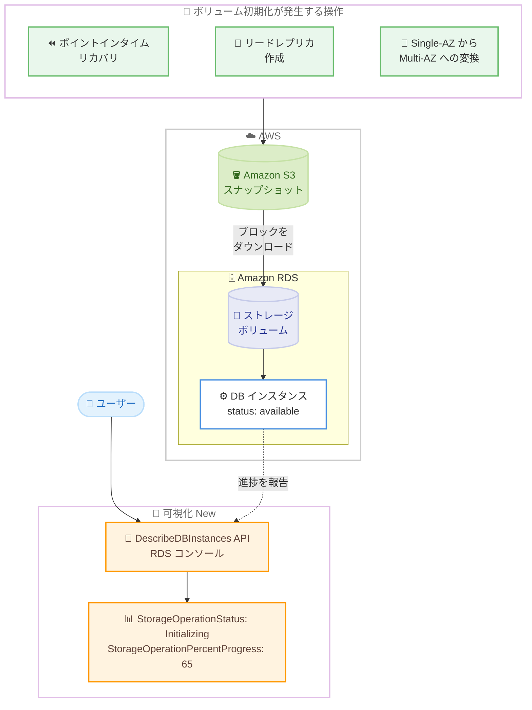

# Amazon RDS - ストレージボリューム初期化ステータスの可視化

**リリース日**: 2026年8月6日
**サービス**: Amazon RDS (Relational Database Service)
**機能**: ストレージボリューム初期化ステータスの可視化 (StorageOperationStatus / StorageOperationPercentProgress)

📊 [このアップデートのインフォグラフィックを見る](https://takech9203.github.io/aws-news-summary/20260806-amazon-rds-storage-volume-initialization-visibility.html)

## 概要

Amazon RDS が、スナップショットから作成されたストレージボリュームの初期化ステータスを可視化する機能を発表しました。RDS コンソールおよび `DescribeDBInstances` API に新しいフィールド `StorageOperationStatus` と `StorageOperationPercentProgress` が追加され、ストレージ初期化の進行状況をリアルタイムで確認できるようになります。

RDS では、ポイントインタイムリカバリ、リードレプリカの作成、Single-AZ から Multi-AZ への変換などの操作を行うと、スナップショットからストレージボリュームが作成されます。この初期化中は、ストレージブロックがアクセス前に Amazon S3 からダウンロードされてボリュームに書き込まれるため、I/O レイテンシーが一時的に上昇することがあります。今回のアップデートにより、初期化がいつ完了し、プロビジョニングされた本来の性能をいつ発揮できるようになるかを正確に把握できます。

本機能はすべての RDS データベースインスタンスでデフォルトで有効化されており、追加設定は不要です。レイテンシーに敏感なワークロードを扱うデータベース管理者や、リストア後の切り替えタイミングを計画する運用チームにとって重要なアップデートです。

**アップデート前の課題**

このアップデート以前は、ストレージ初期化の状態を確認する手段がありませんでした。

- スナップショットからのリストア後、ストレージ初期化中であっても RDS はインスタンスを「available」と報告しており、初期化中であることを判別できなかった
- 初期化中はブロックが S3 から遅延ロードされるため I/O レイテンシーが上昇するが、いつ性能が安定するかを予測できなかった
- 初期化の進行はワークロードやアクセスされるブロックに依存するため、完了タイミングの見積もりが困難で、本番切り替えのスケジュール判断が難しかった

**アップデート後の改善**

今回のアップデートにより、以下が可能になりました。

- `StorageOperationStatus` と `StorageOperationPercentProgress` フィールドで、初期化の状態と進捗率をリアルタイムに監視できるようになった
- すべてのブロックがボリュームに書き込まれた (初期化完了) タイミングを正確に把握し、レイテンシーに敏感なワークロードの開始時期を計画できるようになった
- ストレージ変更後の最適化 (Optimizing) の進捗も同じフィールドで確認でき、フルパフォーマンスに戻るタイミングを計画できるようになった

## アーキテクチャ図



スナップショットからボリュームが作成される操作では、ブロックが S3 からダウンロードされて初期化されます。今回のアップデートで、この初期化の進捗を `DescribeDBInstances` API や RDS コンソールから確認できるようになりました。

## サービスアップデートの詳細

### 主要機能

1. **ストレージ初期化ステータスの可視化**
   - `StorageOperationStatus` フィールドで現在のストレージ操作の種類を確認可能 (初期化中は `Initializing`)
   - `StorageOperationPercentProgress` フィールドで進捗率をパーセントで確認可能
   - 操作が完了すると両フィールドはレスポンスから消えるため、完了判定が容易

2. **ストレージ最適化の進捗の可視化**
   - ストレージ変更 (スケールアップなど) 後の最適化中は `StorageOperationStatus` が `Optimizing` となる
   - ストレージ変更後にフルパフォーマンスへ戻るタイミングの計画に活用可能

3. **追加ストレージボリュームのボリューム単位の追跡**
   - RDS for Oracle / SQL Server の追加ストレージボリューム構成では、ストレージ操作がボリューム単位で追跡される
   - `DescribeDBInstances` レスポンスのトップレベル (プライマリボリューム) と `AdditionalStorageVolumes` 配列の各エントリの両方にフィールドが含まれる
   - プライマリボリュームが初期化中、追加ボリュームが最適化中といった異なる状態を同時に把握可能

4. **デフォルト有効・複数のアクセス手段**
   - すべての RDS データベースインスタンスでデフォルトで有効 (追加設定不要)
   - RDS マネジメントコンソール、AWS CLI、AWS SDK から利用可能

## 技術仕様

### 新しいフィールド

| 項目 | 詳細 |
|------|------|
| `StorageOperationStatus` | 進行中のストレージ操作の種類。`Initializing` (初期化中) または `Optimizing` (最適化中)。操作完了後はレスポンスに含まれない |
| `StorageOperationPercentProgress` | ストレージ操作の進捗率 (整数、パーセント) |
| 出現箇所 | `DBInstance` オブジェクトのトップレベル (プライマリボリューム) および `AdditionalStorageVolumes` 配列の各エントリ |
| 取得方法 | RDS コンソール、`DescribeDBInstances` API (AWS CLI / SDK) |
| 有効化 | すべての RDS DB インスタンスでデフォルト有効 |

### 初期化が発生する操作

| 操作 | 説明 |
|------|------|
| ポイントインタイムリカバリ | 指定時刻の状態にスナップショットから新規インスタンスを復元 |
| スナップショットからのリストア | DB スナップショットから新規インスタンスを作成 |
| リードレプリカ作成 | プライマリのスナップショットからレプリカのボリュームを作成 |
| Single-AZ から Multi-AZ への変換 | スタンバイ用ボリュームをスナップショットから作成 |

### API変更履歴

| 日付 | サービス | 変更内容 |
|------|----------|----------|
| 2026/07/31 | [Amazon RDS](https://awsapichanges.com/archive/changes/21e1f1-rds.html) | 13 updated api methods - `DBInstance` オブジェクトに `StorageOperationStatus` と `StorageOperationPercentProgress` を追加。`DescribeDBInstances` を含む `DBInstance` を返す 13 の API メソッドに反映 |

### レスポンス例

```json
{
  "DBInstances": [
    {
      "DBInstanceIdentifier": "mydb-restored",
      "DBInstanceStatus": "available",
      "StorageOperationStatus": "Initializing",
      "StorageOperationPercentProgress": 65,
      "AdditionalStorageVolumes": [
        {
          "VolumeName": "rdsdbdata2",
          "StorageOperationStatus": "Optimizing",
          "StorageOperationPercentProgress": 40
        }
      ]
    }
  ]
}
```

## 設定方法

### 前提条件

1. AWS CLI がインストール済みで、RDS への読み取り権限 (`rds:DescribeDBInstances`) を持つ認証情報が設定されていること
2. スナップショットリストア、リードレプリカ作成などの操作で作成された DB インスタンスが存在すること (初期化の観察対象)
3. 追加設定は不要 (本機能はデフォルトで有効)

### 手順

#### ステップ1: 初期化ステータスの確認

```bash
aws rds describe-db-instances \
  --db-instance-identifier mydb-restored \
  --query 'DBInstances[0].{Status:DBInstanceStatus,StorageOp:StorageOperationStatus,Progress:StorageOperationPercentProgress}'
```

`DescribeDBInstances` API を呼び出し、DB インスタンスのステータスに加えて、ストレージ操作の種類 (`StorageOperationStatus`) と進捗率 (`StorageOperationPercentProgress`) を抽出して表示します。初期化中であれば `Initializing` と進捗率が返ります。

#### ステップ2: 初期化完了の待機 (ポーリング)

```bash
while true; do
  STATUS=$(aws rds describe-db-instances \
    --db-instance-identifier mydb-restored \
    --query 'DBInstances[0].StorageOperationStatus' \
    --output text)
  if [ "$STATUS" = "None" ]; then
    echo "ストレージ初期化が完了しました"
    break
  fi
  PROGRESS=$(aws rds describe-db-instances \
    --db-instance-identifier mydb-restored \
    --query 'DBInstances[0].StorageOperationPercentProgress' \
    --output text)
  echo "状態: $STATUS 進捗: $PROGRESS%"
  sleep 60
done
```

60 秒間隔でストレージ操作の状態をポーリングし、`StorageOperationStatus` フィールドがレスポンスから消えた (完了した) 時点でループを終了します。操作完了後はフィールド自体が返されなくなるため、`None` の判定で完了を検知できます。

#### ステップ3: 追加ストレージボリュームの確認 (Oracle / SQL Server の場合)

```bash
aws rds describe-db-instances \
  --db-instance-identifier mydb-oracle \
  --query 'DBInstances[0].AdditionalStorageVolumes[*].{Volume:VolumeName,StorageOp:StorageOperationStatus,Progress:StorageOperationPercentProgress}'
```

追加ストレージボリュームを持つインスタンスでは、`AdditionalStorageVolumes` 配列の各エントリからボリューム単位の状態と進捗を確認します。プライマリと追加ボリュームが異なる状態にある場合も個別に把握できます。

## メリット

### ビジネス面

- **計画的な本番切り替え**: リストアやレプリカ作成後、フルパフォーマンスが保証されるタイミングを把握してカットオーバーを計画でき、切り替え直後の性能劣化によるユーザー影響を回避できる
- **DR 訓練・復旧作業の精度向上**: 障害復旧時に「いつからワークロードを流せるか」を定量的に判断でき、RTO の見積もりと実績管理が改善する
- **運用工数の削減**: レイテンシーメトリクスの推移から初期化完了を推測する必要がなくなり、確認作業が簡素化される

### 技術面

- **完了判定の自動化**: API のフィールドをポーリングするだけで初期化・最適化の完了を機械的に判定でき、リストア後の処理を自動化パイプラインに組み込める
- **ボリューム単位の可視性**: 追加ストレージボリューム構成でも各ボリュームの状態を個別に追跡でき、部分的な初期化遅延を特定できる
- **追加コスト・設定なし**: デフォルトで有効なため、既存の運用スクリプトに `DescribeDBInstances` の項目を追加するだけで利用開始できる

## デメリット・制約事項

### 制限事項

- 初期化そのものを高速化する機能ではなく、あくまで進捗の可視化機能である
- 初期化のペースはワークロードとアクセスされるブロックに依存するため、進捗率から完了時刻を正確に予測できるとは限らない
- 操作完了後はフィールドがレスポンスに含まれなくなるため、過去の初期化履歴を後から参照する用途には使えない

### 考慮すべき点

- 初期化中も `DBInstanceStatus` は `available` のままであるため、初期化状態の判定には従来のインスタンスステータスではなく新フィールドを参照する必要がある
- 初期化中の I/O レイテンシー上昇自体は引き続き発生するため、レイテンシーに敏感なワークロードは初期化完了後に開始することが推奨される
- CloudWatch メトリクスではなく API レスポンスのフィールドであるため、アラーム連携にはポーリングの仕組み (Lambda + EventBridge スケジュールなど) が必要

## ユースケース

### ユースケース1: ポイントインタイムリカバリ後の本番切り替え判断

**シナリオ**: 障害発生により本番データベースをポイントインタイムリカバリで復元し、アプリケーションの接続先を切り替える。切り替え直後から本来の性能が必要なため、ストレージ初期化の完了を待ってから切り替えたい。

**実装例**:
```bash
# リストア実行
aws rds restore-db-instance-to-point-in-time \
  --source-db-instance-identifier mydb-prod \
  --target-db-instance-identifier mydb-prod-restored \
  --restore-time 2026-08-06T00:00:00Z

# インスタンスが available になった後、初期化完了を待機
aws rds describe-db-instances \
  --db-instance-identifier mydb-prod-restored \
  --query 'DBInstances[0].[StorageOperationStatus,StorageOperationPercentProgress]'
```

**効果**: 初期化完了を確認してから DNS やアプリケーション設定を切り替えることで、切り替え直後のレイテンシー上昇によるユーザー影響を回避できる。

### ユースケース2: リードレプリカ追加時のトラフィック投入タイミング制御

**シナリオ**: 繁忙期に向けて読み取り負荷分散のためリードレプリカを追加する。作成直後のレプリカはストレージ初期化中で読み取りレイテンシーが高いため、初期化完了後にロードバランシング対象へ組み込みたい。

**実装例**:
```bash
# レプリカ作成
aws rds create-db-instance-read-replica \
  --db-instance-identifier mydb-replica-2 \
  --source-db-instance-identifier mydb-prod

# 初期化進捗を監視し、完了後にアプリケーションの読み取りエンドポイントへ追加
aws rds describe-db-instances \
  --db-instance-identifier mydb-replica-2 \
  --query 'DBInstances[0].StorageOperationStatus'
```

**効果**: 初期化が完了したレプリカのみに読み取りトラフィックを振り分けることで、レプリカ追加時の応答遅延を防ぎ、安定した読み取り性能を提供できる。

### ユースケース3: ストレージ変更後の最適化完了を待つ運用自動化

**シナリオ**: 定期的なストレージスケールアップの運用で、ストレージ変更後の最適化 (Optimizing) 期間中は性能が変動するため、最適化完了後に負荷テストやバッチ処理を開始するようパイプラインを制御したい。

**実装例**:
```bash
# ストレージ変更
aws rds modify-db-instance \
  --db-instance-identifier mydb-prod \
  --allocated-storage 2000 \
  --apply-immediately

# 最適化の進捗を確認し、完了後に後続ジョブを起動
aws rds describe-db-instances \
  --db-instance-identifier mydb-prod \
  --query 'DBInstances[0].[StorageOperationStatus,StorageOperationPercentProgress]'
```

**効果**: 最適化中の性能変動期間を避けてバッチや負荷テストを実行でき、処理時間のばらつきや誤ったベンチマーク結果を防止できる。

## 料金

本機能に追加料金はありません。すべての RDS データベースインスタンスでデフォルトで有効化されており、`DescribeDBInstances` API の呼び出しにも料金は発生しません。

Amazon RDS 自体の料金 (インスタンス、ストレージ、I/O など) は従来どおり適用されます。詳細は [Amazon RDS 料金ページ](https://aws.amazon.com/rds/pricing/) を参照してください。

## 利用可能リージョン

すべての AWS 商用リージョンおよび AWS GovCloud (US) リージョンで利用可能です。

## 関連サービス・機能

- **Amazon EBS**: RDS のストレージボリュームの実体。EBS でも同様に、スナップショットから作成したボリュームの初期化 (ハイドレーション) の概念があり、RDS ではこの状態が新フィールドで可視化される
- **Amazon S3**: DB スナップショットの保存先。初期化中はストレージブロックが S3 からボリュームへダウンロードされる
- **Amazon CloudWatch**: `ReadLatency` / `WriteLatency` などのメトリクスと組み合わせることで、初期化中の性能影響を定量的に把握できる
- **RDS 追加ストレージボリューム**: RDS for Oracle / SQL Server で最大 3 つの追加ボリュームを利用可能。本アップデートによりボリューム単位でストレージ操作の状態を追跡できる

## 参考リンク

- 📊 [インフォグラフィック](https://takech9203.github.io/aws-news-summary/20260806-amazon-rds-storage-volume-initialization-visibility.html)
- [公式発表 (What's New)](https://aws.amazon.com/about-aws/whats-new/2026/08/amazon-rds-storage-volume-initialization-visibility)
- [ドキュメント: Amazon RDS DB instance storage](https://docs.aws.amazon.com/AmazonRDS/latest/UserGuide/CHAP_Storage.html)
- [API リファレンス: DescribeDBInstances](https://docs.aws.amazon.com/AmazonRDS/latest/APIReference/API_DescribeDBInstances.html)
- [API 変更履歴 (awsapichanges.com)](https://awsapichanges.com/archive/changes/21e1f1-rds.html)
- [料金ページ](https://aws.amazon.com/rds/pricing/)

## まとめ

Amazon RDS のストレージ初期化ステータス可視化により、スナップショットリストア、リードレプリカ作成、Multi-AZ 変換後に「いつフルパフォーマンスが得られるか」を正確に判断できるようになりました。追加料金・追加設定なしで全リージョンのすべての RDS インスタンスに適用されるため、リストア後の切り替え手順やレプリカ投入の自動化スクリプトに `DescribeDBInstances` の新フィールドの確認を組み込むことを推奨します。
