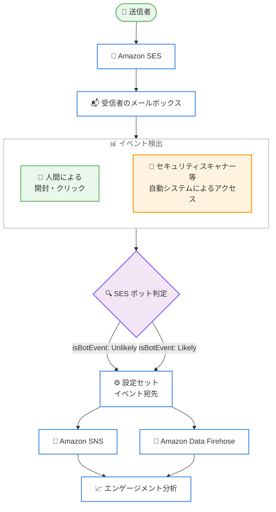

# Amazon SES - Open / Click イベント通知における自動化イベント識別機能

**リリース日**: 2026 年 8 月 6 日
**サービス**: Amazon Simple Email Service (SES)
**機能**: イベント通知への isBotEvent フィールド追加 (自動化された Open / Click イベントの識別)

📊 [このアップデートのインフォグラフィックを見る](https://takech9203.github.io/aws-news-summary/20260806-amazon-ses-automated-email-interactions.html)

## 概要

Amazon SES の Open (開封) および Click (クリック) イベント通知に、新しいフィールド `isBotEvent` が追加されました。このフィールドは `Likely` または `Unlikely` の値を持ち、そのイベントが自動化されたシステム (ボット) によってトリガーされた可能性が高いか、人間の受信者によるものかを示します。

近年、メールセキュリティゲートウェイやプライバシー保護機能 (リンクスキャン、画像の自動プリフェッチなど) により、人間の操作を伴わない開封・クリックイベントが大量に発生し、エンゲージメント指標の正確性が課題となっていました。今回のアップデートにより、送信者はどの程度のエンゲージメントが実際の人間の受信者によるものかをより正確に把握できるようになります。

設定セットのイベント宛先 (Amazon SNS、Amazon Data Firehose など) を通じて Open / Click イベントを発行しているすべてのお客様に対して、`isBotEvent` フィールドは自動的に含まれます。追加の設定は不要です。

**アップデート前の課題**

以前は、Open / Click イベントに人間とボットを区別する情報が含まれていませんでした。

- セキュリティスキャナーやリンク検査ツールによる自動アクセスが、人間による開封・クリックと区別なくカウントされていた
- エンゲージメント指標 (開封率、クリック率) がボットイベントにより過大評価され、キャンペーン効果の正確な測定が困難だった
- ボットイベントを除外するには、User-Agent や IP アドレスをもとに独自のヒューリスティックを実装する必要があった

**アップデート後の改善**

今回のアップデートにより、以下が可能になりました。

- SES がイベントごとにボット判定 (`Likely` / `Unlikely`) を自動付与し、人間のエンゲージメントとの区別が容易になった
- 独自のボット判定ロジックを実装することなく、正確なエンゲージメント分析が可能になった
- 既存のイベント発行設定をそのまま利用でき、追加設定なしで新フィールドを受け取れるようになった

## アーキテクチャ図



SES が Open / Click イベントの発生元を判定し、`isBotEvent` フィールド (`Likely` / `Unlikely`) を付与してイベント宛先 (SNS、Firehose) に発行するフローを示しています。

## サービスアップデートの詳細

### 主要機能

1. **isBotEvent フィールドの追加**
   - Open および Click イベント通知の JSON オブジェクトに `isBotEvent` フィールドが追加された
   - 値は `Likely` (自動システムによる可能性が高い) または `Unlikely` (人間による可能性が高い) の 2 種類
   - イベントが自動化されたシステムによって生成された可能性を SES が判定して付与する

2. **自動適用 (設定変更不要)**
   - 設定セットのイベント宛先経由で Open / Click イベントを発行している場合、自動的にフィールドが含まれる
   - 既存のイベント発行パイプラインへの追加設定は不要
   - Amazon SNS、Amazon Data Firehose のいずれのイベント宛先でも利用可能

3. **エンゲージメント分析の精度向上**
   - 人間の受信者によるエンゲージメントと自動システムによるイベントを区別可能
   - 開封率・クリック率の実態把握、リエンゲージメントキャンペーンの対象選定などに活用できる

## 技術仕様

### Open イベントオブジェクトのフィールド

| フィールド | 説明 |
|------|------|
| `ipAddress` | 受信者の IP アドレス |
| `timestamp` | 開封イベントの発生日時 (ISO8601 形式) |
| `userAgent` | メールを開封したデバイスまたはメールクライアントのユーザーエージェント |
| `isBotEvent` | イベントが自動システム (ボット) により生成された可能性。値: `Likely` / `Unlikely` |

### Click イベントオブジェクトのフィールド

| フィールド | 説明 |
|------|------|
| `ipAddress` | 受信者の IP アドレス |
| `timestamp` | クリックイベントの発生日時 (ISO8601 形式) |
| `userAgent` | リンクをクリックしたクライアントのユーザーエージェント |
| `link` | クリックされたリンクの URL |
| `linkTags` | `ses:tags` 属性でリンクに追加されたタグのリスト |
| `isBotEvent` | イベントが自動システム (ボット) により生成された可能性。値: `Likely` / `Unlikely` |

### イベント通知の例

```json
{
  "eventType": "Click",
  "mail": {
    "timestamp": "2026-08-06T00:00:00.000Z",
    "messageId": "EXAMPLE7c191be45-e9aedb9a-02f9-4d12-a87d-dd0099a07f8a-000000",
    "source": "sender@example.com",
    "destination": ["recipient@example.com"]
  },
  "click": {
    "ipAddress": "192.0.2.1",
    "timestamp": "2026-08-06T00:01:00.000Z",
    "userAgent": "Mozilla/5.0 (Windows NT 10.0; Win64; x64)",
    "link": "https://example.com/campaign",
    "linkTags": {
      "campaign": ["summer-sale"]
    },
    "isBotEvent": "Unlikely"
  }
}
```

## 設定方法

### 前提条件

1. Amazon SES で検証済みの送信 ID (ドメインまたはメールアドレス) があること
2. 設定セット (Configuration Set) を作成済みであること
3. 設定セットに Open / Click イベントを発行するイベント宛先 (SNS または Firehose) を設定済みであること

### 手順

#### ステップ1: 既存のイベント宛先を確認する

```bash
aws sesv2 get-configuration-set-event-destinations \
  --configuration-set-name my-config-set
```

指定した設定セットに関連付けられたイベント宛先の一覧と、発行対象のイベントタイプ (`OPEN`、`CLICK` など) を確認します。

#### ステップ2: Open / Click イベントの発行を有効化する (未設定の場合)

```bash
aws sesv2 create-configuration-set-event-destination \
  --configuration-set-name my-config-set \
  --event-destination-name engagement-events \
  --event-destination '{
    "Enabled": true,
    "MatchingEventTypes": ["OPEN", "CLICK"],
    "SnsDestination": {
      "TopicArn": "arn:aws:sns:ap-northeast-1:123456789012:ses-engagement-events"
    }
  }'
```

設定セットに SNS トピックをイベント宛先として追加し、Open / Click イベントの発行を有効化します。既にイベント発行を設定済みの場合、このステップは不要です。

#### ステップ3: 受信したイベントで isBotEvent フィールドを確認する

イベント宛先に発行される JSON の `open` または `click` オブジェクト内の `isBotEvent` フィールドを確認します。追加の設定は不要で、自動的にフィールドが含まれます。分析パイプライン (Athena クエリ、ダッシュボードなど) でこのフィールドを利用してボットイベントをフィルタリングします。

## メリット

### ビジネス面

- **正確なキャンペーン効果測定**: ボットによる開封・クリックを除外した実質的なエンゲージメント率を把握でき、マーケティング施策の意思決定精度が向上する
- **リスト管理の品質向上**: 人間のエンゲージメントに基づいてリエンゲージメントや配信停止の判断ができ、送信レピュテーションの維持につながる
- **追加コストなし**: 既存のイベント発行の仕組みにフィールドが追加されるだけであり、追加料金や導入コストが発生しない

### 技術面

- **独自ボット判定ロジックが不要**: User-Agent や IP アドレスに基づく自前のヒューリスティック実装・保守が不要になる
- **設定変更不要で即時利用可能**: 既存のイベント発行パイプラインにフィールドが自動追加されるため、移行作業が発生しない
- **下流分析への統合が容易**: Firehose 経由で S3 / Athena / QuickSight などに取り込み、`isBotEvent` でのフィルタリングや集計が簡単に行える

## デメリット・制約事項

### 制限事項

- 判定は `Likely` / `Unlikely` の確率的なシグナルであり、100% の精度でボットを識別するものではない
- 対象は Open / Click イベントのみで、他のイベントタイプ (Delivery、Bounce など) には適用されない
- 設定セットのイベント宛先経由でイベントを発行している場合が対象であり、開封・クリック追跡自体を有効にしている必要がある

### 考慮すべき点

- 既存の分析パイプラインやスキーマ定義 (Glue テーブル、Athena クエリなど) が固定スキーマの場合、新フィールドに対応するための更新が必要になることがある
- `isBotEvent` が `Likely` のイベントを一律に除外するか、参考情報として扱うかは、各ワークロードの要件に応じて判断する必要がある
- CloudWatch のイベントメトリクス集計値には従来どおりの挙動が適用されるため、詳細な人間/ボットの区別はイベント通知データでの分析が前提となる

## ユースケース

### ユースケース1: メールマーケティングの実質エンゲージメント測定

**シナリオ**: マーケティングチームがニュースレターの開封率・クリック率を KPI としているが、企業向け送信ではセキュリティスキャナーによる自動開封が多く、実態より高い数値が出ていた。

**実装例**:
```sql
-- Athena で人間による開封のみを集計
SELECT
  COUNT(*) AS total_opens,
  COUNT_IF(open.isBotEvent = 'Unlikely') AS human_opens,
  ROUND(COUNT_IF(open.isBotEvent = 'Unlikely') * 100.0 / COUNT(*), 1)
    AS human_open_ratio
FROM ses_events
WHERE eventType = 'Open'
  AND date >= date '2026-08-01';
```

**効果**: ボットイベントを除外した実質的な開封率を KPI として利用でき、キャンペーン改善の判断精度が向上する。

### ユースケース2: リエンゲージメントキャンペーンの対象選定

**シナリオ**: 一定期間エンゲージメントのない受信者に再送信するリエンゲージメントキャンペーンで、ボットによる開封を「アクティブ」と誤判定し、実際には無反応の受信者に送信を継続していた。

**実装例**:
```sql
-- 人間によるエンゲージメントが 90 日間ない受信者を抽出
SELECT DISTINCT mail.destination[1] AS recipient
FROM ses_events
GROUP BY mail.destination[1]
HAVING MAX(CASE WHEN eventType IN ('Open', 'Click')
  AND COALESCE(open.isBotEvent, click.isBotEvent) = 'Unlikely'
  THEN date END) < current_date - interval '90' day;
```

**効果**: 真に非アクティブな受信者を正確に特定し、送信リストの品質と送信レピュテーションを維持できる。

### ユースケース3: クリック起点の自動処理におけるボット除外

**シナリオ**: メール内リンクのクリックをトリガーにワンタイム URL の無効化や特典付与などの処理を実行しているが、セキュリティゲートウェイのリンクスキャンにより意図せず処理が実行されてしまう。

**実装例**:
```python
# Lambda で SNS 経由のクリックイベントを処理
def handler(event, context):
    for record in event["Records"]:
        message = json.loads(record["Sns"]["Message"])
        if message.get("eventType") != "Click":
            continue
        click = message["click"]
        if click.get("isBotEvent") == "Likely":
            # ボットの可能性が高いクリックはスキップ
            continue
        process_user_click(message["mail"], click)
```

**効果**: リンクスキャナーによる誤作動を抑制し、人間のクリックに対してのみ後続処理を実行できる。

## 料金

`isBotEvent` フィールドの追加に伴う追加料金はありません。Amazon SES の通常のメール送信料金、および開封・クリック追跡を含むイベント発行に関する既存の料金体系が適用されます。イベント宛先として使用する Amazon SNS や Amazon Data Firehose には、それぞれのサービスの料金が適用されます。

## 利用可能リージョン

Amazon SES が利用可能なすべての AWS リージョンで利用できます (東京・大阪リージョンを含む)。

## 関連サービス・機能

- **Amazon SNS**: SES イベント宛先の 1 つ。Open / Click イベントを通知として受け取り、Lambda などでリアルタイム処理できる
- **Amazon Data Firehose**: SES イベント宛先の 1 つ。イベントデータを S3 や OpenSearch Service に配信し、大規模な分析基盤を構築できる
- **Amazon SES Virtual Deliverability Manager**: 到達性とエンゲージメントの分析・改善を支援する機能。isBotEvent と組み合わせてエンゲージメントの実態把握に活用できる
- **Amazon Athena / Amazon QuickSight**: Firehose 経由で蓄積したイベントデータの集計・可視化に利用できる

## 参考リンク

- 📊 [インフォグラフィック](https://takech9203.github.io/aws-news-summary/20260806-amazon-ses-automated-email-interactions.html)
- [公式発表 (What's New)](https://aws.amazon.com/about-aws/whats-new/2026/08/amazon-ses-automated-email-interactions/)
- [ドキュメント: SES が Amazon SNS に発行するイベントデータの内容](https://docs.aws.amazon.com/ses/latest/dg/event-publishing-retrieving-sns-contents.html)
- [ドキュメント: SES が Firehose に発行するイベントデータの内容](https://docs.aws.amazon.com/ses/latest/dg/event-publishing-retrieving-firehose-contents.html)
- [料金ページ](https://aws.amazon.com/ses/pricing/)

## まとめ

Amazon SES の Open / Click イベント通知に `isBotEvent` フィールドが追加され、自動システムによるイベントと人間のエンゲージメントを追加設定なしで区別できるようになりました。セキュリティスキャナー等によるエンゲージメント指標の歪みは多くの送信者に共通する課題であり、既にイベント発行を利用している場合は自動的に恩恵を受けられます。分析パイプラインやクリック起点の自動処理に `isBotEvent` によるフィルタリングを組み込むことを推奨します。
