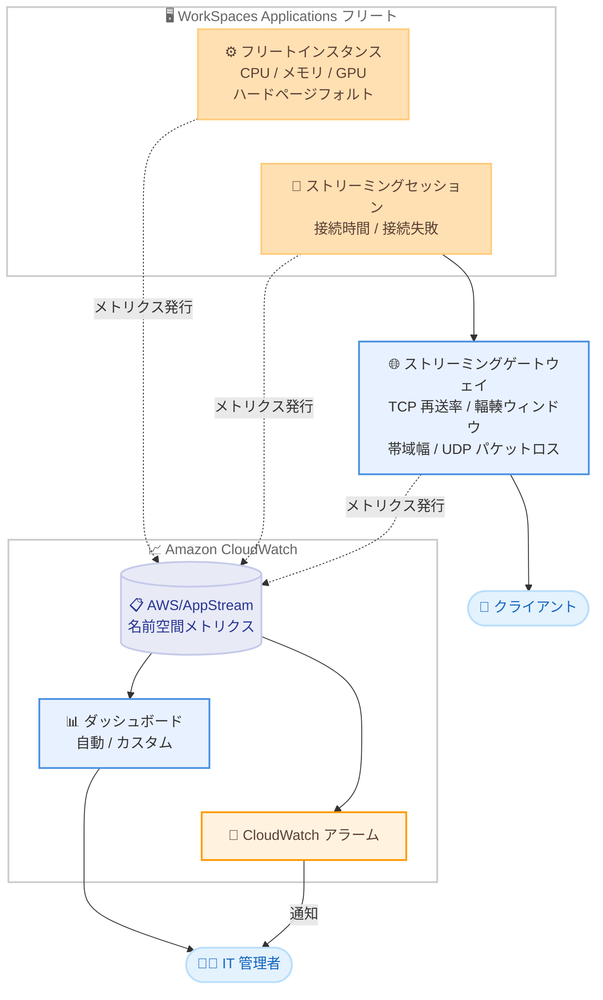

# Amazon WorkSpaces Applications - 拡張オブザーバビリティメトリクスの提供開始

**リリース日**: 2026 年 8 月 6 日
**サービス**: Amazon WorkSpaces Applications (旧 Amazon AppStream 2.0)
**機能**: Amazon CloudWatch への拡張オブザーバビリティメトリクスの発行

📊 [このアップデートのインフォグラフィックを見る](https://takech9203.github.io/aws-news-summary/20260806-amazon-workspaces-applications-observability-metrics.html)

## 概要

Amazon WorkSpaces Applications (旧 Amazon AppStream 2.0) が、アプリケーションストリーミングワークロードの可視性を高める新しいパフォーマンスメトリクスとセッションヘルスメトリクスを Amazon CloudWatch に発行するようになりました。新しいメトリクスは、ネットワークパフォーマンス、コンピュートリソース使用率、セッションライフサイクルイベントの 3 つの領域をカバーします。

IT 管理者は、TCP 再送率や輻輳ウィンドウなどのネットワークメトリクスによりネットワーク品質の劣化箇所を特定でき、GPU 使用率やメモリのハードページフォルトなどのリソースメトリクスにより、セッション品質に影響が出る前にリソースのボトルネックを検出できます。また、接続失敗や接続時間などのセッションライフサイクルメトリクスに CloudWatch アラームを設定することで、接続問題を迅速に検知できます。

これらのメトリクスは追加料金なしで提供され、WorkSpaces Applications が利用可能なすべての AWS リージョンで利用できます。フリート全体を可視化するカスタムダッシュボードの構築や、エンドユーザー体験に影響する問題のプロアクティブなトラブルシューティングにより、平均復旧時間 (MTTR) の短縮が期待できます。

**アップデート前の課題**

拡張メトリクスの提供前は、ストリーミングセッションの品質問題の原因特定が困難でした。

- ネットワーク起因の品質劣化 (パケット再送、輻輳など) をメトリクスで直接確認する手段が限られていた
- GPU 使用率やハードページフォルトなど、セッション品質に直結するリソースボトルネックの兆候を事前に検出しにくかった
- 接続失敗や接続時間といったセッションライフサイクルの状況を CloudWatch アラームで機械的に監視することが難しく、エンドユーザーからの申告に依存しがちだった

**アップデート後の改善**

- TCP 再送率 (TCPRetransmissionRate) や輻輳ウィンドウ (CongestionWindow) などのメトリクスで、ネットワーク劣化のポイントを特定できるようになった
- GPU 使用率 (GpuUtilizationInstance) やハードページフォルト (MemoryPageHardFaults) により、セッション品質に影響が出る前にリソースのボトルネックを可視化できるようになった
- 接続失敗や接続時間 (ConnectionDuration) に CloudWatch アラームを設定し、接続問題の迅速な検知と MTTR の短縮が可能になった
- フリート横断のカスタムダッシュボードで、ストリーミング環境全体の健全性を一元的に把握できるようになった

## アーキテクチャ図



フリートインスタンス、ストリーミングセッション、ゲートウェイの各レイヤーから拡張メトリクスが CloudWatch の AWS/AppStream 名前空間に発行され、IT 管理者はダッシュボードとアラームでフリート全体の健全性を監視できます。

## サービスアップデートの詳細

### 主要機能

1. **ネットワークパフォーマンスメトリクス**
   - TCP 再送率 (TCPRetransmissionRate): ゲートウェイからクライアントへの TCP セグメント再送の割合を示し、ネットワーク劣化の特定に役立つ
   - 輻輳ウィンドウ (CongestionWindow): ゲートウェイにおけるクライアント向けトラフィックの輻輳ウィンドウサイズを示す
   - UDP パケットロス率 (UDPPacketLossRate)、帯域幅 (Bandwidth / BandwidthInbound)、セッション内レイテンシ (InSessionLatency) と組み合わせて、ネットワーク品質を多角的に分析できる

2. **コンピュートリソース使用率メトリクス**
   - GPU 使用率 (GpuUtilizationInstance): インスタンスで使用されている GPU リソースの割合を可視化
   - ハードページフォルト (MemoryPageHardFaults): インスタンス上のハードページフォルトの発生レートを示し、メモリ不足の兆候を検出
   - CPU キュー長 (CpuQueueLength) やディスク I/O キュー長 (DiskIoQueueLength) と合わせて、セッション品質に影響する前にリソースボトルネックを特定できる

3. **セッションライフサイクルメトリクス**
   - 接続失敗: 接続の失敗を監視し、CloudWatch アラームによる迅速な検知が可能
   - 接続時間 (ConnectionDuration): ストリーミング接続の継続時間を記録し、セッションの安定性分析に活用できる

4. **ダッシュボードによる可視化**
   - CloudWatch 自動ダッシュボードで WorkSpaces Applications 環境の健全性をすぐに確認可能
   - CloudFormation テンプレートを使用したカスタムダッシュボードで、フリート横断の可視化を構築可能

## 技術仕様

### 主な拡張メトリクス (AWS/AppStream 名前空間)

| メトリクス | 説明 | 単位 |
|------|------|------|
| TCPRetransmissionRate | ゲートウェイからクライアントへ再送された TCP セグメントの割合 | Percent |
| CongestionWindow | ゲートウェイにおけるクライアント向けトラフィックの輻輳ウィンドウサイズ | Bytes |
| UDPPacketLossRate | ゲートウェイからクライアントへのトラフィックで失われた UDP パケットの割合 | Percent |
| Bandwidth / BandwidthInbound | ゲートウェイ・クライアント間のデータ転送レート (アウトバウンド / インバウンド) | Kilobits/Second |
| InSessionLatency | クライアントとインスタンス間のラウンドトリップタイム | Milliseconds |
| GpuUtilizationInstance | インスタンスで使用されている GPU リソースの割合 | Percent |
| MemoryPageHardFaults | インスタンス上のハードページフォルトの発生レート | Count/Second |
| CpuQueueLength | CPU 時間を待機しているスレッド数 | Count |
| DiskIoQueueLength | ディスク処理待ちの保留中 I/O リクエスト数 | Count |
| ConnectionDuration | ストリーミング接続の継続時間 | Seconds |
| FramesPerSecond | インスタンスからクライアントへ送信される 1 秒あたりのフレーム数 | Count |

### ディメンション

| ディメンション | 用途 |
|------|------|
| Fleet | フリート単位の集計 |
| UserId | ユーザー単位の集計 |
| FleetName, InstanceId | インスタンス単位の分析 |
| FleetName, InstanceId, SessionId, UserId | セッション・ユーザー単位の詳細分析 |

### OS ごとの利用可否

| OS | 利用可否 |
|------|------|
| Windows Server | すべてのメトリクスが利用可能 |
| Linux など (Windows Desktop 以外) | UDPPacketLossRate、TCPRetransmissionRate、BandwidthInbound、CongestionWindow、ConnectionDuration などが利用可能 |
| Windows Desktop | これらのメトリクスは利用不可 |

メトリクスの利用可否はオペレーティングシステムによって異なるため、詳細は公式ドキュメントを確認してください。

## 設定方法

### 前提条件

1. Amazon WorkSpaces Applications のフリートが稼働していること
2. CloudWatch コンソールおよびメトリクスへのアクセス権限 (cloudwatch:GetMetricData、cloudwatch:ListMetrics など) があること
3. アラーム通知を行う場合は Amazon SNS トピックが設定されていること

### 手順

#### ステップ 1: CloudWatch コンソールでメトリクスを確認する

```bash
# AWS/AppStream 名前空間のメトリクス一覧を確認
aws cloudwatch list-metrics \
  --namespace AWS/AppStream
```

CloudWatch に発行されている WorkSpaces Applications のメトリクス一覧を取得します。コンソールの場合は、CloudWatch コンソールの [メトリクス] から AppStream 名前空間を選択し、[Fleet Instance Metrics] または [Fleet Session Metrics] を確認します。

#### ステップ 2: TCP 再送率のメトリクスデータを取得する

```bash
# フリート単位で TCP 再送率の平均値を取得
aws cloudwatch get-metric-statistics \
  --namespace AWS/AppStream \
  --metric-name TCPRetransmissionRate \
  --dimensions Name=Fleet,Value=my-fleet \
  --start-time 2026-08-06T00:00:00Z \
  --end-time 2026-08-06T23:59:59Z \
  --period 300 \
  --statistics Average
```

指定したフリートの TCP 再送率を 5 分間隔の平均値で取得します。値が高い場合、ゲートウェイからクライアントへのネットワーク経路で劣化が発生している可能性があります。

#### ステップ 3: 接続品質に対する CloudWatch アラームを作成する

```bash
# TCP 再送率が 5% を超えた場合に通知するアラームを作成
aws cloudwatch put-metric-alarm \
  --alarm-name workspaces-apps-tcp-retransmission-high \
  --namespace AWS/AppStream \
  --metric-name TCPRetransmissionRate \
  --dimensions Name=Fleet,Value=my-fleet \
  --statistic Average \
  --period 300 \
  --evaluation-periods 3 \
  --threshold 5 \
  --comparison-operator GreaterThanThreshold \
  --alarm-actions arn:aws:sns:ap-northeast-1:123456789012:notify-topic
```

TCP 再送率が 3 回連続の評価期間 (計 15 分) で 5% を超えた場合に SNS トピックへ通知するアラームを作成します。同様に接続失敗やハードページフォルトに対してもアラームを設定できます。

#### ステップ 4: ダッシュボードで可視化する

CloudWatch の自動ダッシュボードを使用すると、WorkSpaces Applications 環境の健全性をすぐに確認できます。さらに、AWS が提供する CloudFormation テンプレートを使用して、フリート横断のカスタムダッシュボードを構築することも可能です。詳細は参考リンクのドキュメントを参照してください。

## メリット

### ビジネス面

- **MTTR の短縮**: 接続問題やリソースボトルネックを迅速に特定できるため、平均復旧時間が短縮され、エンドユーザーの生産性低下を最小限に抑えられる
- **追加コストなし**: すべての拡張メトリクスは追加料金なしで提供されるため、監視強化のための追加投資が不要
- **ユーザー体験の向上**: 問題がエンドユーザーに影響する前にプロアクティブに検出・対処でき、ストリーミング体験の品質を維持できる

### 技術面

- **ネットワーク劣化の切り分け**: TCP 再送率や輻輳ウィンドウにより、アプリケーション側かネットワーク側かの問題切り分けが容易になる
- **リソースボトルネックの早期検出**: GPU 使用率やハードページフォルトにより、インスタンスタイプの見直しやフリート設計の最適化をデータに基づいて実施できる
- **既存の CloudWatch エコシステムとの統合**: アラーム、ダッシュボード、メトリクス数式など既存の CloudWatch 機能をそのまま活用できる

## デメリット・制約事項

### 制限事項

- メトリクスの利用可否はオペレーティングシステムによって異なる (Windows Desktop では TCPRetransmissionRate、CongestionWindow、ConnectionDuration などのメトリクスは利用不可)
- インスタンス・セッションのパフォーマンスメトリクスは 5 分間隔で収集され、新規セッションの最初のデータポイントは約 5 分後に表示される
- コンソールでのパフォーマンスメトリクス表示は、現時点ではマルチセッションフリートのみが対象

### 考慮すべき点

- CloudWatch アラームやダッシュボード自体には CloudWatch の標準料金が適用される
- アラームのしきい値は、ワークロード特性 (グラフィックス系か業務アプリ系かなど) に応じてチューニングが必要
- ゲートウェイ・クライアント間のメトリクスであるため、クライアント端末側のローカル要因はカバーされない点に注意が必要

## ユースケース

### ユースケース 1: リモート拠点のネットワーク品質劣化の特定

**シナリオ**: 特定拠点のユーザーから「画面表示が遅い」という申告が増加している。原因がネットワークかインスタンスリソースかを切り分けたい。

**実装例**:
```
1. CloudWatch で該当ユーザーのセッションを UserId ディメンションで絞り込み
2. TCPRetransmissionRate と UDPPacketLossRate を確認し、ネットワーク劣化を検証
3. CongestionWindow の縮小傾向と InSessionLatency の上昇を突き合わせて経路品質を判断
4. 同時に CpuUtilizationSession / GpuUtilizationInstance を確認し、リソース要因を除外
```

**効果**: 申告ベースの推測ではなく、メトリクスに基づいてネットワーク起因と特定でき、拠点側ネットワークチームへ具体的なデータとともにエスカレーションできる。

### ユースケース 2: GPU ワークロードのボトルネック検出とフリート最適化

**シナリオ**: CAD や 3D レンダリングアプリケーションをストリーミング配信しており、セッション品質の低下を未然に防ぎたい。

**実装例**:
```
1. GpuUtilizationInstance に対して 85% 超で警告するアラームを設定
2. MemoryPageHardFaults の急増を検知するアラームを併設
3. FramesPerSecond の低下と GPU 使用率の相関をダッシュボードで可視化
4. 恒常的に高負荷の場合は、より大きな GPU インスタンスタイプへの変更を検討
```

**効果**: セッション品質に影響が出る前にリソースボトルネックを検出し、データに基づいたインスタンスタイプ選定でコストと性能のバランスを最適化できる。

### ユースケース 3: 接続問題の早期検知による MTTR 短縮

**シナリオ**: 全社的に利用される業務アプリケーションのストリーミング環境で、接続障害を早期に検知し影響範囲を最小化したい。

**実装例**:
```
1. 接続失敗のメトリクスに CloudWatch アラームを設定し、SNS 経由で運用チームへ即時通知
2. ConnectionDuration の異常な短縮 (頻繁な切断) を検知するアラームを追加
3. CloudFormation テンプレートでフリート横断のカスタムダッシュボードを構築
4. CloudWatch 自動ダッシュボードで環境全体の健全性を定常監視
```

**効果**: エンドユーザーからの問い合わせ前に接続問題を検知でき、MTTR を大幅に短縮。フリート全体の傾向把握により再発防止策の立案も容易になる。

## 料金

新しい拡張オブザーバビリティメトリクスは、**追加料金なし**で提供されます。

なお、CloudWatch アラームの作成、カスタムダッシュボードの利用、メトリクスの API 取得などには、Amazon CloudWatch の標準料金が適用されます。

## 利用可能リージョン

Amazon WorkSpaces Applications がサポートされているすべての AWS リージョンで利用可能です (東京リージョンを含む)。

## 関連サービス・機能

- **Amazon CloudWatch**: メトリクスの収集・可視化・アラーム通知の基盤。自動ダッシュボードやカスタムダッシュボードで WorkSpaces Applications の健全性を監視
- **Amazon SNS**: CloudWatch アラームからの通知先として、運用チームへのアラート配信に使用
- **AWS CloudFormation**: フリート横断のカスタム CloudWatch ダッシュボードをテンプレートから構築
- **Amazon WorkSpaces**: 同日に仮想デスクトップサービスの Amazon WorkSpaces でも拡張オブザーバビリティメトリクスが発表されており、エンドユーザーコンピューティング全体で監視強化が進んでいる (別レポート参照)

## 参考リンク

- 📊 [インフォグラフィック](https://takech9203.github.io/aws-news-summary/20260806-amazon-workspaces-applications-observability-metrics.html)
- [公式発表 (What's New)](https://aws.amazon.com/about-aws/whats-new/2026/08/amazon-workspaces-applications-observability-metrics)
- [ドキュメント: Monitoring Amazon WorkSpaces Applications Resources](https://docs.aws.amazon.com/appstream2/latest/developerguide/monitoring.html)
- [ドキュメント: Instance and Session Performance Metrics](https://docs.aws.amazon.com/appstream2/latest/developerguide/instance-session-metrics-single-session-multi-session.html)
- [ドキュメント: Create custom CloudWatch dashboards using CloudFormation templates](https://docs.aws.amazon.com/appstream2/latest/developerguide/custom-cloudwatch-dashboards.html)
- [ドキュメント: CloudWatch automatic dashboard](https://docs.aws.amazon.com/appstream2/latest/developerguide/cloudwatch-automatic-dashboard.html)

## まとめ

Amazon WorkSpaces Applications の拡張オブザーバビリティメトリクスにより、ネットワーク、コンピュートリソース、セッションライフサイクルの 3 つの観点からストリーミング環境を追加料金なしで詳細に監視できるようになりました。アプリケーションストリーミングを運用しているチームは、まず CloudWatch コンソールで新しいメトリクスを確認し、TCP 再送率や接続失敗に対するアラームの設定とダッシュボードの整備から始めることを推奨します。OS によってメトリクスの利用可否が異なるため、事前にドキュメントでの確認も重要です。
