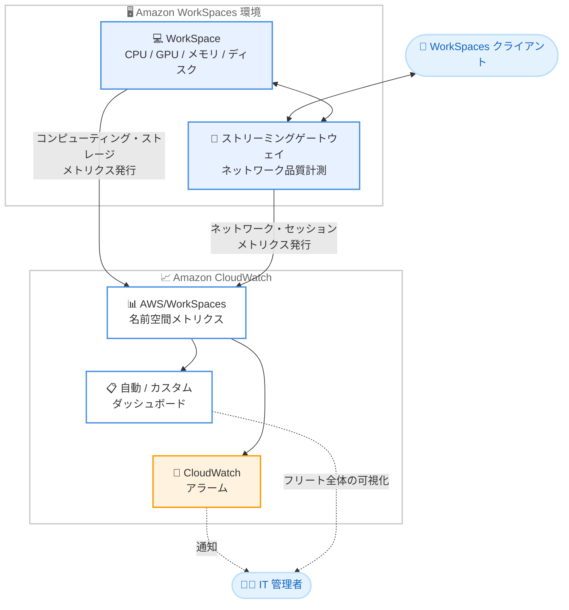

# Amazon WorkSpaces - 拡張オブザーバビリティメトリクスの提供開始

**リリース日**: 2026 年 8 月 6 日
**サービス**: Amazon WorkSpaces
**機能**: Amazon CloudWatch への拡張オブザーバビリティメトリクスの発行

📊 [このアップデートのインフォグラフィックを見る](https://takech9203.github.io/aws-news-summary/20260806-amazon-workspaces-observability-metrics.html)

## 概要

Amazon WorkSpaces が、パフォーマンスとセッションヘルスに関する追加のメトリクスを Amazon CloudWatch に発行するようになりました。今回のアップデートにより、IT 管理者は仮想デスクトップワークロードに対するより深い可視性を獲得し、エンドユーザー体験に影響する問題をプロアクティブに特定・トラブルシューティングできるようになります。

新しいメトリクスは、ネットワークパフォーマンス、コンピューティングとストレージの使用状況、セッションライフサイクルイベントをカバーします。具体的には、TCP 再送率や輻輳ウィンドウによるネットワーク品質低下の検出、GPU 使用率や CPU キュー長によるコンピューティングボトルネックの把握、ディスク I/O キュー長やメモリハードページフォールトによるディスク飽和・メモリ逼迫の特定が可能になります。

これらのメトリクスに対して CloudWatch アラームを作成することで問題を迅速に検出できるほか、フリート全体を対象としたカスタムダッシュボードの構築により、平均復旧時間 (MTTR) の短縮が期待できます。追加料金なしで利用できる点も大きな特徴です。

**アップデート前の課題**

WorkSpaces の従来のメトリクスでは、環境の詳細な状態把握に限界がありました。

- CPU・メモリ・ディスクの使用率は取得できたが、CPU キュー長やディスク I/O キュー長といった「使用率だけでは見えないボトルネック」を CloudWatch で直接確認できなかった
- TCP 再送率や輻輳ウィンドウなどの詳細なネットワーク品質指標がなく、「遅い」というユーザーからの申告に対して原因の切り分けが困難だった
- 問題の調査には WorkSpace へのログインやサードパーティ製の監視エージェント導入が必要になるケースがあった

**アップデート後の改善**

今回のアップデートにより、以下が可能になりました。

- TCP 再送率 (`TCPRetransmissionRate`) や輻輳ウィンドウ (`CongestionWindow`) により、ネットワーク品質低下をゲートウェイ視点で定量的に検出できるようになった
- GPU 使用率 (`GPUUsage`) や CPU キュー長 (`CPUQueueLength`) により、コンピューティングリソースのボトルネックを特定できるようになった
- ディスク I/O キュー長 (`RootVolumeDiskIOQueueLength` / `UserVolumeDiskIOQueueLength`) やメモリハードページフォールト (`MemoryPageHardFaults`) により、ディスク飽和やメモリ逼迫をプロアクティブに検知できるようになった
- CloudWatch アラームやフリート全体のダッシュボードを追加料金なしで構築し、MTTR を短縮できるようになった

## アーキテクチャ図



WorkSpace 本体とストリーミングゲートウェイから拡張メトリクスが CloudWatch の `AWS/WorkSpaces` 名前空間に発行され、IT 管理者はダッシュボードとアラームを通じてフリート全体の健全性を監視できます。

## サービスアップデートの詳細

### 主要機能

1. **ネットワークパフォーマンスメトリクス**
   - `TCPRetransmissionRate`: ゲートウェイからクライアントへの TCP セグメント再送率 (%)
   - `CongestionWindow`: ゲートウェイにおけるクライアント向けトラフィックの輻輳ウィンドウサイズ (バイト)
   - `Bandwidth` / `BandwidthInbound`: ゲートウェイとクライアント間の送受信データレート (Kbps)
   - `UDPPacketLossRate`: UDP パケット損失率 (%)
   - ネットワーク品質の低下を、体感ではなく定量的な指標で検出可能

2. **コンピューティング・ストレージメトリクス**
   - `GPUUsage`: WorkSpace 上の GPU リソース使用率 (%)
   - `CPUQueueLength`: CPU 時間を待機しているスレッド数
   - `RootVolumeDiskIOQueueLength` / `UserVolumeDiskIOQueueLength`: ルート/ユーザーボリュームで処理待ちの I/O リクエスト数
   - `MemoryPageHardFaults`: ハードページフォールトの発生レート (回/秒)
   - `PagingFileUsage`: ページングファイル使用率 (%)
   - 使用率だけでは検出できない「待ち行列」ベースのボトルネックを可視化

3. **セッションライフサイクルメトリクス**
   - `SessionDisconnect`: 切断されたセッション数
   - `ConnectionDuration`: ストリーミング接続の継続時間 (秒)
   - `FramesPerSecond`: WorkSpace からクライアントへ送信されるフレームレート (回/秒)
   - `UpTime`: WorkSpace の最終再起動からの経過時間 (秒)
   - セッションの安定性と描画品質をライフサイクル全体で追跡可能

4. **ダッシュボードとアラームによる運用**
   - CloudWatch コンソールでのメトリクス確認、カスタムダッシュボードの更新に対応
   - WorkSpaces 自動ダッシュボード (automatic dashboard) でフリート全体をすぐに可視化
   - CloudWatch アラームによる閾値ベースの迅速な問題検出

## 技術仕様

### 主な拡張メトリクス一覧 (AWS/WorkSpaces 名前空間)

| メトリクス | 説明 | 単位 | 備考 |
|------|------|------|------|
| `TCPRetransmissionRate` | ゲートウェイからクライアントへの TCP 再送率 | Percentage | DCV のみ |
| `CongestionWindow` | ゲートウェイの輻輳ウィンドウサイズ | Bytes | DCV のみ |
| `Bandwidth` / `BandwidthInbound` | 送信/受信データレート | Kilobits/Second | DCV のみ |
| `FramesPerSecond` | クライアントへ送信されるフレームレート | Count/Second | DCV のみ |
| `ConnectionDuration` | ストリーミング接続の継続時間 | Seconds | DCV のみ |
| `GPUUsage` | GPU リソース使用率 | Percentage | |
| `CPUQueueLength` | CPU 待ちスレッド数 | Count | |
| `RootVolumeDiskIOQueueLength` | ルートボリュームの処理待ち I/O 数 | Count | |
| `UserVolumeDiskIOQueueLength` | ユーザーボリュームの処理待ち I/O 数 | Count | |
| `MemoryPageHardFaults` | ハードページフォールト発生レート | Count/Second | |
| `PagingFileUsage` | ページングファイル使用率 | Percentage | |
| `UpTime` | 最終再起動からの経過時間 | Seconds | |
| `SessionDisconnect` | 切断されたセッション数 | Count | |

### 利用可能なディメンション

| ディメンション | 説明 |
|------|------|
| `DirectoryId` | ディレクトリ単位でフィルタリング (d-XXXXXXXXXX) |
| `WorkspaceId` | WorkSpace 単位でフィルタリング (ws-XXXXXXXXXX) |
| `RunningMode` | 実行モード (AutoStop / AlwaysOn) でフィルタリング |
| `Protocol` | プロトコルタイプでフィルタリング |
| `ComputeType` | コンピュートタイプでフィルタリング |
| `BundleId` | バンドル単位でフィルタリング (wsb-XXXXXXXXXX) |
| `UserName` | ユーザー名でフィルタリング |
| `ComputerName` | コンピューター名でフィルタリング |

### 前提となるネットワーク要件

CloudWatch メトリクスを取得するには、us-east-1 リージョンの `AMAZON` サブセットに対するポート 443 のアクセスを許可する必要があります。詳細は [WorkSpaces Personal の IP アドレスとポートの要件](https://docs.aws.amazon.com/workspaces/latest/adminguide/workspaces-port-requirements.html)を参照してください。

## 設定方法

### 前提条件

1. Amazon WorkSpaces (パーソナル) 環境が構築済みであること
2. us-east-1 の `AMAZON` サブセットへのポート 443 アクセスが許可されていること
3. CloudWatch メトリクスの参照とアラーム作成に必要な IAM 権限があること

### 手順

#### ステップ1: CloudWatch コンソールでメトリクスを確認する

```bash
# 特定の WorkSpace の TCP 再送率を取得する例
aws cloudwatch get-metric-statistics \
  --namespace AWS/WorkSpaces \
  --metric-name TCPRetransmissionRate \
  --start-time 2026-08-06T00:00:00Z \
  --end-time 2026-08-07T00:00:00Z \
  --period 300 \
  --statistics Average Maximum \
  --dimensions "Name=WorkspaceId,Value=ws-xxxxxxxxxx"
```

`AWS/WorkSpaces` 名前空間から、指定した WorkSpace の TCP 再送率を 5 分間隔で取得します。平均値と最大値を確認することで、ネットワーク品質低下の傾向を把握できます。

#### ステップ2: CloudWatch アラームを作成する

```bash
# CPU キュー長が継続的に高い場合に通知するアラームの例
aws cloudwatch put-metric-alarm \
  --alarm-name workspaces-high-cpu-queue \
  --namespace AWS/WorkSpaces \
  --metric-name CPUQueueLength \
  --dimensions "Name=WorkspaceId,Value=ws-xxxxxxxxxx" \
  --statistic Average \
  --period 300 \
  --evaluation-periods 3 \
  --threshold 5 \
  --comparison-operator GreaterThanThreshold \
  --alarm-actions arn:aws:sns:ap-northeast-1:123456789012:workspaces-alerts
```

CPU キュー長の 5 分間平均が 3 回連続で 5 を超えた場合に SNS トピックへ通知するアラームを作成します。使用率が高くなくても処理待ちが発生しているボトルネックを検出できます。

#### ステップ3: ダッシュボードでフリート全体を可視化する

WorkSpaces の[自動ダッシュボード](https://docs.aws.amazon.com/workspaces/latest/adminguide/cloudwatch-dashboard.html)を利用するか、[カスタムダッシュボード用 CloudFormation テンプレート](https://docs.aws.amazon.com/workspaces/latest/adminguide/cloudformation-templates.html)を更新して、新しいメトリクスをフリート全体で可視化します。`DirectoryId` や `BundleId` ディメンションを活用すると、部門やバンドル単位での傾向分析が可能です。

## メリット

### ビジネス面

- **エンドユーザー体験の向上**: 問題をユーザーからの申告前にプロアクティブに検出し、業務影響を最小化できる
- **MTTR の短縮**: 原因切り分けに必要な指標が CloudWatch に集約され、調査時間を削減できる
- **追加コスト不要**: 拡張メトリクスは追加料金なしで提供され、サードパーティ監視ツールへの依存を減らせる

### 技術面

- **多層的な原因切り分け**: ネットワーク (再送率・輻輳ウィンドウ)、コンピューティング (GPU・CPU キュー)、ストレージ (I/O キュー・ページフォールト) を横断して分析できる
- **キューベースのボトルネック検出**: 使用率メトリクスでは見えない処理待ち状態を直接観測できる
- **既存の CloudWatch エコシステムとの統合**: アラーム、ダッシュボード、API など既存の運用フローにそのまま組み込める

## デメリット・制約事項

### 制限事項

- `TCPRetransmissionRate`、`CongestionWindow`、`Bandwidth`、`BandwidthInbound`、`ConnectionDuration`、`FramesPerSecond` は DCV プロトコルでのみ利用可能
- `UDPPacketLossRate` は測定方向がプロトコルにより異なる (PCoIP はクライアントからゲートウェイ、DCV はゲートウェイからクライアント)
- メトリクス取得には us-east-1 の `AMAZON` サブセットへのポート 443 アクセス許可が必要

### 考慮すべき点

- 本アップデートは WorkSpaces (パーソナル) が対象であり、WorkSpaces Applications の拡張メトリクスは別のアップデートとして発表されている
- メトリクス自体は無料だが、CloudWatch アラームやカスタムダッシュボードの利用には CloudWatch 側の標準料金が発生する
- フリート規模が大きい場合、WorkSpace 単位のアラームを一律に作成すると管理が煩雑になるため、`DirectoryId` などの集約ディメンションの活用を検討する

## ユースケース

### ユースケース1: リモートワーカーの「動作が遅い」申告の切り分け

**シナリオ**: 在宅勤務ユーザーから「WorkSpace の動作が遅い」という申告があり、ネットワーク起因か WorkSpace 側のリソース起因かを迅速に切り分けたい。

**実装例**:
```bash
# 該当ユーザーの WorkSpace についてネットワークとリソースの両面を確認
aws cloudwatch get-metric-data \
  --start-time 2026-08-06T00:00:00Z --end-time 2026-08-06T09:00:00Z \
  --metric-data-queries '[
    {"Id":"tcp","MetricStat":{"Metric":{"Namespace":"AWS/WorkSpaces","MetricName":"TCPRetransmissionRate","Dimensions":[{"Name":"WorkspaceId","Value":"ws-xxxxxxxxxx"}]},"Period":300,"Stat":"Average"}},
    {"Id":"cpuq","MetricStat":{"Metric":{"Namespace":"AWS/WorkSpaces","MetricName":"CPUQueueLength","Dimensions":[{"Name":"WorkspaceId","Value":"ws-xxxxxxxxxx"}]},"Period":300,"Stat":"Average"}}
  ]'
```

**効果**: 再送率が高ければユーザー側ネットワーク、CPU キュー長が高ければ WorkSpace のサイジング不足、と一次切り分けを数分で完了できる。

### ユースケース2: GPU バンドルの適正サイジング

**シナリオ**: CAD や動画編集向けに Graphics バンドルを提供しているが、GPU リソースが適切に使われているか把握できておらず、コスト最適化余地を評価したい。

**実装例**:
```bash
# バンドル単位で GPU 使用率の傾向を確認
aws cloudwatch get-metric-statistics \
  --namespace AWS/WorkSpaces \
  --metric-name GPUUsage \
  --dimensions "Name=BundleId,Value=wsb-xxxxxxxxxx" \
  --start-time 2026-07-06T00:00:00Z --end-time 2026-08-06T00:00:00Z \
  --period 86400 --statistics Average Maximum
```

**効果**: GPU 使用率が恒常的に低いユーザーは標準バンドルへの変更を検討でき、逆に GPU 飽和が見られる場合は上位バンドルへの移行を根拠を持って提案できる。

### ユースケース3: ディスク・メモリ逼迫の予兆検知

**シナリオ**: 一部の WorkSpace で断続的なフリーズが報告されており、ディスク飽和やメモリ逼迫の予兆を事前に検知して計画的に対処したい。

**実装例**:
```bash
# ハードページフォールトの急増を検知するアラーム
aws cloudwatch put-metric-alarm \
  --alarm-name workspaces-memory-pressure \
  --namespace AWS/WorkSpaces \
  --metric-name MemoryPageHardFaults \
  --dimensions "Name=DirectoryId,Value=d-xxxxxxxxxx" \
  --statistic Average --period 300 \
  --evaluation-periods 3 --threshold 100 \
  --comparison-operator GreaterThanThreshold \
  --alarm-actions arn:aws:sns:ap-northeast-1:123456789012:workspaces-alerts
```

**効果**: メモリ逼迫やディスク I/O 飽和をユーザー影響が顕在化する前に検知し、メモリ増強やボリューム拡張を計画的に実施できる。

## 料金

拡張オブザーバビリティメトリクスは**追加料金なし**で提供されます。

ただし、CloudWatch のアラーム、カスタムダッシュボード、API リクエストなどには CloudWatch の標準料金が適用されます。詳細は [Amazon CloudWatch の料金ページ](https://aws.amazon.com/cloudwatch/pricing/)を参照してください。

## 利用可能リージョン

Amazon WorkSpaces がサポートされているすべての AWS リージョンで利用可能です (東京・大阪リージョンを含む)。

## 関連サービス・機能

- **Amazon CloudWatch**: メトリクスの保存・可視化・アラームの基盤。今回の拡張メトリクスは `AWS/WorkSpaces` 名前空間に発行される
- **Amazon WorkSpaces Applications**: アプリケーションストリーミングサービス。同時期に別アップデートとして拡張オブザーバビリティメトリクスが発表されている
- **AWS CloudFormation**: WorkSpaces カスタムダッシュボードのテンプレートが提供されており、フリート監視環境を迅速に展開できる

## 参考リンク

- 📊 [インフォグラフィック](https://takech9203.github.io/aws-news-summary/20260806-amazon-workspaces-observability-metrics.html)
- [公式発表 (What's New)](https://aws.amazon.com/about-aws/whats-new/2026/08/amazon-workspaces-observability-metrics)
- [ドキュメント: CloudWatch メトリクスによる WorkSpaces のモニタリング](https://docs.aws.amazon.com/workspaces/latest/adminguide/cloudwatch-metrics.html)
- [ドキュメント: WorkSpaces 自動ダッシュボード](https://docs.aws.amazon.com/workspaces/latest/adminguide/cloudwatch-dashboard.html)
- [ドキュメント: カスタムダッシュボード用 CloudFormation テンプレート](https://docs.aws.amazon.com/workspaces/latest/adminguide/cloudformation-templates.html)
- [Amazon WorkSpaces ドキュメント](https://docs.aws.amazon.com/workspaces/latest/adminguide/amazon-workspaces.html)

## まとめ

Amazon WorkSpaces の拡張オブザーバビリティメトリクスにより、ネットワーク・コンピューティング・ストレージ・セッションの各レイヤーを CloudWatch だけで横断的に監視できるようになりました。追加料金なしで利用できるため、WorkSpaces を運用しているすべての組織にとって導入のハードルは低く、まずは自動ダッシュボードで新メトリクスを確認し、CPU キュー長や TCP 再送率など主要指標のアラームを整備することを推奨します。
