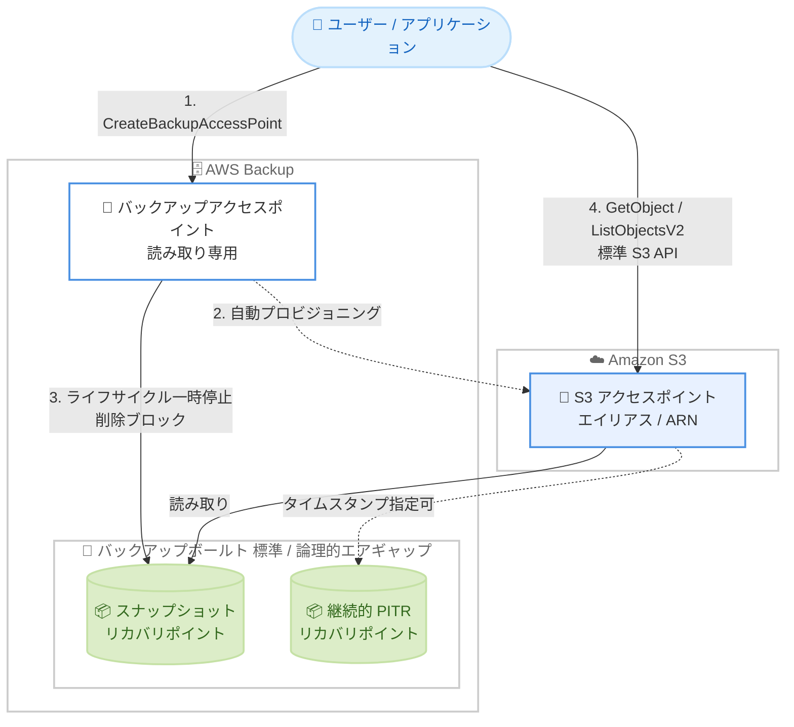

# AWS Backup - Amazon S3 バックアップデータへの直接アクセス

**リリース日**: 2026 年 8 月 6 日
**サービス**: AWS Backup, Amazon S3
**機能**: バックアップアクセスポイントによる S3 バックアップデータへの直接読み取りアクセス

📊 [このアップデートのインフォグラフィックを見る](https://takech9203.github.io/aws-news-summary/20260806-aws-backup-amazon-s3-direct-access.html)

## 概要

AWS Backup for Amazon S3 が、バックアップデータへの直接アクセスをサポートしました。S3 リカバリポイントに対して S3 アクセスポイントを作成することで、復元 (リストア) を開始することなく、標準の S3 API を使用してバックアップデータに即座に読み取り専用でアクセスできます。

バックアップアクセスポイントを作成すると、AWS Backup がお客様に代わって S3 アクセスポイントをプロビジョニングし、エイリアスを返します。このエイリアスはバケット名を使用する場所であればどこでも利用でき、`GetObject`、`HeadObject`、`ListObjectsV2`、`ListObjectVersions` などの標準 S3 API でバックアップデータを読み取れます。既存の S3 互換コードは、バケット参照をエイリアスに置き換えるだけでそのまま動作します。

対象ユーザーは、大規模な S3 バックアップから特定ファイルのみを取り出したい運用チーム、バックアップデータの検証やコンプライアンス監査を行う監査担当者、セキュリティインシデント時にフォレンジック調査を行うセキュリティチームなどです。バックアップデータはボールト内で保護されたまま、必要なデータのみに迅速にアクセスできます。

**アップデート前の課題**

このアップデート以前は、S3 バックアップデータの内容を確認するには復元操作が必須でした。

- 1 つのファイルを確認するだけでも、復元ジョブを開始して完了を待つ必要があった
- 数 TB 規模のバックアップでは復元に長時間かかり、targeted なファイル復旧や監査が非効率だった
- 復元先のバケットやストレージが必要になり、追加のコストと管理負荷が発生していた
- インシデント調査時に、クリーンな時点のデータを即座に参照する手段がなかった

**アップデート後の改善**

今回のアップデートにより、復元なしでバックアップデータへ直接アクセスできるようになりました。

- リカバリポイントにアクセスポイントを作成するだけで、標準 S3 API による即時の読み取りアクセスが可能になった
- スナップショットと継続的 (ポイントインタイム) リカバリポイントの両方に対応し、PITR ではタイムスタンプを指定して特定時点のビューを取得できるようになった
- 標準バックアップボールトと論理的エアギャップボールトの両方をサポートし、AWS RAM 共有や多者承認 (Multi-party approval) によるクロスアカウントアクセスにも対応した
- アクセスポイントがアクティブな間はリカバリポイントの削除とライフサイクル移行がブロックされ、参照中のデータが保護されるようになった

## アーキテクチャ図



バックアップアクセスポイントを作成すると、AWS Backup が S3 アクセスポイントを自動プロビジョニングし、ユーザーは復元なしで標準 S3 API によりリカバリポイント内のデータを読み取れます。アクセスポイントがアクティブな間、対象リカバリポイントは削除やライフサイクル移行から保護されます。

## サービスアップデートの詳細

### 主要機能

1. **復元不要の即時読み取りアクセス**
   - リカバリポイントに対してバックアップアクセスポイントを作成すると、S3 アクセスポイントのエイリアスと ARN が発行される
   - `GetObject`、`HeadObject`、`GetObjectAttributes`、`GetObjectTagging`、`ListObjectsV2`、`ListObjects`、`ListObjectVersions`、`GetBucketLocation` がサポートされる
   - 読み取り専用のため、`PutObject` や `DeleteObject` などの書き込み・削除操作は実行できず、バックアップデータの改変リスクがない
   - オブジェクトのレスポンスには `"StorageClass": "AWS_BACKUP_WARM"`、`"ServerSideEncryption": "aws:backup"` が表示される

2. **スナップショットと継続的リカバリポイントの両方に対応**
   - スナップショット型と継続的 (PITR) 型のリカバリポイントの両方でアクセスポイントを作成可能
   - 継続的リカバリポイントでは、作成時に `AccessPointInTime` タイムスタンプを指定して特定時点のデータビューを取得できる
   - アクセスポイントが存在する限り、指定時点のデータは保持期間ウィンドウ外になった後もアクセス可能

3. **論理的エアギャップボールトとクロスアカウント対応**
   - 標準バックアップボールトに加え、論理的エアギャップボールト内のリカバリポイントにも対応
   - AWS Resource Access Manager (RAM) で共有されたボールト、または多者承認による復元アクセスバックアップボールト経由でのクロスアカウント作成が可能
   - RAM 権限 `AWSRAMPermissionBackupVaultReadOnly` に `backup:CreateBackupAccessPoint` が含まれる (ボールトアクセスポリシーで拒否可能)
   - アクセスが取り消されると、アクセスポイントは DISASSOCIATED 状態になり利用不可となる

4. **リカバリポイントの保護**
   - アクセスポイントがアクティブな間、対象リカバリポイントのライフサイクル移行が一時停止され、手動削除 (`DeleteRecoveryPoint`) もブロックされる
   - すべてのアクセスポイントを削除すると、ライフサイクル処理が自動的に再開される

5. **アクセスポイントポリシーによるアクセス制御**
   - アクセスポイントごとにリソースベースのポリシーを設定でき、IAM プリンシパル、VPC エンドポイント、送信元 IP、プレフィックスなどの条件で読み取りアクセスを制御可能
   - S3 のアカウントレベル Block Public Access 設定が適用され、パブリックアクセスはブロックされる
   - ポリシー編集時には IAM Access Analyzer によるポリシー検証が実行される

6. **モニタリングと通知**
   - アクセスポイントのステータス変化 (作成、削除、失敗など) について CloudTrail イベント、EventBridge イベント、SNS 通知が発行される
   - バックアップボールト通知に `ACCESS_POINT_AVAILABLE`、`ACCESS_POINT_CREATION_FAILED`、`ACCESS_POINT_DELETED`、`ACCESS_POINT_EXPIRED` などの新しいイベントタイプが追加された

## 技術仕様

### アクセスポイントのステータス

| ステータス | 説明 |
|------|------|
| CREATING | 作成処理中。S3 アクセスポイントをプロビジョニング中 |
| AVAILABLE | 利用可能。`DescribeBackupAccessPoint` で S3 ARN とエイリアスを取得可能 |
| DELETING | 削除処理中 |
| FAILED | 作成または削除が失敗。`DescribeBackupAccessPoint` でエラー詳細を確認 |
| EXPIRED | 利用不可 (S3 アクセスポイントが S3 API で直接削除された場合など) |
| DISASSOCIATING | アクセス取り消し処理中 |
| DISASSOCIATED | アクセスが取り消され利用不可 |

### サポートされる S3 操作

| 分類 | 操作 | サポート |
|------|------|----------|
| 読み取り | GetObject, HeadObject, GetObjectAttributes, GetObjectTagging, GetBucketLocation | 対応 |
| 一覧 | ListObjectsV2, ListObjects, ListObjectVersions | 対応 |
| 書き込み・削除 | PutObject, DeleteObject, DeleteObjects, CopyObject | 非対応 |
| マルチパート | CreateMultipartUpload, UploadPart, CompleteMultipartUpload, AbortMultipartUpload | 非対応 |
| その他 | PutObjectTagging, PutObjectAcl, GetObjectAcl, GetObjectLegalHold, GetObjectRetention | 非対応 |

### API変更履歴

| 日付 | サービス | 変更内容 |
|------|----------|----------|
| 2026/08/06 | [AWS Backup](https://awsapichanges.com/archive/changes/32fa45-backup.html) | 6 new 2 updated api methods - `CreateBackupAccessPoint`、`DescribeBackupAccessPoint`、`DeleteBackupAccessPoint`、`ListBackupAccessPoints`、`ListBackupAccessPointsByRecoveryPoint`、`ListBackupAccessPointsByResource` を新規追加。`GetBackupVaultNotifications` / `PutBackupVaultNotifications` にアクセスポイント関連イベントを追加 |

### 必要な IAM 権限

マネージドポリシー `AWSBackupAccessPointOperatorAccess` を使用するか、以下の権限を付与します。

```json
{
  "Version": "2012-10-17",
  "Statement": [
    {
      "Effect": "Allow",
      "Action": [
        "backup:CreateBackupAccessPoint",
        "backup:DescribeBackupAccessPoint",
        "backup:DeleteBackupAccessPoint",
        "backup:ListBackupAccessPoints",
        "backup:ListBackupAccessPointsByRecoveryPoint",
        "s3:GetAccessPoint",
        "s3:CreateAccessPoint",
        "s3:DeleteAccessPoint",
        "s3:PutAccessPointPolicy"
      ],
      "Resource": "*"
    }
  ]
}
```

`s3:CreateAccessPoint` は作成時、`s3:DeleteAccessPoint` は削除時、`s3:PutAccessPointPolicy` はアクセスポイントポリシーをリクエストに含める場合のみ必要です。

## 設定方法

### 前提条件

1. AWS Backup で作成した Amazon S3 のリカバリポイント (スナップショットまたは継続的) が存在すること
2. リカバリポイントが AVAILABLE、STOPPED、COMPLETED のいずれかの状態であること
3. IAM ロールに `AWSBackupAccessPointOperatorAccess` 相当の権限が付与されていること
4. アクセスポイント名が同一リージョン・アカウント内の既存 S3 アクセスポイントと重複しないこと (小文字、アンダースコアなし、3〜50 文字)

### 手順

#### ステップ1: バックアップアクセスポイントの作成

```bash
aws backup create-backup-access-point \
  --recovery-point-arn "arn:aws:backup:us-east-1:123456789012:recovery-point:rp-1234567890abcdef0" \
  --name "my-access-point" \
  --access-point-metadata '{"AccessPointInTime": "2026-07-01T12:00:00Z"}'
```

指定したリカバリポイントに対してバックアップアクセスポイントを作成します。`--access-point-metadata` の `AccessPointInTime` は継続的リカバリポイントの場合に指定し、その時点のデータビューを取得します。レスポンスにはアクセスポイント ARN とステータス (CREATING) が返されます。

#### ステップ2: ステータス確認とエイリアスの取得

```bash
aws backup describe-backup-access-point \
  --access-point-arn "arn:aws:backup:us-east-1:123456789012:accesspoint/my-access-point"
```

アクセスポイントの詳細を取得します。ステータスが AVAILABLE になると、レスポンスの `AccessPointMetadata` に S3 アクセスポイントのエイリアス (`S3AccessPointAlias`) と ARN (`S3AccessPointArn`) が含まれます。

#### ステップ3: 標準 S3 API でバックアップデータにアクセス

```bash
# オブジェクト一覧の取得
aws s3api list-objects-v2 \
  --bucket "my-access-point-abc123-ext-s3alias"

# 特定オブジェクトのダウンロード
aws s3api get-object \
  --bucket "my-access-point-abc123-ext-s3alias" \
  --key "path/to/my-file.txt" \
  output-file.txt

# メタデータのみの取得
aws s3api head-object \
  --bucket "my-access-point-abc123-ext-s3alias" \
  --key "path/to/my-file.txt"
```

取得したエイリアスをバケット名の代わりに指定して、標準の S3 API でバックアップデータを読み取ります。エイリアスの代わりに S3 アクセスポイント ARN を `--bucket` に指定することも可能です。

#### ステップ4: アクセスポイントの削除

```bash
aws backup delete-backup-access-point \
  --access-point-arn "arn:aws:backup:us-east-1:123456789012:accesspoint/my-access-point"
```

利用が終わったらバックアップアクセスポイントを削除します。S3 アクセスポイントが削除され、他にアクセスポイントが残っていなければリカバリポイントのライフサイクル処理が再開されます。S3 API で S3 アクセスポイントを直接削除すると EXPIRED 状態のまま残るため、必ず AWS Backup 側の API またはコンソールから削除してください。

## メリット

### ビジネス面

- **復旧時間の大幅短縮**: 数 TB 規模のバックアップ全体を復元することなく、必要なファイルだけを即座に取り出せるため、業務影響を最小化できる
- **コスト削減**: 復元先ストレージのプロビジョニングが不要になり、アクセスポイント自体の作成・維持にも料金がかからない (支払いは API リクエストとデータ取得分のみ)
- **コンプライアンス対応の効率化**: 監査人がバックアップの内容を直接検証でき、DR テストやコンプライアンス検証をエアギャップの分離を崩さずに実施できる

### 技術面

- **既存コードの再利用**: バケット名をエイリアスに置き換えるだけで、既存の S3 互換アプリケーションやツールがそのまま動作する
- **安全な読み取り専用アクセス**: 書き込み操作が一切サポートされないため、バックアップデータの改変や破壊のリスクがない
- **参照中データの保護**: アクセスポイントがアクティブな間はリカバリポイントの削除とライフサイクル移行が自動的にブロックされる
- **柔軟なアクセス制御**: アクセスポイントポリシーで IAM プリンシパル、VPC、プレフィックス単位の細かなアクセス制御が可能

## デメリット・制約事項

### 制限事項

- 読み取り専用であり、書き込み・削除・マルチパートアップロード操作は非対応
- 対応リソースは Amazon S3 のリカバリポイントのみ (他のリソースタイプは対象外)
- リカバリポイントごと、アカウントごとに最大 5 個のアクセスポイントまで (FAILED や EXPIRED 状態のものも数に含まれる)
- アクセスポイント名は同一リージョン・アカウント内の S3 アクセスポイント名前空間と共有されるため、既存名と競合できない
- 自動削除 (delete-after-days) の設定はなく、手動で削除する必要がある
- `.` や `..` を含む特殊なオブジェクトキー (先頭の `./`、`/./` や `//` を含むキー、`/` で終わるキーなど) にはアクセスできず、`InvalidKey` エラーになる

### 考慮すべき点

- アクセスポイントを削除し忘れると、リカバリポイントのライフサイクル移行が停止したままになり、意図しない保持コストが発生する可能性がある
- S3 API で S3 アクセスポイントを直接削除すると、バックアップアクセスポイントが EXPIRED 状態で残り、ライフサイクル保護が解除されないため、必ず AWS Backup 側から削除する
- 削除直後に同じ名前でアクセスポイントを再作成すると `ConflictException` が発生するため、時間を置くか別名を使用する
- 継続的リカバリポイントの `AccessPointInTime` は、作成時点で保持期間ウィンドウ内のタイムスタンプを指定する必要がある
- 利用可能リージョンが限定されているため、事前に機能の利用可否を確認する

## ユースケース

### ユースケース1: 特定ファイルのピンポイント復旧

**シナリオ**: 数 TB のデータを含む S3 バケットのバックアップから、誤って削除された設定ファイル 1 つだけを復旧したい。

**実装例**:
```bash
# アクセスポイントを作成し、対象ファイルのみダウンロード
aws backup create-backup-access-point \
  --recovery-point-arn "arn:aws:backup:ap-northeast-1:123456789012:recovery-point:rp-xxxx" \
  --name "restore-config-file"

aws s3api get-object \
  --bucket "restore-config-file-abc123-ext-s3alias" \
  --key "configs/app-settings.json" \
  app-settings.json
```

**効果**: バケット全体の復元 (数時間〜) を待たずに、数分で必要なファイルのみを取得でき、復元先ストレージのコストも発生しない。

### ユースケース2: セキュリティインシデント時のフォレンジック調査

**シナリオ**: ランサムウェア被害の疑いがあり、論理的エアギャップボールト内のクリーンな時点のバックアップデータを、分離を維持したまま調査したい。

**実装例**:
```bash
# 継続的リカバリポイントに対して、感染前のタイムスタンプを指定
aws backup create-backup-access-point \
  --recovery-point-arn "arn:aws:backup:ap-northeast-1:123456789012:recovery-point:rp-yyyy" \
  --name "forensic-investigation" \
  --access-point-metadata '{"AccessPointInTime": "2026-08-01T00:00:00Z"}'

# 読み取り専用でオブジェクトの状態を検証
aws s3api list-object-versions \
  --bucket "forensic-investigation-def456-ext-s3alias"
```

**効果**: 既知のクリーンな時点のデータを読み取り専用で調査でき、調査中はリカバリポイントが削除から保護される。復元操作による本番環境への影響もない。

### ユースケース3: コンプライアンス監査とバックアップ検証

**シナリオ**: 監査要件として、バックアップデータが正しく取得・保全されていることを定期的に検証する必要がある。

**実装例**:
```bash
# 監査担当者向けにアクセスポイントポリシーで読み取り権限を限定
aws backup create-backup-access-point \
  --recovery-point-arn "arn:aws:backup:ap-northeast-1:123456789012:recovery-point:rp-zzzz" \
  --name "audit-validation" \
  --access-point-policy '{
    "Version": "2012-10-17",
    "Statement": [{
      "Effect": "Allow",
      "Principal": {"AWS": "arn:aws:iam::123456789012:role/Auditor"},
      "Action": ["s3:GetObject", "s3:ListBucket"],
      "Resource": [
        "arn:aws:s3:ap-northeast-1:123456789012:accesspoint/audit-validation",
        "arn:aws:s3:ap-northeast-1:123456789012:accesspoint/audit-validation/object/*"
      ]
    }]
  }'
```

**効果**: 監査担当者に必要最小限の読み取り権限のみを付与し、復元操作なしでバックアップ内容の実在性と整合性を検証できる。

## 料金

バックアップアクセスポイントの作成・維持自体に追加料金はかかりません。AWS Backup および Amazon S3 の API リクエストとデータ取得に対してのみ課金されます。詳細は [AWS Backup 料金ページ](https://aws.amazon.com/backup/pricing/) を参照してください。

## 利用可能リージョン

一部の AWS リージョンで利用可能です。対応リージョンの詳細は [リージョン別の機能提供状況](https://docs.aws.amazon.com/aws-backup/latest/devguide/backup-feature-availability.html#features-by-region) を参照してください。

## 関連サービス・機能

- **Amazon S3 アクセスポイント**: 本機能の基盤となる仕組み。AWS Backup がリカバリポイント用の S3 アクセスポイントを自動プロビジョニングする
- **AWS Backup 論理的エアギャップボールト**: エアギャップボールト内のリカバリポイントにも直接アクセス可能で、ランサムウェア対策と迅速な調査を両立できる
- **AWS Resource Access Manager (RAM)**: 論理的エアギャップボールトの共有により、別アカウントからのアクセスポイント作成を可能にする
- **AWS Backup 多者承認 (Multi-party approval)**: 復元アクセスバックアップボールト経由で、侵害時にも別アカウントからバックアップデータへアクセスできる
- **Amazon EventBridge / Amazon SNS / AWS CloudTrail**: アクセスポイントのステータス変化イベントの監視・通知に利用できる

## 参考リンク

- 📊 [インフォグラフィック](https://takech9203.github.io/aws-news-summary/20260806-aws-backup-amazon-s3-direct-access.html)
- [公式発表 (What's New)](https://aws.amazon.com/about-aws/whats-new/2026/08/aws-backup-amazon-s3-direct-access/)
- [AWS Blog: Access Amazon S3 backup data directly using S3 access points in AWS Backup](https://aws.amazon.com/blogs/storage/access-amazon-s3-backup-data-directly-using-s3-access-points-in-aws-backup/)
- [ドキュメント: Access points (AWS Backup Developer Guide)](https://docs.aws.amazon.com/aws-backup/latest/devguide/backup-access-points.html)
- [ドキュメント: Amazon S3 backups](https://docs.aws.amazon.com/aws-backup/latest/devguide/s3-backups.html)
- [料金ページ](https://aws.amazon.com/backup/pricing/)

## まとめ

AWS Backup for Amazon S3 のバックアップアクセスポイントにより、復元を待つことなく標準 S3 API でバックアップデータへ読み取り専用アクセスできるようになりました。ピンポイントのファイル復旧、フォレンジック調査、コンプライアンス監査の所要時間とコストを大幅に削減できる重要なアップデートです。S3 バックアップを運用しているチームは、まず利用可能リージョンを確認のうえ、`AWSBackupAccessPointOperatorAccess` ポリシーを用いた運用手順とアクセスポイントの削除忘れ防止の仕組み (EventBridge 通知など) を整備することを推奨します。
