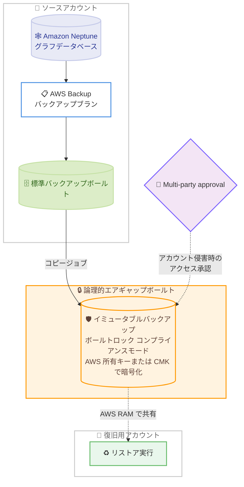

# AWS Backup - Amazon Neptune 向け論理的エアギャップボールトの 3 リージョン追加サポート

**リリース日**: 2026 年 8 月 6 日
**サービス**: AWS Backup / Amazon Neptune
**機能**: 論理的エアギャップボールト (Logically Air-gapped Vault) の Amazon Neptune 対応リージョン拡大

📊 [このアップデートのインフォグラフィックを見る](https://takech9203.github.io/aws-news-summary/20260806-aws-backup-logically-air-gapped-vault-neptune-regions.html)

## 概要

AWS Backup の論理的エアギャップボールト (Logically Air-gapped Vault) による Amazon Neptune のサポートが、新たに 3 つの AWS リージョン (アジアパシフィック (メルボルン)、欧州 (スペイン)、欧州 (チューリッヒ)) に拡大されました。これにより、これらのリージョンでグラフデータベースサービスである Amazon Neptune のバックアップを、より高いセキュリティレベルで保護できるようになります。

論理的エアギャップボールトは、デフォルトでロックされた不変 (イミュータブル) のボールトであり、AWS 所有キーまたはカスタマーマネージドキーで暗号化されます。アカウント間・リージョン間でのバックアップコピー、AWS Resource Access Manager (RAM) を使用したボールト共有による復旧、Multi-party approval (多者承認) によるアカウント侵害時のボールトアクセス保護をサポートしており、ランサムウェア対策やディザスタリカバリ (DR) 戦略の中核となる機能です。

このアップデートは、メルボルン、スペイン、チューリッヒの各リージョンで Neptune を運用しており、データ主権や地域内でのコンプライアンス要件を満たしながら堅牢なバックアップ保護を実現したい組織にとって重要な拡張です。

**アップデート前の課題**

このアップデート以前は、対象 3 リージョンにおいて以下の制約がありました。

- アジアパシフィック (メルボルン)、欧州 (スペイン)、欧州 (チューリッヒ) の各リージョンでは、Amazon Neptune のバックアップを論理的エアギャップボールトに保存できなかった
- これらのリージョンで Neptune のバックアップにイミュータブルな保護 (コンプライアンスモードのボールトロック) を適用するための選択肢が限られていた
- アカウント侵害時に別アカウントから Neptune バックアップを復旧するには、対応済みの他リージョンへコピーする必要があった

**アップデート後の改善**

今回のアップデートにより、以下が可能になりました。

- 対象 3 リージョンで Amazon Neptune のバックアップを論理的エアギャップボールトに直接保存可能になった
- データを地域内に保持したまま、イミュータブルかつロック済みのボールトで Neptune バックアップを保護できるようになった
- AWS RAM によるボールト共有と Multi-party approval を活用し、アカウント侵害時でも迅速な復旧が可能になり、復旧時間 (RTO) の短縮と DR・コンプライアンス要件への対応が容易になった

## アーキテクチャ図



Amazon Neptune のバックアップを標準バックアップボールトから論理的エアギャップボールトへコピーし、AWS RAM 共有や Multi-party approval を通じて別アカウントから復旧するフローを示しています。

## サービスアップデートの詳細

### 主要機能

1. **イミュータブルなバックアップ保護**
   - 論理的エアギャップボールトは、作成時から AWS Backup Vault Lock のコンプライアンスモードが自動的に適用される
   - 保存されたバックアップは変更・削除から保護され、ランサムウェアや内部不正によるバックアップ破壊を防止する
   - 最小保持期間 (7 日以上) と最大保持期間をボールト作成時に設定する

2. **柔軟な暗号化オプション**
   - デフォルトでは AWS 所有キーで暗号化される (AWS 推奨)
   - オプションでカスタマーマネージド KMS キー (CMK) を指定可能
   - 暗号化キータイプの情報は AWS Backup の API とコンソールで確認でき、透明性とコンプライアンスレポートに活用できる

3. **クロスアカウント・クロスリージョンのバックアップコピー**
   - 標準バックアップボールトから論理的エアギャップボールトへ、バックアッププランまたはオンデマンドコピーでバックアップをコピーできる
   - リージョン間・アカウント間コピーに対応し、多層防御のバックアップ戦略を構築できる

4. **AWS RAM によるボールト共有と迅速な復旧**
   - AWS Resource Access Manager を使用して、他の AWS アカウント (他組織のアカウントを含む) とボールトを共有できる
   - 共有先アカウントからバックアップを直接リストアできるため、インシデント発生時の復旧時間 (RTO) を短縮できる
   - リストアテスト (Restore Testing) にも利用可能

5. **Multi-party approval によるアカウント侵害対策**
   - ボールト所有アカウントにアクセスできない状況でも、Multi-party approval (MPA) を通じてボールト内のバックアップにアクセスし復旧できる
   - アカウントが閉鎖された場合でも、閉鎖後期間 (post-closure period) が終了するまでは MPA 経由でバックアップのリストアやコピーが可能

## 技術仕様

### 標準バックアップボールトとの比較

| 項目 | 標準バックアップボールト | 論理的エアギャップボールト |
|------|--------------------------|----------------------------|
| ボールトロック | オプション (ガバナンス/コンプライアンスモード) | 常時コンプライアンスモードでロック |
| 暗号化 | カスタマーマネージドキーまたは AWS マネージドキー (オプション) | AWS 所有キー (デフォルト) またはカスタマーマネージドキー |
| リストア | ボールト所有アカウントからのみ | RAM 共有先アカウントからもリストア可能 |
| 共有 | AWS RAM 非対応 | AWS RAM でクロスアカウント共有可能 |
| 課金表示 | リソースタイプごとに各サービスに計上 | すべて「AWS Backup」に計上 |
| バックアップ保存先 | 自アカウント | AWS Backup サービス所有アカウント |

### 今回追加されたリージョン

| リージョン | リージョンコード |
|------------|------------------|
| アジアパシフィック (メルボルン) | ap-southeast-4 |
| 欧州 (スペイン) | eu-south-2 |
| 欧州 (チューリッヒ) | eu-central-2 |

## 設定方法

### 前提条件

1. AWS Backup を利用できる IAM 権限があること
2. Amazon Neptune クラスターが暗号化されていること (暗号化されていない Neptune クラスターは論理的エアギャップボールトに対応していない)
3. コピー元のバックアップが標準バックアップボールトに存在すること (またはプライマリバックアップターゲットとして利用する場合は AWS MPA へのオンボーディングが完了していること)

### 手順

#### ステップ 1: 論理的エアギャップボールトの作成

```bash
aws backup create-logically-air-gapped-backup-vault \
  --region ap-southeast-4 \
  --backup-vault-name NeptuneAirGappedVault \
  --min-retention-days 7 \
  --max-retention-days 35
```

アジアパシフィック (メルボルン) リージョンに、最小保持期間 7 日・最大保持期間 35 日の論理的エアギャップボールトを作成します。最小保持期間は 7 日以上を指定する必要があります。カスタマーマネージドキーを使用する場合は `--encryption-key-arn` パラメータを追加します。

#### ステップ 2: ボールトの状態確認

```bash
aws backup describe-backup-vault \
  --region ap-southeast-4 \
  --backup-vault-name NeptuneAirGappedVault
```

作成したボールトの詳細を確認します。作成直後の `VaultState` は `CREATING` で、KMS キーの割り当てが完了すると `AVAILABLE` に遷移し利用可能になります (通常 1〜3 分程度)。`VaultType` が `LOGICALLY_AIR_GAPPED_BACKUP_VAULT`、`Locked` が `true` であることを確認します。

#### ステップ 3: Neptune バックアップのコピー

```bash
aws backup start-copy-job \
  --region ap-southeast-4 \
  --recovery-point-arn arn:aws:neptune:ap-southeast-4:123456789012:cluster-snapshot:awsbackup-job-xxxx \
  --source-backup-vault-name Default \
  --destination-backup-vault-arn arn:aws:backup:ap-southeast-4:123456789012:backup-vault:NeptuneAirGappedVault \
  --iam-role-arn arn:aws:iam::123456789012:role/service-role/AWSBackupDefaultServiceRole
```

標準バックアップボールト内の Neptune のリカバリポイントを、論理的エアギャップボールトへオンデマンドでコピーします。バックアッププランのコピーアクションとして定期的なコピーをスケジュールすることも可能です。

#### ステップ 4: AWS RAM によるボールト共有 (オプション)

AWS Backup コンソールまたは AWS RAM の CLI コマンド (`aws ram create-resource-share`) を使用して、復旧用アカウントとボールトを共有します。共有先アカウントは、共有されたボールト内のバックアップの閲覧とリストアが可能になります (コピーの作成は不可)。

## メリット

### ビジネス面

- **ランサムウェア対策の強化**: イミュータブルかつロック済みのボールトにより、悪意ある削除や暗号化からグラフデータベースのバックアップを保護できる
- **コンプライアンス要件への対応**: データを地域内 (オーストラリア、スペイン、スイス) に保持したまま、規制要件に沿ったバックアップ保護を実現できる
- **復旧時間 (RTO) の短縮**: RAM 共有により別アカウントから直接リストアできるため、インシデント時の事業継続性が向上する

### 技術面

- **自動適用されるボールトロック**: コンプライアンスモードのボールトロックが作成時から有効なため、設定ミスによる保護漏れを防げる
- **アカウント侵害への耐性**: Multi-party approval により、ボールト所有アカウントが侵害・閉鎖された場合でもバックアップにアクセスできる
- **一元的な課金管理**: 論理的エアギャップボールトの課金はすべて「AWS Backup」に計上され、コスト把握が容易になる

## デメリット・制約事項

### 制限事項

- 暗号化されていない Amazon Neptune クラスターは、論理的エアギャップボールトに対応していない (暗号化されていない DB クラスタースナップショットの暗号化がサポートされていないため)
- 最小保持期間は 7 日以上の設定が必須で、これより短い保持期間のバックアップはボールトへコピーできない
- 論理的エアギャップボールト間のコピーはオンデマンドのみで、バックアッププランによるスケジュールはできない
- 共有先アカウントはバックアップの閲覧とリストアのみ可能で、コピーの作成はできない

### 考慮すべき点

- 論理的エアギャップボールト内のリカバリポイントの ARN は、元のリソースタイプではなく `arn:aws:backup:...:recovery-point:*` 形式になるため、自動化スクリプトでは `list-recovery-points-by-backup-vault` で ARN を確認する必要がある
- コンプライアンスモードのボールトロックは解除できないため、保持期間の設計は慎重に行う必要がある
- ストレージコストを抑えたい場合は、AWS MPA へのオンボーディング後にプライマリバックアップターゲットとして単一コピー運用も選択できるが、耐障害性の観点ではクロスリージョンコピーが推奨される

## ユースケース

### ユースケース 1: 金融機関のグラフデータベースのランサムウェア対策

**シナリオ**: チューリッヒリージョンで不正検知用の Neptune グラフデータベースを運用する金融機関が、ランサムウェア攻撃によるバックアップ破壊に備えたい。

**実装例**:
```bash
# チューリッヒリージョンに論理的エアギャップボールトを作成
aws backup create-logically-air-gapped-backup-vault \
  --region eu-central-2 \
  --backup-vault-name FraudGraphAirGappedVault \
  --min-retention-days 30 \
  --max-retention-days 365
```

**効果**: バックアップがイミュータブルに保護され、攻撃者が本番アカウントに侵入してもバックアップの削除・改ざんができず、確実な復旧手段を確保できる。

### ユースケース 2: マルチアカウント環境での迅速な DR 復旧

**シナリオ**: メルボルンリージョンで Neptune を利用する企業が、本番アカウントの侵害時に専用の復旧アカウントから迅速にリストアできる体制を構築したい。

**実装例**:
```bash
# AWS RAM で復旧アカウントとボールトを共有
aws ram create-resource-share \
  --region ap-southeast-4 \
  --name NeptuneVaultShare \
  --resource-arns arn:aws:backup:ap-southeast-4:123456789012:backup-vault:NeptuneAirGappedVault \
  --principals 210987654321
```

**効果**: 本番アカウントが利用不能になっても、復旧アカウントから共有ボールトのバックアップを直接リストアでき、RTO を大幅に短縮できる。

### ユースケース 3: データ主権要件を満たすスペイン国内でのバックアップ保護

**シナリオ**: スペインリージョンでナレッジグラフを Neptune で運用する公共機関が、データを国内リージョンに保持したままコンプライアンス要件を満たすバックアップ体制を整えたい。

**実装例**:
```bash
# バックアッププランにエアギャップボールトへのコピーアクションを追加
aws backup create-backup-plan \
  --region eu-south-2 \
  --backup-plan file://neptune-backup-plan-with-copy.json
```

**効果**: 従来は他リージョンへのコピーが必要だった高度なバックアップ保護を、スペイン国内で完結でき、データレジデンシー要件と DR 要件を同時に満たせる。

## 料金

論理的エアギャップボールトに保存されたバックアップのストレージ料金は、AWS Backup の料金体系に従います。論理的エアギャップボールトのストレージ料金は標準のバックアップストレージとは異なる料金が適用され、すべての課金は「AWS Backup」として計上されます。詳細は [AWS Backup 料金ページ](https://aws.amazon.com/backup/pricing/) を参照してください。

## 利用可能リージョン

今回のアップデートにより、以下の 3 リージョンで Amazon Neptune の論理的エアギャップボールトサポートが追加されました。

- アジアパシフィック (メルボルン)
- 欧州 (スペイン)
- 欧州 (チューリッヒ)

その他の対応リージョンを含む全体の提供状況は、[AWS Backup の機能提供状況ドキュメント](https://docs.aws.amazon.com/aws-backup/latest/devguide/backup-feature-availability.html#features-by-region) を参照してください。

## 関連サービス・機能

- **Amazon Neptune**: 今回サポートリージョンが拡大されたフルマネージドグラフデータベースサービス。バックアップ対象リソース
- **AWS Backup Vault Lock**: 論理的エアギャップボールトに常時適用されるコンプライアンスモードのロック機能。バックアップの改ざん・削除を防止
- **AWS Resource Access Manager (RAM)**: 論理的エアギャップボールトを他アカウントと共有するためのサービス。クロスアカウント復旧を実現
- **AWS KMS**: ボールトの暗号化に使用。AWS 所有キーまたはカスタマーマネージドキーを選択可能
- **Multi-party approval (MPA)**: アカウント侵害・閉鎖時でもボールトへのアクセスを可能にする多者承認機能

## 参考リンク

- 📊 [インフォグラフィック](https://takech9203.github.io/aws-news-summary/20260806-aws-backup-logically-air-gapped-vault-neptune-regions.html)
- [公式発表 (What's New)](https://aws.amazon.com/about-aws/whats-new/2026/08/aws-backup-logically-air-gapped-vault-neptune-regions/)
- [ドキュメント: 論理的エアギャップボールト](https://docs.aws.amazon.com/aws-backup/latest/devguide/logicallyairgappedvault.html)
- [ドキュメント: リージョン別機能提供状況](https://docs.aws.amazon.com/aws-backup/latest/devguide/backup-feature-availability.html#features-by-region)
- [料金ページ](https://aws.amazon.com/backup/pricing/)

## まとめ

AWS Backup の論理的エアギャップボールトによる Amazon Neptune サポートが、メルボルン、スペイン、チューリッヒの 3 リージョンに拡大され、これらのリージョンでもグラフデータベースのバックアップをイミュータブルかつセキュアに保護できるようになりました。対象リージョンで Neptune を運用している場合は、ランサムウェア対策と DR 戦略の強化のため、論理的エアギャップボールトへのバックアップコピーの導入を検討することを推奨します。導入時は、Neptune クラスターの暗号化が前提条件である点と、最小保持期間 7 日以上の要件に注意してください。
