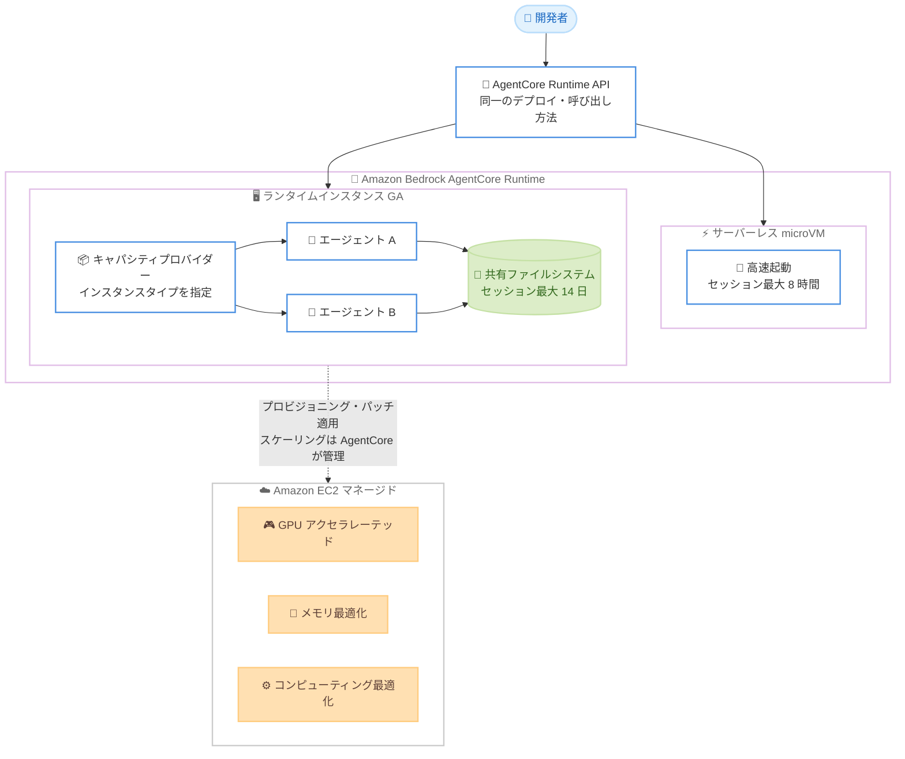

# Amazon Bedrock AgentCore - ランタイムインスタンスの一般提供開始

**リリース日**: 2026 年 8 月 6 日
**サービス**: Amazon Bedrock AgentCore
**機能**: ランタイムインスタンス (Runtime Instances) の一般提供開始 (GA)

📊 [このアップデートのインフォグラフィックを見る](https://takech9203.github.io/aws-news-summary/20260806-aws-bedrock-agentcore-runtime-instances-generally-available.html)

## 概要

Amazon Bedrock AgentCore の新機能「ランタイムインスタンス」が一般提供 (GA) となりました。ランタイムインスタンスは、AI エージェントを専用の Amazon EC2 インスタンス上で実行できる新しいコンピュートオプションで、インフラストラクチャの管理は不要です。既存の microVM ベースのサーバーレスオプションを補完する位置づけであり、持続的なワークロード、リソース集約型の処理、GPU などの特殊なハードウェアを必要とするエージェントに適しています。

利用するには、必要な EC2 インスタンスタイプ (GPU アクセラレーテッド、メモリ最適化、コンピューティング最適化など) を指定した「キャパシティプロバイダー」を作成し、エージェントをアタッチします。プロビジョニング、パッチ適用、スケーリング、ライフサイクル管理はすべて AgentCore が処理するため、エージェントのデプロイ方法や呼び出し方法を変更する必要はありません。エージェントごとにコンピュートオプションを混在させることも可能です。

ランタイムインスタンスは最大 14 日間の長時間セッションをサポートします。サーバーレス microVM の最大 8 時間と比較して大幅に長く、複数日にわたる継続的なエージェントワークフロー、OS レベルのアクセスが必要な処理、同一ホスト上での複数エージェントの協調動作といった本番ユースケースに対応できます。

**アップデート前の課題**

これまでの AgentCore Runtime は microVM ベースのサーバーレス実行のみであり、以下の制約がありました。

- セッションの最大実行時間が 8 時間に制限されており、複数日にわたる長時間ワークフローを実行できなかった
- GPU アクセラレーテッドインスタンスなど、特定のハードウェアを指定してエージェントを実行できなかった
- 複数のエージェントを同一ホスト上で動作させ、ファイルシステムを共有した協調動作をさせることが難しかった
- 持続的でリソース集約型のワークロードには、自前で EC2 やコンテナ基盤を構築・運用する必要があった

**アップデート後の改善**

- 最大 14 日間の長時間セッションが可能になり、複数日にわたるエージェントワークフローを実行できるようになった
- GPU アクセラレーテッド、メモリ最適化、コンピューティング最適化など EC2 の幅広いインスタンスタイプを選択できるようになった
- プロビジョニング、パッチ適用、スケーリング、ライフサイクル管理を AgentCore に任せられるため、インフラ管理が不要になった
- 複数のエージェントが同一ランタイム上でセッション内のファイルシステムを共有し、協調動作できるようになった
- エージェントのデプロイ方法や呼び出し方法は変更不要で、microVM とランタイムインスタンスをエージェントごとに使い分けられるようになった

## アーキテクチャ図



AgentCore Runtime に新しいコンピュートオプションとしてランタイムインスタンスが追加され、キャパシティプロバイダーで指定した EC2 インスタンス上でエージェントを実行できます。デプロイや呼び出しの方法は microVM と共通で、EC2 の管理は AgentCore が担います。

## サービスアップデートの詳細

### 主要機能

1. **キャパシティプロバイダーによる EC2 インスタンスの利用**
   - コンソール、AgentCore CLI、AWS CLI、SDK、API からキャパシティプロバイダーを作成し、必要な EC2 インスタンスタイプを指定
   - GPU アクセラレーテッド、メモリ最適化、コンピューティング最適化など EC2 の幅広いインスタンスファミリーに対応
   - VPC、サブネット、セキュリティグループ、ストレージ (gp3)、インフラ管理用サービスロールを設定
   - 作成後に編集できるのは説明 (description) のみである点に注意

2. **最大 14 日間の長時間セッション**
   - サーバーレス microVM の最大 8 時間に対し、ランタイムインスタンスでは最大 14 日間のセッションを維持可能
   - セッションの停止・再開により、アイドル時のコストを削減しつつ状態を保持したまま作業を再開できる
   - Amazon EBS や AgentCore Memory と組み合わせて、長期的な状態保存や記憶の呼び出しが可能

3. **フルマネージドなインフラ運用**
   - プロビジョニング、パッチ適用、スケーリング、ライフサイクル管理を AgentCore が実施
   - エージェントのデプロイ方法や呼び出し方法の変更は不要
   - エージェントごとに microVM とランタイムインスタンスを使い分けるハイブリッド構成が可能 (例: 軽量なオーケストレーターは microVM、特化型ワーカーはインスタンス)

4. **マルチエージェントの協調動作**
   - 複数のエージェントを単一ランタイムにデプロイし、それぞれ独自の依存関係やアーティファクト形式を利用可能
   - セッション内でファイルシステムを共有し、エージェント同士が共有セッション内でツールとして相互呼び出し可能
   - CrewAI、LangGraph、LlamaIndex、Strands Agents などフレームワークを問わず、任意のモデルと組み合わせて利用可能

## 技術仕様

### コンピュートオプションの比較

| 項目 | サーバーレス microVM | ランタイムインスタンス |
|------|---------------------|----------------------|
| 実行基盤 | microVM (サーバーレス) | 専用 EC2 インスタンス (マネージド) |
| セッション最大時間 | 8 時間 | 14 日間 |
| 起動特性 | 高速起動 | 持続的なコンピュートを確保 |
| ハードウェア選択 | 不可 | EC2 インスタンスタイプを指定可能 (GPU 含む) |
| 適するワークロード | 短時間・イベント駆動の呼び出し | 長時間実行、リソース集約型、特殊ハードウェア |
| 料金 | AgentCore の従量課金 | プロビジョニングされたコンピュートの管理料金 + EC2 料金 |

### 実行環境

| 項目 | 詳細 |
|------|------|
| OS | Linux (ARM64 および x86_64) |
| ランタイム | Python 3.11 - 3.14 (ネイティブコード対応)、コンテナイメージも利用可能 |
| パッケージング | `@app.entrypoint` デコレーターと zip ファイルまたはコンテナイメージ |
| ネットワーク | VPC、サブネット、セキュリティグループを指定 |
| ストレージ | gp3 (デフォルト)、Amazon EBS と連携可能 |
| 統合 | microVM と同一の AgentCore API、アイデンティティ、オブザーバビリティ、ポリシー制御 |

### API 変更履歴

| 日付 | サービス | 変更内容 |
|------|----------|----------|
| 2026/08/06 | [bedrock-agentcore-control](https://awsapichanges.com/archive/changes/32fa45-bedrock-agentcore-control.html) | 12 new 8 updated api methods - `CreateCapacityProvider`、`GetCapacityProvider`、`UpdateCapacityProvider`、`DeleteCapacityProvider`、`ListCapacityProviders`、`ListAgentRuntimeVersionsByCapacityProvider` などキャパシティプロバイダー関連 API を追加。`CreateAgentRuntime`、`UpdateAgentRuntime` などを更新 |
| 2026/08/06 | [bedrock-agentcore](https://awsapichanges.com/archive/changes/32fa45-bedrock-agentcore.html) | 1 new api method - `DeleteCapacityProviderSession` を追加。キャパシティプロバイダー経由で起動したランタイムインスタンス上のアクティブセッションを削除可能 |

## 設定方法

### 前提条件

1. Amazon Bedrock AgentCore が利用可能なリージョンであること
2. キャパシティプロバイダー用の VPC、サブネット、セキュリティグループが準備されていること
3. インフラ管理用のサービスロールとエージェント実行用の IAM ロールを作成できる権限があること

### 手順

#### ステップ 1: キャパシティプロバイダーの作成

コンソールの場合: AgentCore コンソールで [Runtime] → [Capacity providers] タブ → [Create capacity provider] を選択します。名前、OS (例: Linux 64-bit ARM)、許可するインスタンスタイプ (例: `c7g.2xlarge`)、VPC・サブネット・セキュリティグループ、ストレージ、サービスロールを設定します。

```bash
# キャパシティプロバイダーの一覧を確認
aws bedrock-agentcore-control list-capacity-providers
```

作成済みのキャパシティプロバイダーを一覧表示し、設定内容を確認します。キャパシティプロバイダーは作成後、説明以外の設定を変更できないため、インスタンスタイプやネットワーク設定は事前に十分検討してください。

#### ステップ 2: ランタイムの作成とエージェントのデプロイ

コンソールで [Create runtime] を選択し、コンピュートタイプに [Instances] を指定して、作成したキャパシティプロバイダーを選択します。エージェントのソースコードは S3 経由の zip アップロードまたはコンテナイメージで指定し、言語ランタイム (例: Python 3.13) とエントリーポイントファイル (例: `agent.py`) を設定します。

```python
# エージェントコードの例 (Strands Agents)
from bedrock_agentcore.runtime import BedrockAgentCoreApp
from strands import Agent

app = BedrockAgentCoreApp()

@app.entrypoint
def invoke(payload, context):
    # セッション ID をコンテキストから取得し、共有ディレクトリを利用
    session_id = context.session_id
    agent = Agent(model="claude-sonnet-4-5")
    result = agent(payload.get("prompt"))
    return {"result": str(result)}

app.run()
```

`@app.entrypoint` デコレーターを付与したハンドラーがエージェントの呼び出しを受け付けます。同一セッション内では `/tmp/agentcore-session/<session-id>/` のようなセッションディレクトリを複数エージェントで共有できます。

#### ステップ 3: エージェントの呼び出しとセッションの管理

デプロイ後は microVM と同じ方法でエージェントを呼び出せます。コンソールの Runtime playground で同じセッション ID を再利用すると、複数エージェントが共有ファイルシステムを通じて連携します。

```bash
# ランタイムインスタンス上のアクティブセッションを削除 (アイドルコスト削減)
aws bedrock-agentcore delete-capacity-provider-session \
  --runtime-identifier <runtime-id> \
  --session-id <session-id>
```

不要になったセッションを削除することで、プロビジョニングされたコンピュートのコストを最適化できます。セッションの停止・再開により、状態を保持したまま数日後に作業を再開する運用も可能です。

## メリット

### ビジネス面

- **インフラ運用コストの削減**: EC2 のプロビジョニング、パッチ適用、スケーリングを AgentCore に任せられるため、自前基盤の構築・運用にかかる人的コストを削減できる
- **本番エージェントワークロードの実現**: 最大 14 日間のセッションにより、複数日にわたる業務プロセスの自動化など、これまで実現が難しかった本番ユースケースに対応できる
- **段階的な移行が可能**: デプロイ・呼び出し方法が microVM と共通のため、既存エージェントのコードを変更せずにコンピュートオプションだけを切り替えられる

### 技術面

- **ハードウェアの選択肢**: GPU アクセラレーテッド、メモリ最適化、コンピューティング最適化など、ワークロードに最適な EC2 インスタンスタイプを指定できる
- **マルチエージェント協調**: 同一ホスト上で複数エージェントがファイルシステムを共有し、コード生成とレビューのような協調ワークフローを低レイテンシーで実現できる
- **フレームワーク非依存**: CrewAI、LangGraph、LlamaIndex、Strands Agents など任意のフレームワークとモデルで利用でき、既存の AgentCore のアイデンティティ、オブザーバビリティ、ポリシー制御と統合される

## デメリット・制約事項

### 制限事項

- キャパシティプロバイダーは作成後、説明以外の設定 (インスタンスタイプ、ネットワークなど) を変更できない
- OS はローンチ時点で Linux (ARM64 / x86_64) のみのサポート
- 利用可能リージョンは 9 リージョンに限定される (詳細は「利用可能リージョン」を参照)

### 考慮すべき点

- サーバーレス microVM と異なり、プロビジョニングされたコンピュートに対する管理料金と EC2 料金が発生するため、短時間・低頻度のワークロードではサーバーレスの方がコスト効率が良い場合がある
- セッションを放置するとアイドルコストが発生するため、セッションの停止・削除の運用設計が必要
- 長時間セッションを前提とする場合、エージェントの障害時の再開戦略 (AgentCore Memory や EBS への状態保存) を検討する必要がある

## ユースケース

### ユースケース 1: 複数日にわたる継続的なエージェントワークフロー

**シナリオ**: 大規模なコードベースのリファクタリングやデータ移行検証など、数日間かけて段階的に進めるエージェントタスクを実行したい。microVM の 8 時間制限では途中で状態が失われてしまう。

**実装例**:
```
1. コンピューティング最適化インスタンスを指定したキャパシティプロバイダーを作成
2. エージェントをランタイムインスタンスにデプロイし、セッションを開始
3. 夜間や待機中はセッションを停止してコストを削減
4. 翌日以降、同じセッション ID で再開し、保持された状態から作業を継続
```

**効果**: 最大 14 日間のセッションにより、状態を保持したまま長期タスクを完遂できる。停止・再開の活用でアイドルコストも抑制できる。

### ユースケース 2: GPU を活用するリソース集約型エージェント

**シナリオ**: ローカルでのモデル推論、画像・動画処理、GUI 自動化など、GPU や大容量メモリを必要とするエージェントワークロードを実行したい。

**実装例**:
```
1. GPU アクセラレーテッドインスタンスタイプを指定したキャパシティプロバイダーを作成
2. GPU 依存ライブラリを含むコンテナイメージでエージェントをパッケージング
3. ランタイム作成時にコンピュートタイプ Instances とキャパシティプロバイダーを選択
4. 通常の AgentCore API でエージェントを呼び出し
```

**効果**: サーバーレスでは実行できなかった GPU 依存の処理を、インフラ管理なしで AgentCore 上で実行できる。

### ユースケース 3: 共有ファイルシステムを使ったマルチエージェント協調

**シナリオ**: コードを生成するライターエージェントと、それをレビューするレビュアーエージェントを連携させ、コード作成・レビュー・テスト・ドキュメント生成のパイプラインを構築したい。

**実装例**:
```
1. 単一のランタイムインスタンスにライターとレビュアーの 2 エージェントをデプロイ
2. ライターが /tmp/agentcore-session/<session-id>/code.py にコードを保存
3. レビュアーが同じセッション ID で共有ディレクトリからコードを読み取りレビュー
4. エージェント間の連携は共有ファイルシステム経由で完結
```

**効果**: エージェント間 API 呼び出しを介さず、同一ホスト上の共有ファイルシステムで低レイテンシーな協調動作を実現できる。

## 料金

ランタイムインスタンスでは、プロビジョニングされたコンピュートに対する管理料金と、標準の Amazon EC2 料金の両方が課金されます。具体的な料金は [AgentCore 料金ページ](https://aws.amazon.com/bedrock/agentcore/pricing/) を参照してください。

セッションの停止・削除を活用してアイドル時間を減らすことで、コストを最適化できます。短時間・イベント駆動のワークロードには、従量課金のサーバーレス microVM の方が適する場合があります。

## 利用可能リージョン

以下の 9 リージョンで利用可能です。

- 米国東部 (バージニア北部) us-east-1
- 米国東部 (オハイオ) us-east-2
- 米国西部 (オレゴン) us-west-2
- アジアパシフィック (ムンバイ) ap-south-1
- アジアパシフィック (シンガポール) ap-southeast-1
- アジアパシフィック (シドニー) ap-southeast-2
- アジアパシフィック (東京) ap-northeast-1
- 欧州 (フランクフルト) eu-central-1
- 欧州 (アイルランド) eu-west-1

東京リージョンでもローンチ時点から利用可能です。

## 関連サービス・機能

- **Amazon Bedrock AgentCore Runtime (microVM)**: 既存のサーバーレス実行オプション。高速起動と最大 8 時間のセッションを提供し、ランタイムインスタンスと併用可能
- **Amazon EC2**: ランタイムインスタンスの実行基盤。GPU アクセラレーテッド、メモリ最適化、コンピューティング最適化などのインスタンスタイプを選択可能
- **AgentCore Memory**: エージェントの長期記憶を保存・呼び出しする機能。長時間セッションと組み合わせて状態管理を強化できる
- **Amazon EBS**: セッションを超えた永続ストレージとして利用可能
- **Strands Agents / CrewAI / LangGraph / LlamaIndex**: ランタイムインスタンス上で動作するエージェントフレームワークの例

## 参考リンク

- 📊 [インフォグラフィック](https://takech9203.github.io/aws-news-summary/20260806-aws-bedrock-agentcore-runtime-instances-generally-available.html)
- [公式発表 (What's New)](https://aws.amazon.com/about-aws/whats-new/2026/08/aws-bedrock-agentcore-runtime-instances-generally-available/)
- [AWS News Blog: Runtime instances: persistent compute for production AI agents on Amazon Bedrock AgentCore](https://aws.amazon.com/blogs/aws/runtime-instances-persistent-compute-for-production-ai-agents-on-amazon-bedrock-agentcore/)
- [ドキュメント: How runtime instances work](https://docs.aws.amazon.com/bedrock-agentcore/latest/devguide/runtime-instances-how-it-works.html)
- [料金ページ](https://aws.amazon.com/bedrock/agentcore/pricing/)

## まとめ

AgentCore ランタイムインスタンスの GA により、最大 14 日間の長時間セッション、GPU を含む EC2 インスタンスタイプの選択、マルチエージェントの協調動作が、インフラ管理なしで実現できるようになりました。長時間実行やリソース集約型のエージェントワークロードを検討している場合は、まずキャパシティプロバイダーを作成し、既存エージェントのコンピュートオプションをランタイムインスタンスに切り替えて評価することを推奨します。
