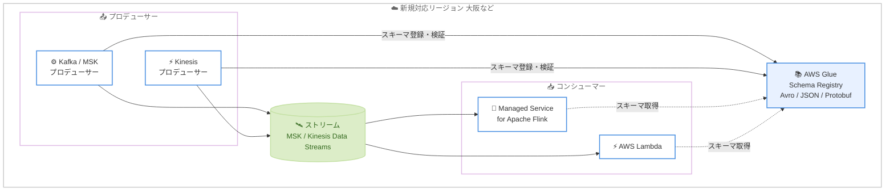

# AWS Glue - Schema Registry が新たに 10 リージョンで利用可能に

**リリース日**: 2026 年 8 月 6 日
**サービス**: AWS Glue (Schema Registry)
**機能**: AWS Glue Schema Registry のリージョン拡大 (大阪リージョンを含む 10 リージョン追加)

📊 [このアップデートのインフォグラフィックを見る](https://takech9203.github.io/aws-news-summary/20260806-aws-gsr-10-more-regions.html)

## 概要

AWS Glue Schema Registry が新たに 10 の AWS リージョンで利用可能になりました。今回の拡大には**アジアパシフィック (大阪) リージョン**が含まれており、日本国内で大阪リージョンを利用しているユーザーや、東京・大阪でのマルチリージョン構成を採用しているユーザーにとって重要なアップデートです。

AWS Glue Schema Registry は、ストリーミングデータのスキーマ (データレコードの構造とフォーマット) を一元的に登録・管理し、スキーマの進化 (バージョンアップ) を制御できるサーバーレスかつ**無料**の機能です。Apache Avro、JSON Schema、Protocol Buffers (Protobuf) の各フォーマットに対応し、Apache Kafka、Amazon MSK、Amazon Kinesis Data Streams、Amazon Managed Service for Apache Flink、AWS Lambda と統合できます。

登録済みスキーマをデータの「契約」としてプロデューサーとコンシューマー間で共有することで、独自のデータ検証ロジックの実装やチーム間の調整作業が不要になり、ストリーミングデータの品質向上とダウンストリームアプリケーションの障害削減を実現します。

**アップデート前の課題**

今回追加されたリージョンでは、以前は以下の課題がありました。

- 大阪リージョンなどでは Schema Registry が利用できず、ストリーミングデータのスキーマ検証を独自実装する必要があった
- スキーマ管理のために他リージョン (東京など) の Schema Registry を参照する場合、クロスリージョン通信によるレイテンシーや構成の複雑化が発生していた
- データレジデンシー要件により国内・域内でデータ管理を完結させたいケースで、スキーマ管理基盤の選択肢が限られていた

**アップデート後の改善**

今回のアップデートにより以下が可能になりました。

- 大阪リージョンを含む 10 リージョンで、ストリーミングアプリケーションと同一リージョン内でのスキーマ管理が可能になった
- 東京・大阪間のマルチリージョン構成 (災害対策など) で、両リージョンに閉じたスキーマ管理を構築できるようになった
- 各リージョン内でスキーマ検証が完結するため、クロスリージョン参照によるレイテンシーと構成の複雑さが解消された

## アーキテクチャ図



プロデューサーはデータ送信時に Schema Registry でスキーマを検証・登録し、コンシューマーは同じスキーマを取得してデシリアライズします。今回のアップデートにより、この構成全体を大阪リージョンなど新規対応リージョン内で完結できます。

## サービスアップデートの詳細

### 主要機能

1. **10 リージョンへの提供拡大**
   - アジアパシフィック (大阪) を含む 10 リージョンで新たに利用可能
   - 既存リージョンと同一の機能 (スキーマ登録、互換性チェック、Serde ライブラリ連携) を提供
   - サーバーレスであり、リージョン追加に伴う追加料金は発生しない (無料機能)

2. **スキーマの一元管理と進化の制御**
   - Apache Avro (v1.11.4)、JSON Schema (Draft-04/06/07)、Protobuf (proto2/proto3) をサポート
   - 8 種類の互換性モード (NONE、DISABLED、BACKWARD、BACKWARD_ALL、FORWARD、FORWARD_ALL、FULL、FULL_ALL) によりスキーマ進化を制御
   - スキーマの自動登録、メタデータによるスキーマソーシング、IAM によるアクセス制御に対応

3. **ストリーミングサービスとの統合**
   - Apache ライセンスのオープンソースシリアライザー / デシリアライザー (Serde ライブラリ) を提供
   - Java および C# アプリケーションから利用可能
   - Apache Kafka、Amazon MSK、Amazon Kinesis Data Streams、Apache Flink / Amazon Managed Service for Apache Flink、AWS Lambda と統合
   - オプションの ZLIB 圧縮によりストレージとデータ転送量を削減

## 技術仕様

### 今回追加されたリージョン

| # | リージョン名 | リージョンコード |
|---|-------------|-----------------|
| 1 | アジアパシフィック (大阪) | ap-northeast-3 |
| 2 | アジアパシフィック (ニュージーランド) | ap-southeast-6 |
| 3 | アジアパシフィック (タイ) | ap-southeast-7 |
| 4 | アジアパシフィック (ハイデラバード) | ap-south-2 |
| 5 | アジアパシフィック (マレーシア) | ap-southeast-5 |
| 6 | アジアパシフィック (メルボルン) | ap-southeast-4 |
| 7 | アジアパシフィック (台北) | ap-east-2 |
| 8 | メキシコ (中部) | mx-central-1 |
| 9 | イスラエル (テルアビブ) | il-central-1 |
| 10 | カナダ西部 (カルガリー) | ca-west-1 |

### Schema Registry の主な仕様

| 項目 | 詳細 |
|------|------|
| 対応データフォーマット | Avro (v1.11.4)、JSON Schema (Draft-04/06/07)、Protobuf (proto2/proto3、extensions と groups は非対応) |
| 互換性モード | NONE、DISABLED、BACKWARD、BACKWARD_ALL、FORWARD、FORWARD_ALL、FULL、FULL_ALL |
| レジストリ数 | 最大 100 レジストリ / リージョン / アカウント (ハードリミット) |
| スキーマバージョン数 | 最大 10,000 バージョン / リージョン / アカウント (ハードリミット) |
| スキーマペイロードサイズ | 最大 170 KB |
| バージョンメタデータ | 最大 10 キーバリューペア / スキーマバージョン (ソフトリミット) |
| 対応言語 (Serde) | Java、C# |
| 圧縮 | ZLIB 圧縮 (オプション) |

## 設定方法

### 前提条件

1. 新規対応リージョン (例: 大阪 ap-northeast-3) を利用できる AWS アカウント
2. AWS Glue の Schema Registry 操作 (`glue:CreateRegistry`、`glue:CreateSchema` など) を許可する IAM 権限
3. 連携対象のストリーミング基盤 (Amazon MSK、Kinesis Data Streams など)

### 手順

#### ステップ 1: レジストリの作成

```bash
aws glue create-registry \
  --registry-name my-streaming-registry \
  --description "Schema registry for streaming apps in Osaka" \
  --region ap-northeast-3
```

大阪リージョンにスキーマを格納する論理コンテナであるレジストリを作成します。デフォルトレジストリをそのまま使用することも可能です。

#### ステップ 2: スキーマの登録

```bash
aws glue create-schema \
  --registry-id RegistryName=my-streaming-registry \
  --schema-name employee-events \
  --data-format AVRO \
  --compatibility BACKWARD \
  --schema-definition '{
    "type": "record",
    "namespace": "MyOrg",
    "name": "Employee",
    "fields": [
      {"name": "Name", "type": "string"},
      {"name": "Age", "type": "int"}
    ]
  }' \
  --region ap-northeast-3
```

Avro 形式のスキーマを BACKWARD 互換性モードで登録します。以降の新バージョン登録時には、この互換性ルールに基づく検証が自動で行われます。

#### ステップ 3: アプリケーションへの Serde ライブラリの組み込み

```xml
<dependency>
    <groupId>software.amazon.glue</groupId>
    <artifactId>schema-registry-serde</artifactId>
    <version>1.1.x</version>
</dependency>
```

Java アプリケーション (Kafka プロデューサー / コンシューマーなど) に AWS 提供のオープンソース Serde ライブラリを追加し、リージョンとして `ap-northeast-3` を指定してシリアライズ / デシリアライズ時にスキーマ検証を行います。

## メリット

### ビジネス面

- **データレジデンシー要件への対応**: 大阪リージョンなど域内でスキーマ管理を完結でき、データ所在地に関する要件を満たしやすくなる
- **追加コストなし**: Schema Registry はサーバーレスかつ無料の機能であり、リージョン拡大による追加費用は発生しない
- **データ品質の向上**: スキーマをプロデューサーとコンシューマー間の契約とすることで、不正なデータの流入を防ぎ、ダウンストリームの障害を削減できる

### 技術面

- **レイテンシーの削減**: ストリーミングアプリケーションと同一リージョンでスキーマ検証が完結し、クロスリージョン参照が不要になる
- **マルチリージョン構成の簡素化**: 東京・大阪の DR 構成などで、各リージョンにスキーマ管理を配置した一貫性のあるアーキテクチャを構築できる
- **独自検証ロジックの排除**: 8 種類の互換性モードと自動検証により、独自のスキーマ検証実装やチーム間調整が不要になる

## デメリット・制約事項

### 制限事項

- Serde ライブラリの言語サポートは Java と C# であり、他言語は AWS SDK 経由での API 利用が中心となる
- Protobuf は proto2 / proto3 に対応するが、`extensions` と `groups` はサポートされない
- スキーマペイロードは 170 KB、スキーマバージョンは 10,000 / リージョン / アカウントなどのクォータがある

### 考慮すべき点

- Schema Registry はリージョナルサービスであり、リージョン間でスキーマは自動レプリケーションされないため、マルチリージョン構成では各リージョンへのスキーマ登録運用が必要
- 互換性モードの選択 (BACKWARD 推奨) はスキーマ進化の柔軟性に直結するため、プロデューサー / コンシューマーのデプロイ順序を考慮して設計する必要がある

## ユースケース

### ユースケース 1: 大阪リージョンでの Amazon MSK ストリーミング基盤のスキーマ管理

**シナリオ**: 金融系システムなどデータレジデンシー要件により大阪リージョンで Amazon MSK を運用しており、トピックに流れるイベントのフォーマットを統制したい。

**実装例**:
```java
// Kafka プロデューサー設定 (Java)
props.put("value.serializer", GlueSchemaRegistryKafkaSerializer.class.getName());
props.put(AWSSchemaRegistryConstants.AWS_REGION, "ap-northeast-3");
props.put(AWSSchemaRegistryConstants.REGISTRY_NAME, "my-streaming-registry");
props.put(AWSSchemaRegistryConstants.DATA_FORMAT, DataFormat.AVRO.name());
props.put(AWSSchemaRegistryConstants.SCHEMA_AUTO_REGISTRATION_SETTING, true);
```

**効果**: 大阪リージョン内でスキーマ検証が完結し、不正フォーマットのイベント混入をプロデューサー側で防止できる。

### ユースケース 2: 東京・大阪マルチリージョン DR 構成でのスキーマ整合性確保

**シナリオ**: 東京リージョンをプライマリ、大阪リージョンをセカンダリとするストリーミング基盤で、フェイルオーバー後も同一スキーマでデータ処理を継続したい。

**実装例**:
```bash
# 同一スキーマ定義を両リージョンに登録
for region in ap-northeast-1 ap-northeast-3; do
  aws glue create-schema \
    --registry-id RegistryName=my-streaming-registry \
    --schema-name employee-events \
    --data-format AVRO \
    --compatibility BACKWARD \
    --schema-definition file://employee.avsc \
    --region $region
done
```

**効果**: フェイルオーバー時にもスキーマ契約が維持され、コンシューマーの改修なしで大阪リージョンでの処理を継続できる。

### ユースケース 3: Kinesis Data Streams と Lambda によるイベント処理のスキーマ進化管理

**シナリオ**: 新規対応リージョンで Kinesis Data Streams と AWS Lambda を用いたイベント処理を運用しており、イベントスキーマへのフィールド追加を安全に行いたい。

**実装例**:
```bash
# BACKWARD 互換性チェック付きで新バージョンを登録
aws glue register-schema-version \
  --schema-id SchemaName=employee-events,RegistryName=my-streaming-registry \
  --schema-definition file://employee-v2.avsc \
  --region ap-northeast-3
```

**効果**: 互換性のない変更は登録時に自動的に拒否されるため、コンシューマー (Lambda) の障害を未然に防ぎながらスキーマを進化させられる。

## 料金

AWS Glue Schema Registry は**サーバーレスかつ無料**の機能です。スキーマの登録、保存、検証に追加料金は発生しません。連携先の Amazon MSK、Kinesis Data Streams、Lambda などの利用料金は別途発生します。

## 利用可能リージョン

今回、以下の 10 リージョンが追加されました。

- アジアパシフィック (大阪)
- アジアパシフィック (ニュージーランド)
- アジアパシフィック (タイ)
- アジアパシフィック (ハイデラバード)
- アジアパシフィック (マレーシア)
- アジアパシフィック (メルボルン)
- アジアパシフィック (台北)
- メキシコ (中部)
- イスラエル (テルアビブ)
- カナダ西部 (カルガリー)

対応リージョンの全一覧は [AWS Regional Services List](https://aws.amazon.com/about-aws/global-infrastructure/regional-product-services/) を参照してください。

## 関連サービス・機能

- **Amazon MSK / Apache Kafka**: Serde ライブラリ経由でプロデューサー / コンシューマーのスキーマ検証に Schema Registry を利用可能
- **Amazon Kinesis Data Streams**: ストリームに流れるデータのスキーマ管理と検証に利用可能
- **Amazon Managed Service for Apache Flink**: Flink アプリケーションでのデシリアライズ時にスキーマを参照可能
- **AWS Lambda**: イベント処理関数でのスキーマ検証・デシリアライズに利用可能
- **AWS Glue Data Catalog**: Schema Registry は AWS Glue の一機能として提供され、データカタログと同じサービス基盤上で動作

## 参考リンク

- 📊 [インフォグラフィック](https://takech9203.github.io/aws-news-summary/20260806-aws-gsr-10-more-regions.html)
- [公式発表 (What's New)](https://aws.amazon.com/about-aws/whats-new/2026/08/aws-gsr-10-more-regions)
- [ドキュメント: AWS Glue Schema Registry](https://docs.aws.amazon.com/glue/latest/dg/schema-registry.html)
- [ドキュメント: Getting started with schema registry](https://docs.aws.amazon.com/glue/latest/dg/schema-registry-gs.html)
- [料金ページ: AWS Glue](https://aws.amazon.com/glue/pricing/)

## まとめ

AWS Glue Schema Registry が大阪リージョンを含む 10 リージョンに拡大され、無料のスキーマ管理機能をより多くのリージョンで利用できるようになりました。特に大阪リージョンでストリーミング基盤を運用しているユーザーや、東京・大阪のマルチリージョン構成を採用しているユーザーは、独自のスキーマ検証ロジックを Schema Registry へ置き換えることで、データ品質の向上と運用負荷の削減を検討することを推奨します。
