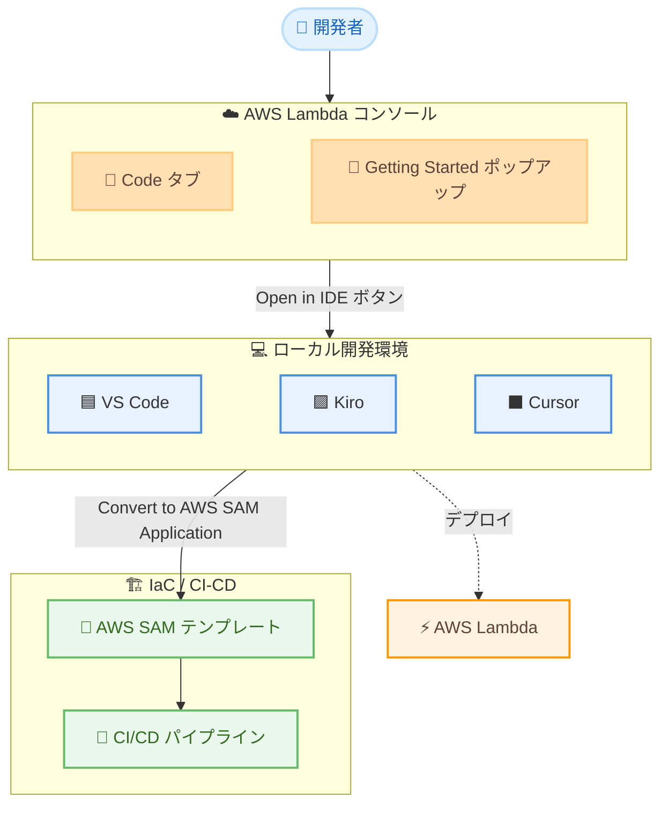

# AWS Lambda - コンソールから IDE への統合を Kiro と Cursor に拡張

**リリース日**: 2026 年 8 月 6 日
**サービス**: AWS Lambda
**機能**: Console-to-IDE Integration (Kiro / Cursor 対応)

📊 [このアップデートのインフォグラフィックを見る](https://takech9203.github.io/aws-news-summary/20260806-aws-lambda-ide-kiro-cursor.html)

## 概要

AWS Lambda コンソールのコンソールから IDE への統合 (console-to-IDE integration) が、Kiro と Cursor の 2 つの IDE に拡張されました。これまで Visual Studio Code (VS Code) のみでサポートされていたコンソールからローカル開発環境へのシームレスな移行が、AI 搭載 IDE である Kiro や Cursor を利用するサーバーレス開発者にも提供されます。

開発者は Lambda コンソールを起点として、ガイド付きセットアップに従うだけで、既存のコードと設定を保持したまま Kiro または Cursor でのローカル開発を開始できます。さらに、Kiro や Cursor を使用して Lambda 関数を AWS Serverless Application Model (AWS SAM) テンプレートへ簡単に変換できるため、Infrastructure as Code (IaC) の実践や CI/CD パイプラインへの統合が容易になります。

本機能は、Lambda が利用可能なすべての商用 AWS リージョンで追加料金なしで利用できます。

**アップデート前の課題**

このアップデート以前は、以下のような課題がありました。

- コンソールから IDE へのワンクリック移行は VS Code のみに対応しており、Kiro や Cursor のユーザーは対象外だった
- Kiro や Cursor でローカル開発を始めるには、関数コードのダウンロードやプロジェクト構成のセットアップを手動で行う必要があった
- コンソールで作成した関数を IaC (AWS SAM テンプレート) へ移行する際、Kiro / Cursor ユーザーには公式にガイドされた移行パスがなかった

**アップデート後の改善**

今回のアップデートにより、以下が可能になりました。

- Lambda コンソールの [Open in Kiro] / [Open in Cursor] ボタンから、ワンクリックでローカル開発を開始できる
- 既存のコードと設定を保持したまま、ガイド付きセットアップでローカル環境へ移行できる
- Kiro / Cursor 上で Lambda 関数を AWS SAM テンプレートへ変換し、IaC や CI/CD パイプラインへスムーズに統合できる
- 一度選択した IDE は記憶され、次回以降はその IDE がプライマリボタンとして表示される

## アーキテクチャ図



Lambda コンソールを起点に、VS Code に加えて Kiro / Cursor でもローカル開発を開始でき、AWS SAM テンプレートへの変換を通じて IaC / CI/CD へ統合する流れを示しています。

## サービスアップデートの詳細

### 主要機能

1. **Kiro / Cursor へのワンクリック移行**
   - Lambda コンソールの Code タブ、または新規関数作成時の Getting Started ポップアップに [Open in Kiro] / [Open in Cursor] ボタンが追加された
   - ボタンの横にあるドロップダウンから Visual Studio Code、Kiro、Cursor のいずれかを選択できる
   - 選択した IDE がローカルデバイス上で自動的に起動し、関数が開かれる
   - IDE の選択は保持され、次回以降はその IDE がプライマリボタンとして表示される

2. **既存コード・設定を保持したガイド付きセットアップ**
   - コンソール上の関数コード、依存関係、基本的なプロジェクト構造を含むローカルプロジェクトが一時的な場所に自動作成される
   - ガイド付きセットアップにより、AWS Toolkit や認証情報の設定を含むローカル開発の開始までを案内される
   - コード補完、デバッグ (ブレークポイント、変数インスペクション)、リファクタリングなど IDE の高度な機能を活用できる

3. **AWS SAM テンプレートへの変換**
   - サポートされるすべての IDE (VS Code、Kiro、Cursor) で、[Convert to AWS SAM Application] アイコンから関数を AWS SAM テンプレートへ変換できる
   - 変換後は `template.yaml` として AWS SAM プロジェクトに保存される
   - インフラのバージョン管理、デプロイの自動化、リモートデバッグ、リソース追加、Infrastructure Composer によるビジュアル編集が可能になる

## 技術仕様

### サポート対象 IDE と要件

| 項目 | 詳細 |
|------|------|
| 対応 IDE | Visual Studio Code、Kiro、Cursor |
| エントリポイント | Lambda コンソールの Code タブ / Getting Started ポップアップ |
| 必須ツール | AWS Toolkit (バージョン 3.69.0 以降)、AWS 認証情報、AWS SAM CLI |
| オプション | Docker (ローカルコンテナテストに必要)、LocalStack (サービス連携のエミュレーション) |
| 認証方法 | IAM ユーザーの長期認証情報、AssumeRole による一時認証情報、ID フェデレーションなど |
| 追加料金 | なし |

Kiro と Cursor は Visual Studio Code をベースに構築されているため、AWS Toolkit を用いた認証フローは 3 つの IDE で共通です。

### 注意事項

- AWS Toolkit のバージョンが 3.69.0 より古い場合、「Cannot open the handler」というメッセージが表示されることがあります。その場合は AWS Toolkit を最新バージョンに更新してください
- コンソール上で未デプロイの変更がある場合は、ローカル開発へ移行する前にデプロイを完了してください

## 設定方法

### 前提条件

1. Kiro または Cursor (あるいは VS Code) がローカルデバイスにインストールされていること
2. AWS Toolkit (バージョン 3.69.0 以降) がインストールされていること
3. AWS 認証情報が設定されていること
4. AWS SAM CLI がインストールされていること (SAM 変換やローカルテストを行う場合)

### 手順

#### ステップ 1: Lambda コンソールから関数を開く

1. Lambda コンソールを開き、対象の関数名を選択する
2. **Code** タブ (Code source) を開く
3. ボタン横のドロップダウンから **Open in Kiro** または **Open in Cursor** を選択する
4. ブラウザのプロンプトで選択した IDE を開くことを許可する

Lambda が関数コード、依存関係、基本的なプロジェクト構造を含むローカルプロジェクトを作成し、選択した IDE で自動的に開きます。

#### ステップ 2: IDE で AWS に接続する

```text
Command Palette (Mac: Cmd+Shift+P / Windows・Linux: Ctrl+Shift+P) を開き、
「AWS Add a New Connection」を検索して選択する
```

サインインパネルで **IAM Credentials** を選択し、プロファイル名、アクセスキー ID、シークレットアクセスキーを入力して接続します。AWS Explorer にサービスとリソースが表示されれば接続は完了です。

#### ステップ 3: ローカルで開発・テスト・デプロイする

IDE 上で以下の操作が可能です。

- コード補完を活用した関数コードの編集
- ブレークポイントと変数インスペクションによるデバッグ
- AWS SAM CLI によるローカルコンテナでのテスト、LocalStack による AWS サービス連携のエミュレーション
- クラウドアイコンからの AWS への再デプロイ

#### ステップ 4: AWS SAM テンプレートへ変換する (オプション)

AWS Explorer で Lambda 関数の横にある **Convert to AWS SAM Application** アイコンを選択し、AWS SAM プロジェクトの保存場所を指定します。関数が `template.yaml` に変換され、IaC ツールや CI/CD パイプラインで管理できるようになります。

## メリット

### ビジネス面

- **開発者の生産性向上**: コンソールからローカル開発環境への移行が数クリックで完了し、セットアップにかかる時間を削減できる
- **開発者の選択肢の拡大**: VS Code に加え、AI 搭載 IDE である Kiro や Cursor を利用するチームもシームレスな開発体験を得られる
- **追加コストなし**: Lambda が利用可能なすべての商用リージョンで追加料金なしで利用できる

### 技術面

- **IaC への移行促進**: コンソールで作成した関数を AWS SAM テンプレートへ簡単に変換でき、CI/CD パイプラインへの統合やバージョン管理が容易になる
- **高度な開発機能の活用**: デバッグ、コード補完、リファクタリング、依存関係管理など、コンソールエディタでは得られない IDE の機能を活用できる
- **一貫した開発体験**: Kiro と Cursor は VS Code ベースであるため、AWS Toolkit による認証や操作フローが 3 つの IDE で共通している

## デメリット・制約事項

### 制限事項

- AWS Toolkit バージョン 3.69.0 以降が必要 (古いバージョンでは「Cannot open the handler」エラーが発生する)
- ローカルプロジェクトは一時的な場所に作成されるため、継続的な開発では AWS SAM プロジェクトへの変換など適切なプロジェクト管理への移行が推奨される
- 商用リージョンのみで利用可能

### 考慮すべき点

- コンソール上に未デプロイの変更がある場合、ローカル開発へ移行する前にデプロイを完了する必要がある
- ローカルテストで関数が他の AWS サービスを呼び出す場合、AWS SAM CLI のローカルコンテナでは実際の AWS リソースへアクセスする (エミュレーションが必要な場合は LocalStack 連携を利用する)
- ドキュメントではローカル開発用プロファイルへの AdministratorAccess 付与が案内されているが、本番運用では最小権限の原則に基づいた権限設計を検討すべきである

## ユースケース

### ユースケース 1: コンソールで試作した関数の本格開発への移行

**シナリオ**: コンソールエディタで素早くプロトタイプを作成した Lambda 関数を、Kiro を使った本格的なローカル開発へ移行したい。

**実装例**:
```text
1. Lambda コンソールで関数の Code タブを開く
2. ドロップダウンから「Open in Kiro」を選択
3. ガイド付きセットアップに従って AWS Toolkit と認証情報を設定
4. Kiro 上でコード編集、デバッグ、依存関係の追加を実施
5. クラウドアイコンから AWS へ再デプロイ
```

**効果**: 既存のコードと設定を保持したまま移行できるため、手動でのダウンロードやプロジェクト構成の再現作業が不要になり、AI 搭載 IDE の支援を受けながら開発を継続できる。

### ユースケース 2: コンソール管理の関数を IaC / CI/CD へ移行

**シナリオ**: コンソールで直接管理されてきた Lambda 関数群を、AWS SAM テンプレートに変換して Git 管理と CI/CD パイプラインに統合したい。

**実装例**:
```text
1. 「Open in Cursor」で関数をローカルに展開
2. AWS Explorer の「Convert to AWS SAM Application」アイコンを選択
3. 生成された template.yaml を Git リポジトリにコミット
4. sam build / sam deploy を CI/CD パイプラインに組み込み
```

**効果**: インフラのバージョン管理、デプロイの自動化、環境間の一貫性維持が実現し、コンソール直接編集による構成ドリフトを防止できる。

### ユースケース 3: AI 支援によるサーバーレスアプリケーションの改善

**シナリオ**: 既存の Lambda 関数のリファクタリングやテストコード追加を、Kiro / Cursor の AI 支援機能を活用して効率的に行いたい。

**実装例**:
```text
1. Lambda コンソールから「Open in Kiro」で関数を開く
2. Kiro のエージェント機能でコードレビュー、リファクタリング、
   テストコード生成を依頼
3. AWS SAM CLI (sam local invoke) でローカルテストを実行
4. 問題がなければ AWS へデプロイ
```

**効果**: AI 搭載 IDE の支援によりコード品質の改善やテスト整備を高速に進められ、ローカルでの検証を経て安全にデプロイできる。

## 料金

本機能に追加料金はありません。Lambda の実行に対しては通常の Lambda 料金 (リクエスト数と実行時間に基づく課金) が適用されます。Kiro および Cursor 自体の利用料金は各製品の料金体系に従います。

## 利用可能リージョン

AWS Lambda が利用可能なすべての商用 AWS リージョンで利用できます (東京・大阪リージョンを含む)。

## 関連サービス・機能

- **AWS Serverless Application Model (AWS SAM)**: Lambda 関数を SAM テンプレートに変換することで、IaC によるインフラ管理とデプロイ自動化が可能
- **AWS Toolkit for Visual Studio Code**: VS Code / Kiro / Cursor で AWS リソースを操作するための拡張機能。本機能の利用にはバージョン 3.69.0 以降が必要
- **Kiro**: AWS が提供する AI 搭載 IDE。スペック駆動開発やエージェント機能を備え、本アップデートで Lambda コンソールとの統合に対応
- **AWS Infrastructure Composer**: 変換した SAM テンプレートをビジュアルに編集できるツール
- **AWS Cloud Development Kit (AWS CDK)**: ローカル開発環境で利用できるもう 1 つの IaC ツール

## 参考リンク

- 📊 [インフォグラフィック](https://takech9203.github.io/aws-news-summary/20260806-aws-lambda-ide-kiro-cursor.html)
- [公式発表 (What's New)](https://aws.amazon.com/about-aws/whats-new/2026/08/aws-lambda-ide-kiro-cursor/)
- [ドキュメント: Developing Lambda functions locally](https://docs.aws.amazon.com/lambda/latest/dg/foundation-iac-local-development.html)
- [AWS Serverless Application Model 開発者ガイド](https://docs.aws.amazon.com/serverless-application-model/latest/developerguide/what-is-sam.html)
- [Kiro 公式サイト](https://kiro.dev/)
- [AWS Lambda 料金ページ](https://aws.amazon.com/lambda/pricing/)

## まとめ

Lambda コンソールから Kiro / Cursor へのワンクリック移行が可能になり、AI 搭載 IDE を利用するサーバーレス開発者もコンソールとローカル開発環境をシームレスに行き来できるようになりました。特に、コンソールで作成した関数を AWS SAM テンプレートへ変換して IaC / CI/CD へ統合できる点は、開発プロセスの成熟化に直結します。Kiro や Cursor を利用しているチームは、AWS Toolkit を 3.69.0 以降へ更新した上で、この統合をローカル開発の標準的な入口として活用することを推奨します。
