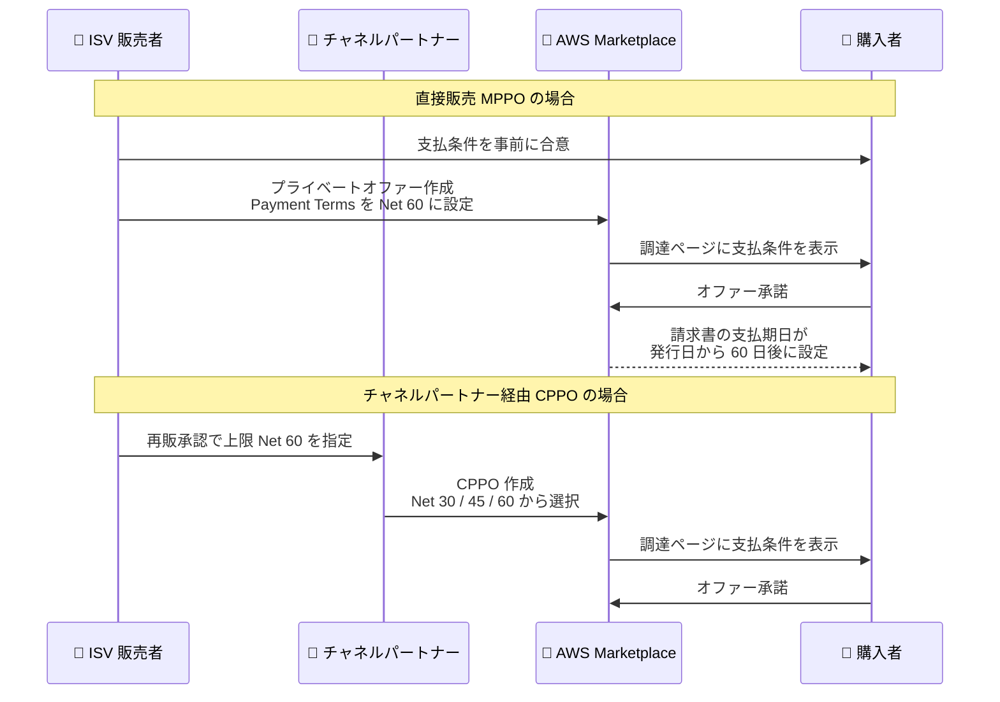

# AWS Marketplace - プライベートオファーの支払期限 (Net Payment Terms) 設定機能

**リリース日**: 2026 年 8 月 6 日
**サービス**: AWS Marketplace
**機能**: プライベートオファーにおける Net Payment Terms (支払期限) の設定

📊 [このアップデートのインフォグラフィックを見る](https://takech9203.github.io/aws-news-summary/20260806-aws-marketplace-net-payment-terms-for-private-offers.html)

## 概要

AWS Marketplace は、販売者 (セラー) がプライベートオファーに対してカスタムの支払期限 (Net Payment Terms) を設定できる機能を発表しました。販売者はオファー作成時に Net 30、Net 45、Net 60、Net 90 の中から支払期限を選択でき、請求書の支払期日を購入者と交渉した契約条件に合わせることができます。

これまで AWS Marketplace の支払期限は、購入者が AWS と取り決めている標準の支払条件に基づいてすべての購入に一律に適用されていました。今回のアップデートにより、個々のプライベートオファーごとに支払期限を柔軟に設定できるようになり、購入者はオファー承諾前に調達ページで支払条件を確認できます。設定した支払期限は、前払い金、スケジュール支払い、従量課金を含むオファー内のすべての請求に一貫して適用されます。

本機能は追加のセットアップやオンボーディング不要で、すべての AWS 商用リージョンのプライベートオファー作成において一般提供が開始されています。エンタープライズ契約で独自の支払サイトを求める購入者との商談を進める ISV や、チャネルパートナー経由の再販 (CPPO) を行う組織にとって重要なアップデートです。

**アップデート前の課題**

このアップデート以前には、以下の課題や制限がありました。

- 支払期限は購入者と AWS 間の標準支払条件に基づき、AWS Marketplace のすべての購入に一律に適用されていた
- 販売者と購入者が商談で独自の支払サイト (例: Net 60) に合意しても、AWS Marketplace の請求書にその条件を反映できなかった
- 支払条件の柔軟性が求められるエンタープライズ商談では、AWS Marketplace 外での取引を検討せざるを得ないケースがあった

**アップデート後の改善**

今回のアップデートにより、以下が可能になりました。

- 販売者がプライベートオファー作成時に Net 30 / Net 45 / Net 60 / Net 90 から支払期限を選択できるようになった
- 購入者はオファー承諾前に調達ページで支払条件を確認でき、支払期日の透明性が向上した
- 前払い金、分割払い、定期支払い、従量課金を含むオファー内のすべての請求に同一の支払期限が適用されるようになった
- CPPO では ISV が再販承認 (Resale Authorization) で上限となる支払期限を定義し、チャネルパートナーはその範囲内で条件を提示できるようになった

## アーキテクチャ図



直接販売 (MPPO) では販売者が支払期限を直接設定し、チャネルパートナー経由 (CPPO) では ISV が定めた上限の範囲内でチャネルパートナーが支払期限を選択します。いずれの場合も購入者はオファー承諾前に条件を確認できます。

## サービスアップデートの詳細

### 主要機能

1. **プライベートオファーごとの支払期限設定**
   - AWS Partner Central のプライベートオファー作成フロー内「Configure offer pricing and duration」ページで Payment Terms を選択
   - 選択肢は「Customer's AWS default (デフォルト)」「Net 30」「Net 45」「Net 60」「Net 90」の 5 種類
   - Net N は請求書発行日から N 日後が支払期日となることを意味する
   - 設定しない場合は従来どおり購入者の標準 AWS 支払条件が適用され、既存の動作は変わらない

2. **オファー内すべての請求への一律適用**
   - 前払い金 (upfront fees)、分割払い (installments)、定期支払い (recurring payments)、従量課金 (usage charges) を含むすべての請求に同一の支払期限が適用される
   - 1 つの契約内で請求タイプごとに異なる支払期限を設定することはできない

3. **チャネルパートナープライベートオファー (CPPO) への対応**
   - ISV は再販承認 (Resale Authorization) 作成時に、チャネルパートナーが提示できる支払期限の上限を指定できる
   - 例: ISV が上限を Net 60 に設定した場合、チャネルパートナーは Net 30 / Net 45 / Net 60 を選択できるが Net 90 は選択できない
   - ISV が「Customer's AWS default」を選択した場合、チャネルパートナーのオファーは最終購入者の標準 AWS 支払条件がデフォルトとなる

4. **購入者向けの可視性向上**
   - 調達ページ (Procurement page): オファー承諾前に支払条件を確認可能
   - サブスクリプション詳細ページ: 承諾後に請求サマリーセクションで支払条件を表示
   - AWS 請求書: 請求書発行日に支払期限の日数を加算した支払期日を表示

5. **支払期限ごとの請求書分割**
   - 異なる支払期限のサブスクリプションが複数ある場合、支払期限ごとにグループ化された個別の月次請求書が発行される
   - 各請求書には単一の支払期日が設定される
   - 販売者が購入者の標準 AWS 支払条件と同じ期限を設定した場合は、通常の請求書にまとめられる

## 技術仕様

### 機能仕様

| 項目 | 詳細 |
|------|------|
| 選択可能な支払期限 | Customer's AWS default / Net 30 / Net 45 / Net 60 / Net 90 |
| 対象オファー | AWS Marketplace プライベートオファー (MPPO)、チャネルパートナープライベートオファー (CPPO) |
| 対象商品タイプ | すべての商品タイプ・料金モデル (AWS Data Exchange 製品を除く) |
| 対象外 | ADX、AWS 1P、2P、Amazon Bedrock 製品 |
| 支払方法の条件 | 請求書払い (pay-by-invoice) の購入者のみ適用。クレジットカード払いは即時課金 |
| 適用範囲 | 該当プライベートオファーの契約に紐づく請求のみ。他の AWS Marketplace 購入や AWS サービスの請求には影響しない |
| 設定場所 | AWS Partner Central のプライベートオファー作成フロー |
| 変更可否 | 購入者のオファー承諾後は変更不可 (変更には新しいプライベートオファーの作成が必要) |

### API変更履歴

| 日付 | サービス | 変更内容 |
|------|----------|----------|
| 2026/08/06 | [AWS Marketplace Agreement Service](https://awsapichanges.com/archive/changes/32fa45-agreement-marketplace.html) | 1 updated api method - `GetAgreementTerms` のレスポンス `AcceptedTerm` に新しいバリアント `netPaymentTerm` が追加され、`paymentDuePeriod` フィールド (例: "P30D") を返すようになった |
| 2026/08/06 | [AWS Marketplace Discovery](https://awsapichanges.com/archive/changes/32fa45-discovery-marketplace.html) | 1 updated api method - `GetOfferTerms` のレスポンス `offerTerms` に `netPaymentTerm` が追加。`paymentDuePeriod` は ISO 8601 期間形式 (例: Net 30 の場合 "P30D") を使用。後方互換性のある追加 |

### API レスポンス例

`GetAgreementTerms` / `GetOfferTerms` のレスポンスに含まれる支払期限情報のイメージは以下のとおりです。

```json
{
  "netPaymentTerm": {
    "paymentDuePeriod": "P30D"
  }
}
```

`paymentDuePeriod` は ISO 8601 期間形式で表現され、"P30D" は請求書発行日から 30 日後 (Net 30) を意味します。

## 設定方法

### 前提条件

1. AWS Marketplace に少なくとも 1 つのアクティブな公開リスティングを保有していること
2. AWS Partner Central でプライベートオファーを作成するアクセス権限を保有していること
3. カスタム支払条件を提示する前に、購入者と支払条件について合意していること (購入者は特段の合意がなければ標準 AWS 支払条件が適用されると想定するため)

### 手順

#### ステップ1: プライベートオファーの作成を開始する

AWS Partner Central にサインインし、[Private offers] を選択します。新しいプライベートオファーを作成するか、下書きのオファーを再開します。

#### ステップ2: 支払期限を設定する

[Configure offer pricing and duration] ページの [Payment Terms] で、このオファーに適用する支払期限を選択します。

- **Customer's AWS default** (デフォルト): 購入者の標準 AWS 支払条件を適用
- **Net 30 / Net 45 / Net 60 / Net 90**: 請求書発行日からそれぞれ 30 / 45 / 60 / 90 日後を支払期日に設定

残りの手順を完了してプライベートオファーを公開します。

#### ステップ3: 再販承認で上限を設定する (CPPO の場合)

チャネルパートナー向けの再販承認を作成する際に、チャネルパートナーが最終購入者に提示できる支払期限の上限を指定します。チャネルパートナーは CPPO 作成時に、指定された上限以下の支払期限を同じ [Payment Terms] ドロップダウンから選択します。

#### ステップ4: 設定した支払条件を確認する

オファー作成後、以下の場所で支払条件を確認できます。

- **販売者側**: Private offers ページ、Agreements ページ (承諾後)、Seller insights ダッシュボード (請求書ごとの支払期日)
- **購入者側**: 調達ページ (承諾前)、サブスクリプション詳細ページ (承諾後)、AWS 請求書 (支払期日)

## メリット

### ビジネス面

- **商談条件と請求の整合**: 購入者と交渉した支払サイトをそのまま AWS Marketplace の請求書に反映でき、カスタム条件を必要とする商談をクローズしやすくなる
- **キャッシュフローの予測可能性向上**: 販売者は自社のキャッシュフロー要件に応じて支払期限を選択でき、入金時期の見通しを立てやすくなる
- **購入者の透明性向上**: 購入者はオファー承諾前に支払期日を確認でき、より有利な支払条件を利用できる

### 技術面

- **追加セットアップ不要**: 既存のプライベートオファー作成フローに統合されており、オンボーディング作業なしで即座に利用可能
- **API による自動化対応**: `GetAgreementTerms` / `GetOfferTerms` API で支払条件をプログラムから取得でき、調達・契約管理システムとの連携が可能
- **請求書の自動分割**: 支払期限ごとに請求書が自動でグループ化され、支払期日が明確に管理される

## デメリット・制約事項

### 制限事項

- ADX (AWS Data Exchange)、AWS 1P、2P、Amazon Bedrock 製品では利用できない
- 請求書払い (pay-by-invoice) の購入者のみに適用され、クレジットカード払いの購入者は設定に関わらず即時課金される
- 購入者がオファーを承諾した後は支払期限を変更できない (変更には新しいプライベートオファーの作成が必要)
- 1 つの契約内で請求タイプごとに異なる支払期限を設定することはできない

### 考慮すべき点

- 販売者が購入者の標準条件より不利な期限 (例: 購入者の標準が Net 45 のところ Net 30) を設定した場合でも、設定した期限が適用される。購入者は承諾前に条件を必ず確認すること
- カスタム支払条件は該当契約のみに適用され、購入者のその他の AWS Marketplace 購入や AWS サービス利用は標準支払条件のまま
- 購入者側では、支払期限の異なるサブスクリプションごとに請求書が分割されるため、買掛金処理のオペレーションに影響する可能性がある
- 調達システム (procure-to-pay ツール) でベンダーレベル・契約レベルの支払条件を管理している場合、発注書 (PO) レベルで条件を上書きして請求書と整合させることが推奨される

## ユースケース

### ユースケース1: エンタープライズ商談での支払サイト交渉への対応

**シナリオ**: ISV が大企業との年間契約を交渉しており、購入者の調達ポリシーで支払サイトが Net 60 に定められている。従来はこの条件を AWS Marketplace の請求に反映できず、商談の障害となっていた。

**実装例**:
```
1. AWS Partner Central でプライベートオファーを作成
2. Payment Terms で「Net 60」を選択
3. 前払い金 + 年次の分割払いで料金を構成
4. 購入者は調達ページで Net 60 を確認して承諾
```

**効果**: 購入者の調達ポリシーに準拠した条件で AWS Marketplace 経由の契約が可能になり、商談を Marketplace 内で完結できる。

### ユースケース2: CPPO における再販条件の統制

**シナリオ**: ISV がチャネルパートナー経由で製品を再販しているが、パートナーが独自に過度に長い支払サイトを提示することで、ISV への入金がさらに遅延するリスクを管理したい。

**実装例**:
```
1. ISV が再販承認 (Resale Authorization) を作成
2. 支払期限の上限として「Net 60」を指定
3. チャネルパートナーは CPPO 作成時に
   Net 30 / Net 45 / Net 60 のいずれかを選択 (Net 90 は選択不可)
```

**効果**: チャネル販売の柔軟性を維持しつつ、ISV がキャッシュフローに影響する支払条件の上限を統制できる。

### ユースケース3: 購入者側での発注書 (PO) と請求書の整合

**シナリオ**: 購入者の経理部門が procure-to-pay ツールでベンダーレベルの支払条件を管理しているが、AWS Marketplace のプライベートオファーで個別の支払条件 (Net 90) に合意した。

**実装例**:
```
1. 販売者に Net 90 でプライベートオファーの作成を依頼
2. 調達ページで支払条件が合意どおりか確認して承諾
3. 購入申請・発注書 (PO) の支払条件を Net 90 に設定し、
   請求書と発注書の条件を一致させる
```

**効果**: 発注書と請求書の支払条件が一致し、買掛金チームの請求書処理がスムーズになる。

## 料金

Net Payment Terms の設定自体に追加料金は発生しません。AWS Marketplace の標準的な手数料体系が引き続き適用されます。なお、AWS は購入者からの支払いを受領した後に販売者へ支払うため、長い支払期限 (例: Net 90) を設定すると販売者への入金もその分遅くなる点に留意が必要です。

## 利用可能リージョン

すべての AWS 商用リージョンで一般提供されています。追加のセットアップやオンボーディングは不要です。

## 関連サービス・機能

- **AWS Marketplace プライベートオファー (MPPO)**: 販売者と購入者が個別に交渉した価格・条件で契約する仕組み。本機能の主要な適用対象
- **チャネルパートナープライベートオファー (CPPO)**: チャネルパートナーが ISV 製品を再販する仕組み。再販承認で支払期限の上限を統制可能
- **AWS Partner Central**: プライベートオファーの作成と支払期限の設定を行うポータル
- **AWS Marketplace Agreement Service / Discovery API**: `GetAgreementTerms` / `GetOfferTerms` で契約・オファーの支払条件 (`netPaymentTerm`) をプログラムから取得可能
- **AWS Marketplace の発注書 (Purchase Order) サポート**: 購入者が PO の支払条件をプライベートオファーの条件と整合させることで、買掛金処理を効率化

## 参考リンク

- 📊 [インフォグラフィック](https://takech9203.github.io/aws-news-summary/20260806-aws-marketplace-net-payment-terms-for-private-offers.html)
- [公式発表 (What's New)](https://aws.amazon.com/about-aws/whats-new/2026/08/aws-marketplace-net-payment-terms-for-private-offers)
- [ドキュメント (Seller Guide): Configuring net payment terms for private offers](https://docs.aws.amazon.com/marketplace/latest/userguide/seller-net-payment-terms.html)
- [ドキュメント (Buyer Guide): Net payment terms for private offers](https://docs.aws.amazon.com/marketplace/latest/buyerguide/buyer-net-payment-terms.html)

## まとめ

AWS Marketplace のプライベートオファーで Net 30 〜 Net 90 のカスタム支払期限を設定できるようになり、商談で交渉した支払条件をそのまま Marketplace の請求に反映できるようになりました。エンタープライズ商談を扱う ISV やチャネルパートナーは、AWS Partner Central のオファー作成フローで本機能をすぐに利用できます。購入者側は請求書払いが前提となる点と、支払期限ごとに請求書が分割される点を踏まえ、調達・経理プロセスへの組み込みを検討することを推奨します。
