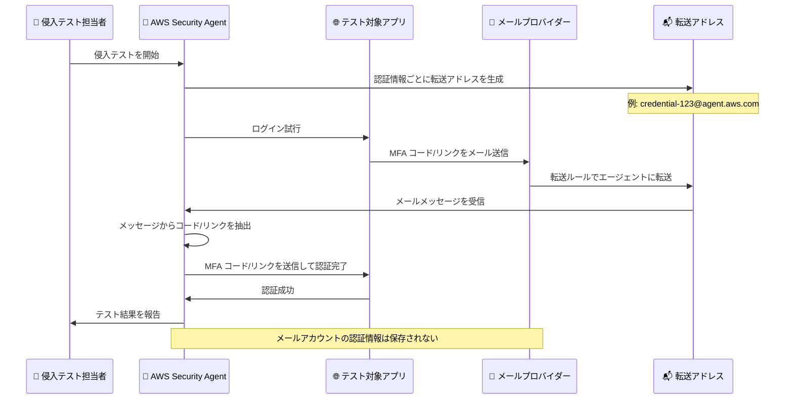

# AWS Security Agent - メールベース MFA サポート

**リリース日**: 2026 年 8 月 6 日
**サービス**: AWS Security Agent
**機能**: メールベース多要素認証 (MFA) の侵入テストサポート

📊 [このアップデートのインフォグラフィックを見る](https://takech9203.github.io/aws-news-summary/20260806-aws-security-agent-mfa.html)

## 概要

AWS Security Agent が、メールベースの多要素認証 (MFA) を使用するアプリケーションの侵入テスト (ペネトレーションテスト) に対応しました。これにより、ワンタイムコードや検証リンクをメールで送信する認証フローを持つアプリケーションも、自動化された侵入テストの対象に含めることができるようになります。

従来、メールで送信されるワンタイムコードや検証リンクを必要とするアプリケーションは、AWS Security Agent がこれらのメッセージを受信・処理する仕組みがなかったため、自動化された侵入テストの対象外でした。今回のアップデートにより、メールベース認証を採用しているアプリケーションも侵入テストのカバレッジに含まれるようになり、セキュリティテストの範囲が大幅に拡大します。

この機能は既存の TOTP (Time-based One-Time Password) サポートを補完するものであり、複数の MFA 方式を使用するアプリケーションを統合的にテストできるソリューションを提供します。

**アップデート前の課題**

- メールで送信されるワンタイムコードや検証リンクを使用する認証フローは、自動化された侵入テストの対象外だった
- エージェントがメールメッセージを受信・処理する仕組みがなかったため、手動での介入が必要だった
- メールベース MFA を採用しているアプリケーションのセキュリティテストを完全に自動化できなかった

**アップデート後の改善**

- メールベース MFA を使用するアプリケーションの侵入テストが自動化可能になった
- エージェントがメールメッセージを自動的に読み取り、認証を完了できるようになった
- 既存の TOTP サポートと組み合わせることで、複数の MFA 方式をカバーする統合的なテストソリューションが実現した

## アーキテクチャ図



AWS Security Agent がメールベース MFA を処理する流れを示しています。エージェントは認証情報ごとに一意の転送アドレスを生成し、既存のメールプロバイダーの転送ルールを使用してメッセージを受信します。受信したメールから自動的にコードやリンクを抽出して認証を完了するため、手動介入なしで侵入テストを実行できます。

## サービスアップデートの詳細

### 主要機能

1. **認証情報ごとの一意の転送アドレス生成**
   - AWS Security Agent は、各認証情報 (credential) ごとに一意のメール転送アドレスを生成します
   - 既存のメールプロバイダーで転送ルールを設定することで、MFA メールをエージェントに直接転送できます
   - メールアカウントの認証情報を保存する必要がないため、プライバシー保護が強化されます

2. **メールメッセージの自動処理**
   - 侵入テスト中、エージェントは転送されたメールメッセージを自動的に読み取ります
   - ワンタイムコードや検証リンクを抽出し、認証を完了するために自動的に送信します
   - 手動介入なしで認証フローを完了できるため、テストの自動化が実現します

3. **TOTP との統合**
   - 既存の TOTP (Time-based One-Time Password) サポートと組み合わせて使用できます
   - 複数の MFA 方式を使用するアプリケーションを統合的にテストできる単一のソリューションを提供します
   - メールベースと TOTP ベースの両方の認証フローを同じエージェントで処理できます

## 技術仕様

### メール転送の設定

| 項目 | 詳細 |
|------|------|
| 転送アドレス形式 | 認証情報ごとに一意のアドレスが生成される |
| 転送ルール設定 | 既存のメールプロバイダーの転送機能を使用 |
| 認証情報の保存 | メールアカウントの認証情報は保存されない |
| プライバシー | 転送メカニズムにより強力なプライバシー保護を実現 |

### サポートされる MFA 方式

| MFA 方式 | サポート状況 | 説明 |
|----------|-------------|------|
| メールベース MFA | ✅ 新規サポート | ワンタイムコードや検証リンクをメールで送信 |
| TOTP | ✅ 既存サポート | Google Authenticator などの TOTP アプリ |

## 設定方法

### 前提条件

1. AWS Security Agent が有効化されたアカウントを持っている
2. テスト対象のアプリケーションがメールベース MFA を使用している
3. メールプロバイダーで転送ルールを設定できるアクセス権限がある

### 手順

#### ステップ 1: AWS Security Agent で転送アドレスを生成

```bash
# AWS Security Agent コンソールまたは API を使用して、
# 認証情報ごとの転送アドレスを取得
aws security-agent get-forwarding-address --credential-id <credential-id>
```

エージェントは各認証情報に対して一意の転送アドレスを生成します。このアドレスを後続のステップで使用します。

#### ステップ 2: メールプロバイダーで転送ルールを設定

既存のメールプロバイダー (Gmail、Outlook、社内メールシステムなど) で、MFA メールを AWS Security Agent の転送アドレスに転送するルールを設定します。

**Gmail の例:**

1. Gmail 設定 → 「転送と POP/IMAP」を開く
2. 「転送先アドレスを追加」をクリック
3. ステップ 1 で取得した転送アドレスを入力
4. フィルタ機能を使用して、特定の送信者 (アプリケーションの MFA システム) からのメールのみを転送

#### ステップ 3: 侵入テストを実行

```bash
# AWS Security Agent で侵入テストを開始
aws security-agent start-pentest --target-url <application-url> --credential-id <credential-id>
```

エージェントは自動的にログインフローを実行し、転送されたメールから MFA コードやリンクを抽出して認証を完了します。

## メリット

### ビジネス面

- **セキュリティテストカバレッジの拡大**: メールベース MFA を採用している多くのアプリケーションが侵入テストの対象に含まれるようになり、セキュリティ検証の範囲が広がります
- **テストコストの削減**: 手動介入が不要になることで、侵入テストの実行コストとスピードが改善されます
- **コンプライアンス対応の強化**: より包括的なセキュリティテストにより、コンプライアンス要件への対応が容易になります

### 技術面

- **テストの完全自動化**: メールベース MFA の処理を含めた認証フロー全体を自動化できるため、テストの再現性と効率が向上します
- **プライバシー保護**: メールアカウントの認証情報を保存する必要がないため、セキュリティリスクが低減されます
- **柔軟な統合**: 既存のメールインフラと簡単に統合でき、転送ルールのみで動作するため、複雑な設定変更が不要です

## デメリット・制約事項

### 制限事項

- 既存のメールプロバイダーで転送ルールを設定する必要があるため、初期設定の手間がかかります
- 転送ルールの設定には、メールシステムへのアクセス権限が必要です
- メールの配信遅延がある場合、テストの実行時間に影響を与える可能性があります

### 考慮すべき点

- 転送アドレスへのメール配信が確実に行われるよう、メールフィルタやスパム設定を適切に構成する必要があります
- 本番環境のメールアカウントを使用する場合、転送ルールが意図した MFA メールのみを対象とするよう注意深く設定する必要があります

## ユースケース

### ユースケース 1: E コマースサイトの侵入テスト

**シナリオ**: E コマースサイトのログインフローでメールベース MFA を使用しており、侵入テストでログイン後の機能を検証したい

**実装例**:
```bash
# 転送アドレスを取得
FORWARD_ADDR=$(aws security-agent get-forwarding-address --credential-id ecommerce-test)

# メールプロバイダーで転送ルール設定 (手動)
# 例: noreply@ecommerce.example.com からのメールを $FORWARD_ADDR に転送

# 侵入テストを実行
aws security-agent start-pentest \
  --target-url https://ecommerce.example.com \
  --credential-id ecommerce-test \
  --test-type full-scan
```

**効果**: ログイン後のページや機能に対する脆弱性スキャンを自動化でき、メールベース MFA による認証フローを手動介入なしで完了できます

### ユースケース 2: SaaS アプリケーションのセキュリティ監査

**シナリオ**: 複数のテナントを持つ SaaS アプリケーションで、メールベースとTOTP ベースの両方の MFA オプションを提供しており、両方の認証フローをテストしたい

**実装例**:
```bash
# メールベース MFA を使用するアカウントのテスト
aws security-agent start-pentest \
  --target-url https://saas.example.com \
  --credential-id tenant-a-email-mfa \
  --mfa-type email

# TOTP ベース MFA を使用するアカウントのテスト
aws security-agent start-pentest \
  --target-url https://saas.example.com \
  --credential-id tenant-b-totp-mfa \
  --mfa-type totp
```

**効果**: 同じエージェントで複数の MFA 方式を統合的にテストでき、異なる認証設定を持つテナント間での一貫したセキュリティ検証が可能になります

### ユースケース 3: CI/CD パイプラインへの統合

**シナリオ**: 新しいコードがデプロイされるたびに自動的に侵入テストを実行し、セキュリティリスクを早期に検出したい

**実装例**:
```yaml
# GitLab CI/CD の例
security_scan:
  stage: test
  script:
    - |
      # AWS Security Agent で侵入テストを実行
      aws security-agent start-pentest \
        --target-url https://staging.example.com \
        --credential-id staging-test \
        --wait-for-completion
      
      # テスト結果を取得
      aws security-agent get-pentest-report \
        --format json > pentest-report.json
  artifacts:
    reports:
      security: pentest-report.json
```

**効果**: デプロイメントごとに自動的にセキュリティテストが実行され、メールベース MFA を含む認証フローの問題を継続的に監視できます

## 料金

AWS Security Agent の既存料金体系に含まれており、メールベース MFA サポートによる追加料金は発生しません。

### 料金例

AWS Security Agent の料金は実行する侵入テストの数とスキャン対象のリソース数に基づきます。詳細は AWS Security Agent の料金ページをご確認ください。

## 利用可能リージョン

AWS Security Agent がサポートされているすべての AWS リージョンで利用可能です。

## 関連サービス・機能

- **AWS Security Agent TOTP サポート**: Time-based One-Time Password を使用する MFA のテストサポート
- **Amazon SES (Simple Email Service)**: メールの送受信を管理する AWS サービス。テスト環境でのメール配信に使用可能
- **AWS IAM**: AWS リソースへのアクセスを安全に管理するサービス。AWS Security Agent の権限設定に使用

## 参考リンク

- 📊 [インフォグラフィック](https://takech9203.github.io/aws-news-summary/20260806-aws-security-agent-mfa.html)
- [公式発表 (What's New)](https://aws.amazon.com/about-aws/whats-new/2026/08/aws-security-agent-mfa/)
- [AWS Security Agent 製品ページ](https://aws.amazon.com/security-agent/)
- [AWS Security Agent ユーザーガイド](https://docs.aws.amazon.com/security-agent/)

## まとめ

AWS Security Agent のメールベース MFA サポートにより、より多くのアプリケーションが自動化された侵入テストの対象に含まれるようになりました。メールアカウントの認証情報を保存することなく、転送メカニズムを使用することでプライバシーを保護しながらテストを実行できます。既存の TOTP サポートと組み合わせることで、複数の MFA 方式を統合的にテストできるソリューションが実現し、セキュリティテストのカバレッジが大幅に拡大します。メールベース MFA を採用しているアプリケーションを運用している組織は、この機能を活用してセキュリティ検証を強化することをお勧めします。
