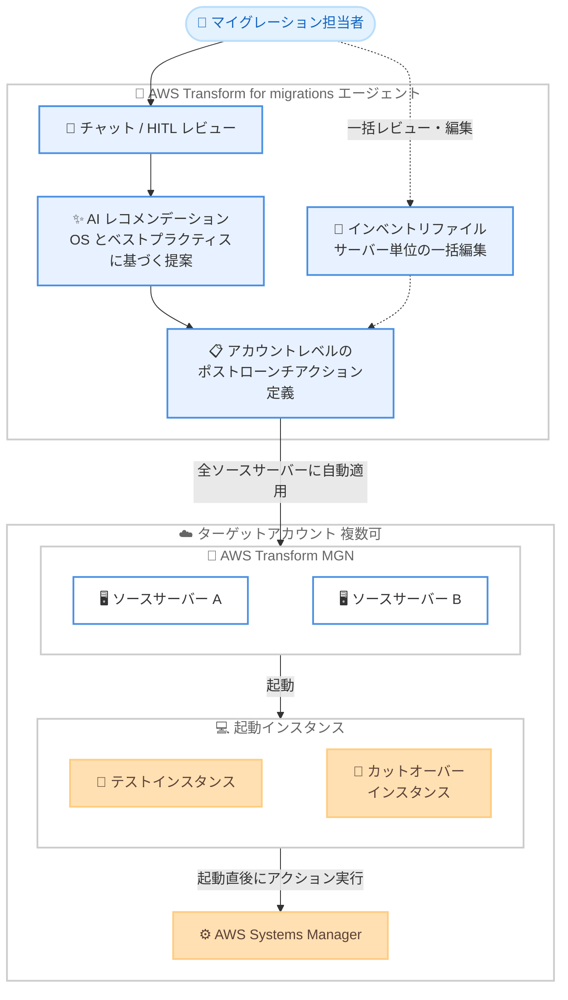

# AWS Transform - マイグレーションにおけるポストローンチアクションの自動化

**リリース日**: 2026 年 8 月 6 日
**サービス**: AWS Transform
**機能**: AWS Transform for migrations によるポストローンチアクションの自動セットアップと実行

📊 [このアップデートのインフォグラフィックを見る](https://takech9203.github.io/aws-news-summary/20260806-aws-transform-for-migrations-automates-post-launch-actions.html)

## 概要

AWS Transform for migrations が、マイグレーションワークフローの一部として、ポストローンチアクション (テスト起動またはカットオーバー起動の直後に移行先インスタンス上で実行される自動化タスク) のセットアップと実行を自動化できるようになりました。ポストローンチアクションをアカウントレベルで一度定義するだけで、マルチアカウントマイグレーションを含むすべてのターゲットアカウントのすべてのソースサーバーに自動的に適用されます。

ポストローンチアクションは AWS Systems Manager (SSM) を通じて実行され、AWS Transform MGN (旧 AWS Application Migration Service) に用意されている定義済みアクションから選択するか、既存の Systems Manager ドキュメントを指定して独自のカスタムアクションを作成できます。AWS Transform のエージェントは、インベントリ内のオペレーティングシステムとベストプラクティスに基づく AI レコメンデーションも提供し、ユーザーに代わってアクションの推奨・設定・実行を行います。

さらに、サーバーを一括で設定できるように、マイグレーションインベントリファイルにポストローンチアクション用の新しい構造が追加され、サーバー単位でのレビューと編集が簡単になりました。今回のアップデートにより、AWS Transform for migrations エージェントは、レプリケーションテンプレート、Amazon EC2 起動テンプレート、EC2 ライトサイジング、ポストローンチアクションを含むマイグレーション設定のエンドツーエンドの自動化を提供しつつ、個々のソースサーバーレベルでの作成・編集も引き続きサポートします。

**アップデート前の課題**

- ポストローンチアクションをサーバーごとに個別に設定する必要があり、大規模マイグレーションでは手作業が膨大で時間がかかっていた
- サーバー単位の手動設定は設定漏れや設定ミスが発生しやすく、移行後の検証・モダナイゼーションタスクの品質が安定しなかった
- マルチアカウントマイグレーションでは、ターゲットアカウントごとに同じアクション定義を繰り返しセットアップする必要があった

**アップデート後の改善**

- ポストローンチアクションをアカウントレベルで一度定義するだけで、すべてのターゲットアカウントの全ソースサーバーに自動適用されるようになった
- エージェントが OS とベストプラクティスに基づいてアクションを推奨・設定・実行するため、手作業と設定ミスが削減され、より多くのサーバーを少ない労力で移行できるようになった
- インベントリファイルの新しいポストローンチアクション構造により、サーバー単位の一括レビュー・編集が可能になった

## アーキテクチャ図



アカウントレベルで定義したポストローンチアクションが全ターゲットアカウントのソースサーバーに自動適用され、テスト / カットオーバー起動の直後に AWS Systems Manager 経由で実行される流れを示しています。

## サービスアップデートの詳細

### 主要機能

1. **アカウントレベルでのポストローンチアクション定義と自動適用**
   - ポストローンチアクションをアカウントレベルで一度定義すると、ソースサーバーが MGN に追加されるたびに自動的に適用される
   - 定義したデフォルトはすべてのターゲットアカウントに自動適用でき、マルチアカウントマイグレーションにも対応
   - ソースサーバー作成後は、チャットインターフェイスまたはインベントリファイルを使用してサーバー単位で上書き変更が可能

2. **AI レコメンデーションと定義済み / カスタムアクションのサポート**
   - エージェントがターゲットアカウント全体で利用可能なポストローンチアクションの一覧を提示し、インベントリの OS とベストプラクティスに基づく AI レコメンデーションを提供
   - MGN の定義済みポストローンチアクション (OS 変換、ディザスタリカバリ設定、ライセンス変更など) から選択可能
   - 事前に作成した Systems Manager ドキュメントの名前または ARN を指定してカスタムアクションを作成でき、エージェントが HITL (human-in-the-loop) インターフェイスを生成してアクション名・実行順序・必須パラメータの入力を支援

3. **インベントリファイルによる一括設定**
   - インベントリファイルがサーバーごとのポストローンチアクションテンプレートを含む新構造に拡張され、MGN へのインポート時にサーバー単位でアクションの追加・更新が可能
   - `mgn:launch:post-actions:<ACTION_NAME>:<FIELD_NAME>` の命名規則で列を定義し、`active` 列を `FALSE` にすることで特定サーバーからアクションを削除可能
   - グローバルトグル `mgn:launch:post-actions:enabled` (`TRUE`/`FALSE`) でポストローンチアクションの実行全体を制御

4. **マイグレーション設定のエンドツーエンド自動化**
   - 今回のアップデートにより、レプリケーションテンプレート、EC2 起動テンプレート、EC2 ライトサイジング、ポストローンチアクションを含むマイグレーション設定全体をエージェントが自動化
   - 個々のソースサーバーレベルでの作成・編集も引き続き可能で、柔軟性を維持

## 技術仕様

### ポストローンチアクションの実行

| 項目 | 詳細 |
|------|------|
| 実行基盤 | AWS Systems Manager (SSM) |
| 実行タイミング | テスト起動またはカットオーバー起動の直後 |
| アクションの種類 | MGN の定義済みアクション、または既存の SSM ドキュメントから作成するカスタムアクション |
| 定義レベル | アカウントレベル (デフォルト) およびソースサーバーレベル (個別上書き) |
| 実行順序のデフォルト | 1001 (既存アクションがある場合は最後尾に配置、変更可能) |
| 一括編集 | インベントリファイル (CSV / XLSX) によるサーバー単位の一括設定 |

### インベントリファイルのポストローンチアクション構造

インベントリファイルでは、アクションごとに以下のフィールドを指定します。

| フィールド | 型 | 必須 | 説明 |
|------|------|------|------|
| `ssmDocumentName` | String | 必須 | 実行する Systems Manager ドキュメント |
| `order` | Integer | 必須 | 実行順序 (1000〜10000)。小さい値から昇順に実行 |
| `active` | TRUE/FALSE | 任意 | アクションの有効 / 無効 |
| `mustSucceedForCutover` | TRUE/FALSE | 任意 | カットオーバー前に成功が必須かどうか |
| `timeoutSeconds` | Integer | 任意 | タイムアウト (秒) |
| `description` | String | 任意 | 人間が読める説明 |
| `parameters` | JSON | 任意 | SSM ドキュメントのパラメータ |

### parameters フィールドの JSON 構造

```json
{
  "parameters": {
    "Operation": [
      {"value": "Scan", "type": "String"}
    ]
  },
  "externalParameters": {
    "InstanceId": "ec2.InstanceId"
  }
}
```

- `parameters`: ドキュメントのパラメータ名を値参照のリストにマッピング (各値は `value` と省略可能な `type` を持ち、`type` のデフォルトは `String`)
- `externalParameters`: ドキュメントのパラメータ名を動的パス文字列にマッピング (SSM パラメータは作成されない)

## 設定方法

### 前提条件

1. AWS Transform のワークスペースとマイグレーションジョブがセットアップ済みであること
2. ターゲットアカウントで MGN が初期化済みであること (未初期化の場合はエージェントが手順を案内)
3. カスタムアクションを使用する場合は、AWS Systems Manager コンソールで SSM ドキュメントを事前に作成しておくこと
4. インベントリファイル (サーバー詳細、ウェーブ割り当て、ターゲットアカウント情報を含む) が準備済みであること

### 手順

#### ステップ 1: 利用可能なポストローンチアクションの確認

```text
# AWS Transform のチャットインターフェイスで依頼する例
「定義済みのポストローンチアクションの一覧を表示してください」
```

AWS Transform がターゲットアカウント全体で利用可能なポストローンチアクションの一覧を提示します。エージェントはインベントリの OS とベストプラクティスに基づく AI レコメンデーションも提供するため、デフォルトのまま続行するか、独自のアクションを設定するかを選択できます。

#### ステップ 2: 新しいポストローンチアクションの作成

```text
# チャットインターフェイスで依頼する例
「SSM ドキュメント <ドキュメント名または ARN> を使って
 新しいポストローンチアクションを作成してください」
```

エージェントが HITL インターフェイスを生成し、アクション名 (デフォルト名を変更可能)、実行順序 (デフォルト 1001)、SSM ドキュメントの必須パラメータ値の入力を求めます。チャットインターフェイスから直接パラメータを変更することも可能です。定義したアクションはターゲットアカウント全体のマイグレーションに適用されます。

#### ステップ 3: インベントリファイルによるサーバー単位の調整

```text
# インベントリファイルの列指定例
mgn:launch:post-actions:enabled                  → TRUE
mgn:launch:post-actions:MyAction:ssmDocumentName → AWS-RunPatchBaseline
mgn:launch:post-actions:MyAction:order           → 1001
mgn:launch:post-actions:MyAction:active          → TRUE
```

「Step 2: Validate and confirm inventory」フェーズでインベントリファイル (CSV / XLSX) をダウンロードし、`mgn:launch:post-actions:<ACTION_NAME>:<FIELD_NAME>` 形式の列でサーバーごとのアクションを追加・更新します。特定サーバーからアクションを削除するには `active` 列を `FALSE` に設定します。編集後のファイルをアップロードすると、MGN へのインポート時にサーバー単位の設定が反映されます。

## メリット

### ビジネス面

- **マイグレーション速度の向上**: サーバーごとの手動セットアップが不要になり、より多くのサーバーを少ない労力で移行できる
- **品質の安定化**: アカウントレベルの一元定義と AI レコメンデーションにより、設定漏れや設定ミスによる移行後トラブルのリスクを低減できる
- **大規模マイグレーションへの対応**: マルチアカウント環境を含む数百台規模のマイグレーションでも、ポストローンチタスクを一貫して自動実行できる

### 技術面

- **SSM ベースの柔軟な自動化**: 定義済みアクションに加え、既存の Systems Manager ドキュメントを利用したカスタムアクションで、パッチ適用や検証スクリプトなど任意のタスクを自動化できる
- **一括編集と個別上書きの両立**: アカウントレベルのデフォルトを基本としつつ、インベントリファイルやチャットでサーバー単位の調整が可能
- **エンドツーエンドの設定自動化**: レプリケーションテンプレート、EC2 起動テンプレート、ライトサイジングと合わせて、マイグレーション設定全体をエージェントに任せられる

## デメリット・制約事項

### 制限事項

- ポストローンチアクションの実行順序 (`order`) は 1000〜10000 の範囲で指定する必要がある
- カスタムアクションに使用する SSM ドキュメントは、AWS Systems Manager コンソールで事前に作成しておく必要がある
- インベントリファイルでは列の削除や列ヘッダーの変更は不可 (AWS Transform が元のファイル構造を必要とするため)

### 考慮すべき点

- ポストローンチアクションはテスト / カットオーバー起動の直後に実行されるため、アクションの実行時間やタイムアウト (`timeoutSeconds`) がカットオーバーウィンドウに与える影響を考慮する必要がある
- `mustSucceedForCutover` を `TRUE` に設定したアクションが失敗するとカットオーバーが進められないため、重要度に応じて設定を使い分ける必要がある
- SSM 経由でアクションを実行するため、起動インスタンスに SSM Agent が動作し、Systems Manager と通信できるネットワーク構成が必要になる

## ユースケース

### ユースケース 1: 大規模リホストにおける移行後検証の標準化

**シナリオ**: 数百台のサーバーをウェーブ単位で Amazon EC2 にリホストしており、移行後の接続性確認やヘルスチェックを全サーバーで統一的に実施したい。

**実装例**:
```text
1. 検証用の SSM ドキュメントを事前に作成
2. AWS Transform のチャットで、この SSM ドキュメントを使った
   ポストローンチアクションをアカウントレベルで定義
3. mustSucceedForCutover を TRUE に設定し、検証に合格した
   サーバーのみカットオーバーを許可
```

**効果**: すべてのウェーブ・全サーバーで同一の検証が自動実行され、移行後の品質が標準化される。検証に失敗したサーバーはカットオーバー前に検出できる。

### ユースケース 2: マルチアカウントマイグレーションでのセキュリティ設定の一括適用

**シナリオ**: 複数のターゲットアカウントにサーバーを移行しており、起動直後にパッチ適用やセキュリティエージェントのインストールをすべてのアカウントで統一的に行いたい。

**実装例**:
```text
1. パッチ適用用に AWS-RunPatchBaseline などの SSM ドキュメントを指定した
   ポストローンチアクションをアカウントレベルで定義
2. アクションはすべてのターゲットアカウントの全ソースサーバーに自動適用
3. parameters フィールドで Operation=Scan などのパラメータを指定
```

**効果**: アカウントごとに同じ設定を繰り返す必要がなくなり、マルチアカウント環境でも移行直後からセキュリティベースラインを確保できる。

### ユースケース 3: サーバー特性に応じたアクションの個別調整

**シナリオ**: アカウントレベルのデフォルトアクションを基本としつつ、一部のデータベースサーバーでは特定のアクションを無効化し、代わりに専用の設定スクリプトを実行したい。

**実装例**:
```text
# インベントリファイルでの調整例
対象 DB サーバーの行:
  mgn:launch:post-actions:DefaultAction:active   → FALSE
  mgn:launch:post-actions:DbSetup:ssmDocumentName → MyDbSetupDocument
  mgn:launch:post-actions:DbSetup:order           → 1002
```

**効果**: アカウントレベルの一元管理と、インベントリファイルによるサーバー単位の柔軟な調整を両立でき、サーバー特性に応じた移行後処理を実現できる。

## 料金

AWS Transform の料金体系に追加料金なしで利用できます。ポストローンチアクションの実行に伴い、起動される Amazon EC2 インスタンス、AWS Systems Manager の利用 (一部の高度な機能)、および実行されるアクションが作成する AWS リソースには通常の料金が適用されます。詳細は [AWS Transform の料金ページ](https://aws.amazon.com/transform/pricing/) を参照してください。

## 利用可能リージョン

AWS Transform が提供されているすべての AWS リージョンで利用できます。リージョンの詳細は [AWS Transform ユーザーガイドのターゲットアカウント接続ページ](https://docs.aws.amazon.com/transform/latest/userguide/transform-vmware-connect-target-account.html) を参照してください。

## 関連サービス・機能

- **AWS Transform MGN (旧 AWS Application Migration Service)**: AWS Transform がリホストのデータレプリケーションとインスタンス起動に使用する基盤サービス。ポストローンチアクションの定義済みアクションと実行メカニズムを提供する
- **AWS Systems Manager**: ポストローンチアクションの実行基盤。カスタムアクションは SSM ドキュメントとして作成する
- **AWS Elastic Disaster Recovery (AWS DRS)**: 定義済みポストローンチアクションを使用して、移行先サーバーのディザスタリカバリ設定を自動化できる
- **AWS Migration Hub**: EC2 インスタンスタイプのレコメンデーション生成など、AWS Transform のライトサイジング機能と連携する

## 参考リンク

- 📊 [インフォグラフィック](https://takech9203.github.io/aws-news-summary/20260806-aws-transform-for-migrations-automates-post-launch-actions.html)
- [公式発表 (What's New)](https://aws.amazon.com/about-aws/whats-new/2026/08/aws-transform-for-migrations-automates-post-launch-actions)
- [ドキュメント: Migrate servers - Post-launch actions (AWS Transform User Guide)](https://docs.aws.amazon.com/transform/latest/userguide/transform-vmware-migrate-servers.html#transform-vmware-ms-prereqs-and-defaults)
- [ドキュメント: Predefined post-launch actions (MGN User Guide)](https://docs.aws.amazon.com/mgn/latest/ug/source-post-launch-settings.html)
- [ドキュメント: Creating Systems Manager documents](https://docs.aws.amazon.com/systems-manager/latest/userguide/create-ssm-doc.html)
- [リージョン情報](https://docs.aws.amazon.com/transform/latest/userguide/transform-vmware-connect-target-account.html)

## まとめ

AWS Transform for migrations のポストローンチアクション自動化により、これまでサーバーごとに必要だった移行後タスクのセットアップが、アカウントレベルの一度の定義で全ターゲットアカウントに自動適用されるようになりました。大規模リホストやマルチアカウントマイグレーションを計画している場合は、定義済みアクションと AI レコメンデーションの確認から始め、パッチ適用や検証スクリプトなどの独自 SSM ドキュメントをポストローンチアクションとして組み込むことを推奨します。
