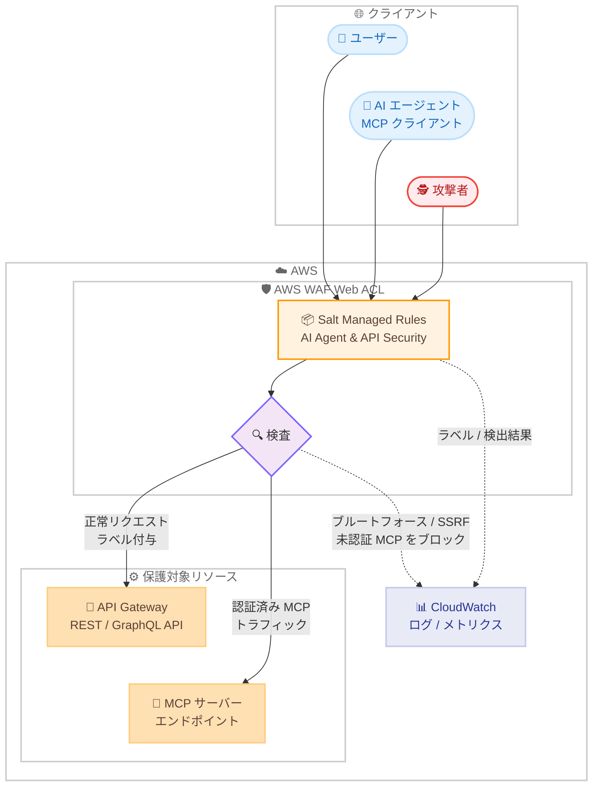

# AWS WAF - Salt Security マネージドルールグループによる API / MCP 脅威検出のサポート

**リリース日**: 2026 年 8 月 6 日
**サービス**: AWS WAF
**機能**: Salt Managed Rules for AWS WAF - AI Agent & API Security (AWS Marketplace マネージドルールグループ)

📊 [このアップデートのインフォグラフィックを見る](https://takech9203.github.io/aws-news-summary/20260806-aws-waf-salt-security-managed-rules.html)

## 概要

AWS WAF が、Salt Security の提供するマネージドルールグループ「Salt Managed Rules for AWS WAF - AI Agent & API Security」を AWS Marketplace 経由でサポートしました。このルールグループは API を標的とした攻撃と、AI エージェントや MCP (Model Context Protocol) エンドポイント由来のトラフィックに対する保護を提供します。お客様はカスタムルールを独自に構築・維持することなく、API 特有の脅威に対する防御を Web ACL に追加できます。

検出対象には、クレデンシャルブルートフォース、過剰な GraphQL クエリ、SSRF (サーバーサイドリクエストフォージェリ)、プロトタイプ汚染、JWT の異常といった API 攻撃ベクトルが含まれます。さらに、MCP エンドポイントへのトラフィックを識別・ラベル付けし、未認証の MCP アクセスをブロックすることで、AWS WAF 上で MCP 通信の可観測性を高めます。

API を公開している企業、GraphQL を利用するアプリケーション、そして MCP サーバーを運用して AI エージェントとの連携を進めている組織にとって、マネージドサービスとして API / AI エージェントセキュリティを導入できる選択肢が増えるアップデートです。

**アップデート前の課題**

このアップデート以前は、API 特有の攻撃や AI エージェント由来のトラフィックへの対策に課題がありました。

- API 列挙攻撃や GraphQL の過剰クエリ、JWT 異常などの API 特有の脅威に対しては、カスタムルールを独自に作成・維持する必要があった
- MCP エンドポイントへのトラフィックを WAF レイヤーで識別・制御する標準的な手段がなく、未認証の MCP アクセスの検出が困難だった
- ユーザー識別子やメールアドレスといった機密性の高いリクエストパラメータに基づくレート制限を実装するには、高度なルール設計が必要だった

**アップデート後の改善**

今回のアップデートにより、以下が可能になりました。

- AWS Marketplace でサブスクライブするだけで、Salt Security の専門知識に基づく API 攻撃検出ルールを Web ACL に追加できるようになった
- MCP エンドポイントトラフィックの識別・ラベル付け、未認証 MCP アクセスのブロック、MCP 通信の可観測性向上が WAF 上で実現できるようになった
- ユーザー識別子やメールアドレスなどの機密パラメータに対するレート制限により、列挙攻撃や不正利用を緩和できるようになった
- 認可ヘッダー、ユーザー識別子、GraphQL クエリなどのリクエスト属性がラベル付けされ、検出精度の向上と下流での分析に活用できるようになった

## アーキテクチャ図



Salt Security マネージドルールグループが Web ACL 内でリクエストを検査し、API 攻撃や未認証 MCP アクセスをブロックしつつ、正常なトラフィックにはラベルを付与してバックエンドへ転送する構成です。

## サービスアップデートの詳細

### 主要機能

1. **API 攻撃ベクトルの検出**
   - クレデンシャルブルートフォース攻撃の検出
   - 過剰な GraphQL クエリの検出
   - SSRF (サーバーサイドリクエストフォージェリ) の検出
   - プロトタイプ汚染 (Prototype Pollution) の検出
   - JWT (JSON Web Token) の異常検出

2. **MCP エンドポイント保護**
   - MCP エンドポイントへのトラフィックを識別しラベル付け
   - 未認証の MCP アクセスをブロック
   - AWS WAF 上で MCP 通信の可観測性を追加

3. **機密パラメータに対するレート制限**
   - ユーザー識別子やメールアドレスなどの機密性の高いリクエストパラメータに基づくレート制限
   - 列挙攻撃 (Enumeration) や不正利用の緩和に有効

4. **リクエスト属性のラベル付け**
   - 認可ヘッダー、ユーザー識別子、GraphQL クエリなどのリクエスト属性にラベルを付与
   - 検出精度の向上と、後続のルールや分析基盤での活用が可能

5. **バージョニングのサポート**
   - マネージドルールグループのバージョン指定が可能
   - Salt Security の専門家 (Salt Lab) が新たな脅威に応じてルールを継続的に更新

## 技術仕様

### ルールグループの概要

| 項目 | 詳細 |
|------|------|
| 製品名 | Salt Managed Rules for AWS WAF - AI Agent & API Security |
| 提供元 | Salt Security (AWS Marketplace セラー) |
| 提供形態 | AWS Marketplace サブスクリプション型マネージドルールグループ |
| 検出対象 | クレデンシャルブルートフォース、過剰な GraphQL クエリ、SSRF、プロトタイプ汚染、JWT 異常 |
| MCP 対応 | MCP トラフィックの識別・ラベル付け、未認証 MCP アクセスのブロック、可観測性の追加 |
| レート制限 | ユーザー識別子、メールアドレスなどの機密パラメータ単位で適用 |
| ラベル付け | 認可ヘッダー、ユーザー識別子、GraphQL クエリなどのリクエスト属性 |
| バージョニング | サポートあり |
| アクション設定 | ログ、アラート、ブロックの設定が可能 |

### マネージドルールグループの特性

AWS Marketplace のマネージドルールグループには以下の特性があります。

- ルールグループはセラー (Salt Security) が所有・管理し、知的財産保護のため個々のルールの詳細はすべては公開されない
- AWS WAF の基本料金に加えて、セラーが設定するサブスクリプション料金が発生する
- 多くのセラーは新しい脆弱性や脅威の出現に応じてルールグループを自動更新する

## 設定方法

### 前提条件

1. AWS アカウントと AWS WAF を利用可能な環境
2. 保護対象のリソース (Amazon CloudFront、Application Load Balancer、Amazon API Gateway、AWS AppSync など) に関連付ける Web ACL
3. AWS Marketplace でのサブスクリプション手続きを行う権限 (aws-marketplace 関連の IAM 権限)

### 手順

#### ステップ1: AWS Marketplace でサブスクライブ

AWS WAF コンソールまたは AWS Marketplace から「[Salt Managed Rules for AWS WAF - AI Agent & API Security](https://aws.amazon.com/marketplace/pp/prodview-yaljl5tu6bkye)」の製品ページにアクセスし、サブスクリプションを開始します。料金と利用条件を確認して契約します。

#### ステップ2: Web ACL にルールグループを追加

AWS WAF コンソールで対象の Web ACL を開き、[Rules] タブから [Add rules] > [Add managed rule groups] を選択します。AWS Marketplace のセクションから Salt Security のルールグループを選択して Web ACL に追加します。追加の設定は不要で、そのまま利用を開始できます。

#### ステップ3: バージョンとアクションの設定 (オプション)

```bash
# Web ACL の設定内容を確認
aws wafv2 get-web-acl \
  --name my-web-acl \
  --scope REGIONAL \
  --id <web-acl-id>
```

このコマンドは Web ACL の現在の設定を取得し、追加したマネージドルールグループの構成を確認します。必要に応じてルールグループのバージョンを固定したり、導入初期は Count モードで動作を検証してからブロックを有効化する運用が推奨されます。

#### ステップ4: ラベルとログの活用

ルールグループが付与するラベル (MCP トラフィック、認可ヘッダー、GraphQL クエリなど) は、Web ACL 内の後続カスタムルールの条件として利用できます。また、AWS WAF ログを Amazon CloudWatch Logs や Amazon S3 に出力し、検出状況を分析します。

## メリット

### ビジネス面

- **運用負荷の削減**: API 特有の脅威に対するカスタムルールの構築・維持が不要になり、Salt Security の専門家によるルール更新に任せられる
- **AI 時代のセキュリティ対応**: AI エージェントや MCP エンドポイントという新しい攻撃面に対して、実績あるセキュリティベンダーの知見を迅速に導入できる
- **調達の簡素化**: AWS Marketplace 経由のサブスクリプションのため、AWS の請求に統合され調達プロセスが簡素化される

### 技術面

- **API 特化の検出能力**: ブルートフォース、GraphQL 過剰クエリ、SSRF、プロトタイプ汚染、JWT 異常など、汎用 WAF ルールではカバーしにくい API 攻撃を検出できる
- **MCP の可視化と制御**: MCP エンドポイントトラフィックの識別・ラベル付けと未認証アクセスのブロックにより、AI エージェント連携の安全性を高められる
- **ラベルによる拡張性**: 付与されるラベルを後続のカスタムルールや分析パイプラインで活用し、独自のセキュリティロジックを構築できる
- **バージョニング**: ルールグループのバージョンを固定して変更管理を行い、意図しない挙動変化を回避できる

## デメリット・制約事項

### 制限事項

- AWS Marketplace ルールグループのため、AWS WAF の基本料金に加えて Salt Security が設定するサブスクリプション料金が発生する
- 知的財産保護のため、ルールグループ内の個々のルールの詳細をすべて確認することはできない
- サポートは AWS ではなく Salt Security が提供する

### 考慮すべき点

- 本番環境への適用前に Count モードでの検証を行い、正常トラフィックの誤検出 (False Positive) がないか確認することが推奨される
- ルールグループは Web ACL の WCU (Web ACL Capacity Unit) を消費するため、既存ルールとの合計容量に注意が必要
- MCP や AI エージェント関連の脅威は進化が速いため、バージョン固定運用の場合は定期的なバージョン更新の検討が必要

## ユースケース

### ユースケース1: 公開 API に対する列挙攻撃・ブルートフォース対策

**シナリオ**: ログイン API やユーザー情報 API を公開している SaaS 企業が、クレデンシャルブルートフォースやメールアドレス列挙攻撃への対策を強化したい。

**実装例**:
```
1. AWS Marketplace で Salt Managed Rules をサブスクライブ
2. ログイン API を保護する Web ACL にルールグループを追加
3. ユーザー識別子・メールアドレスに対するレート制限で列挙攻撃を緩和
4. WAF ログで検出状況をモニタリング
```

**効果**: カスタムルールの開発なしに、アカウントテイクオーバーにつながるブルートフォースや列挙攻撃を WAF レイヤーで緩和できます。

### ユースケース2: MCP サーバーの保護と可観測性の確保

**シナリオ**: 社内外の AI エージェントと連携する MCP サーバーを ALB や API Gateway の背後で公開しており、未認証アクセスの遮断とトラフィックの可視化が必要。

**実装例**:
```
1. MCP サーバーの前段にある Web ACL に Salt Managed Rules を追加
2. MCP エンドポイントトラフィックの識別・ラベル付けを有効化
3. 未認証の MCP アクセスをブロック
4. ラベルを活用して MCP トラフィックの分析ダッシュボードを構築
```

**効果**: MCP という新しいプロトコルの通信を WAF で識別・制御でき、AI エージェント連携のセキュリティガバナンスを確立できます。

### ユースケース3: GraphQL API の過剰クエリ・JWT 異常対策

**シナリオ**: GraphQL API を提供するモバイルアプリバックエンドで、コストの高いクエリの乱用や改ざんされた JWT によるアクセスを検出・遮断したい。

**実装例**:
```
1. AWS AppSync や API Gateway に関連付けた Web ACL にルールグループを追加
2. 過剰な GraphQL クエリの検出ルールを Count モードで検証
3. 誤検出がないことを確認後、ブロックモードへ切り替え
4. GraphQL クエリや認可ヘッダーのラベルを後続ルールで活用
```

**効果**: GraphQL 特有のリソース枯渇攻撃や JWT の異常を検出し、API バックエンドの安定性とセキュリティを向上できます。

## 料金

このルールグループの料金は Salt Security が AWS Marketplace 上で設定します。AWS WAF の基本料金 (Web ACL、ルール、リクエスト数に基づく課金) は別途適用されます。

AWS Marketplace の製品ページでは、以下の従量課金制の料金が提示されています (2026 年 8 月時点)。

### 料金例

| 項目 | 料金 (概算) |
|--------|------------------|
| リージョンあたりの利用料 | 25.00 USD/月 (時間按分) |
| リクエスト処理 | 1.75 USD/100 万リクエスト (リージョンあたり) |

最新の料金は [AWS Marketplace の製品ページ](https://aws.amazon.com/marketplace/pp/prodview-yaljl5tu6bkye)を確認してください。

## 利用可能リージョン

AWS WAF が利用可能なリージョンで使用できます。サポート対象リージョンの詳細は [AWS Regional Services ページ](https://aws.amazon.com/about-aws/global-infrastructure/regional-product-services/)を参照してください。

## 関連サービス・機能

- **AWS WAF**: 本ルールグループを Web ACL に追加して利用する Web アプリケーションファイアウォールサービス
- **AWS Marketplace**: ルールグループのサブスクリプション契約と課金を行うプラットフォーム
- **Amazon API Gateway / AWS AppSync**: 保護対象となる REST / GraphQL API のホスティングサービス
- **Amazon Bedrock AgentCore**: MCP サーバーのホスティングなど AI エージェント基盤を提供するサービスで、エージェント経由の API アクセス保護と関連
- **Amazon CloudWatch**: WAF のメトリクスとログによる検出状況のモニタリングに使用

## 参考リンク

- 📊 [インフォグラフィック](https://takech9203.github.io/aws-news-summary/20260806-aws-waf-salt-security-managed-rules.html)
- [公式発表 (What's New)](https://aws.amazon.com/about-aws/whats-new/2026/08/aws-waf-salt-security-managed-rules/)
- [AWS Marketplace: Salt Managed Rules for AWS WAF - AI Agent & API Security](https://aws.amazon.com/marketplace/pp/prodview-yaljl5tu6bkye)
- [ドキュメント: Using managed rule groups in AWS WAF](https://docs.aws.amazon.com/waf/latest/developerguide/waf-managed-rule-groups.html)
- [料金ページ: AWS WAF Pricing](https://aws.amazon.com/waf/pricing/)

## まとめ

AWS WAF に Salt Security のマネージドルールグループが加わり、API 攻撃と AI エージェント / MCP トラフィックへの保護を AWS Marketplace のサブスクリプションだけで導入できるようになりました。MCP エンドポイントの識別・保護を WAF レイヤーで実現できる点は、AI エージェント活用を進める組織にとって特に重要です。公開 API や MCP サーバーを運用している場合は、Count モードでの検証から導入を検討することを推奨します。
