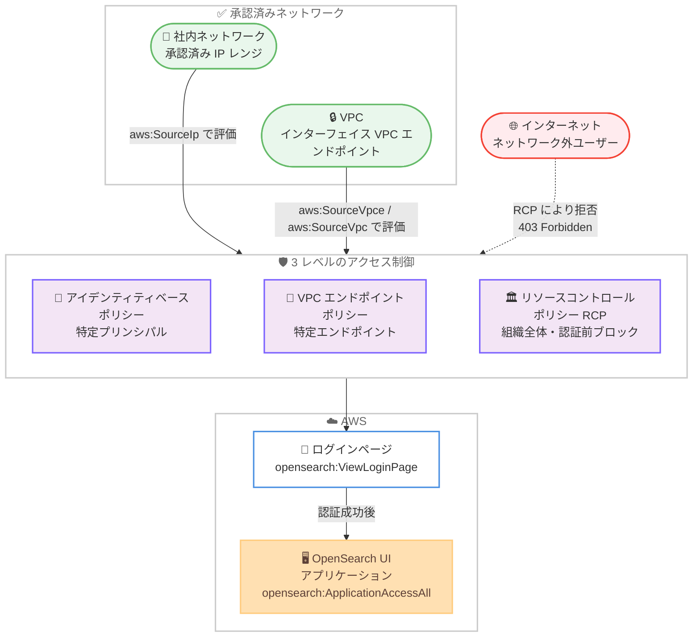

# Amazon OpenSearch Service - OpenSearch UI ネットワークアクセスコントロール

**リリース日**: 2026年8月6日
**サービス**: Amazon OpenSearch Service
**機能**: OpenSearch UI Network Access Control

📊 [このアップデートのインフォグラフィックを見る](https://takech9203.github.io/aws-news-summary/20260806-opensearch-ui-network-access-control.html)

## 概要

Amazon OpenSearch Service の OpenSearch UI アプリケーションがネットワークアクセスコントロールをサポートした。OpenSearch UI は、複数の AWS データソースを横断した検索、分析、統合オブザーバビリティを提供するフルマネージド Web サービスである。今回のアップデートにより、使い慣れた IAM 条件キー (aws:SourceVpce、aws:SourceVpc、aws:SourceIp) を使用して、OpenSearch UI アプリケーションへのアクセスを承認済みネットワークからのみに制限できるようになった。

アクセス制御は 3 つのレベルで適用できる。特定のプリンシパルを制限するアイデンティティベースポリシー、特定のエンドポイント経由で到達できるアプリケーションを制御する VPC エンドポイントポリシー、そして組織内のすべてのアカウントに一律で適用するリソースコントロールポリシー (RCP) である。特に RCP を使用すると、認証前の段階でネットワーク外のユーザーをブロックできるため、社内ネットワークや VPC の外部からはログインページにすら到達できないように構成できる。

標準の IAM リクエスト条件キーとポリシー言語をそのまま使用するため、サービス固有のポリシー形式を新たに学習する必要はなく、AWS 環境全体で一貫したデータ境界 (データペリメーター) を構築できる。

**アップデート前の課題**

- OpenSearch UI アプリケーションはデフォルトでパブリックエンドポイントを公開しており、認証と認可は適用されるものの、インターネット上の誰でもアプリケーションとその API に到達できた
- 社内ネットワークや VPC からのアクセスのみに制限する手段がなく、組織のデータ境界戦略に OpenSearch UI を組み込むことが難しかった
- 認証前のログインページへの到達自体を制御する仕組みがなかった

**アップデート後の改善**

- IAM 条件キー (aws:SourceVpce、aws:SourceVpc、aws:SourceIp) を使用して、承認済みネットワークからのアクセスのみに制限できるようになった
- アイデンティティベースポリシー、VPC エンドポイントポリシー、RCP の 3 レベルで、対象範囲に応じた柔軟な制御が可能になった
- RCP により opensearch:ViewLoginPage アクションを拒否することで、認証前にネットワーク外ユーザーをブロックし、ログインページへの到達自体を防げるようになった

## アーキテクチャ図



承認済みネットワーク (社内 IP レンジまたは VPC エンドポイント) からのリクエストのみが 3 レベルのポリシー評価を通過して OpenSearch UI に到達でき、ネットワーク外からのアクセスは RCP により認証前 (ログインページ表示前) にブロックされる。

## サービスアップデートの詳細

### 主要機能

1. **IAM 条件キーによるネットワークアクセス制限**
   - `aws:SourceVpce`: リクエストが到達したインターフェイス VPC エンドポイントの ID
   - `aws:SourceVpc`: リクエストが到達した VPC の ID
   - `aws:SourceIp`: VPC エンドポイント経由ではないリクエストのパブリック送信元 IP アドレス
   - OpenSearch UI が接続の信頼できるネットワークメタデータから条件キーを設定するため、標準の IAM ポリシー言語でそのまま参照できる

2. **3 レベルのアクセス制御**
   - **アイデンティティベースポリシー**: 特定のプリンシパル (ユーザーまたはロール) を制限。サインイン後のアクセスに適用
   - **VPC エンドポイントポリシー**: 特定の VPC エンドポイント経由で到達できるアプリケーションを、接続するプリンシパルに関係なく制御
   - **リソースコントロールポリシー (RCP)**: AWS Organizations の組織内すべてのアカウントに一律で適用。認証前のブロックが可能
   - 3 つの制御は組み合わせて多層防御 (defense in depth) を構成できる

3. **2 段階のアクセス評価**
   - `opensearch:ViewLoginPage`: サインイン前、ブラウザが最初にログインページをリクエストした時点で認可される。この時点でユーザーは AWS 認証情報を持たない匿名リクエストであるため、RCP で拒否するとネットワーク外ユーザーはログインページに到達できない。IAM 認証と IAM Identity Center 認証の両方に一律で適用される
   - `opensearch:ApplicationAccessAll`: サインイン後、アプリケーションとその API へのアクセスに対して認可される。アイデンティティベースポリシー、VPC エンドポイントポリシー、RCP のいずれでも制限可能
   - 両アクションはアプリケーションリソース ARN (`arn:aws:opensearch:{region}:{account-id}:application/{application-id}`) に対して認可される

## 技術仕様

### 制御レベルの比較

| 保護対象の範囲 | 制御方法 | ログインページのブロック |
|------|------|------|
| 単一のプリンシパル | アイデンティティベースポリシー | 不可 |
| 単一の VPC エンドポイント | VPC エンドポイントポリシー | 不可 |
| 組織内のすべてのアカウント | リソースコントロールポリシー (RCP) | 可能 |

### IAM 条件キー

| 条件キー | 内容 | 主な用途 |
|------|------|------|
| aws:SourceVpce | インターフェイス VPC エンドポイント ID | 特定エンドポイント経由のみ許可 |
| aws:SourceVpc | VPC ID | VPC 内のすべてのエンドポイントを許可 |
| aws:SourceIp | パブリック送信元 IP アドレス | 社内ネットワークの Egress IP レンジのみ許可 |

### RCP の例: VPC エンドポイント外からのアクセスを組織全体で拒否

```json
{
    "Version": "2012-10-17",
    "Statement": [
        {
            "Sid": "DenyOpenSearchUIAccessOutsideVpce",
            "Effect": "Deny",
            "Principal": "*",
            "Action": [
                "opensearch:ViewLoginPage",
                "opensearch:ApplicationAccessAll"
            ],
            "Resource": "arn:aws:opensearch:*:*:application/*",
            "Condition": {
                "StringNotEqualsIfExists": {
                    "aws:SourceVpce": "vpce-1a2b3c4d5e6f7g8h9"
                }
            }
        }
    ]
}
```

## 設定方法

### 前提条件

1. 特定のプリンシパルを制限する場合は、対象ユーザーまたはロールの IAM ポリシーを管理する権限が必要
2. RCP で組織全体に適用する場合は、すべての機能が有効化された AWS Organizations のメンバーアカウントであり、RCP を管理する権限が必要 (RCP は管理アカウントのリソースには影響しないため、アプリケーションはメンバーアカウントに配置する必要がある)
3. VPC エンドポイントに制限する場合は、事前に OpenSearch UI 用のインターフェイス VPC エンドポイントを作成しておく

### 手順 (RCP でログインページへのアクセスをブロックする例)

#### ステップ1: 承認済みネットワークパスの決定

ユーザーが接続する承認済みネットワークパスを確認し、対応する条件キーを選択する。インターフェイス VPC エンドポイントなら `aws:SourceVpce`、VPC 全体なら `aws:SourceVpc`、社内ネットワークの Egress IP レンジなら `aws:SourceIp` を使用する。

#### ステップ2: RCP の作成

```bash
aws organizations create-policy \
  --name DenyOpenSearchUIOffNetwork \
  --description "Denies OpenSearch UI access from outside the approved network" \
  --type RESOURCE_CONTROL_POLICY \
  --content file://policy.json
```

`opensearch:ViewLoginPage` と `opensearch:ApplicationAccessAll` を承認済みネットワーク以外から拒否するポリシー (policy.json) を、組織の管理アカウントまたは委任管理者アカウントから RCP として作成する。レスポンスに含まれる `p-` で始まるポリシー ID を次のステップで使用する。

#### ステップ3: ポリシーのアタッチ

```bash
aws organizations attach-policy \
  --policy-id p-example12345 \
  --target-id 111122223333
```

作成した RCP を組織ルート、組織単位 (OU)、またはアプリケーションを含むアカウントにアタッチする。最初は単一アカウントにアタッチして動作を確認し、その後に適用範囲を拡大することが推奨されている。

#### ステップ4: 動作確認

ポリシーの反映まで最大 1 分程度待機した後、承認済みネットワークの外部から `https://{application-endpoint}/_login/` にアクセスすると、ログインページの代わりに 403 Forbidden が返る。承認済みネットワーク内からは通常どおりログインページが表示され、サインインできる。パスなしのアプリケーション URL を開くと、ログインページのリクエスト前にサインインへリダイレクトされる場合があるため、確認には `/_login/` パスを使用する。

## メリット

### ビジネス面

- **データ境界の一貫性**: AWS 環境全体で使用している IAM 条件キーと同じ仕組みで OpenSearch UI にもネットワーク制限を適用でき、組織のデータペリメーター戦略に統合できる
- **コンプライアンス対応**: 社内ネットワークや専用線経由のアクセスのみを許可する要件を持つ組織でも OpenSearch UI を採用しやすくなる
- **組織全体のガバナンス**: RCP により、個々のアカウント管理者の設定に依存せず、組織内すべての OpenSearch UI アプリケーションに一律のネットワーク制限を強制できる

### 技術面

- **学習コスト不要**: サービス固有のポリシー形式ではなく、標準の IAM ポリシー言語と条件キー (aws:SourceVpce、aws:SourceVpc、aws:SourceIp) をそのまま使用できる
- **認証前ブロック**: RCP で `opensearch:ViewLoginPage` を拒否することで、ネットワーク外ユーザーはログインページにすら到達できず、攻撃対象領域を縮小できる
- **多層防御**: アイデンティティベースポリシー、VPC エンドポイントポリシー、RCP を組み合わせて、プリンシパル単位からアカウント全体まで段階的な防御を構成できる

## デメリット・制約事項

### 制限事項

- RCP は組織の管理アカウントのリソースには影響しないため、RCP でネットワーク制限を適用するにはアプリケーションをメンバーアカウントに配置する必要がある
- 認証前のブロック (`opensearch:ViewLoginPage` の拒否) が可能なのは RCP のみで、アイデンティティベースポリシーと VPC エンドポイントポリシーはサインイン後のアクセスにのみ適用される
- RCP の使用には、すべての機能が有効化された AWS Organizations が必要

### 考慮すべき点

- VPC エンドポイント経由のリクエストには `aws:SourceIp` が設定されないため、プライベート (VPC エンドポイント) とパブリック (IP 制限) の両方のアクセスパスを使用する場合は、両方の条件キーを考慮したポリシーを記述しないと正当な VPC エンドポイントトラフィックを誤って拒否する可能性がある
- RCP の明示的な Deny はアイデンティティベースポリシーで上書きできないため、本番適用前に非本番アプリケーションでテストすることが推奨されている
- RCP の変更が反映されるまで最大 1 分程度かかる場合がある
- IAM Identity Center 認証のアプリケーションで、既に有効なセッションを持つユーザーのリクエストも制限するには、VPC エンドポイント経由でのアクセスを構成する必要がある
- CloudTrail と IAM Access Analyzer を使用して、ネットワーク条件がアクセスに与える影響を確認することが推奨されている

## ユースケース

### ユースケース1: 組織全体で VPC エンドポイント経由のアクセスのみを許可

**シナリオ**: 金融機関など厳格なセキュリティ要件を持つ組織で、すべての OpenSearch UI アプリケーションへのアクセスを AWS PrivateLink 経由に限定し、インターネットからの到達を完全に遮断したい。

**実装例**:
```json
{
    "Version": "2012-10-17",
    "Statement": [
        {
            "Sid": "DenyOpenSearchUIAccessOutsideVpce",
            "Effect": "Deny",
            "Principal": "*",
            "Action": [
                "opensearch:ViewLoginPage",
                "opensearch:ApplicationAccessAll"
            ],
            "Resource": "arn:aws:opensearch:*:*:application/*",
            "Condition": {
                "StringNotEqualsIfExists": {
                    "aws:SourceVpce": "vpce-1a2b3c4d5e6f7g8h9"
                }
            }
        }
    ]
}
```

**効果**: 組織内すべてのアカウントの OpenSearch UI アプリケーションが、指定した VPC エンドポイント経由でのみアクセス可能になる。ネットワーク外のユーザーは認証前にブロックされ、ログインページにも到達できない。

### ユースケース2: 社内ネットワークの IP レンジからのアクセスのみを許可

**シナリオ**: VPN や専用線を経由した社内ネットワークからのみ OpenSearch UI のダッシュボードを利用させたい。VPC エンドポイントは使用せず、社内ネットワークのパブリック Egress IP レンジで制限する。

**実装例**:
```json
{
    "Version": "2012-10-17",
    "Statement": [
        {
            "Sid": "DenyOpenSearchUIAccessOutsideCorpNetwork",
            "Effect": "Deny",
            "Principal": "*",
            "Action": [
                "opensearch:ViewLoginPage",
                "opensearch:ApplicationAccessAll"
            ],
            "Resource": "arn:aws:opensearch:*:*:application/*",
            "Condition": {
                "NotIpAddress": {
                    "aws:SourceIp": [
                        "203.0.113.0/24",
                        "198.51.100.0/24"
                    ]
                }
            }
        }
    ]
}
```

**効果**: 社内ネットワークの承認済み IP レンジ以外からのアクセスが組織全体で拒否され、リモートワーク環境からは VPN 接続を経由した場合のみダッシュボードにアクセスできる。

### ユースケース3: 特定の分析チームのロールを VPC エンドポイント経由に限定

**シナリオ**: 機密性の高いログデータを扱う分析チームのロールについてのみ、OpenSearch UI へのアクセスを VPC エンドポイント経由に限定したい。他のチームには影響を与えず、段階的にネットワーク制限を導入する。

**実装例**:
```bash
# アイデンティティベースポリシーを作成
aws iam create-policy \
  --policy-name DenyOpenSearchUIOutsideVpce \
  --description "Denies OpenSearch UI access outside the approved VPC endpoint" \
  --policy-document file://policy.json

# 分析チームのロールにアタッチ
aws iam attach-role-policy \
  --role-name OpenSearchUIUserRole \
  --policy-arn arn:aws:iam::111122223333:policy/DenyOpenSearchUIOutsideVpce
```

**効果**: 対象ロールのユーザーは、承認済み VPC エンドポイント以外からアプリケーションにアクセスすると 403 Forbidden となる。他のプリンシパルには影響しないため、影響範囲を限定して段階的に制限を展開できる。

## 料金

ネットワークアクセスコントロール機能自体に追加料金は発生しない。IAM ポリシー、VPC エンドポイントポリシー、RCP の使用は無料である。ただし、インターフェイス VPC エンドポイント (AWS PrivateLink) を使用する場合は、エンドポイントの時間料金とデータ処理料金が別途発生する。

## 利用可能リージョン

OpenSearch UI が利用可能なすべての AWS リージョンで提供される。

## 関連サービス・機能

- **AWS Organizations (RCP)**: リソースコントロールポリシーにより、組織内すべてのアカウントの OpenSearch UI アプリケーションに一律のネットワーク制限を強制できる
- **AWS PrivateLink (インターフェイス VPC エンドポイント)**: OpenSearch UI へのプライベート接続を提供し、aws:SourceVpce / aws:SourceVpc 条件キーによる制限の前提となる
- **AWS IAM / IAM Identity Center**: OpenSearch UI の認証を担い、ネットワーク制限は両認証方式に対して一律に適用される
- **AWS CloudTrail / IAM Access Analyzer**: ネットワーク条件がアクセスに与える影響のモニタリングとレビューに使用できる

## 参考リンク

- 📊 [インフォグラフィック](https://takech9203.github.io/aws-news-summary/20260806-opensearch-ui-network-access-control.html)
- [公式発表 (What's New)](https://aws.amazon.com/about-aws/whats-new/2026/08/opensearch-ui-network-access-control)
- [ドキュメント: Restricting network access to OpenSearch UI applications](https://docs.aws.amazon.com/opensearch-service/latest/developerguide/application-network-access.html)
- [ドキュメント: Network access control configuration reference](https://docs.aws.amazon.com/opensearch-service/latest/developerguide/application-network-access-reference.html)
- [ドキュメント: Resource control policies (RCPs)](https://docs.aws.amazon.com/organizations/latest/userguide/orgs_manage_policies_rcps.html)
- [Amazon OpenSearch Service 製品ページ](https://aws.amazon.com/opensearch-service/)

## まとめ

OpenSearch UI アプリケーションに標準の IAM 条件キーによるネットワークアクセスコントロールが追加され、承認済みネットワークからのみアクセスを許可するデータ境界を構築できるようになった。特に RCP による認証前ブロックは、ログインページへの到達自体を防ぐ強力な制御であり、厳格なセキュリティ要件を持つ組織にとって OpenSearch UI 採用の障壁を取り除くアップデートである。パブリックエンドポイントで OpenSearch UI を運用している場合は、まず非本番アプリケーションで RCP をテストし、段階的に組織全体へ展開することを推奨する。
