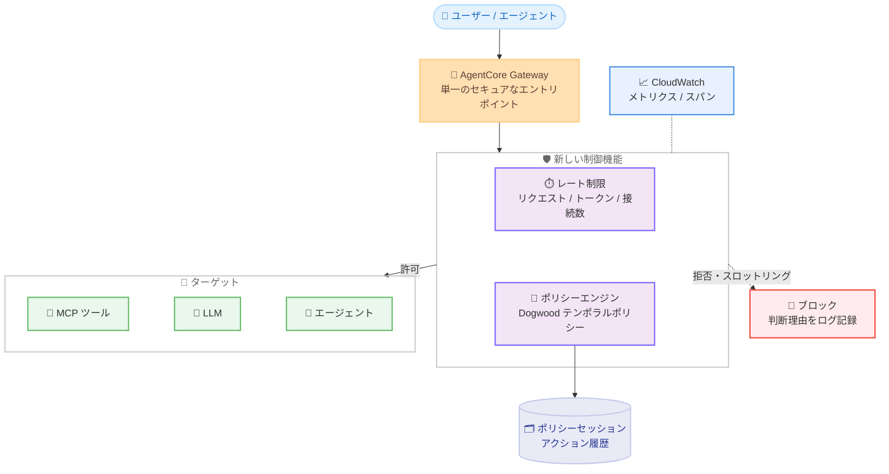

# Amazon Bedrock AgentCore - テンポラルポリシーとレート制限

**リリース日**: 2026 年 8 月 6 日
**サービス**: Amazon Bedrock AgentCore
**機能**: テンポラルポリシー (Temporal Policies) と AI トラフィックのレート制限 (Rate Limiting)

📊 [このアップデートのインフォグラフィックを見る](https://takech9203.github.io/aws-news-summary/20260806-temporal-policies-agentcore.html)

## 概要

AWS は Amazon Bedrock AgentCore に 2 つの新しい制御機能、「ステートフルなエージェント認可のためのテンポラルポリシー」と「AI トラフィックのレート制限」を発表しました。どちらも AgentCore Gateway のインフラストラクチャレイヤーで強制されるため、エージェントのコードを変更することなく、組織全体のエージェントに一貫したガバナンスを適用できます。

テンポラルポリシーは、セッション内でエージェントが過去に実行したアクションの履歴に基づいて各リクエストを評価する、ステートフルな認可ルールです。「単体では安全なツール呼び出しでも、直前の操作との組み合わせでは有害になり得る」という AI エージェント特有のリスクに対応します。ポリシーは Cedar 互換のオープンソースポリシー言語「Dogwood」(Apache 2.0 ライセンス) で記述し、ワークフローの順序強制、過去の呼び出し結果と引数の一致要求、特権操作前の人間による承認の要求、データ鮮度の強制などを宣言的に表現できます。

レート制限は、Gateway に接続されたツール・モデル・エージェントに対するトラフィックを、ユーザー単位またはグループ単位で制御する機能です。OAuth (JWT クレーム) または AWS IAM のアイデンティティでスコープを指定し、リクエスト数、推論ターゲットのトークン数、同時接続数の 3 つのディメンションで上限を設定できます。エージェントの再アーキテクチャは不要で、それぞれの機能を独立して導入できます。

**アップデート前の課題**

従来の AgentCore ポリシーはステートレスであり、各リクエストを単独で評価していました。

- 各 API 呼び出しは単体では正当でも、シーケンス全体として有害な操作 (例: 承認されていない口座への送金、承認しきい値未満の注文の連続実行による予算超過) を検出できなかった
- 「承認後にのみ実行を許可」「一定回数以上の実行をブロック」などのセッション横断的なルールは、エージェントやツールのコード内でイベント追跡ロジックとして独自実装する必要があった
- 夜間のリトライループなどによるトークン予算の浪費や、長時間の低トラフィックセッションによるリソース占有を、ユーザー単位で制御する仕組みがなかった

**アップデート後の改善**

- セッション内のアクション履歴を考慮した認可判断 (テンポラルポリシー) を、エージェントコードの外側である Gateway レイヤーで宣言的に定義・強制できるようになった
- ポリシー判断は決定論的でデフォルト拒否、完全なコンテキスト付きでログに記録されるため、監査担当者はブロック理由を確認できる
- ユーザー・チーム・ツール・モデルごとに異なる上限で、リクエスト数 / トークン数 / 同時接続数のレート制限を設定でき、コスト暴走や下流サービスの過負荷を防止できるようになった

## アーキテクチャ図



すべてのエージェントトラフィックは AgentCore Gateway を通過し、レート制限とテンポラルポリシーがツール・モデル・エージェントへの到達前に評価されます。テンポラルポリシーはポリシーセッションに記録されたアクション履歴を参照して判断を下し、判断結果は CloudWatch に記録されます。

## サービスアップデートの詳細

### 主要機能

1. **テンポラルポリシー (セッション対応のステートフル認可)**
   - セッション内で「以前に何が起きたか」に基づいて `permit` / `forbid` を判断するポリシー。承認イベントの存在確認、実行回数の上限、累積金額のしきい値管理などをポリシーとして表現できる
   - 過去のイベントの入出力フィールドと現在のリクエストを相関付け可能。例えば「以前の承認アクションが返した口座番号と、現在の送金リクエストの口座番号が一致する場合のみ許可」というルールを記述できる
   - Gateway レイヤーで強制されるため、エージェントはポリシーロジックを参照できず、プロンプト操作などで回避することができない
   - 判断は決定論的・デフォルト拒否で、完全なコンテキスト付きでログに記録される
   - `LOG_ONLY` モードで動作を観察してから `ENFORCE` に昇格させる段階的導入が可能

2. **Dogwood ポリシー言語 (オープンソース)**
   - AI エージェント向けに設計された新しいオープンソースポリシー言語。Cedar を基盤とし、すべての既存 Cedar ポリシーと互換 (有効な Cedar ポリシーはそのまま有効な Dogwood ポリシー)
   - テンポラル演算子を提供: `formerly within` (ウィンドウ内に一致イベントが発生済み)、`since within` (アンカーイベント以降の条件維持)、集計の `count` と `sum`
   - 入力ベース条件、テンポラル条件、情報プロバイダー (Guardrails のコンテンツ安全性スコアなど) ベースの条件を 1 つのポリシー内で組み合わせ可能
   - 仕様とリファレンス実装が Apache 2.0 ライセンスで公開 (github.com/dogwood-policy)

3. **Gateway レート制限**
   - ディメンションキー (1〜10 個) でトラフィックをバケットにグループ化し、エントリごとに許可レートを設定
   - 3 つのメトリクス: **リクエスト数** (リトライループ対策)、**トークン数** (推論ターゲットの TPM 制御)、**同時接続数** (長時間セッションの抑制と下流サービス保護)
   - 期間は秒単位 (`second`) と分単位 (`minute`) をサポート
   - OAuth の JWT クレーム (`$.context.jwt.<claim>`) や IAM プリンシパル (`$.context.iam.principal`) によるユーザー・グループ単位のスコープ指定
   - レートを 0 に設定することで特定の呼び出し元をブロック可能
   - エージェントコードの変更不要。設定は 30 秒以内にデータプレーンへ反映

## 技術仕様

### テンポラルポリシーの仕様

| 項目 | 詳細 |
|------|------|
| ポリシー言語 | Dogwood (Cedar 互換、オープンソース、Apache 2.0) |
| 認可モデル | デフォルト拒否。`permit` が適用され、かつ `forbid` が上書きしない場合のみ許可 |
| セッション管理 | `x-amzn-bedrock-agentcore-policy-session-id` ヘッダーでセッション ID を指定。省略時は Gateway が生成しレスポンスヘッダーで返却 |
| イベント記録 | 許可され完了したアクションは `response` イベント、拒否されたアクションは `error` イベントとして記録 |
| ポリシー変更時の挙動 | テンポラルポリシーの追加・更新でアクティブセッションが無効化。無効化されたセッションの再利用は HTTP 409 `ConflictException` |
| 実行モード | `LOG_ONLY` (観察のみ) と `ENFORCE` (強制) |
| クォータ | ポリシーエンジンあたりテンポラルポリシー 25 件、ポリシーあたりテンポラル演算子 3 個、時間ウィンドウ最大 24 時間 |
| 可観測性 | CloudWatch `AWS/Bedrock-AgentCore` 名前空間の `TemporalLatency` メトリクス、`aws.agentcore.policy.temporal.*` スパン属性 |

### レート制限の仕様

| 項目 | 詳細 |
|------|------|
| メトリクスタイプ | `requests` (リクエスト数)、`tokens` (トークン数)、`connections` (同時接続数) |
| 期間 | `second` / `minute` |
| ディメンションキー | `targetName`、`toolName`、`qualifiedModelId`、`$.context.jwt.<claim>`、`$.context.iam.principal`、`$.context.iam.sourceIdentity` |
| デフォルト値 `*` | 全値へのキャッチオール。より具体的なエントリが優先 (最長一致)。`*` は値ごとに独立したバケットを作成 |
| レート値の範囲 | 0〜10,000,000 (0 は該当トラフィックを全ブロック) |
| クォータ | Gateway あたりレート制限 50 件、レート制限あたりエントリ 1,000 件、ディメンションキー 10 個 |
| 評価ロジック | すべてのアクティブなレート制限を AND 評価。顧客定義の制限とサービス管理制限の小さい方が有効レート |
| 反映時間 | 30 秒以内 |
| フェイル動作 | フェイルオープン (レート制限サービスが利用不可、またはディメンション解決不可の場合はリクエストを許可) |

### API変更履歴

| 日付 | サービス | 変更内容 |
|------|----------|----------|
| 2026/08/06 | [bedrock-agentcore-control](https://awsapichanges.com/archive/changes/32fa45-bedrock-agentcore-control.html) | 12 new 8 updated api methods - Gateway レート制限管理 API (`create-gateway-rate-limit`、`batch-put-gateway-rate-limits` など) を含むコントロールプレーンの更新 |
| 2026/08/06 | [bedrock-agentcore](https://awsapichanges.com/archive/changes/32fa45-bedrock-agentcore.html) | 1 new api methods - データプレーンの更新 |

### Dogwood テンポラルポリシーの例

以下は「直前 1 時間以内に、同じ銘柄・株数に対する承認が完了している場合のみ売却を許可する」ポリシーです。

```
permit ( principal, action == AgentCore::Action::"SellShares", resource )
when temporal {
    formerly within 1h AgentCore::Action::"ApproveSale"::response{
        eventResource:   resource,
        input.stock:     context.input.stock,
        input.shares:    context.input.shares,
        output.approved: true
    }
};
```

## 設定方法

### 前提条件

1. AgentCore Gateway が作成済みであること
2. テンポラルポリシーの場合: ポリシーエンジンを作成し、Gateway に関連付けていること
3. レート制限で JWT クレームを使用する場合: Gateway のインバウンド認証 (OAuth) が構成済みであること。IAM ディメンションは SigV4 認証リクエストでのみ利用可能
4. `bedrock-agentcore-control` に対する適切な IAM 権限

### 手順

#### ステップ1: レート制限の作成 (呼び出し元ごとの RPM 制限)

```bash
aws bedrock-agentcore-control create-gateway-rate-limit \
    --gateway-identifier my-gateway-abc1234567 \
    --dimension-keys '["$.context.jwt.sub"]' \
    --description "Per-caller RPM by subscription tier" \
    --entries '[
        {
            "dimensions": {"$.context.jwt.sub": "premium-user-001"},
            "requests": [{"rate": 300, "period": "minute"}]
        },
        {
            "dimensions": {"$.context.jwt.sub": "*"},
            "requests": [{"rate": 60, "period": "minute"}]
        }
    ]'
```

JWT の `sub` クレームをディメンションキーとして、特定のプレミアムユーザーには毎分 300 リクエスト、その他の各ユーザーには毎分 60 リクエストの上限を設定します。`*` エントリはユーザーごとに独立したバケットを作成します。

#### ステップ2: トークンレート制限の作成 (モデル・ユーザー単位の TPM 制御)

```bash
aws bedrock-agentcore-control create-gateway-rate-limit \
    --gateway-identifier my-gateway-abc1234567 \
    --dimension-keys '["targetName", "qualifiedModelId", "$.context.jwt.sub"]' \
    --entries '[
        {
            "dimensions": {"targetName": "my-inference-target",
                           "qualifiedModelId": "anthropic.claude-3-sonnet-20240229-v1:0",
                           "$.context.jwt.sub": "*"},
            "requests": [{"rate": 100, "period": "minute"}],
            "tokens":   [{"rate": 50000, "period": "minute"}]
        },
        {
            "dimensions": {"targetName": "*", "qualifiedModelId": "*",
                           "$.context.jwt.sub": "*"},
            "requests": [{"rate": 30, "period": "minute"}],
            "tokens":   [{"rate": 10000, "period": "minute"}]
        }
    ]'
```

ターゲット、モデル ID、呼び出し元の 3 ディメンションで、特定の推論ターゲット・モデルの組み合わせに対しユーザーごとに毎分 100 リクエスト・50,000 トークン、その他の組み合わせには毎分 30 リクエスト・10,000 トークンの予算を設定します。

#### ステップ3: テンポラルポリシーの作成と適用

1. ポリシーエンジンに Dogwood でテンポラルポリシーを作成します (前述のポリシー例を参照)。自然言語 (英語プロンプト) からポリシーを生成し、ツールスキーマに対する検証と自動推論による安全性チェックを行うことも可能です
2. まず `LOG_ONLY` モードで動作を観察し、意図通りの判断が行われることを確認してから `ENFORCE` モードに昇格します
3. クライアントは各リクエストで `x-amzn-bedrock-agentcore-policy-session-id` ヘッダーにセッション ID を指定します。省略した場合、Gateway がセッションを作成しレスポンスヘッダーで ID を返すので、以降のリクエストで再利用します

## メリット

### ビジネス面

- **リスクの高いエージェント動作の抑止**: 承認前の特権操作や累積予算超過など、単一リクエストの検査では検出できないパターンをインフラレイヤーでブロックし、エージェント本番展開の最大の障壁であるセキュリティ懸念を軽減
- **コスト暴走の防止**: リトライループや長時間セッションによるトークン・接続の浪費をユーザー単位で制御し、エージェント運用コストの予見性を向上
- **監査・コンプライアンス対応**: すべてのポリシー判断が完全なコンテキスト付きでログに記録され、セキュリティ・コンプライアンスチームが挙動を検証可能

### 技術面

- **エージェントコードからのセキュリティ分離**: イベント追跡や制限ロジックをエージェント / ツールコードに実装する必要がなく、Gateway で一元的・決定論的に強制。エージェントの実装方法に依存しない
- **Cedar 互換による段階的導入**: 既存の Cedar ポリシーは変更なしでそのまま動作し、セッション履歴が必要なルールにのみテンポラル条件を追加できる
- **柔軟なディメンション設計**: ターゲット・ツール・モデル・JWT クレーム・IAM プリンシパルを最大 10 キーまで組み合わせ、共有バケットと個別バケットを使い分けられる

## デメリット・制約事項

### 制限事項

- テンポラルポリシーはポリシーエンジンあたり 25 件、ポリシーあたりテンポラル演算子 3 個、時間ウィンドウ最大 24 時間の制限がある
- テンポラルポリシーの追加・更新はアクティブなポリシーセッションを無効化し、次のリクエストは HTTP 409 で失敗する (新しいセッションの開始が必要)
- テンポラル履歴はセッション単位でスコープされ、セッション ID は呼び出し元が指定するため、`count` ベースの制限はセッション内でのみ有効。新しいセッションを開始するとカウントはリセットされる (呼び出し元全体の制限には Gateway レート制限を使用)
- レート制限はデフォルトでフェイルオープン。レート制限サービスが利用不可の場合やディメンションを解決できない場合、リクエストは許可されるため、単独のセキュリティ境界として依存すべきではない
- レート制限の `dimensionKeys` は作成後に変更不可 (変更には削除と再作成が必要)

### 考慮すべき点

- 自己参照的なテンポラル条件 (認可対象と同じアクションを参照する条件) では、現在のリクエスト自身のイベントも評価に含まれる
- 先行アクションが拒否された場合は `error` イベントとして記録され、`response` 条件にはマッチしない。テンポラルポリシーが依存する先行アクション自体が許可されるようにポリシーを設計する必要がある
- 先行アクションのレスポンスに依存するリクエストは、先行アクションの完了後に発行する必要がある (履歴の記録順序とワークフローの整合性)
- 高カーディナリティな JWT クレーム (`jti`、`nonce` など) をディメンションキーに使うとバケット数が無制限に増加するため、`sub`、`team`、`tier` などの安定した識別子を使用する
- 顧客定義のレート制限はサービス管理制限を超えられない (有効レートは両者の最小値)

## ユースケース

### ユースケース1: 金融取引の承認ワークフロー強制

**シナリオ**: 株式売買エージェントで、承認担当者による承認が完了した取引のみを実行させたい。単体では正当な API 呼び出しでも、承認と異なる銘柄・株数での実行を防ぎたい。

**実装例**:
```
permit ( principal, action == AgentCore::Action::"SellShares", resource )
when temporal {
    formerly within 1h AgentCore::Action::"ApproveSale"::response{
        eventResource:   resource,
        input.stock:     context.input.stock,
        input.shares:    context.input.shares,
        output.approved: true
    }
};
```

**効果**: 承認イベントの出力と実行リクエストの入力の一致が Gateway レイヤーで検証され、「誤った口座への送金」のようなシーケンス起因の事故を決定論的に防止できる。

### ユースケース2: セッション内予算のしきい値管理

**シナリオ**: 購買エージェントが、1 件あたりは承認しきい値未満の注文を繰り返し、合計で予算を大幅に超過するリスクを防ぎたい。

**実装例**:
```
Dogwood の sum 集計演算子を使用し、セッション内の購入アクションの
金額合計が予算に達した時点で以降の購入を forbid するポリシーを定義
```

**効果**: 個別注文の上限チェックでは検出できない累積的な予算超過を、エージェントコードの変更なしにポリシーとして強制できる。

### ユースケース3: SaaS 型エージェントプラットフォームのテナント別クォータ

**シナリオ**: マルチテナントのエージェントプラットフォームで、サブスクリプション階層に応じたリクエスト・トークン予算を適用し、暴走したリトライループや長時間セッションによる下流サービスへの影響を防ぎたい。

**実装例**:
```bash
aws bedrock-agentcore-control batch-put-gateway-rate-limits \
    --gateway-identifier my-gateway-abc1234567 \
    --rate-limits '[
        {
            "dimensionKeys": ["$.context.jwt.tier", "$.context.jwt.sub"],
            "description": "Tier-based per-user quota",
            "entries": [
                {"dimensions": {"$.context.jwt.tier": "premium", "$.context.jwt.sub": "*"},
                 "requests": [{"rate": 300, "period": "minute"}]},
                {"dimensions": {"$.context.jwt.tier": "*", "$.context.jwt.sub": "*"},
                 "requests": [{"rate": 60, "period": "minute"}]}
            ]
        }
    ]'
```

**効果**: JWT クレームに基づく階層別・ユーザー別の独立したレートバケットにより、公平なリソース配分とコスト管理を実現。悪質な呼び出し元はレート 0 で即時ブロック可能。

## 料金

What's New および AWS Blog の発表時点では、本機能固有の料金詳細は公開されていません。AgentCore は前払いや最低料金のない消費ベースの料金体系を採用しており、詳細は [AgentCore 料金ページ](https://aws.amazon.com/bedrock/agentcore/pricing/)を参照してください。

## 利用可能リージョン

テンポラルポリシーは以下のリージョンで利用可能です (公式ドキュメントより)。

- 米国東部 (バージニア北部、オハイオ)
- 米国西部 (オレゴン)
- カナダ (中部)
- 南米 (サンパウロ)
- 欧州 (フランクフルト、アイルランド、ロンドン、ストックホルム、パリ、スペイン)
- アジアパシフィック (東京、ソウル、シンガポール、シドニー、ムンバイ)

アジアパシフィック (タイ、マレーシア) および欧州 (ミラノ) では利用できません。Gateway レート制限を含む最新のリージョン対応状況は[公式ドキュメント](https://docs.aws.amazon.com/bedrock-agentcore/latest/devguide/what-is-bedrock-agentcore.html)を確認してください。

## 関連サービス・機能

- **AgentCore Gateway**: 本アップデートの両機能の強制ポイント。エージェント・ツール・LLM への単一のセキュアなエントリポイントとして、すべてのエージェントトラフィックを仲介する
- **Policy in AgentCore**: 従来からのステートレスな Cedar ポリシーによる決定論的アクセス制御。テンポラルポリシーはこの拡張として位置付けられる
- **AgentCore Identity**: OAuth / IAM ベースのアイデンティティ管理。レート制限のディメンション (JWT クレーム、IAM プリンシパル) の基盤となる
- **Amazon Bedrock Guardrails**: Dogwood ポリシーの情報プロバイダーとして、コンテンツ安全性スコアやプロンプト攻撃スコアをポリシー評価時に参照可能
- **Amazon CloudWatch**: ポリシー評価メトリクス (`TemporalLatency` など) とスパンデータによるポリシー判断・レート制限の可観測性を提供

## 参考リンク

- 📊 [インフォグラフィック](https://takech9203.github.io/aws-news-summary/20260806-temporal-policies-agentcore.html)
- [公式発表 (What's New)](https://aws.amazon.com/about-aws/whats-new/2026/08/temporal-policies-agentcore/)
- [AWS Blog: Control agent behaviors and cost beyond a single action](https://aws.amazon.com/blogs/machine-learning/control-agent-behaviors-and-cost-beyond-a-single-action-new-capabilities-in-amazon-bedrock-agentcore/)
- [ドキュメント: Temporal policies](https://docs.aws.amazon.com/bedrock-agentcore/latest/devguide/policy-temporal.html)
- [ドキュメント: Add rate limits to a gateway](https://docs.aws.amazon.com/bedrock-agentcore/latest/devguide/gateway-rate-limits.html)
- [Dogwood Policy (オープンソース仕様・リファレンス実装)](https://github.com/dogwood-policy)
- [料金ページ](https://aws.amazon.com/bedrock/agentcore/pricing/)

## まとめ

本アップデートにより、AI エージェントのセキュリティ制御が「単一リクエストの検査」から「セッション履歴を考慮したステートフルな認可」へと進化し、コスト制御もユーザー単位のきめ細かなレート制限として利用可能になりました。どちらも Gateway レイヤーで強制されるためエージェントコードの変更や再アーキテクチャは不要であり、既存の Cedar ポリシーとの互換性も維持されます。エージェントを本番運用している、または計画している場合は、まず `LOG_ONLY` モードでテンポラルポリシーの評価を開始し、あわせて主要ユーザー・モデルに対するレート制限の導入を検討することを推奨します。
