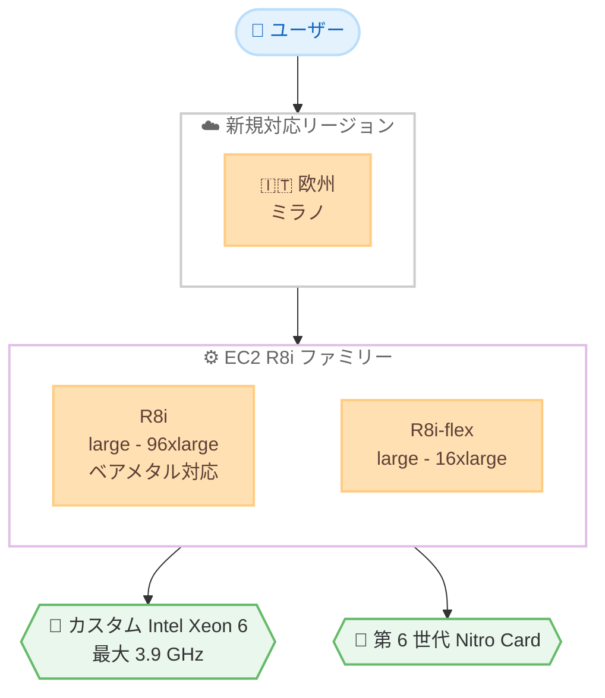

# Amazon EC2 - R8i および R8i-flex インスタンスの欧州 (ミラノ) リージョン提供開始

**リリース日**: 2026 年 8 月 7 日
**サービス**: Amazon EC2
**機能**: R8i および R8i-flex インスタンス (メモリ最適化)

📊 [このアップデートのインフォグラフィックを見る](https://takech9203.github.io/aws-news-summary/20260807-amazon-ec2-r8i-r8i-flex.html)

## 概要

Amazon EC2 の R8i および R8i-flex インスタンスが、新たに欧州 (ミラノ) リージョンで利用可能になりました。これらのインスタンスは、AWS 専用にカスタマイズされた Intel Xeon 6 プロセッサを搭載したメモリ最適化インスタンスであり、同等の Intel ベースクラウドプロセッサの中で最高クラスのパフォーマンスとメモリ帯域幅を提供します。

R8i インスタンスは、前世代の Intel ベースインスタンスと比較して最大 15% 優れた価格性能比と 2.5 倍のメモリ帯域幅を提供します。R7i インスタンスと比較すると 20% 高いパフォーマンスを実現し、ワークロード別では PostgreSQL データベースで最大 30% 高速、NGINX ウェブアプリケーションで最大 60% 高速、AI ディープラーニングのレコメンデーションモデルで最大 40% 高速なパフォーマンスを発揮します。

R8i-flex は AWS 初のメモリ最適化 Flex インスタンスであり、すべてのコンピューティングリソースを常時フル活用しないメモリ集約型ワークロードに対して、コスト効率の高い選択肢を提供します。今回の提供拡大により、イタリアおよび周辺地域でデータレジデンシー要件を持つお客様も、最新世代のメモリ最適化インスタンスを利用できるようになりました。

**アップデート前の課題**

- 欧州 (ミラノ) リージョンでは、最新世代のメモリ最適化インスタンス R8i / R8i-flex を利用できなかった
- 前世代の R7i インスタンスでは、メモリ帯域幅やコアあたりのパフォーマンスに制約があった
- コンピューティングリソースを常時フル活用しないワークロードに対して、コスト最適化されたメモリ最適化インスタンスの選択肢が限られていた

**アップデート後の改善**

- 欧州 (ミラノ) リージョンで R8i / R8i-flex を利用可能になった
- 前世代比で最大 15% 優れた価格性能比、2.5 倍のメモリ帯域幅を利用できるようになった
- R8i-flex により、リソースをフル活用しないワークロード向けにコスト効率の高い選択肢が追加された

## アーキテクチャ図

新規対応した欧州 (ミラノ) リージョンで、R8i / R8i-flex インスタンスがカスタム Intel Xeon 6 プロセッサと第 6 世代 Nitro Card を基盤として利用できることを示しています。

## サービスアップデートの詳細

### 主要機能

1. **カスタム Intel Xeon 6 プロセッサ**
   - AWS 専用にカスタマイズされた Intel Xeon 6 プロセッサを搭載
   - 全コアターボ周波数は最大 3.9 GHz (前世代の 3.2 GHz から向上)
   - L3 キャッシュは前世代比で 4.6 倍に拡大
   - Intel AMX の FP16 データ型をサポートし、AI/ML ワークロードに対応

2. **R8i インスタンス**
   - large から 96xlarge まで、ベアメタル 2 サイズを含む 13 サイズを提供
   - 新しい 96xlarge サイズは 384 vCPU、3,072 GiB メモリを提供
   - SAP 認定済みで、142,100 aSAPS はオンプレミスおよびクラウドの同等マシンの中で最高値
   - 大規模なサイズや継続的な高 CPU 使用率を必要とするワークロードに最適

3. **R8i-flex インスタンス**
   - AWS 初のメモリ最適化 Flex インスタンス
   - large から 16xlarge までのサイズを提供
   - CPU パフォーマンスを 95% の時間で最大限まで引き出せる
   - すべてのコンピューティングリソースを常時フル活用しないワークロードに最適

4. **第 6 世代 AWS Nitro Card**
   - 前世代比で最大 2 倍のネットワークおよび EBS 帯域幅を提供
   - ネットワークと Amazon EBS 帯域幅の間で 25% 単位の割り当て調整が可能

## 技術仕様

### インスタンスサイズと構成

| 項目 | R8i | R8i-flex |
|------|-----|----------|
| サイズ範囲 | large - 96xlarge (13 サイズ) | large - 16xlarge |
| 最小構成 | 2 vCPU / 16 GiB | 2 vCPU / 16 GiB |
| 最大構成 | 384 vCPU / 3,072 GiB (96xlarge) | 64 vCPU / 512 GiB (16xlarge) |
| ネットワーク帯域幅 | 最大 100 Gbps | 最大 30 Gbps |
| EBS 帯域幅 | 最大 80 Gbps | 最大 20 Gbps |
| ベアメタル | あり (metal-48xl、metal-96xl) | なし |

### R7i との比較

| 項目 | 詳細 |
|------|------|
| 価格性能比 | 前世代比で最大 15% 向上 |
| パフォーマンス | R7i 比で 20% 向上 |
| メモリ帯域幅 | 前世代比で 2.5 倍 |
| PostgreSQL | R7i 比で最大 30% 高速 |
| NGINX | R7i 比で最大 60% 高速 |
| AI ディープラーニング推論 | R7i 比で最大 40% 高速 |

## メリット

### ビジネス面

- **コスト最適化**: 前世代比で最大 15% 優れた価格性能比により、同一ワークロードの実行コストを削減できます
- **Flex によるコスト効率**: R8i-flex は、リソースをフル活用しないワークロードに対してコスト効率の高い選択肢を提供します
- **イタリアでのデータレジデンシー対応**: 欧州 (ミラノ) リージョンでデータレジデンシー要件を満たしつつ、最新世代インスタンスを利用できます

### 技術面

- **メモリ帯域幅の向上**: 2.5 倍のメモリ帯域幅により、メモリ集約型ワークロードのパフォーマンスが向上します
- **大規模スケール対応**: 96xlarge サイズ (384 vCPU、3,072 GiB) により、より大規模なワークロードを単一インスタンスで実行できます
- **SAP ワークロード対応**: SAP 認定済み (142,100 aSAPS) で、ミッションクリティカルな SAP HANA などの運用に適しています

## デメリット・制約事項

### 制限事項

- R8i-flex はベアメタルサイズを提供していません
- R8i-flex は 16xlarge が最大サイズであり、それ以上の規模には R8i が必要です
- 継続的に高い CPU 使用率が求められるワークロードには R8i-flex は適しません

### 考慮すべき点

- ワークロードのリソース使用パターンに応じて、R8i と R8i-flex を適切に選択する必要があります
- リージョンによって提供されるインスタンスサイズが異なる場合があるため、利用前に確認が必要です

## ユースケース

### ユースケース1: 大規模インメモリデータベース

**シナリオ**: SAP HANA や Redis などのインメモリデータベースを欧州 (ミラノ) リージョンで運用する場合

**効果**: 2.5 倍のメモリ帯域幅と最大 3,072 GiB のメモリにより、大規模なインメモリデータセットを高速に処理できます

### ユースケース2: コスト効率重視のウェブスケールキャッシュ

**シナリオ**: 常時フルにリソースを使わない分散キャッシュや中規模のインメモリ分析ワークロード

**効果**: R8i-flex を使用することで、コスト効率を高めつつ、必要時には CPU パフォーマンスを最大限に引き出せます

### ユースケース3: ミッションクリティカルな SAP ワークロード

**シナリオ**: SAP 認定インスタンスが必要な基幹業務システムをイタリア国内でホスティングする場合

**効果**: 142,100 aSAPS の SAP 認定パフォーマンスと最大 96xlarge のサイズにより、大規模な SAP 環境を安定して運用できます

## 料金

R8i および R8i-flex は Savings Plans、オンデマンド、スポットインスタンスなどの EC2 の各種購入オプションで利用できます。詳細な料金はリージョンごとに異なるため、Amazon EC2 の料金ページで確認してください。

## 利用可能リージョン

今回のアップデートにより、R8i および R8i-flex は以下のリージョンで新たに利用可能になりました。

- 欧州 (ミラノ)

これらのインスタンスは、米国東部 (バージニア北部)、米国東部 (オハイオ)、米国西部 (オレゴン)、欧州 (スペイン) などの既存リージョンでもすでに提供されています。

## 関連サービス・機能

- **AWS Nitro System**: R8i / R8i-flex は第 6 世代 Nitro Card を採用し、ネットワークおよび EBS 帯域幅の向上を実現しています
- **Amazon EBS**: ネットワークと EBS 帯域幅の割り当てを 25% 単位で調整できます
- **AWS Savings Plans**: R8i / R8i-flex に適用することでコンピューティングコストを最適化できます

## 参考リンク

- 📊 [インフォグラフィック](https://takech9203.github.io/aws-news-summary/20260807-amazon-ec2-r8i-r8i-flex.html)
- [公式発表 (What's New)](https://aws.amazon.com/about-aws/whats-new/2026/08/amazon-ec2-r8i-r8i-flex/)
- [AWS Blog](https://aws.amazon.com/blogs/aws/best-performance-and-fastest-memory-with-the-new-amazon-ec2-r8i-and-r8i-flex-instances/)
- [Amazon EC2 R8i インスタンス](https://aws.amazon.com/ec2/instance-types/r8i/)
- [SAP 認定情報 (AWS ドキュメント)](https://docs.aws.amazon.com/sap/latest/general/sap-hana-aws-ec2.html)
- [Amazon EC2 料金](https://aws.amazon.com/ec2/pricing/)

## まとめ

R8i および R8i-flex インスタンスの欧州 (ミラノ) リージョンへの提供拡大により、イタリアおよび周辺地域のお客様も最新世代のメモリ最適化インスタンスを活用できるようになりました。メモリ集約型ワークロードやコスト最適化を検討しているお客様は、ワークロードの特性に応じて R8i と R8i-flex を使い分けることで、パフォーマンスとコストの両面でメリットを得られます。
