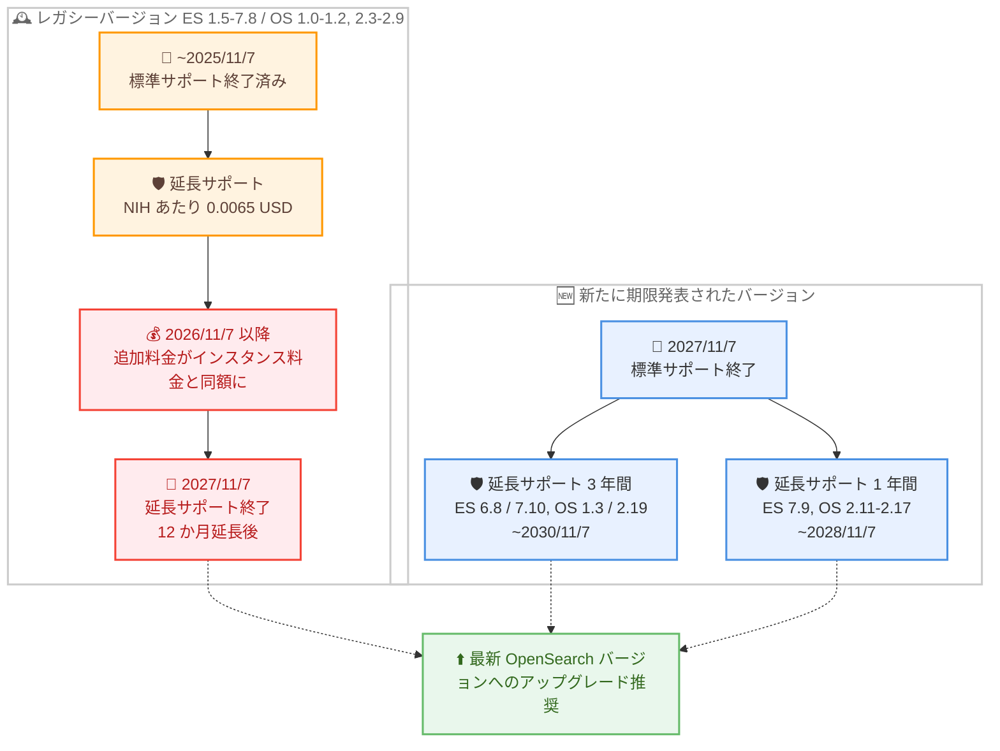

# Amazon OpenSearch Service - レガシーバージョン向け追加アップグレード猶予期間と追加バージョンのサポート期限の発表

**リリース日**: 2026 年 8 月 7 日
**サービス**: Amazon OpenSearch Service
**機能**: 既存ドメイン向けの延長サポート期間の追加延長、および追加バージョンの標準サポート / 延長サポート期限の発表

📊 [このアップデートのインフォグラフィックを見る](https://takech9203.github.io/aws-news-summary/20260807-amazon-opensearch-service-additional-upgrade-runway-support-dates.html)

## 概要

Amazon OpenSearch Service は、延長サポート (Extended Support) 対象のレガシーエンジンバージョンに対するセキュリティパッチおよび OS パッチの提供期間を、さらに 12 か月延長して **2027 年 11 月 7 日** まで継続することを発表しました。対象は Elasticsearch 1.5 ~ 7.8 (5.6 を除く。5.6 は 2028 年 11 月 7 日まで延長サポート提供済み)、OpenSearch 1.0 ~ 1.2、および OpenSearch 2.3 ~ 2.9 です。これらのバージョンで稼働中のドメインは分離 (isolation) されず、引き続き利用できます。ただし、2026 年 11 月 7 日以降、これらのバージョンの延長サポート追加料金はインスタンス料金と同額 (実質的にインスタンス料金が 2 倍) に改定されます。ストレージ料金は影響を受けません。

また、これまでサポート期限が発表されていなかった Elasticsearch 6.8、7.9、7.10、OpenSearch 1.3、および OpenSearch 2.11 ~ 2.19 について、標準サポートと延長サポートの期限が新たに発表されました。各メジャーバージョン系列の最終バージョン (Elasticsearch 6.8 / 7.10、OpenSearch 1.3 / 2.19) には 3 年間、系列内にアップグレードパスがあるマイナーバージョン (Elasticsearch 7.9、OpenSearch 2.11 ~ 2.17) には 1 年間の延長サポートが提供されます。これらのバージョンの延長サポート料金は、米国東部 (バージニア北部) で 1 正規化インスタンス時間 (NIH) あたり 0.0065 USD です。

このアップデートは、レガシーバージョンからの移行に時間を要する顧客に追加の猶予期間 (アップグレードランウェイ) を提供する一方、コスト面のインセンティブにより最新バージョンへの移行を促すものです。AWS は、パフォーマンス、セキュリティ、新機能の観点から、最新の OpenSearch バージョンへのアップグレードを推奨しています。

**アップデート前の課題**

- レガシーバージョン (Elasticsearch 1.5 ~ 7.8、OpenSearch 1.0 ~ 1.2、2.3 ~ 2.9) の延長サポートは 2026 年 11 月 7 日に終了予定であり、移行が間に合わない場合の対応が課題だった
- Elasticsearch 6.8、7.9、7.10、OpenSearch 1.3、2.11 ~ 2.19 のサポート期限が未発表であり、長期的なアップグレード計画を立てにくかった
- 延長サポート終了後のドメインの扱いに関する不確実性があった

**アップデート後の改善**

- レガシーバージョンのセキュリティ / OS パッチ提供が 2027 年 11 月 7 日まで 12 か月延長され、移行のための追加の猶予期間が確保された
- 対象バージョンで稼働中のドメインは分離されないことが明示された
- Elasticsearch 6.8 / 7.9 / 7.10、OpenSearch 1.3 / 2.11 ~ 2.19 の標準サポート期限 (2027 年 11 月 7 日) と延長サポート期限が明確になり、計画的なバージョン管理が可能になった

## アーキテクチャ図



レガシーバージョンと新たに期限が発表されたバージョンのサポートライフサイクルを示しています。レガシーバージョンは 2026 年 11 月 7 日以降に追加料金が引き上げられ、2027 年 11 月 7 日に延長サポートが終了します。

## サービスアップデートの詳細

### 主要機能

1. **レガシーバージョンの延長サポート期間を 12 か月延長**
   - 対象: Elasticsearch 1.5 ~ 7.8 (5.6 を除く)、OpenSearch 1.0 ~ 1.2、OpenSearch 2.3 ~ 2.9
   - セキュリティパッチおよび OS パッチの提供を 2027 年 11 月 7 日まで継続
   - 対象バージョンで稼働中のドメインは分離されない
   - Elasticsearch 5.6 は既に 2028 年 11 月 7 日まで延長サポートが提供されており、変更なし

2. **レガシーバージョンの延長サポート料金の改定**
   - 2026 年 11 月 7 日以降、延長サポート追加料金がインスタンス料金と同額になる (実質的にインスタンス料金が 2 倍)
   - ストレージ料金は影響を受けない
   - Elasticsearch 5.6 は従来どおり NIH あたり 0.0065 USD (バージニア北部) のまま

3. **追加バージョンのサポート期限を新規発表**
   - Elasticsearch 6.8、7.9、7.10、OpenSearch 1.3、OpenSearch 2.11 ~ 2.19 の標準サポートは 2027 年 11 月 7 日に終了
   - 各メジャーバージョン系列の最終バージョン (ES 6.8 / 7.10、OS 1.3 / 2.19) は 3 年間の延長サポート (2030 年 11 月 7 日まで)
   - 系列内にアップグレードパスがあるバージョン (ES 7.9、OS 2.11 / 2.13 / 2.15 / 2.17) は 1 年間の延長サポート (2028 年 11 月 7 日まで)
   - 延長サポート料金は NIH あたり 0.0065 USD (バージニア北部)

## 技術仕様

### サポート期限一覧 (レガシーバージョン)

| バージョン | 標準サポート終了 | 従来の延長サポート終了 | 更新後の延長サポート終了 |
|------|------|------|------|
| Elasticsearch 1.5 / 2.3 | 2025/11/7 | 2026/11/7 | 2027/11/7 |
| Elasticsearch 5.1 ~ 5.5 | 2025/11/7 | 2026/11/7 | 2027/11/7 |
| Elasticsearch 5.6 | 2025/11/7 | 2028/11/7 | 変更なし |
| Elasticsearch 6.0 ~ 6.7 | 2025/11/7 | 2026/11/7 | 2027/11/7 |
| Elasticsearch 7.1 ~ 7.8 | 2025/11/7 | 2026/11/7 | 2027/11/7 |
| OpenSearch 1.0 ~ 1.2 | 2025/11/7 | 2026/11/7 | 2027/11/7 |
| OpenSearch 2.3 ~ 2.9 | 2025/11/7 | 2026/11/7 | 2027/11/7 |

### サポート期限一覧 (新たに発表されたバージョン)

| バージョン | 標準サポート終了 | 延長サポート終了 | 延長サポート期間 |
|------|------|------|------|
| Elasticsearch 6.8 | 2027/11/7 | 2030/11/7 | 3 年 |
| Elasticsearch 7.9 | 2027/11/7 | 2028/11/7 | 1 年 |
| Elasticsearch 7.10 | 2027/11/7 | 2030/11/7 | 3 年 |
| OpenSearch 1.3 | 2027/11/7 | 2030/11/7 | 3 年 |
| OpenSearch 2.11 / 2.13 / 2.15 / 2.17 | 2027/11/7 | 2028/11/7 | 1 年 |
| OpenSearch 2.19 | 2027/11/7 | 2030/11/7 | 3 年 |
| OpenSearch 3.1 以降 | 未発表 | 未発表 | - |

### サポートポリシー

| 項目 | 詳細 |
|------|------|
| 標準サポート期間 | オープンソース版 OpenSearch のサポート終了日から最低 12 か月、または次のマイナーバージョンがサービスでリリースされてから 12 か月のいずれか長い方 |
| 延長サポート中の提供内容 | 重要なセキュリティパッチおよび OS アップデート |
| 延長サポート終了後 | バグ修正・セキュリティアップデートの提供終了、新規ドメイン作成の停止 |
| ドメインの分離 | 今回の対象バージョンで稼働中のドメインは分離されない |

## 設定方法

### 前提条件

1. Amazon OpenSearch Service ドメインを運用していること
2. 現在のエンジンバージョンとサポート期限を把握していること
3. アップグレード前にスナップショットを取得できること

### 手順

#### ステップ 1: 現在のドメインのバージョンを確認

```bash
aws opensearch list-domain-names

aws opensearch describe-domain \
  --domain-name my-domain \
  --query "DomainStatus.EngineVersion"
```

アカウント内の OpenSearch Service ドメインを一覧表示し、各ドメインの現在のエンジンバージョンを確認します。延長サポート対象バージョンで稼働しているドメインを特定します。

#### ステップ 2: アップグレード可能なバージョンを確認

```bash
aws opensearch get-compatible-versions \
  --domain-name my-domain
```

指定したドメインが現在のバージョンからアップグレード可能なターゲットバージョンの一覧を取得します。

#### ステップ 3: バージョンアップグレードを実行

```bash
aws opensearch upgrade-domain \
  --domain-name my-domain \
  --target-version "OpenSearch_3.1" \
  --perform-check-only

aws opensearch upgrade-domain \
  --domain-name my-domain \
  --target-version "OpenSearch_3.1"
```

最初のコマンドで `--perform-check-only` を指定してアップグレード適格性チェックのみを実行し、問題がないことを確認したうえで、2 つ目のコマンドで実際のアップグレードを実行します。マイナーバージョンアップグレードには破壊的変更が含まれず、通常は無停止で実行できます。メジャーバージョンをまたぐ移行には、Migration Assistant for Amazon OpenSearch Service の利用も検討してください。

## メリット

### ビジネス面

- **移行計画の柔軟性向上**: レガシーバージョンのパッチ提供が 2027 年 11 月 7 日まで延長され、複雑な移行プロジェクトに十分な時間を確保できる
- **サービス継続性の保証**: 対象バージョンのドメインは分離されないため、業務への突発的な影響を回避できる
- **長期計画の立案が可能**: 追加バージョンのサポート期限が明確になり、数年先を見据えたアップグレードロードマップを策定できる

### 技術面

- **セキュリティの維持**: 延長サポート期間中も重要なセキュリティパッチと OS アップデートが提供される
- **段階的な移行が可能**: 系列最終バージョン (ES 6.8 / 7.10、OS 1.3 / 2.19) の 3 年間の延長サポートを中継点として、段階的なアップグレード戦略を取れる
- **予見可能なライフサイクル**: オープンソース版のメンテナンスポリシーに沿った標準サポート期間の定義により、バージョン管理の見通しが立てやすい

## デメリット・制約事項

### 制限事項

- 2026 年 11 月 7 日以降、レガシーバージョン (ES 1.5 ~ 7.8 (5.6 除く)、OS 1.0 ~ 1.2、2.3 ~ 2.9) の延長サポート追加料金はインスタンス料金と同額となり、コンピューティングコストが実質 2 倍になる
- 延長サポート期間中は重要なセキュリティパッチと OS アップデートのみが提供され、新機能やバグ修正は提供されない
- 延長サポート終了後は、対象バージョンでの新規ドメイン作成ができなくなる

### 考慮すべき点

- 延長はあくまで移行のための猶予期間であり、料金面のインセンティブからも早期のアップグレードが推奨される
- Elasticsearch 7.9、OpenSearch 2.11 ~ 2.17 の延長サポートは 1 年間のみのため、これらのバージョンを利用中の場合は系列内の最終バージョンまたは最新バージョンへの移行を優先的に検討する必要がある
- 延長サポート料金は NIH (正規化インスタンス時間) ベースで計算されるため、インスタンスサイズにより実際の追加費用が異なる (medium は係数 2、large は係数 4 など)

## ユースケース

### ユースケース 1: レガシー Elasticsearch ドメインの計画的移行

**シナリオ**: Elasticsearch 6.4 で稼働する本番検索基盤を運用しており、アプリケーション側のクライアント改修に時間がかかるため、2026 年 11 月の延長サポート終了に間に合わない。

**実装例**:
```bash
# 現在のバージョンと互換性のあるアップグレードパスを確認
aws opensearch get-compatible-versions --domain-name search-prod

# 6.8 へ中継アップグレード後、OpenSearch 1.3 → 最新版へ段階移行
aws opensearch upgrade-domain --domain-name search-prod \
  --target-version "Elasticsearch_6.8"
```

**効果**: 2027 年 11 月まで延長された猶予期間を活用しつつ、3 年間の延長サポートを持つ ES 6.8 を中継点として段階的に最新 OpenSearch バージョンへ移行できる。ただし 2026 年 11 月以降はコストが実質 2 倍になるため、それ以前の中継アップグレード完了が望ましい。

### ユースケース 2: OpenSearch 2.x マイナーバージョンの統一

**シナリオ**: 複数チームが OpenSearch 2.11、2.13、2.15 など異なるマイナーバージョンでドメインを運用しており、これらの延長サポートが 1 年間 (2028 年 11 月まで) しかないことが判明した。

**実装例**:
```bash
# 各ドメインのバージョンを棚卸し
aws opensearch list-domain-names --engine-type OpenSearch
for d in $(aws opensearch list-domain-names --engine-type OpenSearch \
  --query "DomainNames[].DomainName" --output text); do
  aws opensearch describe-domain --domain-name "$d" \
    --query "[DomainStatus.DomainName, DomainStatus.EngineVersion]" --output text
done

# 3 年間の延長サポートを持つ 2.19 または最新版へ統一
aws opensearch upgrade-domain --domain-name team-a-domain \
  --target-version "OpenSearch_2.19"
```

**効果**: マイナーバージョンアップグレードは破壊的変更を含まないため低リスクで実施でき、延長サポート期間が 3 年間の 2.19 (2030 年 11 月まで) に統一することで運用負荷と将来の移行リスクを低減できる。

### ユースケース 3: 延長サポートコストの試算と移行判断

**シナリオ**: OpenSearch 2.5 のドメイン (m7g.medium.search x 3 ノード) を運用しており、2026 年 11 月以降に延長サポートを継続した場合のコスト影響を評価したい。

**実装例**:
```text
# 2026 年 11 月 7 日以降のレガシーバージョン延長サポート料金 (バージニア北部)
インスタンス料金:      0.068 USD/時間 x 24 時間 x 3 ノード = 4.896 USD/日
延長サポート追加料金:  インスタンス料金と同額            = 4.896 USD/日
合計:                  約 9.792 USD/日 (ストレージ除く、従来の約 2 倍)

# 参考: 新発表バージョン (例: OpenSearch 2.19) の延長サポート料金
追加料金: 0.0065 USD/NIH x 24 時間 x 係数 2 (medium) x 3 ノード = 0.936 USD/日
```

**効果**: レガシーバージョンに留まり続けた場合のコスト増を定量的に把握でき、アップグレードプロジェクトの投資対効果を明確にして経営層への説明や移行判断に活用できる。

## 料金

延長サポートの料金体系は、バージョンと時期により異なります。

- **レガシーバージョン (ES 1.5 ~ 7.8 (5.6 除く)、OS 1.0 ~ 1.2、2.3 ~ 2.9)**: 2026 年 11 月 7 日以降、延長サポート追加料金はインスタンス料金と同額 (実質的にインスタンス料金が 2 倍)。ストレージ料金は変更なし
- **Elasticsearch 5.6**: 従来どおり 1 NIH あたり 0.0065 USD (バージニア北部) で 2028 年 11 月 7 日まで
- **新発表バージョン (ES 6.8 / 7.9 / 7.10、OS 1.3 / 2.11 ~ 2.19)**: 1 NIH あたり 0.0065 USD (バージニア北部)。リージョンごとの料金は料金ページを参照

NIH (Normalized Instance Hour) はインスタンスサイズに応じた正規化係数で計算されます (例: medium = 2、large = 4、xlarge = 8)。

### 料金例 (バージニア北部、m7g.medium.search 1 ノード、24 時間)

| ケース | 日額料金 (概算、ストレージ除く) |
|--------|------------------|
| 標準サポート中 | 1.632 USD (インスタンス料金のみ) |
| 新発表バージョンの延長サポート | 1.944 USD (1.632 + 0.0065 x 24 x 2 = 0.312) |
| レガシーバージョンの延長サポート (2026/11/7 以降) | 3.264 USD (1.632 x 2) |

## 利用可能リージョン

Amazon OpenSearch Service が提供されるすべての AWS リージョンに適用されます。延長サポートのリージョン別料金は [Amazon OpenSearch Service 料金ページ](https://aws.amazon.com/opensearch-service/pricing/) を参照してください。

## 関連サービス・機能

- **Migration Assistant for Amazon OpenSearch Service**: メジャーバージョンをまたぐ移行やクラスター移行を支援するツールで、レガシーバージョンからの移行に活用できる
- **Amazon OpenSearch Serverless**: バージョン管理自体が不要なサーバーレスオプションで、ライフサイクル管理の運用負荷をなくす選択肢となる
- **AWS Cost Explorer**: 延長サポート追加料金の発生状況をモニタリングし、移行判断の材料とすることができる

## 参考リンク

- 📊 [インフォグラフィック](https://takech9203.github.io/aws-news-summary/20260807-amazon-opensearch-service-additional-upgrade-runway-support-dates.html)
- [公式発表 (What's New)](https://aws.amazon.com/about-aws/whats-new/2026/08/amazon-opensearch-service-additional-upgrade-runway-support-dates)
- [AWS Blog: Amazon OpenSearch Service extends version lifecycle support timelines](https://aws.amazon.com/blogs/big-data/amazon-opensearch-service-extends-version-lifecycle-support-timelines/)
- [ドキュメント: Upgrading Amazon OpenSearch Service domains](https://docs.aws.amazon.com/opensearch-service/latest/developerguide/version-migration.html)
- [料金ページ](https://aws.amazon.com/opensearch-service/pricing/)

## まとめ

Amazon OpenSearch Service のレガシーエンジンバージョンに対するパッチ提供が 2027 年 11 月 7 日まで 12 か月延長され、移行に時間を要する顧客に追加の猶予期間が提供されました。一方で 2026 年 11 月 7 日以降はレガシーバージョンの延長サポート追加料金がインスタンス料金と同額となるため、コスト増を回避するには早期のアップグレードが不可欠です。自社ドメインのバージョンを棚卸しし、新たに発表されたサポート期限 (特に 1 年間のみ延長サポートされる ES 7.9 / OS 2.11 ~ 2.17) を踏まえて、最新 OpenSearch バージョンへの移行計画を策定することを推奨します。
