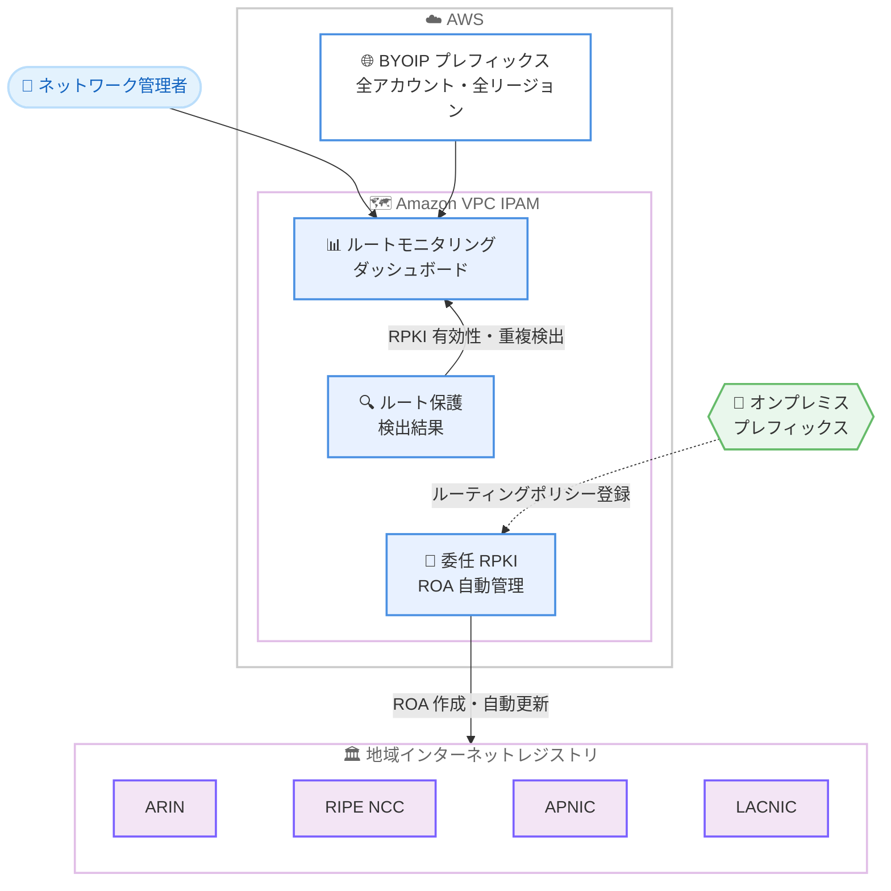

# Amazon VPC IPAM - BGP ルート保護モニタリングと委任 RPKI サポート

**リリース日**: 2026 年 8 月 7 日
**サービス**: Amazon VPC IP Address Manager (IPAM)
**機能**: BYOIP プレフィックス向け BGP ルート保護モニタリングと委任 RPKI 管理

📊 [このアップデートのインフォグラフィックを見る](https://takech9203.github.io/aws-news-summary/20260807-amazon-vpc-ipam-bgp-rpki-byoip.html)

## 概要

Amazon VPC IP Address Manager (IPAM) が、Bring Your Own IP (BYOIP) プレフィックス向けに BGP ルート保護モニタリングと委任 RPKI (Resource Public Key Infrastructure) 管理のサポートを発表しました。ネットワーク管理者は、単一のダッシュボードからアカウントとリージョンを横断して、すべての BYOIP プレフィックスの RPKI 有効性ステータス、ROA (Route Origin Authorization) の強度、ルート重複の検出結果を確認できるようになります。

委任 RPKI では、地域インターネットレジストリ (RIR: ARIN、RIPE NCC、APNIC、LACNIC) との一度きりのセットアップを行うことで、IPAM が ROA のライフサイクル管理を自動化します。BYOIP プロビジョニング時の ROA 自動作成、有効期限前の自動更新、さらに AWS に持ち込んでいないオンプレミスプレフィックスの ROA 管理まで、IPAM が代行します。

このアップデートは、BYOIP を利用してインターネットにプレフィックスを広告している組織、特に多数のプレフィックスを複数アカウント・複数リージョンで運用しているエンタープライズのネットワーク管理者にとって、ルートハイジャック対策と RPKI 運用の負荷を大幅に軽減するものです。

**アップデート前の課題**

BYOIP プレフィックスのルート保護は、AWS の外側で手動運用する必要がありました。

- ROA の作成・更新のために、プレフィックスごとに RIR のポータル (ARIN、RIPE、APNIC など) へログインして手動で操作するか、Krill などのオープンソースツールで独自の RPKI 認証局を運用する必要があった
- 数十から数百の ROA の有効期限を自分で追跡する必要があり、更新を忘れると RPKI ステータスが Valid から Unknown へサイレントに遷移し、ハイジャック保護が失われていた
- ルートハイジャック (第三者による自プレフィックスやサブプレフィックスの広告) の検出には、サードパーティツールに依存する必要があった
- BYOIP プロビジョニング時には、WHOIS や DNS レコードによる所有権証明を自分で用意する必要があった

**アップデート後の改善**

- 単一ダッシュボードで、全アカウント・全リージョンの BYOIP ルートの RPKI 有効性、ROA 強度 (Strict / Permissive)、ルート重複を一元的に可視化できるようになった
- 委任 RPKI により、CIDR プロビジョニング時の ROA 自動作成と有効期限前の自動更新が実現し、手動の ROA 運用が不要になった
- AWS に持ち込んでいないオンプレミスプレフィックスの ROA も、ルーティングポリシー登録 (RPR) として同じコンソールから管理できるようになった
- 委任 RPKI を有効化すると、AWS が所有権を検証するため、プロビジョニング時の所有権証明の提出が不要になった

## アーキテクチャ図



IPAM がアカウント・リージョン横断で BYOIP ルートを自動検出し、RPKI 有効性と重複をダッシュボードに集約します。委任 RPKI を有効化すると、IPAM が RIR に対して ROA の作成・更新を自動実行し、オンプレミスプレフィックスの ROA も同じ仕組みで管理できます。

## サービスアップデートの詳細

### 主要機能

1. **ルートディスカバリー**
   - IPAM がアカウントとリージョンを横断して、すべての BYOIP ルートを自動検出
   - プレフィックス、ASN、広告ステータス、RPKI 有効性を単一ダッシュボードで表示
   - Free Tier でもルートディスカバリー API (`get-ipam-discovered-routes`) を利用可能

2. **ルート保護検出結果 (Route Protection Findings)**
   - 各ルートを公開済みの ROA データと照合して評価
   - 競合する ROA、ROA の欠如、Permissive な設定、他 ASN からの重複広告を検出
   - サブプレフィックスハイジャックや ROA 期限切れを、トラフィックが誤ルーティングされる前に検知可能
   - コンソールのダッシュボード (IPAM > Monitoring > Route monitoring) で、RPKI カバレッジ (Valid / Invalid / Unknown)、ROA 強度 (Strict / Permissive)、重複ルート数の 3 つのチャートを提供

3. **委任 RPKI (Delegated RPKI)**
   - RIR との一度きりの「インターネットレジストリアソシエーション」セットアップで、AWS に ROA 管理を委任
   - CIDR プロビジョニング時に ROA を自動作成し、有効期限前に自動更新
   - 委任後は、プロビジョニング時の CIDR 所有権証明 (WHOIS や DNS レコード) の提出が不要 (AWS が代行して検証)
   - 複数プレフィックスをアトミックに管理するバッチ更新をサポート

4. **オンプレミスプレフィックスの ROA 管理**
   - AWS に持ち込んでいない IP 空間についても、ルーティングポリシー登録 (RPR) として ROA を管理可能
   - RPR はプレフィックスと ASN のリストで構成され、ASN ごとに 1 つの ROA にマッピング
   - AWS 上の IP とオンプレミスの IP を同じコンソールで一元管理

## 技術仕様

### ティア別の利用可能機能

| 機能 | Free Tier | Advanced Tier |
|------|-----------|---------------|
| ルートディスカバリー (ルート表示) | 利用可能 | 利用可能 |
| ルート保護検出結果 (RPKI ステータス、重複検出) | 利用不可 | 利用可能 |
| 委任 RPKI (ROA 自動管理) | 利用不可 | 利用可能 |
| オンプレミス ROA 管理 (ルーティングポリシー登録) | 利用不可 | 利用可能 |

### サポートされる地域インターネットレジストリ

| RIR | カバレッジ | 備考 |
|-----|-----------|------|
| ARIN | 北米、カリブ海の一部 | 米国拠点の顧客で最も一般的 |
| RIPE NCC | 欧州、中東、中央アジア | |
| APNIC | アジア太平洋 | 日本を含む |
| LACNIC | ラテンアメリカ、カリブ海 | 委任 RPKI 対応。初期セットアップ時の CIDR 自動検出と ROA 事前作成は非対応 |
| AFRINIC | アフリカ | ルートディスカバリーと検出結果のみ。委任 RPKI 非対応 |

### 主要な概念

| 用語 | 説明 |
|------|------|
| ROA | 特定の ASN が特定の IP プレフィックスを広告することを許可する、暗号署名付きオブジェクト。CIDR、ASN、max-length の 3 属性を持つ |
| Strict ROA | max-length がプレフィックス長と完全一致。より詳細な広告はすべて RPKI-invalid となる。推奨されるデフォルト |
| Permissive ROA | max-length がプレフィックス長より大きい。トラフィックエンジニアリングに有用だが、サブプレフィックスハイジャックへの保護が弱い |
| インターネットレジストリアソシエーション | IPAM と RIR の間の信頼関係。有効化後、AWS が ROA を発行・管理可能になる |
| ルーティングポリシー登録 (RPR) | AWS に持ち込んでいない IP 空間向けに IPAM が管理する ROA のセット |

### API 変更履歴

| 日付 | サービス | 変更内容 |
|------|----------|----------|
| 2026/08/07 | [ec2](https://awsapichanges.com/archive/changes/c10ac1-ec2.html) | 15 new 13 updated api methods - IPAM の BGP ルート保護 (ルートディスカバリー、RPKI ルート保護検出結果、委任 RPKI) のサポート追加 |

主な新規 API:

- `GetIpamDiscoveredRoutes`: 検出されたルートの表示
- `GetIpamRouteProtectionFindings`: ルート保護検出結果の表示
- `CreateIpamInternetRegistryAssociation` / `EnableIpamInternetRegistryAssociation`: インターネットレジストリアソシエーションの作成・有効化
- `GetIpamRouteOriginAuthorizations`: ROA の表示
- `CreateIpamRoutingPolicyRegistration` / `BatchModifyIpamRoutingPolicyRegistrations`: ルーティングポリシー登録の作成・バッチ変更
- `GetIpamRoutingPolicyRegistrationDeltas`: 登録変更履歴の表示

## 設定方法

### 前提条件

1. Amazon VPC IPAM が作成済みであること (検出結果と委任 RPKI には Advanced Tier が必要)
2. BYOIP プレフィックスが AWS にプロビジョニング済み、またはプロビジョニング予定であること
3. 委任 RPKI を利用する場合、対象プレフィックスを管理する RIR (ARIN、RIPE NCC、APNIC、LACNIC) のアカウントを保有していること

### 手順

#### ステップ 1: 検出されたルートの確認

```bash
aws ec2 get-ipam-discovered-routes \
  --ipam-resource-discovery-id ipam-res-disco-xxxxxxxx \
  --address-region ap-northeast-1
```

IPAM が自動検出した BYOIP ルートの一覧 (プレフィックス、ASN、広告ステータス、RPKI 有効性) を表示します。まず現状のルート保護態勢を把握するために実行します。

#### ステップ 2: ルート保護検出結果の確認

```bash
aws ec2 get-ipam-route-protection-findings \
  --ipam-id ipam-xxxxxxxx
```

各ルートを公開済み ROA データと照合した評価結果を表示します。ROA の欠如、競合、Permissive な設定、他 ASN からの重複広告などの問題を確認できます。

#### ステップ 3: インターネットレジストリアソシエーションの作成と有効化

```bash
# アソシエーションの作成
aws ec2 create-ipam-internet-registry-association \
  --ipam-id ipam-xxxxxxxx \
  --internet-registry ARIN

# RIR 側での承認手続き完了後、アソシエーションを有効化
aws ec2 enable-ipam-internet-registry-association \
  --ipam-internet-registry-association-id ipam-ira-xxxxxxxx
```

RIR との信頼関係を確立し、AWS に ROA 管理を委任します。RIR 側での一度きりのセットアップ完了後に有効化すると、以降は CIDR プロビジョニング時の ROA 自動作成と期限前の自動更新が行われます。

#### ステップ 4: オンプレミスプレフィックスの ROA 管理 (オプション)

```bash
aws ec2 create-ipam-routing-policy-registration \
  --ipam-internet-registry-association-id ipam-ira-xxxxxxxx \
  --cidr "203.0.113.0/24" \
  --asns 64500
```

AWS に持ち込んでいないオンプレミスプレフィックスについて、ルーティングポリシー登録を作成し、IPAM 経由で ROA を管理します。

## メリット

### ビジネス面

- **ルートハイジャックリスクの低減**: RPKI 有効性の常時モニタリングと重複検出により、ハイジャックの兆候を早期に発見でき、顧客からの接続障害報告を待たずに対応できる
- **運用コストの削減**: プレフィックスごとの RIR ポータルへのログイン、ROA 期限の手動追跡、サードパーティ監視ツールの運用が不要になる
- **コンプライアンス対応の強化**: 組織全体の RPKI 態勢を単一ダッシュボードで証跡として提示でき、セキュリティ監査への対応が容易になる

### 技術面

- **一元的な可視性**: アカウント・リージョン横断のルート情報、RPKI ステータス、ROA 強度を単一の場所で確認できる
- **ROA ライフサイクルの完全自動化**: プロビジョニング時の自動作成と期限前の自動更新により、ROA 期限切れによるサイレントな保護喪失を防止できる
- **段階的な導入が可能**: モニタリングのみから開始し、現状把握後に委任 RPKI を追加でき、既存ルートに影響を与えない
- **オンプレミスとの統合管理**: AWS 上の IP とオンプレミスの IP 空間の ROA を同じ仕組みで管理できる

## デメリット・制約事項

### 制限事項

- ルート保護検出結果、委任 RPKI、オンプレミス ROA 管理には IPAM Advanced Tier が必要 (Free Tier はルートディスカバリーのみ)
- AFRINIC は委任 RPKI に非対応 (ルートディスカバリーと検出結果のみ利用可能)
- LACNIC は委任 RPKI に対応しているが、初期セットアップ時の CIDR 自動検出と ROA 事前作成は利用できない
- AWS GovCloud (US) リージョンおよび中国リージョン (北京、寧夏) では利用不可

### 考慮すべき点

- 委任 RPKI の利用には RIR 側での一度きりのセットアップ (承認手続き) が必要であり、RIR ごとに手順が異なる
- Krill などで成熟した RPKI 認証局を既に自動運用している組織では、委任 RPKI は機能が重複する (ただし一元的な可視化のためにモニタリングダッシュボードは有用)
- AWS 所有の IP 空間 (Elastic IP など) のみを利用している場合、ROA は AWS が自動管理するため本機能は不要
- BYOIP プレフィックスをインターネットに広告していない (AWS 内のプライベート利用のみの) 場合、BGP 広告がないためハイジャックリスクはなく、本機能は不要

## ユースケース

### ユースケース 1: マルチアカウント環境での RPKI 態勢の一元監視

**シナリオ**: 複数の AWS アカウントと複数リージョンで数十の BYOIP プレフィックスを運用しているエンタープライズが、各プレフィックスの RPKI 保護状況を把握できていない。

**実装例**:
```bash
# 組織全体のルート保護検出結果を確認
aws ec2 get-ipam-route-protection-findings \
  --ipam-id ipam-xxxxxxxx

# コンソールの IPAM > Monitoring > Route monitoring で
# RPKI カバレッジ、ROA 強度、重複ルートのチャートを確認
```

**効果**: ROA が欠如または期限切れのプレフィックスを即座に特定し、優先順位を付けて是正できる。Permissive な ROA を Strict に強化する対象も明確になる。

### ユースケース 2: ROA 手動運用からの脱却

**シナリオ**: ネットワークチームが ARIN と APNIC のポータルに定期的にログインし、100 以上の ROA の有効期限をスプレッドシートで管理している。更新漏れによる保護喪失が過去に発生した。

**実装例**:
```bash
# RIR ごとにインターネットレジストリアソシエーションを作成・有効化
aws ec2 create-ipam-internet-registry-association \
  --ipam-id ipam-xxxxxxxx \
  --internet-registry APNIC

aws ec2 enable-ipam-internet-registry-association \
  --ipam-internet-registry-association-id ipam-ira-xxxxxxxx

# ROA の状態を確認
aws ec2 get-ipam-route-origin-authorizations \
  --ipam-internet-registry-association-id ipam-ira-xxxxxxxx
```

**効果**: ROA の作成・更新が完全自動化され、期限追跡のスプレッドシート運用が不要になる。新規 BYOIP プロビジョニング時も所有権証明の準備が不要になり、リードタイムが短縮される。

### ユースケース 3: ルートハイジャックの早期検出

**シナリオ**: 金融サービス企業が、自社の BYOIP プレフィックスに対するサブプレフィックスハイジャック (第三者がより詳細なプレフィックスを広告してトラフィックを奪う攻撃) を懸念している。

**実装例**:
```bash
# 重複広告の検出結果を定期的に確認
aws ec2 get-ipam-route-protection-findings \
  --ipam-id ipam-xxxxxxxx

# 検出された場合は ROA を Strict (max-length = プレフィックス長) に設定し、
# より詳細な広告を RPKI-invalid として拒否させる
```

**効果**: 他 ASN からの重複広告をダッシュボードで検知でき、顧客影響が出る前に対処可能。Strict ROA により、RPKI 検証を行うネットワークがハイジャック広告を自動的に拒否する。

## 料金

ルートディスカバリー (ルート表示) は Free Tier で利用可能です。ルート保護検出結果、委任 RPKI、オンプレミス ROA 管理には IPAM Advanced Tier が必要です。Advanced Tier はアクティブ IP アドレスごとの時間課金です。

詳細は [Amazon VPC 料金ページ](https://aws.amazon.com/vpc/pricing/)の IPAM タブを参照してください。

## 利用可能リージョン

AWS GovCloud (US) リージョンおよび中国リージョン (北京: Sinnet 運営、寧夏: NWCD 運営) を除く、すべての AWS 商用リージョンで利用可能です。東京・大阪リージョンを含みます。

## 関連サービス・機能

- **BYOIP (Bring Your Own IP)**: 自社所有の IP アドレス範囲を AWS に持ち込む機能。本アップデートの保護対象であり、委任 RPKI によりプロビジョニング時の所有権証明も簡素化される
- **Amazon VPC IPAM Advanced Tier**: 本アップデートの検出結果・委任 RPKI 機能の利用に必要なティア。IP アドレスの計画・追跡・監視機能を提供
- **AWS Organizations**: IPAM と統合することで、組織内の全アカウントのルートと IP アドレスを一元管理できる

## 参考リンク

- 📊 [インフォグラフィック](https://takech9203.github.io/aws-news-summary/20260807-amazon-vpc-ipam-bgp-rpki-byoip.html)
- [公式発表 (What's New)](https://aws.amazon.com/about-aws/whats-new/2026/08/amazon-vpc-ipam-bgp-rpki-byoip/)
- [ドキュメント: Monitor BGP route protection](https://docs.aws.amazon.com/vpc/latest/ipam/monitor-bgp-route-security.html)
- [ドキュメント: What is IPAM?](https://docs.aws.amazon.com/vpc/latest/ipam/what-it-is-ipam.html)
- [料金ページ](https://aws.amazon.com/vpc/pricing/)

## まとめ

BYOIP プレフィックスの BGP ルート保護が、RIR ポータルでの手動運用やサードパーティツールへの依存から、IPAM による一元的なモニタリングと ROA 自動管理へと大きく進化するアップデートです。BYOIP を運用中の組織は、まず Free Tier でも利用できるルートディスカバリーで現状の RPKI 態勢を把握し、Advanced Tier の検出結果で問題点を特定した上で、委任 RPKI による ROA 運用の自動化を検討することを推奨します。
