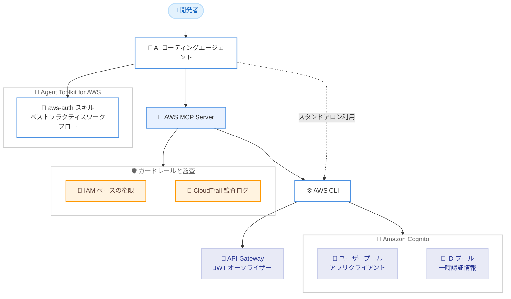

# Amazon Cognito - Agent Toolkit for AWS のコアスキル aws-auth として提供開始

**リリース日**: 2026 年 8 月 7 日
**サービス**: Amazon Cognito
**機能**: Agent Toolkit for AWS のコアスキル (aws-auth)

📊 [このアップデートのインフォグラフィックを見る](https://takech9203.github.io/aws-news-summary/20260807-aws-auth-agent-skill.html)
<!-- INFOGRAPHIC_BASE_URL は環境変数から取得 -->

## 概要

Amazon Cognito が、Agent Toolkit for AWS のコアスキル **aws-auth** として利用可能になりました。このスキルを利用することで、AI コーディングエージェントは、ベストプラクティスに基づくワークフローに従って、Amazon Cognito のセットアップ、設定、セキュリティ強化、トラブルシューティングを実行できます。エンドユーザー、AI エージェント、マイクロサービス向けの安全なサインイン体験を構築する開発者の作業を大幅に加速します。

aws-auth スキルは、ユーザープールとアプリクライアントの設定、マネージドログインと OAuth 2.0 フロー、トークン管理、JWT オーソライザー、パスキー / WebAuthn 登録、脅威保護、Lambda トリガーの接続、ID プールといった幅広い認証・認可の領域をカバーしています。認証は設定ミスがセキュリティインシデントに直結する領域であり、暗黙的グラントの回避や公開クライアントでのクライアントシークレット禁止といったベストプラクティスがスキルに組み込まれている点が特徴です。

AWS MCP Server と組み合わせて使用すると、エージェントは IAM ベースのガードレールと CloudTrail による監査ログのもとで AWS CLI コマンドを実行できます。また、AWS MCP Server がない環境でも、AWS CLI を通じてスタンドアロンで利用可能です。このスキルは Agent Toolkit for AWS の一部として GitHub で公開されています。

**アップデート前の課題**

- AI コーディングエージェントに Cognito の認証ベストプラクティスが組み込まれておらず、開発者が手動でドキュメントを参照しながら実装する必要があった
- OAuth 2.0 フローの選択、トークン管理、アプリクライアント設定などは誤りやすく、設定ミスがセキュリティリスクに直結していた
- `update-user-pool-client` の完全置換動作のような落とし穴のある API 仕様を、エージェントが把握せずに操作すると既存設定を破壊するリスクがあった

**アップデート後の改善**

- エージェントがベストプラクティスワークフローに従って、ユーザープール作成からトークン管理、API 保護までを一貫して実行できるようになった
- PKCE 付き認可コードグラントの推奨や公開クライアントでのシークレット禁止など、セキュリティ上の推奨事項がスキルに組み込まれ、設定ミスを未然に防止できるようになった
- AWS MCP Server との連携により、IAM ガードレールと CloudTrail 監査ログのもとで安全にエージェントが Cognito を操作できるようになった

## アーキテクチャ図



開発者の指示を受けた AI コーディングエージェントが、aws-auth スキルのワークフローに従い、AWS MCP Server 経由 (ガードレール・監査あり) またはスタンドアロンの AWS CLI で Cognito のユーザープール、ID プール、API Gateway オーソライザーを構成する流れを示しています。

## サービスアップデートの詳細

### 主要機能

1. **ユーザープールとアプリクライアントの設定**
   - サインアップ / サインインフロー、MFA、パスワードポリシーの構成
   - ユーザープールグループの作成と `cognito:groups` クレームの活用
   - 公開クライアント (SPA / モバイル) と機密クライアント (サーバーサイド) の適切な使い分けをガイド

2. **マネージドログインと OAuth 2.0 フロー**
   - Cognito ホステッド UI / マネージドログインのセットアップ
   - PKCE 付き認可コードグラント、クライアントクレデンシャルフロー (M2M 認証) の構成
   - ソーシャルログイン (Google など) や SAML フェデレーションの接続と属性マッピング

3. **トークン管理と JWT オーソライザー**
   - ID / アクセス / リフレッシュトークンの管理、ローテーション、失効
   - API Gateway (HTTP API の JWT オーソライザー、REST API の Cognito オーソライザー) や ALB の `authenticate-cognito` アクションによる API 保護
   - `aws-jwt-verify` などのライブラリを使用した JWT 検証のガイダンス

4. **パスキー / WebAuthn と脅威保護**
   - `USER_AUTH` フローと `AllowedFirstAuthFactors` によるパスキーサインインの構成
   - 侵害された認証情報のブロック、アダプティブ認証 (リスクベース MFA)、CloudWatch へのログ配信の設定

5. **Lambda トリガーと ID プール**
   - クレームのカスタマイズ、カスタム認証チャレンジ、ユーザー移行などの Lambda トリガー接続
   - ID プールによる一時 AWS 認証情報の払い出し、ゲストアクセス、ロールマッピングの構成

6. **トラブルシューティングワークフロー**
   - `redirect_mismatch`、SECRET_HASH エラー、API Gateway の 401、CORS、ソーシャルログインの属性競合など、頻出エラーの診断と修正手順を提供

### 組み込まれたセキュリティガードレール

スキルには、エージェントが陥りやすい落とし穴への警告が組み込まれています。

- **完全置換 API への対策**: `update-user-pool-client` と `set-identity-pool-roles` は部分更新ではなく完全置換であるため、必ず read-modify-write (現在の設定を取得してから全フィールドを再送信) を行うようガイド
- **レガシーフローの回避**: 暗黙的グラント (`response_type=token`) を避け、PKCE 付き認可コードグラントを使用
- **トークン保管の安全性**: 高価値アプリでは `localStorage` ではなく `cookieStorage` を使用し、リフレッシュトークンローテーションとトークン失効を有効化
- **UNCONFIRMED ユーザーの扱い**: メール所有権を検証しない `admin-confirm-sign-up` の一括実行を避け、`resend-confirmation-code` を推奨

## 技術仕様

### スキルの構成

| 項目 | 詳細 |
|------|------|
| スキル名 | aws-auth |
| 提供形態 | Agent Toolkit for AWS のコアスキル (GitHub で公開) |
| 対象サービス | Amazon Cognito (ユーザープール、ID プール)、API Gateway / ALB のオーソライザー設定、Amplify クライアント認証ライブラリ |
| 実行方式 | AWS MCP Server 経由 (推奨) または AWS CLI によるスタンドアロン |
| ガードレール | AWS MCP Server 利用時: IAM ベースの権限制御、CloudTrail 監査ログ |
| 対象外 | Amplify Gen2 バックエンド定義 (`defineAuth`)、IAM / STS / IAM Identity Center (aws-iam スキル)、API Gateway ルート設定や Lambda 実装 (aws-serverless スキル) |

## 設定方法

### 前提条件

1. Agent Toolkit for AWS に対応した AI コーディングエージェント (Claude Code、Kiro など)
2. AWS CLI と適切な IAM 権限を持つ認証情報
3. (推奨) AWS MCP Server のセットアップ

### 手順

#### ステップ1: Agent Toolkit for AWS の導入

```bash
# Agent Toolkit for AWS のリポジトリを取得
git clone https://github.com/aws/agent-toolkit-for-aws.git
```

Agent Toolkit for AWS のリポジトリを取得します。aws-auth スキルは `skills/core-skills/aws-auth` ディレクトリに含まれています。導入手順の詳細は [Quick Start ガイド](https://docs.aws.amazon.com/agent-toolkit/latest/userguide/quick-start.html)を参照してください。

#### ステップ2: AWS MCP Server の設定 (推奨)

```json
{
  "mcpServers": {
    "aws": {
      "command": "uvx",
      "args": ["awslabs.aws-mcp-server@latest"]
    }
  }
}
```

エージェントの MCP 設定に AWS MCP Server を追加します。これにより、エージェントの AWS CLI 実行に IAM ベースのガードレールと CloudTrail 監査ログが適用されます。AWS MCP Server がない場合でも、スキルは AWS CLI で直接動作します。

#### ステップ3: エージェントに認証タスクを依頼

エージェントに自然言語で指示します。例:

- 「React アプリにサインアップとログインを追加して」→ ユーザープール + シークレットなしの公開アプリクライアント + PKCE 付きマネージドログインを構成
- 「認証済みユーザーだけが API を呼べるようにして」→ HTTP API の JWT オーソライザーまたは REST API の Cognito オーソライザーを構成
- 「Google ログインを追加して」→ ソーシャル IdP の登録と属性マッピングを実施

## メリット

### ビジネス面

- **開発速度の向上**: 認証機能の実装で頻発するドキュメント参照と試行錯誤を削減し、安全なサインイン体験の構築を加速できる
- **セキュリティリスクの低減**: OAuth フローの選択ミスやトークン保管の不備といった、インシデントに直結する設定ミスをベストプラクティスの組み込みにより防止できる
- **追加コストなし**: Agent Toolkit for AWS の一部として GitHub で公開されており、スキル自体に追加料金は発生しない

### 技術面

- **落とし穴への事前対策**: 完全置換 API の read-modify-write 徹底など、エージェント操作で「気付かないうちに設定が壊れる」問題への警告が組み込まれている
- **ガードレール付き実行**: AWS MCP Server との連携により、IAM 権限制御と CloudTrail 監査のもとでエージェントが Cognito を操作できる
- **幅広いカバレッジ**: ユーザープールから ID プール、パスキー、脅威保護、API 保護まで、認証・認可のライフサイクル全体をカバーする

## デメリット・制約事項

### 制限事項

- Amplify Gen2 のバックエンド定義 (`defineAuth`、`npx ampx`) は対象外で、別のアプローチが必要
- IAM ポリシー / ロールの作成、STS、IAM Identity Center は対象外 (aws-iam スキルの領域)
- API Gateway のルート / 統合設定や Lambda 関数の実装自体はカバーされない (オーソライザー設定のみ)

### 考慮すべき点

- アクセストークンのクレームカスタマイズ (Pre Token Generation V2/V3) には Cognito の有料フィーチャープランが必要
- エージェントによる操作であっても、本番環境への適用前に生成された設定のレビューが推奨される
- スタンドアロン利用時は AWS MCP Server のガードレール (IAM 制御、監査ログ) が適用されないため、実行環境の権限設計に注意が必要

## ユースケース

### ユースケース1: SPA へのサインイン機能の追加

**シナリオ**: React 製の SPA にサインアップ / サインイン機能を新規追加したい。

**実装例**:
```
エージェントへの指示:
「この React アプリに Cognito でサインアップとログインを追加して。
パスキーにも対応させて」

エージェントの動作 (aws-auth スキルに従う):
1. ユーザープールを作成
2. シークレットなしの公開アプリクライアントを作成
3. PKCE 付き認可コードグラントでマネージドログインを構成
4. USER_AUTH フローと AllowedFirstAuthFactors でパスキーを有効化
5. Amplify クライアントライブラリを接続 (cookieStorage を使用)
```

**効果**: セキュリティベストプラクティスに沿った認証基盤を、手動のドキュメント参照なしに短時間で構築できる。

### ユースケース2: API Gateway の認可設定

**シナリオ**: 既存の HTTP API を認証済みユーザーのみに制限したい。

**実装例**:
```
エージェントへの指示:
「この API Gateway の HTTP API を、Cognito にサインインした
ユーザーだけが呼び出せるようにして」

エージェントの動作:
1. HTTP API に JWT オーソライザーを作成
   - issuer: https://cognito-idp.{region}.amazonaws.com/{userPoolId}
   - audience: アプリクライアント ID
2. 対象ルートにオーソライザーをアタッチ
3. クライアント側でアクセストークンを送信するよう修正
```

**効果**: issuer / audience の不一致による 401 エラーなどの典型的なミスを回避し、正しい認可設定を一度で構成できる。

### ユースケース3: マイクロサービス間の M2M 認証

**シナリオ**: マイクロサービス間の API 呼び出しにクライアントクレデンシャルフローを導入したい。

**実装例**:
```
エージェントへの指示:
「サービス A からサービス B の API を呼ぶための
マシン間認証を Cognito で構成して」

エージェントの動作:
1. リソースサーバーとカスタムスコープを定義
2. クライアントクレデンシャルフロー用の機密アプリクライアントを作成
3. サービス B 側の JWT オーソライザーでスコープを検証
```

**効果**: AI エージェントやマイクロサービス向けの認証を、ベストプラクティスに沿って標準化できる。

## 料金

aws-auth スキルは Agent Toolkit for AWS の一部として無料で利用できます。スキルを通じて作成・操作する Amazon Cognito のリソースには、通常の [Amazon Cognito 料金](https://aws.amazon.com/cognito/pricing/)が適用されます。ユーザープールは月間アクティブユーザー (MAU) 数に基づく課金で、フィーチャープラン (Lite / Essentials / Plus) により利用可能な機能が異なります。

## 利用可能リージョン

スキル自体は GitHub で公開されており、リージョンの制約なく利用できます。操作対象の Amazon Cognito は、Cognito が利用可能なすべての AWS リージョンで使用できます。

## 関連サービス・機能

- **Agent Toolkit for AWS**: AI コーディングエージェント向けのスキル集。aws-auth のほか、aws-iam、aws-serverless などのコアスキルや、DocumentDB、MSK などのサービス別スキルを提供
- **AWS MCP Server**: エージェントの AWS 操作に IAM ガードレールと CloudTrail 監査ログを提供する MCP サーバー。aws-auth スキルの推奨実行基盤
- **Amazon Cognito**: ユーザープール (認証、OIDC IdP) と ID プール (一時 AWS 認証情報) を提供するマネージド認証サービス
- **Amazon API Gateway / ALB**: JWT オーソライザーや `authenticate-cognito` アクションにより、Cognito トークンで API / アプリケーションを保護

## 参考リンク

- 📊 [インフォグラフィック](https://takech9203.github.io/aws-news-summary/20260807-aws-auth-agent-skill.html)
- [公式発表 (What's New)](https://aws.amazon.com/about-aws/whats-new/2026/08/aws-auth-agent-skill/)
- [aws-auth スキル (GitHub)](https://github.com/aws/agent-toolkit-for-aws/tree/main/skills/core-skills/aws-auth)
- [Agent Toolkit for AWS](https://aws.amazon.com/products/developer-tools/agent-toolkit-for-aws/)
- [AWS MCP Server ドキュメント](https://docs.aws.amazon.com/agent-toolkit/latest/userguide/mcp-server.html)
- [Agent Toolkit Quick Start ガイド](https://docs.aws.amazon.com/agent-toolkit/latest/userguide/quick-start.html)
- [Amazon Cognito 開発者ガイド](https://docs.aws.amazon.com/cognito/latest/developerguide/what-is-amazon-cognito.html)
- [Amazon Cognito 料金](https://aws.amazon.com/cognito/pricing/)

## まとめ

Amazon Cognito が Agent Toolkit for AWS のコアスキル aws-auth として提供され、AI コーディングエージェントがベストプラクティスに沿って認証機能を構築・保守できるようになりました。認証は設定ミスがセキュリティインシデントに直結する領域であるため、完全置換 API への対策や PKCE の徹底といったガードレールが組み込まれている価値は大きいといえます。AI エージェントを開発に活用しているチームは、GitHub で公開されているスキルを導入し、AWS MCP Server と組み合わせた安全な認証構築ワークフローを試すことを推奨します。
