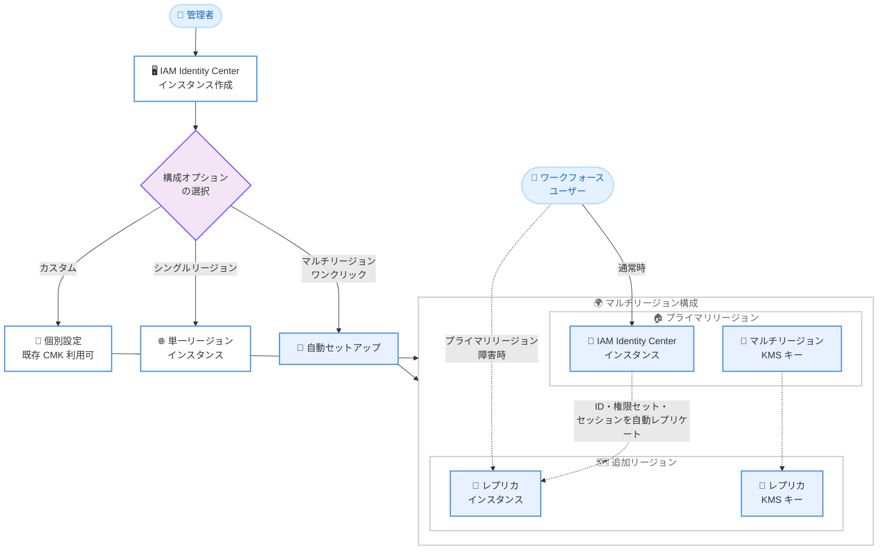

# AWS IAM Identity Center - 新規組織インスタンスのワンクリックマルチリージョンオプション

**リリース日**: 2026 年 8 月 7 日
**サービス**: AWS IAM Identity Center
**機能**: 新規組織インスタンス作成時のワンクリックマルチリージョンオプション

📊 [このアップデートのインフォグラフィックを見る](https://takech9203.github.io/aws-news-summary/20260807-aws-iam-identity-center-supports-one-click-multi-region-option-new-organization-instances.html)

## 概要

AWS IAM Identity Center の新規組織インスタンスを作成する際に、ワンクリックでマルチリージョンサポートを有効化できるようになりました。従来、マルチリージョン構成を行うには、カスタマーマネージド KMS キーの作成、キーポリシーの設定、リージョンの手動追加といった複数のステップが必要でしたが、今回のアップデートによりインスタンス作成時に自動で構成できます。

新規インスタンス作成時には、次の 3 つの構成オプションから選択できます。シングルリージョンインスタンス、マルチリージョンインスタンス (カスタマーマネージドのマルチリージョン KMS キーを自動作成し、追加リージョンへインスタンスをレプリケート)、およびカスタム (リージョン設定を個別に構成し、既存のカスタマーマネージド KMS キーも利用可能) です。

マルチリージョン構成により、プライマリリージョンで障害が発生した場合でも、ワークフォースユーザーは AWS アカウントやアプリケーションへのアクセスを継続できます。組織全体のシングルサインオン基盤の耐障害性を高めたい管理者にとって、導入のハードルが大幅に下がるアップデートです。

**アップデート前の課題**

- マルチリージョン構成には、カスタマーマネージド KMS キーの作成、キーポリシーの設定、リージョンの手動追加など複数のステップが必要だった
- 手順が複雑なため、設定ミスや構成漏れのリスクがあった
- 新規インスタンス作成時に耐障害性を考慮した構成を簡単に選択する手段がなかった

**アップデート後の改善**

- 新規組織インスタンス作成時に、ワンクリックでマルチリージョンサポートを有効化できるようになった
- マルチリージョンオプションを選択すると、カスタマーマネージドのマルチリージョン KMS キーが自動作成され、追加リージョンへのレプリケーションも自動で構成される
- カスタムオプションにより、既存のカスタマーマネージド KMS キーを使用した柔軟な構成も引き続き可能

## アーキテクチャ図



新規インスタンス作成時にマルチリージョンオプションを選択すると、マルチリージョン KMS キーの作成と追加リージョンへのレプリケーションが自動で構成され、プライマリリージョン障害時もユーザーはレプリカ経由でアクセスを継続できます。

## サービスアップデートの詳細

### 主要機能

1. **ワンクリックマルチリージョンオプション**
   - 新規組織インスタンス作成時に、マルチリージョンサポートをワンクリックで有効化できる
   - カスタマーマネージドのマルチリージョン KMS キーを自動的にアカウント内に作成
   - インスタンスを追加リージョンへ自動的にレプリケート
   - 従来必要だった KMS キー作成、キーポリシー設定、リージョン手動追加の手順が不要

2. **3 つのインスタンス構成オプション**
   - **シングルリージョン**: 単一リージョンで動作する標準的なインスタンス
   - **マルチリージョン**: KMS キー作成とレプリケーションを自動構成
   - **カスタム**: リージョン設定を個別に構成し、アカウント内の既存カスタマーマネージド KMS キーを使用可能

3. **自動レプリケーションの対象**
   - ワークフォース ID、権限セット、ユーザー・グループの割り当て、セッション、その他のメタデータがプライマリリージョンから追加リージョンへ自動レプリケートされる
   - プライマリリージョンの障害時も、事前にプロビジョニングされた権限による AWS アカウントアクセスが継続可能

## 技術仕様

### マルチリージョンサポートの前提条件

| 項目 | 詳細 |
|------|------|
| インスタンスタイプ | 組織インスタンスのみ対応 (アカウントインスタンスは非対応) |
| ID ソース | 外部 IdP または Identity Center ディレクトリ (Active Directory は非対応) |
| 対応リージョン | デフォルトで有効な商用リージョン (オプトインリージョンは現時点で非対応) |
| KMS キー | マルチリージョンのカスタマーマネージド KMS キーが必要。IAM Identity Center と同一アカウント内に配置 |
| AWS マネージドアプリケーション | カスタマーマネージド KMS キー構成、および追加リージョンへのデプロイに対応している必要がある |
| 外部 IdP の要件 | 複数の ACS URL をサポートする IdP (Okta、Microsoft Entra ID、PingFederate、PingOne、JumpCloud など) が必要 |

### 構成オプションの比較

| オプション | KMS キー | レプリケーション | 主な用途 |
|-----------|---------|----------------|---------|
| シングルリージョン | 標準構成 | なし | 従来どおりの単一リージョン運用 |
| マルチリージョン | マルチリージョン CMK を自動作成 | 追加リージョンへ自動レプリケート | 手間なく耐障害性を確保 |
| カスタム | 既存の CMK を利用可能 | リージョン設定を個別構成 | 既存のキー管理ポリシーに準拠した構成 |

## 設定方法

### 前提条件

1. AWS Organizations が設定済みで、管理アカウントまたは委任管理者アカウントで操作すること
2. 組織インスタンスとして IAM Identity Center を新規作成すること
3. マルチリージョン構成を利用する場合、ID ソースが外部 IdP または Identity Center ディレクトリであること

### 手順

#### ステップ 1: IAM Identity Center コンソールで有効化を開始

IAM Identity Center コンソールを開き、デフォルトで有効な商用リージョンのいずれかをプライマリリージョンとして選択して、組織インスタンスの作成を開始します。

#### ステップ 2: インスタンス構成オプションの選択

インスタンス作成時に、以下の 3 つのオプションから構成を選択します。

- **シングルリージョン**: 単一リージョンのインスタンスを作成
- **マルチリージョン**: ワンクリックでマルチリージョン KMS キーの自動作成と追加リージョンへのレプリケーションを構成
- **カスタム**: リージョン設定を個別に構成 (既存のカスタマーマネージド KMS キーを指定可能)

#### ステップ 3: 追加リージョンの選択と構成の確認

マルチリージョンまたはカスタムを選択した場合、レプリケート先の追加リージョンを指定します。追加リージョンの選択にあたっては、以下を考慮します。

- **耐障害性**: プライマリリージョンから地理的に離れたリージョンを選択
- **コンプライアンス**: データレジデンシー要件があるリージョンを選択
- **パフォーマンス**: アプリケーションユーザーに近いリージョンを選択
- **アプリケーション対応**: 利用する AWS マネージドアプリケーションが対象リージョンで利用可能か確認

作成が完了すると、ワークフォース ID、権限セット、割り当てなどが追加リージョンへ自動的にレプリケートされます。

## メリット

### ビジネス面

- **事業継続性の向上**: プライマリリージョンの障害時もワークフォースの AWS アカウントアクセスが継続され、業務停止リスクを低減できる
- **導入コストの削減**: 複雑な手動設定が不要となり、マルチリージョン構成の導入・運用にかかる工数を削減できる
- **データレジデンシー対応**: AWS マネージドアプリケーションを希望するリージョンにデプロイでき、コンプライアンス要件に対応しやすくなる

### 技術面

- **設定ミスの防止**: KMS キーの作成やキーポリシーの設定が自動化され、手動設定に起因する構成ミスを回避できる
- **自動レプリケーション**: ワークフォース ID、権限セット、割り当て、セッションなどが自動的にレプリケートされ、整合性が維持される
- **柔軟な構成**: カスタムオプションにより、既存のカスタマーマネージド KMS キーを使用した組織のキー管理ポリシーに沿った構成も可能

## デメリット・制約事項

### 制限事項

- 組織インスタンスのみが対象で、アカウントインスタンスではマルチリージョンサポートを利用できない
- ID ソースに Active Directory を使用しているインスタンスでは利用できない
- オプトインリージョンは現時点で非対応 (デフォルトで有効な商用 17 リージョンのみ)
- レプリケート可能なリージョン数にはクォータがある

### 考慮すべき点

- ワンクリックのマルチリージョンオプションは新規の組織インスタンス作成時のオプションであり、既存インスタンスのマルチリージョン化は従来どおり前提条件を満たした上での構成が必要
- 外部 IdP を利用する場合、マルチリージョンサポートを最大限活用するには複数の ACS URL をサポートする IdP が必要 (Google Workspace など非対応の IdP では一部機能に制約がある)
- 利用中のすべての AWS マネージドアプリケーションがカスタマーマネージド KMS キー構成に対応している必要がある
- 自動作成されるカスタマーマネージド KMS キーには標準の AWS KMS 料金が発生する

## ユースケース

### ユースケース 1: 新規導入企業のシングルサインオン基盤を最初から高可用構成にする

**シナリオ**: AWS の利用を開始する企業が、IAM Identity Center による組織全体のシングルサインオン基盤を新規構築する。将来の障害に備え、最初から耐障害性の高い構成にしたい。

**実装例**:
```
1. 管理アカウントで IAM Identity Center コンソールを開く
2. プライマリリージョンとして東京から地理的に近いリージョンを選択
3. インスタンス作成時に「マルチリージョン」オプションを選択
4. 追加リージョンを指定して作成 (KMS キーとレプリケーションは自動構成)
```

**効果**: 手動での KMS キー作成やポリシー設定なしに、作成直後から耐障害性を備えたシングルサインオン基盤を利用できる。

### ユースケース 2: プライマリリージョン障害時のアクセス継続

**シナリオ**: グローバル展開する企業で、プライマリリージョンの IAM Identity Center に障害が発生した場合でも、運用チームが各 AWS アカウントへアクセスして業務を継続する必要がある。

**実装例**:
```
1. マルチリージョンオプションで組織インスタンスを作成
2. プライマリリージョンから地理的に離れた追加リージョンを選択
3. 権限セットとユーザー割り当てを通常どおり管理
   (追加リージョンへ自動レプリケート)
4. 障害時は追加リージョンのアクセスポータル経由でサインイン
```

**効果**: プライマリリージョンの障害時も、事前にプロビジョニングされた権限で AWS アカウントへのアクセスを継続でき、インシデント対応や業務が停止しない。

### ユースケース 3: 既存のキー管理ポリシーに準拠したカスタム構成

**シナリオ**: 金融機関など厳格なキー管理要件を持つ組織が、自社で管理する既存のカスタマーマネージド KMS キーを使用して IAM Identity Center を構成し、データレジデンシー要件のあるリージョンにアプリケーションをデプロイしたい。

**実装例**:
```
1. 事前に組織のポリシーに沿ったマルチリージョン CMK を作成
2. インスタンス作成時に「カスタム」オプションを選択
3. 既存の CMK を指定し、リージョン設定を個別に構成
4. データレジデンシー要件を満たすリージョンに
   AWS マネージドアプリケーションをデプロイ
```

**効果**: 組織のキー管理ポリシーとコンプライアンス要件を満たしながら、マルチリージョン構成の利便性を享受できる。

## 料金

IAM Identity Center 自体は無料で利用できます。ただし、マルチリージョンオプションで自動作成されるカスタマーマネージド KMS キーには、標準の AWS KMS 料金が適用されます。

### 料金例

| 項目 | 料金 (概算) |
|------|------------|
| IAM Identity Center | 無料 |
| カスタマーマネージド KMS キー | 1 キーあたり月額 1 USD (レプリカキーも同様に課金) |
| KMS API リクエスト | 標準の KMS リクエスト料金が適用 |

詳細は [AWS KMS 料金ページ](https://aws.amazon.com/kms/pricing/) を参照してください。

## 利用可能リージョン

デフォルトで有効な商用 17 リージョンの組織インスタンスで利用可能です。オプトインリージョンは現時点で対象外です。対象リージョンの一覧は [AWS アカウントのリージョン管理ドキュメント](https://docs.aws.amazon.com/accounts/latest/reference/manage-acct-regions.html#manage-acct-regions-regional-availability) を参照してください。

## 関連サービス・機能

- **AWS KMS**: マルチリージョンオプションで自動作成されるマルチリージョンのカスタマーマネージドキーにより、保管データの暗号化を実現
- **AWS Organizations**: IAM Identity Center の組織インスタンスは Organizations と統合され、組織全体のアカウントアクセス管理を提供
- **AWS マネージドアプリケーション**: Amazon Q Developer や Amazon QuickSight などのアプリケーションを、レプリケートされたワークフォース ID を利用して追加リージョンにデプロイ可能
- **外部 IdP (Okta、Microsoft Entra ID など)**: 複数の ACS URL をサポートする IdP と連携することで、マルチリージョン構成の利点を最大限活用可能

## 参考リンク

- 📊 [インフォグラフィック](https://takech9203.github.io/aws-news-summary/20260807-aws-iam-identity-center-supports-one-click-multi-region-option-new-organization-instances.html)
- [公式発表 (What's New)](https://aws.amazon.com/about-aws/whats-new/2026/08/aws-iam-identity-center-supports-one-click-multi-region-option-new-organization-instances)
- [ドキュメント: IAM Identity Center の有効化](https://docs.aws.amazon.com/singlesignon/latest/userguide/enable-identity-center.html)
- [ドキュメント: 複数の AWS リージョンでの IAM Identity Center の利用](https://docs.aws.amazon.com/singlesignon/latest/userguide/multi-region-iam-identity-center.html)
- [製品ページ: AWS IAM Identity Center](https://aws.amazon.com/iam/identity-center/)
- [料金ページ: AWS KMS](https://aws.amazon.com/kms/pricing/)

## まとめ

今回のアップデートにより、IAM Identity Center の新規組織インスタンスでマルチリージョン構成をワンクリックで有効化できるようになり、シングルサインオン基盤の耐障害性向上が大幅に容易になりました。これから IAM Identity Center を導入する組織は、作成時にマルチリージョンオプションの選択を検討することを推奨します。既存のキー管理要件がある場合はカスタムオプションを利用し、前提条件 (組織インスタンス、対応 ID ソース、対応リージョン) を事前に確認してください。
