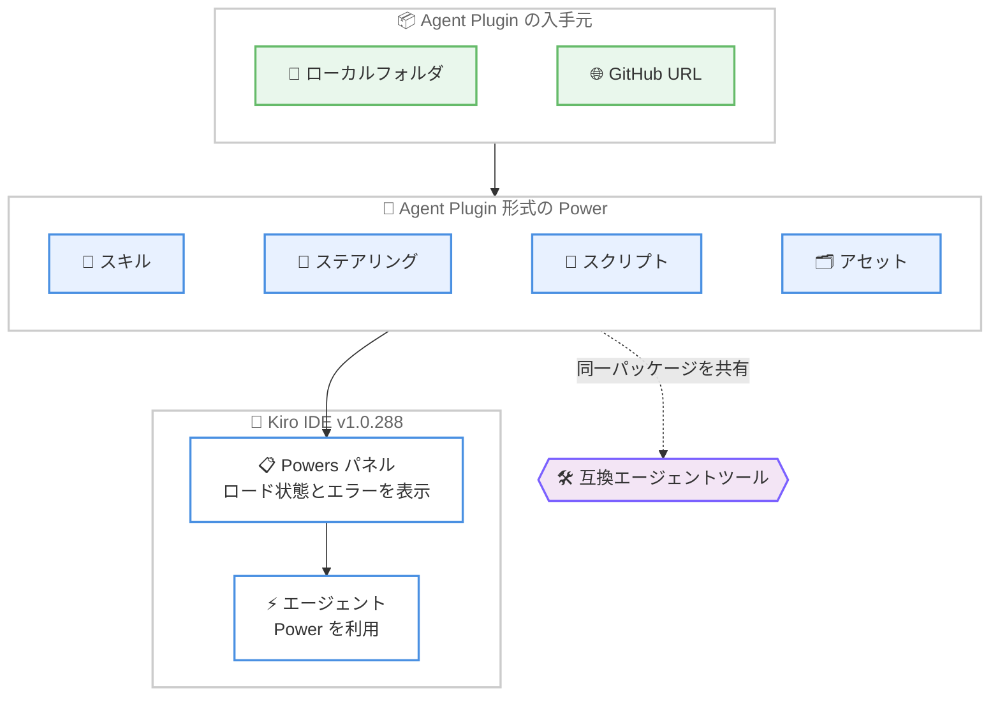

# Kiro - Agent Plugin 形式の Powers サポートとセッションピン留め

**リリース日**: 2026 年 8 月 7 日
**サービス**: Kiro (Kiro IDE v1.0.288)
**機能**: Agent Plugin Support and Session Pinning

📊 [このアップデートのインフォグラフィックを見る](https://takech9203.github.io/aws-news-summary/20260807-kiro-changelog-2026-08-07.html)

## 概要

Kiro IDE v1.0.288 がリリースされ、オープンな Agent Plugin 形式でパッケージ化された Powers のサポートが追加されました。ローカルフォルダまたは GitHub URL から Agent Plugin をインストールでき、プラグインにバンドルされたスキル、ステアリング、スクリプト、アセットが Kiro に取り込まれます。これにより、互換性のあるエージェントツール間で Powers を共有しやすくなります。

あわせて、Agent Focus Mode のセッションレールが強化されました。セッションのピン留め、既存セッションの Kiro CLI への引き継ぎ、アプリ内アップデートの通知と Check for Updates ボタンが追加されています。さらに、ベースエディタが Code OSS v1.108.2 から v1.109.5 に更新され、信頼していないワークスペースにおける Spec ホバーや MCP インストールの安全性向上、チャット履歴の一括移行、モデルエラーからの安定した復旧なども含まれています。

**アップデート前の課題**

このアップデート以前には、以下の課題がありました。

- Powers は Kiro 独自の形式に依存しており、他の互換エージェントツールとの間でパッケージを共有しにくかった
- Agent Focus Mode のセッションレールで重要なセッションを目立つ位置に固定できず、IDE のセッションを Kiro CLI で再開する手段もなかった
- `kiro://` リンクから MCP サーバーをインストールする際に、設定に書き込まれる内容を事前に確認できなかった
- 移行前のチャットセッションを 1 件ずつ移行する必要があった
- 応答のストリーミング開始前に発生した失敗が自動リトライされず、ネットワークエラーの分類も不正確でメッセージが実際の原因を反映しないことがあった

**アップデート後の改善**

今回のアップデートにより、以下が可能になりました。

- オープンな Agent Plugin 形式の Powers をローカルフォルダまたは GitHub URL からインストールし、バンドルされたスキル、ステアリング、スクリプト、アセットを利用できるようになった
- Pin Session でセッションをセクションの先頭に固定し、Open with Kiro CLI で既存セッションを Kiro CLI で再開できるようになった
- 新しいバージョンが利用可能になるとレールのフッターにアップデート行が表示され、設定パネルの Check for Updates ボタンで更新を確認できるようになった
- `kiro://` リンクからの MCP インストール時に、コマンド、引数、環境変数やヘッダーの名前 (値は非表示) を確認ダイアログで確認してから設定に書き込めるようになった
- Migrate All ボタンで移行前のセッションを一括移行できるようになった

## アーキテクチャ図



Agent Plugin 形式の Powers のインストールフローを示しています。ローカルフォルダまたは GitHub URL から取得したプラグインのスキル、ステアリング、スクリプト、アセットが Kiro に取り込まれ、同じパッケージを互換性のあるエージェントツールでも共有できます。

## サービスアップデートの詳細

### 主要機能

1. **Agent Plugin 形式の Powers サポート**
   - オープンな Agent Plugin 形式でパッケージ化された Powers を、ローカルフォルダまたは GitHub URL からインストールできる
   - プラグインにバンドルされたスキル、ステアリング、スクリプト、アセットが Kiro に取り込まれる
   - 互換性のあるエージェントツール間で Powers を共有しやすくなる
   - Powers パネルには各 Power が実際にロードされたかどうかが表示され、ロードエラーや個々のコンポーネントの問題も確認できる。Agent Plugin 自身の `mcp.json` をパネルから開くこともできる

2. **Agent Focus Mode のセッションピン留めと管理**
   - Pin Session でセッションをセクションの先頭に固定できる
   - Open with Kiro CLI で既存のセッションを Kiro CLI で再開できる
   - 新しいバージョンの Kiro が利用可能になると、レールのフッターにアップデート行が表示される。設定パネルには Check for Updates ボタンが追加された
   - コンテキストパネルの Spec ドキュメントとタスク行を、エディタで直接開けるようになった

3. **信頼していないワークスペースコンテンツの安全な取り扱い**
   - `kiro://` リンクから MCP サーバーをインストールする際、設定に書き込まれる前に確認ダイアログが開き、コマンド、引数、環境変数やヘッダーの名前 (値は非表示) を確認できる
   - Spec ファイルの内容はホバーツールチップ内でリテラルテキストとしてレンダリングされる
   - 信頼していないワークスペースでは、Spec ホバーにクリック可能なリンクが含まれない
   - リモートホストへの接続時に信頼確認のプロンプトが表示され、Trust and Connect、Don't Connect、Always trust this remote host (マシンごとに記憶) を選択できる

4. **Code OSS v1.109.5 へのアップグレード**
   - ベースエディタが Code OSS v1.108.2 から v1.109.5 に更新された
   - `terminal.integrated.stickyScroll.ignoredCommands` でターミナルのスティッキースクロールから特定のコマンドを除外できる
   - `editorBracketMatch.foreground` で対応する括弧の色を変更できる
   - `terminal.integrated.allowInUntrustedWorkspace` で、信頼していないワークスペースでのターミナル利用をオプトインできる

5. **チャット履歴の一括移行とエラー復旧の安定化**
   - Migrate All ボタンにより、アップグレード前の残りのセッションをライブ進捗表示付きで一括移行できる。移行が必要なレガシーセッションだけに絞り込むフィルタも追加された
   - 応答のストリーミング開始前に発生した失敗は自動的にリトライされる
   - ネットワークエラーの分類が精緻化され、表示されるメッセージが実際の原因を反映するようになった

6. **エージェントとステアリングの改善**
   - エージェントが、OS のデフォルトを想定するのではなく、実際に実行しているシェルに合わせてターミナルコマンドを記述するようになった
   - `grep_search` と `file_search` が IDE 自身の検索を通じて実行され、結果がエディタから見える内容と一致するようになった
   - Spec ワークフローがフェーズ間でチェックインのために一時停止し、Spec セッションでも Default エージェントと同じコードベース探索ツールが利用できるようになった
   - Quick Spec 完了メッセージに `Run required tasks`、`Run required and optional tasks`、`Analyze the requirements first` のリンクが表示され、同じチャットセッションで続行できる
   - `kiroAgent.agentIgnoreFiles` の編集がリロードなしで実行中のセッションに反映され、無視ルールが読み取りだけでなく書き込みにも適用され、無効なエントリはエラーとして表示される
   - ステアリングディレクトリに置かれた `AGENTS.md` ファイルが通常のステアリングとして読み込まれる
   - カスタムエージェントプロファイルが Kiro CLI 形式のフックを受け付けるため、Kiro CLI 向けに作成したプロファイルをフックの書き換えなしで IDE で利用できる
   - フックが `confirmCommand` により実行時に確認オプションを提供できるようになった
   - 要求されたエージェントが使用できない場合、単に「見つからない」ではなく理由が表示されるようになった

7. **主な修正**
   - 長い複数行コマンドが途中で切れ、ターミナルが `heredoc>` や `dquote>` の継続プロンプトで停止する問題を修正
   - コマンド終了後にシェルプロセスが残留する問題、および Windows のアップデータが実行中のコピーを更新せず別の場所に 2 つ目の Kiro をインストールする問題を修正
   - セッション途中のエージェント切り替えが反映されず、前のエージェントが次のターンを実行する問題を修正
   - ワークスペースに保存した `Always Allow` ルールが以降のセッションで適用されない問題、および `--flag=value` 構文の PowerShell コマンドで `Always Allow` が保持されない問題を修正
   - 外部 ID プロバイダーのセッション失効後、サインイン状態のまま操作できなくなる問題を修正 (サインインページに戻るようになった)
   - Kiro の設定ディレクトリ外にある `mcp.json` ファイルをエージェントが作成・編集できない問題を修正

## 技術仕様

### 対象バージョン

| 項目 | 詳細 |
|------|------|
| 製品 | Kiro IDE |
| バージョン | 1.0.288 (2026 年 8 月 7 日) |
| ベースエディタ | Code OSS v1.109.5 (v1.108.2 から更新) |
| Agent Plugin のインストール元 | ローカルフォルダ、GitHub URL |

### 追加・変更された主な設定項目

| 設定 / 機能 | 説明 |
|------|------|
| `terminal.integrated.stickyScroll.ignoredCommands` | ターミナルのスティッキースクロールから特定コマンドを除外する |
| `editorBracketMatch.foreground` | 対応する括弧の色をカスタマイズする |
| `terminal.integrated.allowInUntrustedWorkspace` | 信頼していないワークスペースでのターミナル利用をオプトインする |
| `kiroAgent.agentIgnoreFiles` | 編集がリロードなしで実行中のセッションに反映され、書き込みにも適用される |
| `confirmCommand` | フックが実行時に確認オプションを動的に提供できる |

## 設定方法

### 前提条件

1. Kiro IDE v1.0.288 以降がインストールされていること
2. Agent Plugin をインストールする場合、ローカルフォルダまたは GitHub URL でプラグインが提供されていること
3. Agent Focus Mode の機能を使用する場合、Agent Focus Mode (実験的機能) が有効であること

### 手順

#### ステップ 1: Kiro を最新バージョンに更新

Agent Focus Mode のレールフッターに表示されるアップデート行、または設定パネルの Check for Updates ボタンから更新を確認し、v1.0.288 に更新します。

#### ステップ 2: Agent Plugin 形式の Power をインストール

Powers パネルから、ローカルフォルダまたは GitHub URL を指定して Agent Plugin 形式の Power をインストールします。インストール後、Powers パネルで各 Power のロード状態 (ロードエラーや個々のコンポーネントの問題を含む) を確認できます。

#### ステップ 3: Agent Focus Mode でセッションを管理

Agent Focus Mode のセッションレールで、重要なセッションに対して Pin Session を実行し、セクションの先頭に固定します。CLI で作業を続けたいセッションでは Open with Kiro CLI を選択し、Kiro CLI で再開します。

## メリット

### ビジネス面

- **エコシステムの相互運用性**: オープンな Agent Plugin 形式により、Powers を互換性のあるエージェントツール間で共有でき、社内資産の再利用性が高まる
- **セキュリティリスクの低減**: MCP インストールの確認ダイアログや信頼していないワークスペースでの制限により、悪意あるコンテンツによる設定改変やリンク誘導のリスクを抑制できる
- **運用負荷の軽減**: チャット履歴の一括移行やアプリ内アップデート通知により、バージョンアップに伴う移行作業の手間が減る

### 技術面

- **プラグインの配布容易性**: ローカルフォルダや GitHub URL から直接インストールでき、スキル、ステアリング、スクリプト、アセットを 1 つのパッケージとして配布できる
- **IDE と CLI のシームレスな連携**: Open with Kiro CLI や CLI 形式フックのサポートにより、IDE と Kiro CLI をまたいだワークフローを構築しやすい
- **エラー復旧の安定性**: ストリーミング開始前の失敗の自動リトライと精緻なネットワークエラー分類により、長時間のエージェントセッションが安定する

## デメリット・制約事項

### 制限事項

- 本リリースは Kiro IDE のアップデートであり、Kiro CLI 本体の機能は対象外 (ただし Kiro CLI 2.16.2 では Agent Plugin 形式の Powers が V3 セッションで読み込まれるようになっている)
- セッションピン留めや Kiro CLI への引き継ぎは Agent Focus Mode (実験的機能) のセッションレールの機能である
- MCP インストールの確認ダイアログでは、環境変数やヘッダーは名前のみが表示され、値は非表示となる

### 考慮すべき点

- Agent Plugin を GitHub URL からインストールする場合、提供元の信頼性を確認することが推奨される。Powers パネルのロード状態表示でコンポーネントの問題を確認できる
- Code OSS のバージョン更新 (v1.108.2 から v1.109.5) に伴い、拡張機能の互換性を確認することが推奨される
- `kiroAgent.agentIgnoreFiles` の無視ルールが書き込みにも適用されるようになったため、既存のワークフローで意図しないブロックが発生しないか確認するとよい

## ユースケース

### ユースケース 1: チーム標準の Power を複数ツールで共有

**シナリオ**: 社内のコーディング規約やレビュー手順をスキルとステアリングにまとめ、Kiro IDE と他の互換エージェントツールの両方で利用したい。

**実装例**:
```
1. スキル、ステアリング、スクリプト、アセットを Agent Plugin 形式でパッケージ化
2. 社内 GitHub リポジトリで公開
3. 各メンバーが Powers パネルから GitHub URL を指定してインストール
4. Powers パネルでロード状態を確認
```

**効果**: 単一のパッケージをチーム全体および互換ツール間で共有でき、エージェントの振る舞いを標準化できる。

### ユースケース 2: 長時間タスクのセッション管理と CLI への引き継ぎ

**シナリオ**: Agent Focus Mode で複数のセッションを並行して進めており、重要なセッションをすぐ開ける場所に固定したい。また、離席後はターミナルから作業を続けたい。

**実装例**:
```
1. 重要なセッションで Pin Session を実行し、セクション先頭に固定
2. ターミナルで続きを行う場合は Open with Kiro CLI を選択
3. Kiro CLI 上で同じセッションを再開して作業を継続
```

**効果**: セッションの見失いを防ぎ、IDE と CLI の間でコンテキストを失わずに作業環境を切り替えられる。

### ユースケース 3: 信頼していないリポジトリの安全な調査

**シナリオ**: 外部から取得したリポジトリを調査する際、悪意ある Spec コンテンツや `kiro://` リンクによる設定改変を防ぎたい。

**実装例**:
```
1. ワークスペースを信頼しない状態で開く
2. Spec ホバーはリテラルテキストとして表示され、クリック可能なリンクは含まれない
3. kiro:// リンクからの MCP インストール時は、確認ダイアログでコマンドと引数を確認してから承認
```

**効果**: 信頼していないコンテンツによる意図しない設定変更やリンク誘導を防ぎ、安全にコードを調査できる。

## 利用可能リージョン

グローバル (Kiro はリージョンに依存しないサービスです)

## 関連サービス・機能

- **Kiro Powers**: エージェントの能力を拡張するパッケージ。今回のアップデートでオープンな Agent Plugin 形式に対応した
- **Kiro CLI**: v2.16.2 (2026 年 8 月 6 日) で Agent Plugin 形式の Powers が V3 セッションで読み込まれるようになり、IDE と CLI の両方で同じプラグインを利用できる
- **Agent Focus Mode**: エージェントセッションの管理に特化した実験的な UI モード。今回のアップデートでセッションピン留めや Kiro CLI への引き継ぎが追加された
- **MCP (Model Context Protocol)**: `kiro://` リンクからのサーバーインストール時の確認ダイアログが追加され、安全性が向上した

## 参考リンク

- 📊 [インフォグラフィック](https://takech9203.github.io/aws-news-summary/20260807-kiro-changelog-2026-08-07.html)
- [Kiro Changelog: Agent Plugin Support and Session Pinning](https://kiro.dev/changelog/ide/1-0-288/)
- [Kiro Changelog](https://kiro.dev/changelog/)
- [Kiro ドキュメント: Powers](https://kiro.dev/docs/powers)
- [Kiro ドキュメント: Agent Focus Mode](https://kiro.dev/docs/experimental/focus-mode)
- [Kiro ドキュメント: MCP](https://kiro.dev/docs/mcp)
- [Kiro ドキュメント: Steering](https://kiro.dev/docs/steering)

## まとめ

Kiro IDE v1.0.288 は、オープンな Agent Plugin 形式による Powers の共有と、Agent Focus Mode のセッション管理強化を柱とするアップデートです。プラグインの相互運用性が高まる一方、信頼していないワークスペースコンテンツの取り扱いも強化されており、エコシステムの拡大と安全性の両面で重要なリリースです。Powers を活用しているチームは Agent Plugin 形式でのパッケージ化を検討し、Agent Focus Mode を利用している場合はピン留めと Kiro CLI 連携を試すことを推奨します。
