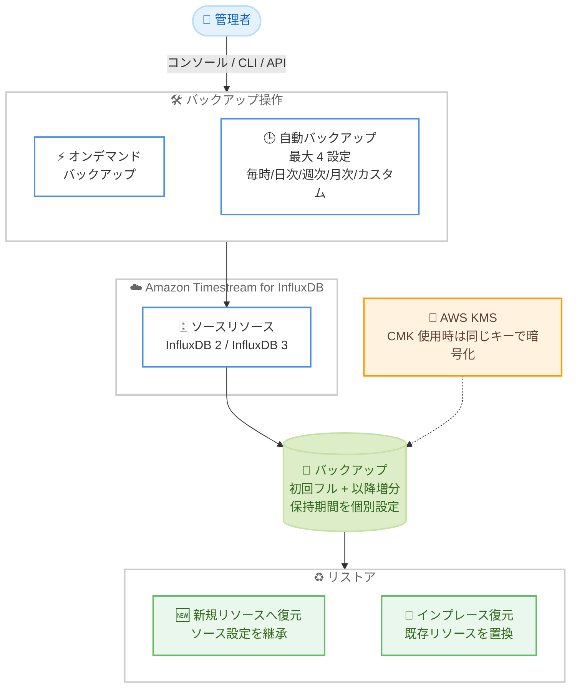

# Amazon Timestream for InfluxDB - バックアップ・リストア機能

**リリース日**: 2026 年 8 月 7 日
**サービス**: Amazon Timestream for InfluxDB
**機能**: カスタマー主導のバックアップおよびリストア (Backup and Restore)

📊 [このアップデートのインフォグラフィックを見る](https://takech9203.github.io/aws-news-summary/20260807-timestream-influxdb-backup-restore.html)

## 概要

Amazon Timestream for InfluxDB が、カスタマー主導のバックアップ・リストア機能をサポートしました。ユーザー自身がバックアップを作成・管理し、必要なタイミングでデータをリストアできるようになります。InfluxDB 2 エンジンと InfluxDB 3 エンジンの両方に対応し、AWS マネジメントコンソール、AWS CLI、Timestream for InfluxDB API から利用できます。

本機能では、リスクの高い移行や設定変更の前に取得するワンタイムのオンデマンドバックアップに加え、スケジュールに基づく自動バックアップを設定できます。自動バックアップはリソースごとに最大 4 つの設定を持つことができ、毎時・日次・週次・月次・カスタムスケジュールから選択し、それぞれに個別の保持期間を設定可能です。初回バックアップはデータベースの完全コピーとなり、以降は増分バックアップとなるため、稼働中のワークロードへのパフォーマンス影響を最小限に抑えられます。

リストアは、ソースの設定を引き継いだ新しいリソースとして復元する方法と、既存リソースを置き換える方法 (インプレースリストア) の 2 種類から選択できます。IoT データやアプリケーションメトリクスなどの時系列データを Timestream for InfluxDB で運用するユーザーにとって、データ保護と災害復旧の運用が大幅に簡素化されるアップデートです。

**アップデート前の課題**

このアップデート以前は、Timestream for InfluxDB のバックアップ運用に以下の課題がありました。

- ユーザーが任意のタイミングでバックアップを取得・管理するネイティブな仕組みがなく、`influx backup` コマンドや外部エクスポートなどの独自の仕組みを構築する必要があった
- リスクの高い移行や設定変更の前に、簡単に復元ポイントを作成する手段がなかった
- バックアップの頻度や保持期間を要件に合わせて柔軟に制御することが困難だった

**アップデート後の改善**

今回のアップデートにより、以下が可能になりました。

- コンソール・CLI・API からワンタイムのオンデマンドバックアップを取得できるようになった
- リソースごとに最大 4 つの自動バックアップ設定 (毎時・日次・週次・月次・カスタムスケジュール) を、それぞれ個別の保持期間付きで構成できるようになった
- 初回のフルコピー以降は増分バックアップとなり、パフォーマンス影響を抑えながら高頻度のバックアップが可能になった
- 新規リソースへのリストアと既存リソースを置き換えるインプレースリストアを選択できるようになった

## アーキテクチャ図



オンデマンドまたは自動スケジュールでソースリソースのバックアップを取得し、新規リソースへの復元またはインプレース復元を選択できる構成を示しています。CMK で暗号化されたソースのバックアップは同じ KMS キーで暗号化されます。

## サービスアップデートの詳細

### 主要機能

1. **オンデマンドバックアップ**
   - 任意のタイミングでワンタイムのバックアップを作成可能
   - リスクの高い移行や設定変更の前の復元ポイント作成に有効
   - `CreateDbBackup` API で名前・対象リソース・保持日数 (retentionDays)・タグを指定して作成

2. **自動バックアップ設定 (最大 4 つ)**
   - リソースごとに最大 4 つの自動バックアップ設定を構成可能
   - スケジュールタイプ: 毎時 (HOURLY)・日次 (DAILY)・週次 (WEEKLY)・月次 (MONTHLY)・カスタムスケジュール (CUSTOM_SCHEDULE)
   - 各設定に個別の保持期間 (retentionDays) を指定可能
   - `CreateDbInstance` / `CreateDbCluster` での新規作成時、または `UpdateDbInstance` / `UpdateDbCluster` での既存リソース更新時に設定可能

3. **増分バックアップ**
   - 初回バックアップはデータベースの完全コピー (フルバックアップ)
   - 2 回目以降は増分バックアップとなり、実行中のワークロードへのパフォーマンス影響を軽減

4. **柔軟なリストアオプション**
   - **新規リソースへの復元 (NEW_RESOURCE)**: ソースリソースの設定を継承した新しいインスタンス/クラスターとして復元
   - **インプレース復元 (REPLACE_EXISTING)**: 既存リソースを置き換えて復元
   - `RestoreFromDbBackup` API では VPC サブネット、セキュリティグループ、ポート、デプロイタイプなどの上書き指定も可能

5. **KMS 暗号化との統合**
   - カスタマーマネージドキー (CMK) で暗号化されたソースリソースのバックアップは、同じ KMS キーで暗号化される
   - 今回の API リリースでは、新規 DbInstance / DbCluster 作成時の CMK 暗号化 (`kmsKeyId` パラメータ) のサポートも追加

6. **両エンジン対応**
   - InfluxDB 2 エンジンと InfluxDB 3 エンジン (Core / Enterprise) の両方をサポート
   - シングル AZ、マルチ AZ スタンバイ、マルチノードリードレプリカの各デプロイタイプに対応

## 技術仕様

### バックアップ仕様

| 項目 | 詳細 |
|------|------|
| バックアップ種別 | オンデマンド (ON_DEMAND)、自動 (HOURLY / DAILY / WEEKLY / MONTHLY / CUSTOM_SCHEDULE) |
| 自動バックアップ設定数 | リソースあたり最大 4 つ |
| 保持期間 | 設定ごとに個別指定 (retentionDays) |
| バックアップ方式 | 初回フルコピー、以降は増分 |
| 対象エンジン | INFLUXDB_V2、INFLUXDB_V3_CORE、INFLUXDB_V3_ENTERPRISE |
| 対象デプロイタイプ | SINGLE_AZ、WITH_MULTIAZ_STANDBY、MULTI_NODE_READ_REPLICAS |
| リストアモード | NEW_RESOURCE (新規リソース)、REPLACE_EXISTING (インプレース) |
| 暗号化 | CMK 暗号化ソースのバックアップは同一 KMS キーを使用 |
| 削除時のオプション | `retainAutomatedBackups` で削除後も自動バックアップの保持が可能 |
| 操作インターフェース | AWS マネジメントコンソール、AWS CLI、Timestream for InfluxDB API |

### API変更履歴

| 日付 | サービス | 変更内容 |
|------|----------|----------|
| 2026/08/03 | [Timestream InfluxDB](https://awsapichanges.com/archive/changes/9e1c25-timestream-influxdb.html) | 5 new 13 updated api methods - カスタマー主導のバックアップ・リストア、および新規 DbInstance / DbCluster の CMK 暗号化のサポートを追加 |

**新規 API (5 つ):**

| API | 説明 |
|-----|------|
| `CreateDbBackup` | オンデマンドバックアップの作成 |
| `GetDbBackup` | バックアップの詳細取得 |
| `ListDbBackups` | 対象リソースのバックアップ一覧取得 |
| `DeleteDbBackup` | バックアップの削除 |
| `RestoreFromDbBackup` | バックアップからのリストア (新規 / インプレース) |

**主な更新 API:** `CreateDbInstance` / `CreateDbCluster` / `UpdateDbInstance` / `UpdateDbCluster` に `dbBackupConfigurations` パラメータが追加され、`DeleteDbInstance` / `DeleteDbCluster` に `retainAutomatedBackups` が追加されました。また、リソースステータスに `RESTORING` / `RESTORE_FAILED` が追加されています。

## 設定方法

### 前提条件

1. Amazon Timestream for InfluxDB の DB インスタンスまたは DB クラスターが作成済みであること
2. AWS CLI が最新バージョンに更新されていること (新 API を利用する場合)
3. IAM ユーザー/ロールに Timestream for InfluxDB のバックアップ関連 API の実行権限があること
4. CMK 暗号化を使用する場合、対象 KMS キーへのアクセス権限があること

### 手順

#### ステップ1: オンデマンドバックアップの作成

```bash
aws timestream-influxdb create-db-backup \
  --name "pre-migration-backup" \
  --db-resource-id "db-XXXXXXXXXX" \
  --retention-days 30 \
  --tags Purpose=Migration
```

指定した DB リソースのオンデマンドバックアップを作成します。`--retention-days` でバックアップの保持日数を指定し、期限を過ぎたバックアップは自動的に削除されます。移行や設定変更などのリスクの高い操作の前に実行することを推奨します。

#### ステップ2: 自動バックアップ設定の追加

```bash
aws timestream-influxdb update-db-instance \
  --identifier "db-XXXXXXXXXX" \
  --db-backup-configurations \
    '[{"type":"DAILY","retentionDays":7,"enabled":true},
      {"type":"WEEKLY","retentionDays":30,"enabled":true},
      {"type":"MONTHLY","retentionDays":365,"enabled":true}]'
```

既存の DB インスタンスに自動バックアップ設定を追加します。この例では、日次 (7 日保持)、週次 (30 日保持)、月次 (365 日保持) の 3 つの自動バックアップを構成しています。リソースあたり最大 4 つまで設定でき、`CUSTOM_SCHEDULE` タイプでは `customSchedule` によるカスタムスケジュールの指定も可能です。

#### ステップ3: バックアップの一覧確認

```bash
aws timestream-influxdb list-db-backups \
  --db-resource-id "db-XXXXXXXXXX"
```

対象リソースのバックアップ一覧を取得します。各バックアップのステータス (IN_PROGRESS / COMPLETED / FAILED など)、種別 (ON_DEMAND / DAILY など)、作成日時、有効期限を確認できます。

#### ステップ4: バックアップからのリストア

```bash
# 新規リソースとして復元
aws timestream-influxdb restore-from-db-backup \
  --name "restored-influxdb" \
  --db-backup-id "backup-XXXXXXXXXX" \
  --restore-mode NEW_RESOURCE

# 既存リソースを置き換えて復元 (インプレース)
aws timestream-influxdb restore-from-db-backup \
  --name "restored-influxdb" \
  --db-backup-id "backup-XXXXXXXXXX" \
  --restore-mode REPLACE_EXISTING
```

バックアップからデータをリストアします。`NEW_RESOURCE` モードではソース設定を継承した新規リソースが作成され、必要に応じて VPC サブネットやセキュリティグループ、デプロイタイプなどを上書き指定できます。`REPLACE_EXISTING` モードでは既存リソースが置き換えられます。リストア中はリソースのステータスが `RESTORING` になります。

## メリット

### ビジネス面

- **データ保護の強化**: 時系列データの復元ポイントをユーザー主導で管理でき、オペレーションミスや障害からの復旧手段が確保される
- **コンプライアンス対応**: 日次・週次・月次など複数の保持ポリシーを組み合わせることで、組織のデータ保持要件に柔軟に対応できる
- **運用コストの削減**: 独自のバックアップスクリプトや外部エクスポートの仕組みを構築・維持する必要がなくなる

### 技術面

- **増分バックアップによる低影響**: 初回以降は増分方式となるため、稼働中のワークロードへのパフォーマンス影響を抑えつつ高頻度のバックアップが可能
- **柔軟なリストアオプション**: 新規リソースへの復元とインプレース復元を使い分けることで、検証用途と本番復旧の両方に対応できる
- **KMS 統合による一貫した暗号化**: CMK 暗号化ソースのバックアップは同じキーで暗号化され、セキュリティポリシーの一貫性を維持できる
- **API による自動化**: CLI / API 対応により、CI/CD パイプラインへの組み込み (変更前バックアップの自動取得など) が容易

## デメリット・制約事項

### 制限事項

- 自動バックアップ設定はリソースあたり最大 4 つまで
- 初回バックアップはフルコピーとなるため、データ量によっては完了までに時間を要する可能性がある
- CMK 暗号化されたソースのバックアップは同じ KMS キーを使用するため、キーを削除・無効化するとリストアできなくなる

### 考慮すべき点

- バックアップの保持期間 (retentionDays) を過ぎると自動削除されるため、長期保持が必要なバックアップは適切な保持期間を設定する必要がある
- インプレース復元 (REPLACE_EXISTING) は既存リソースを置き換えるため、実行前に影響範囲を十分確認する必要がある
- リソース削除時に自動バックアップを保持するかどうかは `retainAutomatedBackups` で明示的に制御する
- バックアップストレージに関する料金は料金ページで確認が必要

## ユースケース

### ユースケース1: メジャーバージョン移行前の復元ポイント作成

**シナリオ**: InfluxDB 2 から InfluxDB 3 への移行や、インスタンスタイプ変更などのリスクの高い作業の前に、確実に元の状態へ戻せるようにしたい。

**実装例**:
```bash
# 移行作業直前にオンデマンドバックアップを取得
aws timestream-influxdb create-db-backup \
  --name "pre-upgrade-$(date +%Y%m%d)" \
  --db-resource-id "db-XXXXXXXXXX" \
  --retention-days 14
```

**効果**: 移行に問題が発生した場合でも、バックアップからインプレース復元することで迅速に元の状態へ戻せる。

### ユースケース2: IoT プラットフォームの多層バックアップポリシー

**シナリオ**: 製造業の IoT センサーデータを Timestream for InfluxDB に蓄積しており、短期の運用復旧用と長期のコンプライアンス用で異なる保持ポリシーが必要。

**実装例**:
```bash
aws timestream-influxdb update-db-instance \
  --identifier "db-XXXXXXXXXX" \
  --db-backup-configurations \
    '[{"type":"HOURLY","retentionDays":2,"enabled":true},
      {"type":"DAILY","retentionDays":14,"enabled":true},
      {"type":"MONTHLY","retentionDays":365,"enabled":true}]'
```

**効果**: 毎時バックアップで直近の障害に迅速に対応しつつ、月次バックアップで 1 年間の長期保持要件を満たす多層的なデータ保護を実現できる。

### ユースケース3: 本番データを使った検証環境の構築

**シナリオ**: 本番の時系列データを使用してクエリ性能のチューニングや新しいダッシュボードの検証を行いたいが、本番環境には影響を与えたくない。

**実装例**:
```bash
# 本番のバックアップから検証用の新規リソースを作成
aws timestream-influxdb restore-from-db-backup \
  --name "staging-influxdb" \
  --db-backup-id "backup-XXXXXXXXXX" \
  --restore-mode NEW_RESOURCE \
  --db-instance-type db.influx.large \
  --tags Environment=Staging
```

**効果**: 本番と同じデータを持つ検証環境を数ステップで構築でき、本番ワークロードに影響を与えずに検証作業を実施できる。

## 料金

What's New の発表には具体的な料金情報は記載されていません。バックアップストレージに関する料金の詳細は [Amazon Timestream 料金ページ](https://aws.amazon.com/timestream/pricing/) を参照してください。

## 利用可能リージョン

Amazon Timestream for InfluxDB が利用可能なすべての AWS リージョンで利用できます。対象リージョンの一覧は [AWS リージョン別サービス表](https://docs.aws.amazon.com/general/latest/gr/timestream.html) を参照してください。

## 関連サービス・機能

- **AWS KMS**: CMK で暗号化されたソースリソースのバックアップは同じ KMS キーで暗号化される。新規 DbInstance / DbCluster 作成時の CMK 暗号化も今回の API リリースでサポート
- **Amazon EventBridge**: Timestream for InfluxDB は 2026 年 7 月に EventBridge 統合をサポートしており、リソースのステータス変化 (RESTORING など) をイベントとして通知する運用と組み合わせられる
- **AWS Backup**: 他の AWS サービスの集中バックアップ管理サービス。Timestream for InfluxDB の本機能はサービスネイティブのバックアップとして提供される
- **Amazon RDS**: 自動バックアップ・スナップショットの概念が類似しており、RDS の運用経験があれば同様のモデルで理解しやすい

## 参考リンク

- 📊 [インフォグラフィック](https://takech9203.github.io/aws-news-summary/20260807-timestream-influxdb-backup-restore.html)
- [公式発表 (What's New)](https://aws.amazon.com/about-aws/whats-new/2026/07/timestream-influxdb-backup-restore/)
- [Amazon Timestream ドキュメント](https://docs.aws.amazon.com/timestream/)
- [API 変更詳細 (awsapichanges.com)](https://awsapichanges.com/archive/changes/9e1c25-timestream-influxdb.html)
- [料金ページ](https://aws.amazon.com/timestream/pricing/)

## まとめ

Amazon Timestream for InfluxDB にカスタマー主導のバックアップ・リストア機能が追加され、オンデマンドバックアップと最大 4 つの自動バックアップ設定、柔軟なリストアオプションが利用可能になりました。これまで独自の仕組みで対応していたデータ保護がマネージド機能として提供され、増分バックアップにより運用への影響も最小限に抑えられます。Timestream for InfluxDB を本番運用しているユーザーは、まず日次などの自動バックアップ設定を有効化し、重要な変更作業の前にはオンデマンドバックアップを取得する運用を検討することを推奨します。
