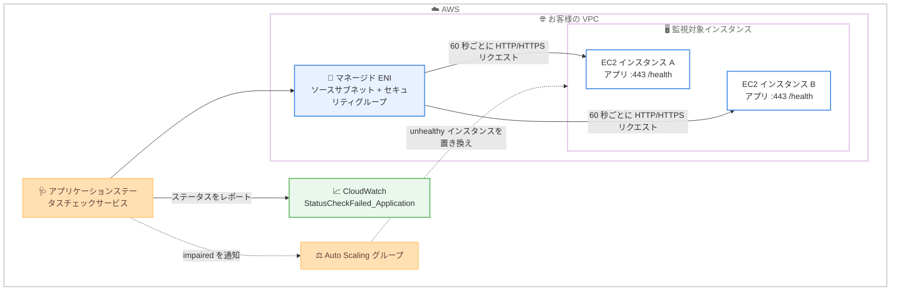

# Amazon EC2 - アプリケーションステータスチェック

**リリース日**: 2026 年 8 月 10 日
**サービス**: Amazon EC2 (Elastic Compute Cloud)
**機能**: アプリケーションステータスチェック (Application Status Checks)

📊 [このアップデートのインフォグラフィックを見る](https://takech9203.github.io/aws-news-summary/20260810-amazon-ec2-application-status-checks.html)

## 概要

Amazon EC2 が新しいステータスチェックの種類として「アプリケーションステータスチェック」を発表しました。従来のインスタンスステータスチェックとシステムステータスチェックに加えて、EC2 インスタンス上で稼働するアプリケーションレベルの問題を検出し、対応できるようになります。リクエストを受け付けなくなった Web サーバー、停止した Docker デーモン、トラフィックを通さないネットワークインターフェイスなど、インスタンス自体は正常でもアプリケーションが機能していない状況を検出できます。

利用方法はシンプルで、監視対象のプロトコル (HTTP または HTTPS)、ポート、パス、および正常と判定するレスポンスコードを指定してチェックを作成します。その後、インスタンス ID またはタグでチェックをインスタンスに関連付けると、Amazon EC2 が 60 秒ごとに HTTP/HTTPS リクエストを送信し、アプリケーションのステータスをレポートします。Auto Scaling グループはこのアプリケーションステータスに基づいて動作し、アプリケーションが unhealthy と報告されたインスタンスを自動的に置き換えて復旧します。

EC2 上でセルフマネージドなアプリケーションを運用するすべてのユーザーが対象で、特に Elastic Load Balancing を使用しないワークロードや、独自のヘルスチェック機構を構築・運用してきたチームにとって価値の大きいアップデートです。

**アップデート前の課題**

このアップデート以前は、EC2 標準のステータスチェックではアプリケーションレベルの監視ができませんでした。

- 既存のインスタンス / システムステータスチェックは、インスタンスや基盤ホストへの到達性のみを確認し、アプリケーションの応答不能は検出できなかった
- アプリケーションレベルの監視には、独自のヘルスチェックの仕組み (カスタムスクリプト、外部監視ツール、cron + CloudWatch カスタムメトリクスなど) を構築・保守する必要があった
- ELB 配下にないインスタンスでは、アプリケーション障害を検出して Auto Scaling による自動置き換えにつなげる標準的な手段がなかった

**アップデート後の改善**

今回のアップデートにより、EC2 ネイティブの機能としてアプリケーション監視が可能になります。

- プロトコル、ポート、パス、レスポンスコードを指定するだけで、60 秒間隔のアプリケーション監視を追加の監視基盤なしで実現できるようになった
- インスタンス ID またはタグ (Auto Scaling グループのシステムタグを含む) による柔軟な関連付けが可能になった
- Auto Scaling グループが追加設定なしでアプリケーションステータスに基づくインスタンスの自動置き換えを実行できるようになった
- CloudWatch メトリクス `StatusCheckFailed_Application` によるアラームや自動化が可能になった

## アーキテクチャ図



アプリケーションステータスチェックサービスは、お客様の VPC 内にマネージド ENI を作成し、そこから 60 秒ごとに各インスタンスのアプリケーションエンドポイントへ HTTP/HTTPS リクエストを送信します。チェック結果は CloudWatch メトリクスとして公開され、Auto Scaling グループは impaired と判定されたインスタンスを自動的に置き換えます。

## サービスアップデートの詳細

### 主要機能

1. **アプリケーションレベルのヘルスチェック**
   - プロトコル (HTTP / HTTPS)、ポート、パス、ステータスコードマッチャーを指定してチェックを定義
   - 60 秒間隔 (固定) で HTTP/2 によるリクエストを送信し、レスポンスコードを設定値と照合
   - 連続失敗回数 (デフォルト 2 回) で impaired、連続成功回数 (デフォルト 2 回) で healthy と判定
   - HTTPS チェックではサーバー証明書の検証は行われない

2. **柔軟なインスタンス関連付け**
   - インスタンス ID による直接指定、またはタグによる動的な関連付けが可能
   - システムタグ `aws:autoscaling:groupName` を使用すると Auto Scaling グループ内の全インスタンスに一括適用できる
   - 関連付け / 解除操作はインスタンスごとの成功・失敗結果を返す

3. **Auto Scaling との統合**
   - 全体のアプリケーションステータスが `impaired` になったインスタンスを Auto Scaling が自動的に終了・置き換え
   - チェックの関連付け以外に Auto Scaling グループ側の追加設定は不要
   - `InitializationGracePeriodSeconds` (デフォルト 300 秒) により、起動直後のインスタンスが準備完了前に置き換えられることを防止

4. **VPC 内からのプライベートな監視経路**
   - チェックは VPC 内のマネージド ENI から発信され、パブリックインターネットを経由しない
   - ヘルスチェックトラフィックは対象インスタンスと同じアベイラビリティゾーンの AWS 管理インスタンスから送信される
   - AWS マネージドネットワークパス (AWS がサブネット / セキュリティグループを選択) とカスタマーマネージドネットワークパス (ユーザーが指定) の 2 つのモードを選択可能
   - IPv4 と IPv6 の両方に対応 (チェックごとに単一の IP バージョン)

5. **運用に配慮した制御機能**
   - サプレッション機能: デプロイやパッチ適用などのメンテナンス時間帯にチェック評価を一時停止 (期間指定可)
   - 集約設定 (`included` / `excluded`): 新しいチェックを本番環境で検証する際、全体ステータスや Auto Scaling の動作に影響を与えずに個別ステータスのみを確認できる
   - 失敗時のレスポンスには理由コード (`ResponseCodeMismatch`、`ConnectionTimeout` など) と HTTP ステータスコードが含まれ、トラブルシューティングが容易

## 技術仕様

### デフォルト設定

| 項目 | デフォルト値 |
|------|------|
| チェック間隔 | 60 秒 (固定、変更不可) |
| 失敗しきい値 | 連続 2 回 |
| 成功しきい値 | 連続 2 回 |
| タイムアウト | 6 秒 (有効範囲: 1〜30 秒) |
| ステータスコードマッチャー | 200 |
| HTTP パス | / |
| IP バージョン | IPv4 |
| IP スコープ | private |
| デバイスインデックス | 0 |
| 初期化猶予期間 | 300 秒 (有効範囲: 1〜600 秒) |
| 集約設定 | included |

### ステータス値

| 種別 | 値 |
|------|------|
| 個別チェック | `passed`、`failed`、`initializing`、`insufficient-data`、`not-applicable` |
| インスタンス全体 | `ok`、`impaired`、`initializing`、`insufficient-data`、`not-applicable`、`suppressed` |

### サービスクォータ

| クォータ | デフォルト | 引き上げ |
|------|------|------|
| アカウントあたりのヘルスチェック数 | 50 | 自動承認 |
| ヘルスチェックあたりの関連付け数 | 50 | 自動承認 |
| アカウントあたりの関連付け数 | 200 | 自動承認 |
| アカウントあたりのターゲット数 | 5,000 | 申請による承認 |

ターゲット数がクォータを超過した場合、超過分のインスタンスは監視されず、アプリケーションステータスが報告されない点に注意が必要です。

## 設定方法

### 前提条件

1. 監視対象のインスタンスが存在する VPC
2. 各インスタンス上で、設定するポートとパスに対して HTTP または HTTPS で応答できるアプリケーションエンドポイント
3. チェック元のセキュリティグループからチェックポートへのインバウンドトラフィックを許可する、対象インスタンスのセキュリティグループ設定

### 手順

#### ステップ 1: チェック定義の作成

```bash
aws ec2 create-application-status-check \
    --protocol https \
    --port 443 \
    --path "/health" \
    --status-code-matcher "200"
```

HTTPS でポート 443 の `/health` パスを監視し、レスポンスコード 200 を正常と判定するチェックを作成します。`--health-check-paths` パラメータを省略すると AWS マネージドネットワークパスとなり、ソース / デスティネーションのサブネットとセキュリティグループを AWS が選択します。ネットワークセグメンテーションやコンプライアンス要件がある場合は、`--health-check-paths` を指定してカスタマーマネージドネットワークパスを使用します。

#### ステップ 2: インスタンスへの関連付け

```bash
# インスタンス ID で関連付け
aws ec2 associate-application-status-check \
    --application-status-check-id asc-1234567890abcdef0 \
    --instance-ids i-0123456789abcdef0

# Auto Scaling グループのシステムタグで関連付け
aws ec2 associate-application-status-check \
    --application-status-check-id asc-1234567890abcdef0 \
    --target-tag-associations Key=aws:autoscaling:groupName,Value=my-asg
```

作成したチェックを監視対象インスタンスに関連付けます。タグによる関連付けを使用すると、タグに一致するインスタンスが自動的に監視対象となります。

#### ステップ 3: ステータスの確認

```bash
aws ec2 describe-application-status \
    --instance-ids i-0123456789abcdef0
```

インスタンス全体のアプリケーションステータスと、関連付けられた各チェックの個別ステータスを確認します。チェックが失敗している場合は、アプリケーションが返した HTTP ステータスコードと理由コードがレスポンスに含まれます。

#### ステップ 4: メンテナンス時のサプレッション

```bash
# デプロイ前にチェック評価を 1 時間停止
aws ec2 enable-application-status-check-suppression \
    --instance-ids i-0123456789abcdef0 \
    --duration-seconds 3600

# デプロイ完了後に再開
aws ec2 disable-application-status-check-suppression \
    --instance-ids i-0123456789abcdef0
```

デプロイやパッチ適用などの計画的なメンテナンス中はチェック評価を一時停止し、Auto Scaling による意図しないインスタンス置き換えを防ぎます。サプレッション中のインスタンスの全体ステータスは `suppressed` となり、Auto Scaling は動作しません。

## メリット

### ビジネス面

- **運用コストの削減**: 独自のヘルスチェック基盤 (監視スクリプト、外部ツール) の構築・保守が不要になり、運用工数を削減できる
- **ダウンタイムの短縮**: アプリケーション障害を最短約 2 分 (60 秒間隔 x 失敗しきい値 2 回) で検出し、Auto Scaling による自動復旧につなげられる
- **幅広い利用範囲**: すべての商用リージョンと AWS GovCloud (US) リージョンで利用可能なため、グローバル展開やパブリックセクターのワークロードにも適用できる

### 技術面

- **EC2 ネイティブの統合**: `describe-instance-status` や CloudWatch メトリクスなど、既存の EC2 ステータスチェックと同じ運用フローに組み込める
- **セキュアな監視経路**: ヘルスチェックトラフィックは VPC 内のマネージド ENI から発信され、パブリックインターネットを経由しない
- **安全な導入プロセス**: 集約設定 `excluded` により、本番環境で新しいチェックを Auto Scaling に影響を与えずに検証してから有効化できる

## デメリット・制約事項

### 制限事項

- チェック間隔は 60 秒固定で変更できない
- HTTP / HTTPS プロトコルのみ対応 (TCP や gRPC 専用のヘルスチェックは不可)
- HTTPS チェックではサーバー証明書の検証は行われない
- ヘルスチェックはリダイレクトを追跡しないため、301 / 302 を返すパスはマッチャーに追加しない限り失敗と判定される
- チェックごとに単一の IP バージョンのみ対応 (IPv4 と IPv6 の両方を監視する場合は 2 つのチェックが必要)
- マネージド ENI はインスタンスの ENI 上限にはカウントされないが、VPC あたりの ENI グローバル上限にはカウントされる

### 考慮すべき点

- 対象インスタンスのセキュリティグループで、チェック元セキュリティグループからのインバウンド通信を許可する必要がある (許可漏れは失敗判定の最も一般的な原因)
- アプリケーションが `127.0.0.1` のみにバインドされているとチェックに応答できないため、ネットワークインターフェイスで待ち受ける設定が必要
- 起動に時間がかかるアプリケーションでは `InitializationGracePeriodSeconds` を適切に設定しないと、Auto Scaling が準備完了前のインスタンスを置き換えてしまう可能性がある
- デプロイやパッチ適用時はサプレッション、集約除外、関連付け解除のいずれかで意図しない置き換えを防ぐ運用設計が必要
- Local Zones のインスタンスではマネージド ENI が親リージョンに作成され、サービスリンク経由の追加データ転送料金が発生する可能性がある

## ユースケース

### ユースケース 1: ELB を使用しない Auto Scaling グループの自動復旧

**シナリオ**: バッチ処理ワーカーや内部 API サーバーなど、ロードバランサー配下にない Auto Scaling グループで、アプリケーションのハングを検出して自動復旧したい。

**実装例**:
```bash
aws ec2 create-application-status-check \
    --protocol http \
    --port 8080 \
    --path "/healthz" \
    --status-code-matcher "200"

aws ec2 associate-application-status-check \
    --application-status-check-id asc-xxxxxxxxxxxxxxxxx \
    --target-tag-associations Key=aws:autoscaling:groupName,Value=worker-asg
```

**効果**: ELB のヘルスチェックに頼れなかったワークロードでも、アプリケーション障害時に Auto Scaling が自動でインスタンスを置き換え、手動対応なしで復旧できます。

### ユースケース 2: Web サーバーと Docker デーモンの稼働監視

**シナリオ**: EC2 上でコンテナ化された Web アプリケーションを運用しており、インスタンスは正常でも Docker デーモンや Web サーバーが停止するケースを検出したい。

**実装例**:
```bash
aws ec2 create-application-status-check \
    --protocol https \
    --port 443 \
    --path "/health" \
    --status-code-matcher "200"
```

アプリケーション側の `/health` エンドポイントで、Web サーバー自体の応答に加えてコンテナランタイムの状態を確認して 200 を返すように実装します。

**効果**: 既存のインスタンス / システムステータスチェックでは検出できなかったアプリケーションレイヤーの障害を 60 秒間隔で検出し、CloudWatch アラームや Auto Scaling による対応につなげられます。

### ユースケース 3: 本番環境への段階的なチェック導入

**シナリオ**: 稼働中の本番フリートに新しいヘルスチェックを導入したいが、誤設定による意図しないインスタンス置き換えは避けたい。

**実装例**:
```bash
# 集約から除外した状態でチェックを作成
aws ec2 create-application-status-check \
    --protocol https \
    --port 443 \
    --path "/health" \
    --status-code-matcher "200" \
    --aggregation excluded

# 期待どおりのステータスを確認後、集約に含める
aws ec2 modify-application-status-check \
    --application-status-check-id asc-xxxxxxxxxxxxxxxxx \
    --aggregation included
```

**効果**: チェックの個別ステータスのみを本番環境で検証し、問題がないことを確認してから Auto Scaling の判断材料に組み込むという安全なロールアウトが可能です。

## 料金

アプリケーションステータスチェックの料金は以下の要素で構成されます。

- マネージド ENI 1 つあたり、アベイラビリティゾーンごとに 1 時間あたり 0.01 USD
- アプリケーションステータスチェックのメトリクスには標準の Amazon CloudWatch 料金が適用

### 料金例

| 使用量 | 月額料金 (概算) |
|--------|------------------|
| マネージド ENI 1 個 (1 AZ) | 約 7.3 USD (0.01 USD x 730 時間) |
| マネージド ENI 3 個 (3 AZ 構成) | 約 21.9 USD |

マネージド ENI はソースサブネットとセキュリティグループの組み合わせごとに 1 つ作成されるため、実際の課金額は VPC のネットワーク構成に依存します。

## 利用可能リージョン

すべての商用 AWS リージョンおよび AWS GovCloud (US) リージョンで利用可能です。

## 関連サービス・機能

- **Amazon EC2 Auto Scaling**: アプリケーションステータスが `impaired` のインスタンスを自動的に終了・置き換え。追加設定は不要
- **Amazon CloudWatch**: `StatusCheckFailed_Application` メトリクス (インスタンス全体) およびチェックごとのメトリクスによるアラームと自動化
- **EC2 インスタンス / システムステータスチェック**: 既存のステータスチェック。ハードウェアやインスタンス到達性のレイヤーを担当し、今回の機能がアプリケーションレイヤーを補完
- **Elastic Load Balancing ヘルスチェック**: ELB 配下のターゲットに対する類似のヘルスチェック機構。ELB を使用しないワークロードでは本機能が代替となる
- **VPC Reachability Analyzer**: カスタマーマネージドネットワークパス使用時のネットワーク到達性のトラブルシューティングに活用可能

## 参考リンク

- 📊 [インフォグラフィック](https://takech9203.github.io/aws-news-summary/20260810-amazon-ec2-application-status-checks.html)
- [公式発表 (What's New)](https://aws.amazon.com/about-aws/whats-new/2026/08/amazon-ec2-application-status-checks)
- [ドキュメント: Application status checks (Amazon EC2 User Guide)](https://docs.aws.amazon.com/AWSEC2/latest/UserGuide/application-status-checks.html)
- [ドキュメント: Use application status checks with an Auto Scaling group](https://docs.aws.amazon.com/autoscaling/ec2/userguide/use-application-status-checks-auto-scaling-group.html)
- [ドキュメント: Health checks for instances in an Auto Scaling group](https://docs.aws.amazon.com/autoscaling/ec2/userguide/ec2-auto-scaling-health-checks.html)

## まとめ

Amazon EC2 のアプリケーションステータスチェックは、これまで独自構築が必要だったアプリケーションレベルの監視と自動復旧を、EC2 ネイティブの機能として提供する重要なアップデートです。特に ELB を使用しない Auto Scaling グループでの自動復旧や、Web サーバー / Docker デーモンの停止検出に大きな価値があります。まずは集約設定を `excluded` にした状態でチェックを作成して本番環境で検証し、期待どおりの動作を確認してから `included` に切り替えて Auto Scaling との統合を有効化する段階的な導入をおすすめします。
