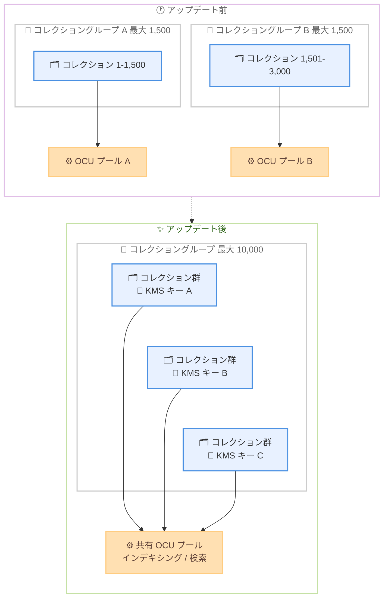

# Amazon OpenSearch Serverless - コレクショングループあたり最大 10,000 コレクションをサポート

**リリース日**: 2026 年 8 月 10 日
**サービス**: Amazon OpenSearch Serverless
**機能**: コレクショングループあたりのコレクション数上限の引き上げ (1,500 → 10,000)

📊 [このアップデートのインフォグラフィックを見る](https://takech9203.github.io/aws-news-summary/20260810-amazon-opensearch-serverless-supports-10000-collections-per-collection-group.html)

## 概要

次世代 (NextGen) の Amazon OpenSearch Serverless において、単一のコレクショングループ内に作成できるコレクション数の上限が、従来の 1,500 から 10,000 に引き上げられました。コレクショングループは複数のコレクションをまとめて管理する仕組みで、コレクションが異なる AWS KMS キーで暗号化されている場合でも、OpenSearch Compute Unit (OCU) をグループ内で共有できます。

この機能は、テナントごとにコレクションを分離するマルチテナント型の SaaS アプリケーションなど、多数のコレクションを運用するユースケースで特に有効です。コンピューティングリソースを多数のコレクションで共有することで、リソース使用率を高め、コレクションあたりのコストを削減できます。

新しい上限は、新規および既存の NextGen コレクショングループに自動的に適用されるため、ユーザー側での対応は不要です。

**アップデート前の課題**

このアップデート以前は、コレクショングループの規模に以下の制限がありました。

- コレクショングループあたりのコレクション数は最大 1,500 に制限されていた
- テナント数が 1,500 を超えるマルチテナントアプリケーションでは、複数のコレクショングループに分割する必要があり、運用が複雑化していた
- コレクショングループを分割すると OCU プールも分かれるため、コンピューティングリソースの共有によるコスト削減効果が限定的だった

**アップデート後の改善**

今回のアップデートにより、以下が可能になりました。

- 単一のコレクショングループで最大 10,000 コレクションまで管理可能になった (約 6.7 倍に拡大)
- より多くのテナントを単一の OCU プールに集約でき、リソース使用率の向上とコスト削減が可能になった
- 上限は新規・既存の NextGen コレクショングループに自動適用されるため、移行作業や設定変更が不要
- Service Quotas コンソールからさらなる上限引き上げのリクエストも可能

## アーキテクチャ図



アップデート前は 1,500 コレクションごとにグループを分割して個別の OCU プールを持つ必要がありましたが、アップデート後は最大 10,000 コレクションを単一グループに集約し、異なる KMS キーで暗号化されたコレクション間でも共有 OCU プールを利用できます。

## サービスアップデートの詳細

### 主要機能

1. **コレクション数上限の引き上げ**
   - NextGen コレクショングループあたりのコレクション数が 1,500 から 10,000 に拡大
   - 新規および既存の NextGen コレクショングループに自動適用され、ユーザー側の操作は不要
   - Service Quotas コンソールから、さらなる上限引き上げをリクエスト可能 (調整可能なクォータ)

2. **異なる KMS キー間での OCU 共有**
   - コレクショングループ内のコレクションは、それぞれ異なる AWS KMS キーで暗号化されていても OCU を共有可能
   - KMS キーごとに個別の OCU をプロビジョニングする必要がなく、コレクション単位のセキュリティとアクセス制御を維持したままコンピューティングを集約できる

3. **NextGen OpenSearch Serverless の特長**
   - 即時オートスケーリングとスケールツーゼロによるコスト最適化
   - Express Create と Standard Create によるシンプルなコレクション作成フロー
   - コレクショングループによる共有キャパシティ管理 (最小 / 最大 OCU をインデキシングと検索で個別に設定可能)

## 技術仕様

### クォータの比較

| 項目 | 詳細 |
|------|------|
| コレクション数 / グループ (NextGen) | 10,000 (従来: 1,500)、Service Quotas で引き上げ申請可能 |
| コレクション数 / グループ (Classic) | 1,500 (変更なし、調整不可) |
| アカウントあたりの最大コレクショングループ数 | 300 |
| コレクションあたりの最大インデックス数 | 1,000 |
| コレクショングループの Max Indexing Capacity デフォルト | 96 OCU |
| コレクショングループの Max Search Capacity デフォルト | 96 OCU |

### コレクショングループのキャパシティ設定

コレクショングループ作成時に以下のキャパシティを設定できます。

| 設定項目 | 説明 |
|------|------|
| Min Indexing Capacity | インデキシングの最小 OCU (省略可、未設定で最小値なし) |
| Max Indexing Capacity | インデキシングの最大 OCU (デフォルト 96) |
| Min Search Capacity | 検索の最小 OCU (省略可、未設定で最小値なし) |
| Max Search Capacity | 検索の最大 OCU (デフォルト 96) |

## 設定方法

### 前提条件

1. NextGen 世代の OpenSearch Serverless コレクショングループを使用していること (Classic コレクショングループは対象外)
2. コレクション作成に必要な IAM 権限 (`aoss:CreateCollection` など) が付与されていること
3. NextGen OpenSearch Serverless が利用可能なリージョンであること

### 手順

新しい上限は自動適用されるため、既存環境での追加設定は不要です。以下は NextGen コレクショングループを利用する基本的な手順です。

#### ステップ 1: NextGen コレクションの作成

```bash
# マネジメントコンソールの場合:
# OpenSearch Service コンソール > Serverless > Collections > Create collection
# NextGen 作成フォームがデフォルトで表示される
```

コンソールで [Create collection] を選択すると NextGen 作成フォームが開きます。Express Create を選択すると、コレクショングループ、暗号化、ネットワーク、データアクセスポリシーが自動的に構成されます。

#### ステップ 2: コレクショングループの選択または作成

```bash
# Standard Create でコレクショングループを新規作成する場合の設定例
# - Collection group name: nextgen-my-collection
# - Max Indexing Capacity: 96 OCU
# - Max Search Capacity: 96 OCU
```

Standard Create では、既存の互換性のあるコレクショングループを選択するか、最小 / 最大 OCU を指定して新しいグループを作成できます。既存グループを選択すると、そのグループの現在のキャパシティ上限が表示されます。

#### ステップ 3: 現在のクォータの確認

```bash
# Service Quotas コンソールで OpenSearch Serverless のクォータを確認
# AWS services > Amazon OpenSearch Serverless
# 「Collections per collection group (NextGen)」が 10,000 であることを確認
```

Service Quotas コンソールで現在の上限値を確認できます。10,000 を超えるコレクションが必要な場合は、同コンソールから引き上げをリクエストします。

## メリット

### ビジネス面

- **コスト削減**: 多数のコレクションで OCU を共有することで、リソース使用率が向上し、コレクションあたりのコストを削減できる
- **マルチテナント SaaS のスケール拡大**: テナントごとに 1 コレクションを割り当てる設計で、単一グループで最大 10,000 テナントまで対応可能
- **移行コストゼロ**: 既存の NextGen コレクショングループに自動適用されるため、追加の作業や費用が発生しない

### 技術面

- **運用の簡素化**: 複数のコレクショングループへの分割やグループ間のバランシングが不要になり、管理対象が減少する
- **セキュリティと効率の両立**: コレクションごとに異なる KMS キーで暗号化しながら、コンピューティングリソースは共有できる
- **さらなる拡張性**: 調整可能なクォータとなっており、Service Quotas コンソールから 10,000 を超える引き上げも申請可能

## デメリット・制約事項

### 制限事項

- 新しい上限は NextGen コレクショングループのみが対象で、Classic コレクショングループは従来どおり 1,500 コレクションまで (調整不可)
- アカウントあたりのコレクショングループ数は最大 300
- 実際に作成できるコレクション数は、コレクションのサイズに応じて Max OCU の設定によりさらに制限される場合がある

### 考慮すべき点

- 多数のコレクションが単一の OCU プールを共有するため、特定コレクションの負荷急増がグループ全体のキャパシティ消費に影響する可能性があり、Min / Max OCU の設計が重要
- コレクショングループ外の (グループに属さない) コレクションでユニークな KMS キーを使用する場合は、別の制限 (最大 OCU / 2) が適用される
- NextGen OpenSearch Serverless が利用可能なリージョンでのみ利用できるため、対象リージョンの確認が必要

## ユースケース

### ユースケース 1: マルチテナント SaaS の検索基盤

**シナリオ**: SaaS 事業者が、テナントごとにデータを分離した検索機能を提供する。テナント数が 1,500 を超えて成長しており、テナントごとに専用のコレクションと KMS キーを割り当てたい。

**実装例**:
```
1. NextGen コレクショングループを 1 つ作成 (Max Indexing / Search Capacity を設定)
2. テナントオンボーディング時にテナント専用のコレクションを同一グループ内に作成
3. テナントごとに顧客管理の KMS キーを指定して暗号化
4. データアクセスポリシーでテナント単位のアクセス制御を設定
```

**効果**: 最大 10,000 テナントを単一グループで管理でき、OCU 共有によりテナントあたりのインフラコストを大幅に削減できる。

### ユースケース 2: 部門・プロジェクト単位のログ分析環境の集約

**シナリオ**: 大企業で部門やプロジェクトごとに分離された検索・分析環境を提供している。従来は 1,500 の上限により複数のコレクショングループに分割しており、リソースが分散して非効率だった。

**実装例**:
```
1. 分散していた複数のコレクショングループの構成を見直し
2. 新規コレクションは単一の NextGen コレクショングループに集約
3. 部門ごとに異なる KMS キーとデータアクセスポリシーを維持
```

**効果**: OCU プールの統合によりリソース使用率が向上し、グループ管理のオーバーヘッドが削減される。

### ユースケース 3: 生成 AI アプリケーションのベクトル検索基盤

**シナリオ**: 顧客ごとに専用のナレッジベースを持つ生成 AI アプリケーションで、ベクトル検索コレクションを顧客単位に分離して提供する。

**実装例**:
```
1. Vector search タイプの NextGen コレクショングループを作成
2. 顧客ごとにベクトル検索コレクションを作成し、埋め込みデータを格納
3. スケールツーゼロにより、アイドル状態の顧客コレクションのコストを最小化
```

**効果**: 顧客数の増加に合わせて最大 10,000 コレクションまで単一グループでスケールでき、共有 OCU とスケールツーゼロの組み合わせでコスト効率の高い RAG 基盤を実現できる。

## 料金

このアップデート自体に追加料金はありません。OpenSearch Serverless の料金は、インデキシングと検索に使用される OCU 時間、および管理ストレージに基づく従量課金です。コレクショングループ内で OCU を共有することで、コレクションごとに個別のコンピューティングを確保する場合と比較してコストを削減できます。

詳細は [Amazon OpenSearch Service 料金ページ](https://aws.amazon.com/opensearch-service/pricing/) を参照してください。

## 利用可能リージョン

次世代 (NextGen) OpenSearch Serverless が利用可能なすべての AWS リージョンで利用できます。リージョンごとの提供状況は [AWS リージョン別サービス一覧](https://docs.aws.amazon.com/general/latest/gr/opensearch-service.html) を参照してください。

## 関連サービス・機能

- **AWS KMS**: コレクション単位で AWS 所有キーまたは顧客管理キーによる暗号化を選択でき、異なるキーを使用するコレクション間でも OCU を共有可能
- **Service Quotas**: 「Collections per collection group (NextGen)」クォータの確認と、10,000 を超える引き上げリクエストに使用
- **Amazon OpenSearch Ingestion**: OpenSearch Serverless コレクションへのデータ取り込みパイプラインを提供
- **Amazon Bedrock ナレッジベース**: ベクトル検索コレクションを RAG 用のベクトルストアとして利用可能

## 参考リンク

- 📊 [インフォグラフィック](https://takech9203.github.io/aws-news-summary/20260810-amazon-opensearch-serverless-supports-10000-collections-per-collection-group.html)
- [公式発表 (What's New)](https://aws.amazon.com/about-aws/whats-new/2026/08/amazon-opensearch-serverless-supports-10000-collections-per-collection-group/)
- [ドキュメント: NextGen コレクションの作成](https://docs.aws.amazon.com/opensearch-service/latest/developerguide/serverless-create.html#serverless-create-nextgen-easy)
- [ドキュメント: OpenSearch Serverless のクォータ](https://docs.aws.amazon.com/general/latest/gr/opensearch-service.html#opensearch-limits-serverless)
- [料金ページ](https://aws.amazon.com/opensearch-service/pricing/)

## まとめ

NextGen OpenSearch Serverless のコレクショングループあたりのコレクション数上限が 1,500 から 10,000 に引き上げられ、マルチテナントアーキテクチャのスケール上限が大幅に拡大しました。上限は既存グループにも自動適用されるため対応は不要ですが、テナント数の増加を見込むシステムでは、コレクショングループの統合による OCU 共有とコスト最適化の検討をお勧めします。
