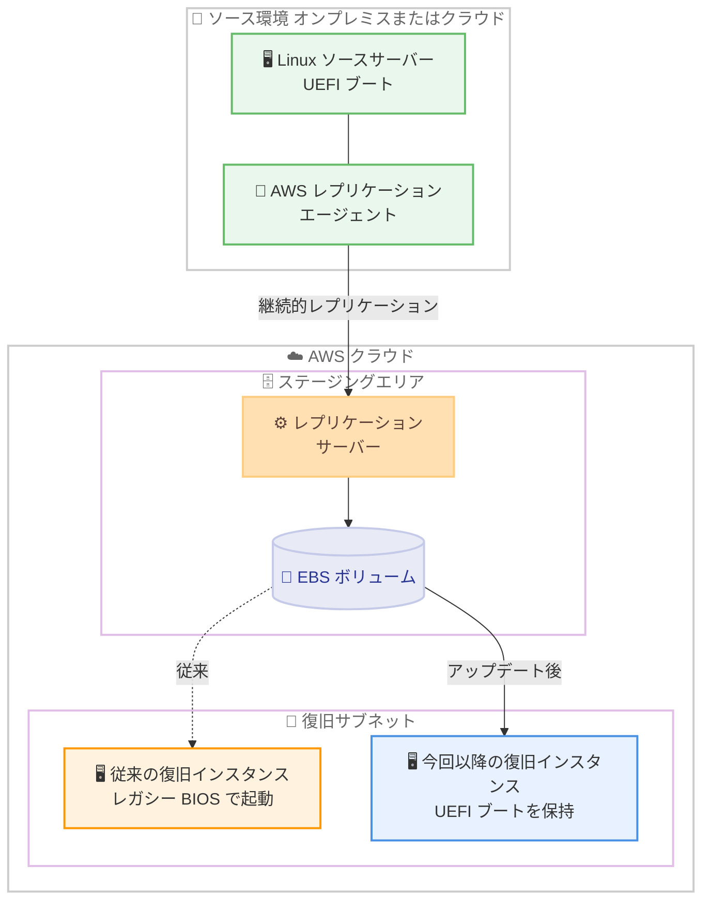

# AWS Elastic Disaster Recovery - Linux サーバーの UEFI ブートモード保持

**リリース日**: 2026 年 8 月 10 日
**サービス**: AWS Elastic Disaster Recovery (AWS DRS)
**機能**: Linux ソースサーバー復旧時の UEFI ブートモード保持

📊 [このアップデートのインフォグラフィックを見る](https://takech9203.github.io/aws-news-summary/20260810-aws-drs-linux-uefi.html)

## 概要

AWS Elastic Disaster Recovery (AWS DRS) が、UEFI ファームウェアで起動する Linux ソースサーバーを復旧する際に、UEFI ブートモードを保持するようになりました。復旧された Linux インスタンスは、ソースサーバーと同じ UEFI ブートモードで起動します。

これまで AWS DRS は、UEFI で起動する Linux サーバーであっても、復旧時にはレガシー BIOS モードでインスタンスを起動していました。このため、UEFI のブート動作に依存するアプリケーションやシステム構成では、復旧後に追加の設定作業が必要になる場合がありました。今回のアップデートにより、復旧環境がソース環境により忠実になり、復旧後の追加作業なしでアプリケーションを期待どおりの状態で稼働させることができます。

本機能は追加設定なしで自動的に適用され、AWS DRS が利用可能なすべての AWS リージョンで、追加料金なしで利用できます。ディザスタリカバリ (DR) 対策として AWS DRS を利用しているすべてのユーザー、特に UEFI ブートの Linux サーバーを保護対象としているユーザーにとって、復旧の信頼性と忠実性を高めるアップデートです。

**アップデート前の課題**

- 以前は、UEFI で起動する Linux ソースサーバーを復旧すると、レガシー BIOS モードでインスタンスが起動していた
- ソースサーバーとブートモードが異なるため、UEFI のブート動作に依存する構成では復旧後に追加の設定作業が必要になる場合があった
- 復旧環境とソース環境の構成差異により、DR 訓練や実際の復旧時の検証負担が大きくなる可能性があった

**アップデート後の改善**

- 復旧された Linux インスタンスがソースサーバーと同じ UEFI ブートモードで起動するようになった
- 復旧後の追加設定作業が不要になり、アプリケーションが期待どおりの状態で復旧できるようになった
- 設定変更は一切不要で、自動的に適用される

## アーキテクチャ図



UEFI ブートの Linux ソースサーバーを AWS DRS で復旧する際のフローです。従来はレガシー BIOS モードで復旧インスタンスが起動していましたが、今回のアップデートによりソースサーバーと同じ UEFI ブートモードが保持されます。

## サービスアップデートの詳細

### 主要機能

1. **UEFI ブートモードの自動保持**
   - UEFI ファームウェアで起動する Linux ソースサーバーを復旧すると、復旧インスタンスも UEFI ブートモードで起動する
   - ソースサーバーのブートモードを自動的に検出して引き継ぐため、ユーザー側の設定は一切不要
   - DR 訓練 (ドリル) と実際の復旧の両方で同じ動作が適用される

2. **復旧環境の忠実性向上**
   - 復旧されたインスタンスがソースサーバーの構成により近い状態で起動する
   - UEFI のブート動作に依存するアプリケーションも、復旧後の追加手順なしで期待どおりに動作する

3. **復旧後の追加設定作業の排除**
   - 従来はレガシー BIOS モードでの起動により復旧後に追加設定が必要になる場合があったが、この作業が不要になった
   - 目標復旧時間 (RTO) の観点でも、復旧後の手作業削減により復旧完了までの時間短縮に寄与する

## 技術仕様

### ブートモードの動作比較

| 項目 | アップデート前 | アップデート後 |
|------|----------------|----------------|
| UEFI ブートの Linux サーバーの復旧 | レガシー BIOS モードで起動 | ソースと同じ UEFI ブートモードで起動 |
| 復旧後の追加設定 | 必要になる場合があった | 不要 |
| ユーザー側の設定変更 | - | 不要 (自動適用) |
| 追加料金 | - | なし |

### AWS DRS の基本動作

| 項目 | 詳細 |
|------|------|
| レプリケーション | AWS レプリケーションエージェントによるブロックレベルの継続的レプリケーション |
| ステージングエリア | 低コストのストレージと最小限のコンピュートリソースでレプリケーションを維持 |
| 復旧 | 最新のサーバー状態または過去のポイントインタイムから数分でインスタンスを起動 |
| 変換処理 | ドリルまたは復旧のためのインスタンス起動時に、AWS でネイティブに起動・実行できるよう自動変換 |
| フェイルバック | 問題解決後にプライマリサイトへのデータレプリケーションとフェイルバックが可能 |

## 設定方法

### 前提条件

1. AWS DRS の初期化が完了していること
2. 保護対象の Linux ソースサーバーに AWS レプリケーションエージェントがインストールされ、レプリケーションが正常に稼働していること
3. ソースサーバーが UEFI ファームウェアで起動していること

### 手順

#### ステップ1: 特別な設定は不要

本機能は自動的に適用されるため、ユーザー側での設定変更は不要です。UEFI で起動する Linux ソースサーバーは、ドリルまたは復旧のためのインスタンス起動時に自動的に UEFI ブートモードで起動されます。

#### ステップ2: DR ドリルによる動作確認

```bash
# ソースサーバーの一覧を確認
aws drs describe-source-servers

# ドリル (テスト) としてリカバリインスタンスを起動
aws drs start-recovery \
  --source-servers sourceServerID=s-1234567890abcdef0 \
  --is-drill
```

`describe-source-servers` で保護対象のソースサーバーを確認し、`start-recovery` を `--is-drill` オプション付きで実行して、非破壊的な DR ドリルとしてリカバリインスタンスを起動します。

#### ステップ3: 復旧インスタンスのブートモード確認

```bash
# 起動したリカバリインスタンスの EC2 インスタンス ID を確認
aws drs describe-recovery-instances

# インスタンスのブートモードを確認
aws ec2 describe-instances \
  --instance-ids i-0123456789abcdef0 \
  --query "Reservations[].Instances[].{InstanceId:InstanceId,BootMode:BootMode,CurrentBootMode:CurrentInstanceBootMode}"
```

`describe-recovery-instances` で復旧インスタンスを確認し、`ec2 describe-instances` の `CurrentInstanceBootMode` フィールドで、インスタンスが UEFI モードで起動していることを確認します。

## メリット

### ビジネス面

- **復旧の信頼性向上**: 復旧環境がソース環境に忠実になり、DR 発動時にアプリケーションが期待どおりに動作する確度が高まる
- **RTO の短縮に寄与**: 復旧後の追加設定作業が不要になることで、業務再開までの時間を短縮できる
- **追加コストなし**: 追加料金なしで自動的に適用されるため、既存の DR 構成の価値がそのまま向上する

### 技術面

- **構成の一貫性**: ソースサーバーと復旧インスタンスのブートモードが一致し、ブートローダーや UEFI 依存の構成がそのまま機能する
- **運用負荷の削減**: 復旧後の手動設定手順を DR 手順書から削減でき、手順の簡素化とヒューマンエラーの防止につながる
- **設定不要**: 既存ユーザーは何も変更せずに本機能の恩恵を受けられる

## デメリット・制約事項

### 制限事項

- 本アップデートの対象は Linux ソースサーバーの UEFI ブートモード保持であり、公式発表に記載された範囲は Linux サーバーに関するもの
- 復旧に使用するインスタンスタイプが UEFI ブートモードをサポートしている必要がある (EC2 のブートモードはインスタンスタイプに依存する)

### 考慮すべき点

- 既存の DR 手順書に「復旧後のブートモード関連の追加設定」が含まれている場合は、手順の見直しを推奨
- 本機能の適用後、DR ドリルを実施して復旧インスタンスが UEFI モードで正常に起動することを確認することを推奨

## ユースケース

### ユースケース1: オンプレミスの UEFI ブート Linux サーバーの DR

**シナリオ**: オンプレミスのデータセンターで稼働する UEFI ブートの Linux サーバー群を AWS DRS で保護している。従来は復旧後にブートモードの差異に起因する追加設定が必要だった。

**実装例**:
```bash
# 既存のレプリケーション構成のまま、ドリルを実行して動作確認
aws drs start-recovery \
  --source-servers sourceServerID=s-1234567890abcdef0 \
  --is-drill
```

**効果**: 復旧インスタンスがソースと同じ UEFI モードで起動し、復旧後の追加設定なしでアプリケーションが稼働する。DR 手順が簡素化される。

### ユースケース2: 定期 DR ドリルの検証項目の簡素化

**シナリオ**: コンプライアンス要件により四半期ごとに DR ドリルを実施している。従来はブートモード差異に関する検証と修正作業がドリル工数を増やしていた。

**実装例**:
```bash
# ドリル後にブートモードを確認し、検証結果を記録
aws ec2 describe-instances \
  --instance-ids i-0123456789abcdef0 \
  --query "Reservations[].Instances[].CurrentInstanceBootMode"
```

**効果**: ブートモード差異に起因する修正作業がなくなり、ドリルの所要時間と検証工数を削減できる。

### ユースケース3: クラウド間 DR での構成忠実性の確保

**シナリオ**: 他クラウドや別 AWS リージョンで稼働する UEFI ブートの Linux サーバーを AWS DRS で保護し、DR 発動時に構成差異を最小化したい。

**実装例**:
```bash
# ソースサーバーのレプリケーション状態を確認
aws drs describe-source-servers \
  --query "items[].{ID:sourceServerID,State:dataReplicationInfo.dataReplicationState}"
```

**効果**: 復旧環境がソース環境に忠実になり、フェイルオーバー後の動作検証がスムーズになる。

## 料金

本機能に追加料金はありません。AWS DRS の標準料金 (保護対象ソースサーバーごとの時間課金) がそのまま適用されます。レプリケーションに使用するステージングエリアの EC2 インスタンス、EBS ボリューム、スナップショット、および復旧時に起動する EC2 インスタンスの料金は別途発生します。

詳細は [AWS Elastic Disaster Recovery の料金ページ](https://aws.amazon.com/disaster-recovery/pricing/) を参照してください。

## 利用可能リージョン

AWS DRS が提供されているすべての AWS リージョンで利用可能です。

## 関連サービス・機能

- **Amazon EC2**: 復旧インスタンスの起動基盤。EC2 のブートモード (UEFI / レガシー BIOS) の仕組みが本機能の前提となる
- **Amazon EBS**: レプリケーションデータの保存先および復旧インスタンスのボリュームとして使用
- **AWS MGN (Application Migration Service)**: AWS DRS と同様のブロックレベルレプリケーション技術を使用する移行サービス

## 参考リンク

- 📊 [インフォグラフィック](https://takech9203.github.io/aws-news-summary/20260810-aws-drs-linux-uefi.html)
- [公式発表 (What's New)](https://aws.amazon.com/about-aws/whats-new/2026/08/aws-drs-linux-uefi)
- [AWS Elastic Disaster Recovery ユーザーガイド](https://docs.aws.amazon.com/drs/latest/userguide/what-is-drs.html)
- [料金ページ](https://aws.amazon.com/disaster-recovery/pricing/)

## まとめ

AWS DRS が UEFI ブートの Linux ソースサーバーの復旧時にブートモードを保持するようになり、復旧環境の忠実性が向上し、復旧後の追加設定作業が不要になりました。設定変更なし・追加料金なしで自動的に適用されるため、UEFI ブートの Linux サーバーを保護しているユーザーは、次回の DR ドリルで復旧インスタンスが UEFI モードで正常に起動することを確認し、既存の DR 手順書からブートモード関連の追加設定手順を見直すことを推奨します。
