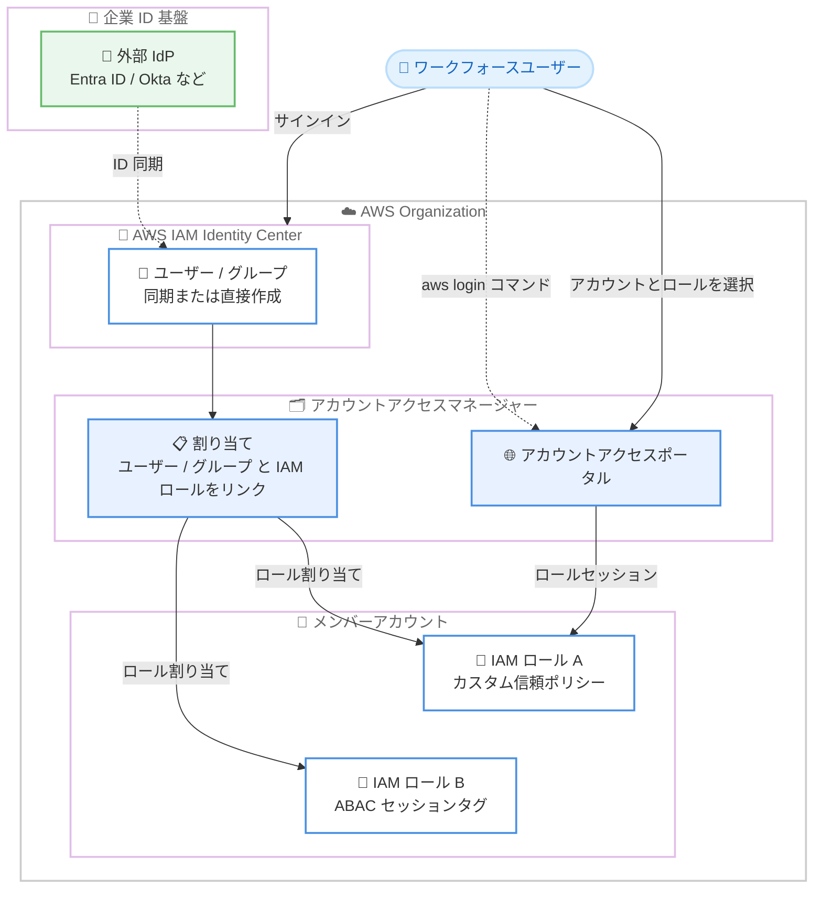

# AWS Identity and Access Management - アカウントアクセスマネージャーによるワークフォースユーザーへの IAM ロール割り当て

**リリース日**: 2026 年 8 月 10 日
**サービス**: AWS Identity and Access Management (IAM)
**機能**: アカウントアクセスマネージャー (Account access manager)

📊 [このアップデートのインフォグラフィックを見る](https://takech9203.github.io/aws-news-summary/20260810-aws-iam-aam.html)

## 概要

AWS Identity and Access Management (IAM) は、ワークフォースユーザーへの IAM ロールの割り当てを簡素化する新機能「アカウントアクセスマネージャー (Account access manager)」を発表しました。管理者は、AWS アカウント内の既存の IAM ロールを、AWS IAM Identity Center で管理されているワークフォースユーザーおよびグループに直接リンクできるようになります。

これまで、ワークフォース (従業員) の AWS アカウントアクセスには 2 つの選択肢がありました。1 つはユーザーを各アカウントに個別にフェデレーションし、アカウントごとの IAM ロールで権限を定義する方法、もう 1 つは IAM Identity Center で一度フェデレーションし、許可セット (Permission sets) を通じて一元的にアクセスを管理する方法です。アカウントアクセスマネージャーは、この両者の利点を組み合わせ、「権限管理の柔軟性」「ユーザーの可視性」「単一のフェデレーションポイント」を同時に実現します。

本機能は IAM コンソール、AWS SDK、AWS CloudFormation / CDK から利用でき、すべての AWS 商用リージョンでデフォルトで有効化されています。追加料金は不要です。

**アップデート前の課題**

このアップデート以前は、ワークフォースアクセスの管理に以下の課題がありました。

- IAM ロールの柔軟性 (信頼ポリシーのカスタマイズ、ABAC、ロールパスなど) を活用するには、外部 IdP から各アカウントへ個別にフェデレーションする必要があり、アカウントごとに SAML アプリケーションを構成する運用負荷が発生していた
- IAM Identity Center の許可セットは単一のフェデレーションポイントとユーザー可視性を提供する一方、プロビジョニングされるロールはイミュータブルであり、アカウントごとに異なるカスタム IAM ロールの要件には適合しにくかった
- ロールとユーザーのマッピングが外部 IdP 側に存在する場合、AWS 側から「誰がどのロールにアクセスできるか」を把握しづらかった

**アップデート後の改善**

今回のアップデートにより、以下が可能になりました。

- IAM Identity Center に同期済みのユーザー / グループに対して、各アカウントの既存の IAM ロールを直接割り当て可能になった
- IAM ロールの信頼ポリシー、セッションタグによる属性ベースアクセス制御 (ABAC)、ロールパスなど、IAM ロール本来の柔軟性を維持したまま、単一のフェデレーションポイントで運用できるようになった
- ユーザーは専用のアカウントアクセスポータルから割り当てられたアカウントとロールを確認・利用でき、CLI では `aws login` コマンドでロールセッションの認証情報を取得できるようになった

## アーキテクチャ図



ワークフォースユーザーは IAM Identity Center で一度サインインし、アカウントアクセスマネージャーの割り当てに基づいて、各アカウントの既存 IAM ロールへポータル経由でアクセスします。

## サービスアップデートの詳細

### 主要機能

1. **IAM Identity Center ユーザー / グループへの IAM ロール割り当て**
   - IAM Identity Center 組織インスタンスのユーザーとグループに対し、AWS アカウント内の IAM ロールを使用してアカウントアクセスを割り当て可能
   - ID ソースから同期したユーザー / グループと、IAM Identity Center で直接作成したユーザー / グループの両方に対応
   - IAM Identity Center の許可セットと併用することも、アカウントアクセスマネージャー単独で使用することも可能

2. **IAM ロールの柔軟性の活用**
   - IAM ロールタグとセッションタグを使用した属性ベースアクセス制御 (ABAC) の構成
   - IAM ロールの信頼ポリシーによるロール引き受けの制限、ネットワークベースの条件の強制、IdP がアサートしたクレームの条件利用
   - IAM ロールパスによるロールの論理的なグループ化と管理の簡素化

3. **アカウントアクセスポータル**
   - ユーザーが自分に割り当てられた AWS アカウントとロールを一覧・アクセスできる専用ポータルを提供
   - IAM Identity Center ユーザーとしてサインイン後、ポータル URL 経由でアカウントにアクセス

4. **CLI アクセス (aws login コマンド)**
   - ブラウザで AWS にサインインした後、`aws login` コマンドで IAM ロールセッションの認証情報を取得
   - ロールセッションの有効期間中は、再認証なしで AWS CLI を継続利用可能

5. **専用 API 名前空間**
   - アカウントアクセスマネージャーは IAM API とは別の独自 API 名前空間 `account-access` を持つ
   - AWS CLI および SDK からこの名前空間を通じて操作可能
   - AWS CloudFormation / CDK による IaC 管理にも対応

## 技術仕様

### ワークフォースアクセス 3 方式の比較

| 項目 | IAM ロール + アカウントアクセスマネージャー | IAM Identity Center 許可セット | IAM ロール + IAM フェデレーション |
|------|------|------|------|
| 適したケース | アカウントごとに異なるカスタム IAM ロール | 読み取り専用や管理者などの統一的なベースラインアクセス | ワークロード向け |
| スコープ | 複数アカウント (AWS Organization) | 複数アカウント (AWS Organization) | アカウント単位 |
| IAM ロールのプロビジョニング | IaC または IAM コンソールで手動 | 自動プロビジョニング | IaC または IAM / 外部 IdP コンソールで手動 |
| ロールと ID のマッピングの保持先 | アカウントアクセスマネージャー | IAM Identity Center | 外部 IdP |
| エンドユーザー体験 | サインイン後、アカウントアクセスポータル URL からアクセス | サインイン後、AWS アクセスポータルからアクセス | IdP ポータルのアカウント別 SAML アプリケーションからアクセス |
| CLI 体験 | ブラウザでロールにアクセス後、`aws login` で認証情報を取得 | `aws configure sso` と `aws sso login` を使用 | AWS SDK 認証情報プロバイダーによるカスタム統合 |

### 利用方法

| 項目 | 詳細 |
|------|------|
| 操作インターフェース | IAM コンソール、AWS SDK、AWS CloudFormation / CDK |
| API 名前空間 | `account-access` (IAM API とは別) |
| 対象 ID | IAM Identity Center 組織インスタンスのユーザーおよびグループ |
| 有効化 | すべての AWS 商用リージョンでデフォルト有効 |
| 料金 | 追加料金なし |

## 設定方法

### 前提条件

1. AWS Organizations が構成され、IAM Identity Center の組織インスタンスが有効化されていること
2. ID ソース (外部 IdP または IAM Identity Center 内) からユーザーとグループが同期または作成されていること
3. 割り当て対象の IAM ロールが各 AWS アカウントに作成されていること (IaC または手動)

### 手順

#### ステップ 1: IAM ロールの準備

```bash
# 割り当て対象となる IAM ロールを確認
aws iam list-roles --path-prefix /workforce/
```

割り当てに使用する IAM ロールを確認します。ロールパスを活用すると、ワークフォース用ロールを論理的にグループ化して管理を簡素化できます。

#### ステップ 2: アカウントアクセスマネージャーでの割り当て

IAM コンソールのアカウントアクセスマネージャー画面から、IAM Identity Center のユーザーまたはグループを選択し、対象アカウントの IAM ロールにリンクします。AWS CLI / SDK では `account-access` 名前空間の API、または CloudFormation / CDK を使用して IaC として管理することも可能です。

#### ステップ 3: ユーザーによるアクセス

```bash
# ブラウザでサインインしてロールにアクセスした後、CLI で認証情報を取得
aws login
```

ユーザーは IAM Identity Center ユーザーとしてサインインし、アカウントアクセスポータルから割り当てられたアカウントとロールにアクセスします。`aws login` コマンドはブラウザで確立したロールセッションの認証情報を CLI に取り込み、セッション有効期間中は再認証なしで CLI を利用できます。

## メリット

### ビジネス面

- **運用負荷の削減**: 外部 IdP でアカウントごとに SAML アプリケーションを構成する必要がなくなり、単一のフェデレーションポイントに集約できる
- **ガバナンスの向上**: ロールとユーザーのマッピングが AWS 側 (アカウントアクセスマネージャー) に保持されるため、誰がどのアカウントのどのロールにアクセスできるかを把握しやすくなる
- **追加コストなし**: 追加料金なしで利用でき、既存の IAM ロール資産をそのまま活用できる

### 技術面

- **IAM ロールの柔軟性を維持**: 信頼ポリシーのカスタマイズ、ABAC 用セッションタグ、ロールパスなど、許可セットでは実現しにくい細かな制御が可能
- **許可セットとの併用**: 統一的なベースラインアクセスは許可セット、アカウント固有のカスタムロールはアカウントアクセスマネージャーと使い分けられる
- **IaC 対応**: CloudFormation / CDK に対応しており、割り当てをコードとして管理できる

## デメリット・制約事項

### 制限事項

- IAM Identity Center の組織インスタンスが前提であり、AWS Organizations を使用していない環境では利用できない
- 許可セットと異なり、IAM ロール自体の作成・管理は自動化されないため、IaC または手動でのロールプロビジョニングが必要
- 利用可能なのは AWS 商用リージョンであり、それ以外のパーティションでの提供は発表に含まれていない

### 考慮すべき点

- 許可セット、アカウントアクセスマネージャー、直接フェデレーションの 3 方式が併存するため、組織としてどの方式をどの用途に使うかの方針整理が必要
- CLI の利用体験が許可セット (`aws configure sso` / `aws sso login`) と異なる (`aws login`) ため、ユーザーへの周知が必要
- ロールの信頼ポリシーや ABAC を活用する場合、設定ミスによる意図しないアクセス許可を防ぐためのレビュープロセスが重要

## ユースケース

### ユースケース 1: アカウントごとに異なるカスタムロールの一元的な割り当て

**シナリオ**: 事業部ごとに AWS アカウントが分かれており、各アカウントで要件の異なるカスタム IAM ロール (データ分析用、開発用など) を運用している。これまでは外部 IdP でアカウントごとにフェデレーションを構成していた。

**実装例**:
```
1. 各アカウントのカスタム IAM ロールを IaC (CloudFormation / CDK) で管理
2. アカウントアクセスマネージャーで IAM Identity Center のグループ
   (例: data-analysts) を各アカウントの分析用ロールに割り当て
3. ユーザーはアカウントアクセスポータルから対象アカウントにアクセス
```

**効果**: IdP 側のアカウント別 SAML 構成が不要になり、フェデレーションポイントを一本化しながらカスタムロールの柔軟性を維持できる。

### ユースケース 2: セッションタグを使った ABAC によるアクセス制御

**シナリオ**: プロジェクトタグに基づいてリソースアクセスを制御したい。許可セットでは実現しにくい、セッションタグを条件とするきめ細かな権限制御が必要。

**実装例**:
```
1. IAM ロールの許可ポリシーで aws:PrincipalTag/project 条件を使用
2. ロールタグやセッションタグでプロジェクト属性を付与
3. アカウントアクセスマネージャーで該当ユーザーグループにロールを割り当て
```

**効果**: ロール数を増やさずに、属性ベースでプロジェクト単位のアクセス制御を実現できる。

### ユースケース 3: 許可セットとの併用によるハイブリッド運用

**シナリオ**: 全社共通の読み取り専用アクセスや管理者アクセスは標準化しつつ、一部のアカウントでは特殊な信頼ポリシー条件 (ネットワーク条件、IdP クレーム条件) を持つロールが必要。

**実装例**:
```
1. 共通のベースラインアクセスは IAM Identity Center 許可セットで提供
2. 特殊要件のロールは各アカウントで作成し、信頼ポリシーに
   ネットワーク条件や IdP アサートクレームの条件を設定
3. アカウントアクセスマネージャーで該当ユーザーに割り当て
```

**効果**: 標準化と柔軟性を両立し、例外的な要件にも単一のフェデレーションポイントで対応できる。

## 料金

アカウントアクセスマネージャーは追加料金なしで利用できます。IAM および IAM Identity Center 自体も無料で利用可能です。

## 利用可能リージョン

すべての AWS 商用リージョンで利用可能です。デフォルトで有効化されています。

## 関連サービス・機能

- **AWS IAM Identity Center**: ワークフォースユーザー / グループの管理と単一のフェデレーションポイントを提供。アカウントアクセスマネージャーはここで管理される ID を割り当て対象とする
- **IAM ロール**: 割り当ての対象となる既存のロール。信頼ポリシー、セッションタグ、ロールパスなどの柔軟な設定を活用できる
- **AWS Organizations**: IAM Identity Center の組織インスタンスの前提となるマルチアカウント管理サービス
- **AWS CloudFormation / CDK**: アカウントアクセスマネージャーの割り当てを IaC として管理可能

## 参考リンク

- 📊 [インフォグラフィック](https://takech9203.github.io/aws-news-summary/20260810-aws-iam-aam.html)
- [公式発表 (What's New)](https://aws.amazon.com/about-aws/whats-new/2026/08/aws-iam-aam/)
- [ドキュメント (IAM User Guide - Account access manager)](https://docs.aws.amazon.com/IAM/latest/UserGuide/account-access-manager.html)
- [AWS Blog (関連記事: IAM ロールパスによる管理の最適化)](https://aws.amazon.com/blogs/security/optimize-aws-administration-with-iam-paths/)
- [aws login コマンド (AWS Sign-In User Guide)](https://docs.aws.amazon.com/signin/latest/userguide/command-line-sign-in.html#command-line-sign-in-local-development)

## まとめ

アカウントアクセスマネージャーは、IAM Identity Center の単一フェデレーションポイントとユーザー可視性に、IAM ロールの柔軟な権限制御を組み合わせる新しい選択肢です。外部 IdP からの個別フェデレーションを運用している組織や、許可セットでは対応しきれないカスタムロール要件を持つ組織は、本機能によるフェデレーションの一本化と運用負荷の削減を検討することを推奨します。まずは IAM コンソールで既存ロールの割り当てを試し、許可セットとの使い分け方針を整理するとよいでしょう。
