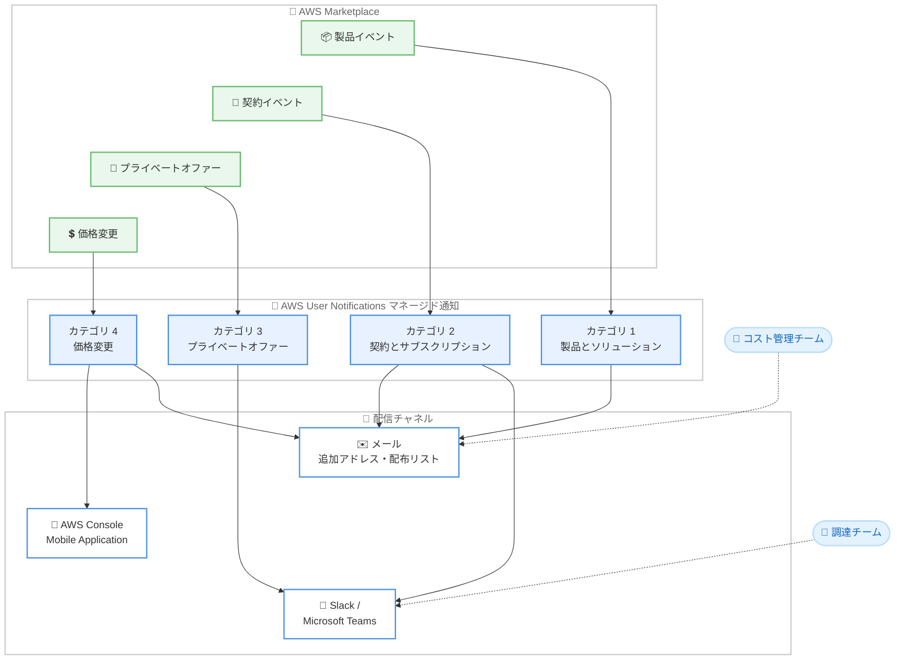

# AWS Marketplace - カテゴリベースの通知サブスクリプションとマルチチャネル配信

**リリース日**: 2026 年 8 月 10 日
**サービス**: AWS Marketplace
**機能**: 購入者向けマネージド通知 (カテゴリベースのサブスクリプションとマルチチャネル配信)

📊 [このアップデートのインフォグラフィックを見る](https://takech9203.github.io/aws-news-summary/20260810-aws-marketplace-managed-buyer-notifications.html)

## 概要

AWS Marketplace は、購入者向け通知において、カテゴリベースの通知サブスクリプションとマルチチャネル配信のサポートを発表しました。この機能は AWS User Notifications (マネージド通知) を通じて提供され、購入者は通知を 4 つのカテゴリに分類して管理し、メール、AWS Console Mobile Application、Slack や Microsoft Teams のチームチャネルなど、複数のチャネルで受信できるようになります。

これまで AWS Marketplace の通知は AWS アカウントのルートユーザーのメールアドレスにのみ送信されていました。今回のアップデートにより、調達チーム、契約更新の担当チーム、コスト管理チームなど、役割の異なる複数の担当者が、それぞれに関連するカテゴリの通知だけを適切なチャネルで受け取れるようになります。

なお、2027 年 1 月には、すべての顧客に対してこれらのカテゴリ管理と配信管理が自動的に有効化される予定です。既存の通知は引き続き変更なく配信されますが、今すぐオプトインすることで、早期に通知のカスタマイズを開始できます。

**アップデート前の課題**

このアップデート以前には、以下の課題が存在していました。

- 通知はアカウントのルートユーザーのメールアドレスにのみ送信されるため、調達・更新・コスト管理の各チームがアラートを見逃したり、メール転送に依存したりする必要があった
- 製品アップデート、契約イベント、価格変更などの通知種別ごとに受信者を分けることができなかった
- メール以外のチャネル (チャットツールやモバイルアプリ) で通知を受け取る仕組みがなかった

**アップデート後の改善**

今回のアップデートにより、以下が可能になりました。

- 通知を 4 つのカテゴリ (製品とソリューション、契約とサブスクリプション、プライベートオファー、価格変更) に分類して管理できるようになった
- 追加のメールアドレス、配布リスト、AWS Console Mobile Application、Slack や Microsoft Teams のチームチャネルへ通知を配信できるようになった
- 受信者ごとに役割に関連するカテゴリのみを受信するよう調整できるようになった

## アーキテクチャ図



AWS Marketplace の各種イベントが AWS User Notifications の 4 つのカテゴリに分類され、受信者ごとに設定したチャネル (メール、モバイルアプリ、チームチャネル) へ配信される流れを示しています。

## サービスアップデートの詳細

### 主要機能

1. **4 つの通知カテゴリ**
   - **製品とソリューション**: 製品バージョンの更新、インスタンスタイプの変更、提供制限に関する通知
   - **契約とサブスクリプション**: 契約の開始、キャンセル、更新、支払い失敗などのライフサイクルイベントに関する通知
   - **プライベートオファー**: 新しいプライベートオファーの受領と承諾確認に関する通知
   - **価格変更**: サブスクライブしている製品の時間単位、月単位、使用量ベースの価格引き上げに関する通知

2. **マルチチャネル配信**
   - 追加のメールアドレスや配布リストへの配信
   - AWS Console Mobile Application への配信
   - Slack や Microsoft Teams のチームチャネルへの配信 (Amazon Q Developer in chat applications を利用)
   - 受信者ごとに、役割に関連するカテゴリのみを受信するように調整可能

3. **デフォルト設定と自動有効化**
   - デフォルトでは、すべてのカテゴリが有効で、ルートアカウントのメールアドレスにメールで送信される
   - 2027 年 1 月に、すべての顧客に対してカテゴリ管理と配信管理が自動的に有効化される予定
   - 既存の通知は変更なく継続されるが、今すぐオプトインしてカスタマイズを開始できる

## 技術仕様

### 通知カテゴリの詳細

| カテゴリ | 対象イベント |
|------|------|
| 製品とソリューション | 製品バージョン更新、インスタンスタイプ変更、提供制限 |
| 契約とサブスクリプション | 契約の開始、キャンセル、更新、支払い失敗 |
| プライベートオファー | 新規プライベートオファー、承諾確認 |
| 価格変更 | 時間単位・月単位・使用量ベースの価格引き上げ |

### 配信チャネル

| チャネル | 説明 |
|------|------|
| メール | ルートユーザーのメールアドレス (デフォルト) に加え、追加アドレスや配布リストを設定可能 |
| コンソール通知センター | AWS マネジメントコンソール内の通知センターで確認可能 |
| AWS Console Mobile Application | モバイルアプリでのプッシュ通知 |
| Slack / Microsoft Teams | Amazon Q Developer in chat applications 経由でチームチャネルに配信 |

### 送信元メールアドレスの変更

AWS User Notifications への移行に伴い、通知メールの送信元が変更されます。

| 項目 | 詳細 |
|------|------|
| 移行前の送信元 | `no-reply@marketplace.aws` |
| 移行後の送信元 | `marketplace@aws.com` |
| 対応が必要なケース | メールフィルタやルールを使用している場合、`marketplace@aws.com` を許可するよう更新が必要 |

## 設定方法

### 前提条件

1. AWS アカウントを保有し、AWS Marketplace で製品を購入またはサブスクライブしていること
2. AWS User Notifications コンソールへのアクセス権限があること
3. Slack や Microsoft Teams へ配信する場合は、Amazon Q Developer in chat applications の設定が必要

### 手順

#### ステップ 1: AWS User Notifications コンソールでマネージド通知を確認

AWS User Notifications コンソールのマネージド通知セクション (`https://us-east-1.console.aws.amazon.com/notifications/home#/managed-notifications`) にアクセスし、AWS Marketplace のマネージド通知にオプトインします。

#### ステップ 2: カテゴリごとのサブスクリプションを設定

4 つのカテゴリ (製品とソリューション、契約とサブスクリプション、プライベートオファー、価格変更) ごとに、通知の有効・無効と受信者を設定します。デフォルトではすべてのカテゴリが有効で、ルートアカウントのメールアドレスに送信されます。

#### ステップ 3: 配信チャネルを追加

各カテゴリに対して、追加のメールアドレス、配布リスト、AWS Console Mobile Application、Slack や Microsoft Teams のチームチャネルを配信先として追加します。受信者ごとに、役割に関連するカテゴリのみを受信するように調整します。

#### ステップ 4: メールフィルタの更新

メールフィルタやルールで AWS Marketplace からのメールを管理している場合は、新しい送信元アドレス `marketplace@aws.com` を許可するように更新します。

## メリット

### ビジネス面

- **通知の見逃し防止**: 調達、更新、コスト管理などの各チームが必要な通知を直接受け取れるため、重要なイベントの見逃しやメール転送への依存を解消できる
- **役割ベースの情報配信**: 受信者ごとに関連カテゴリのみを配信することで、各チームがノイズなく必要な情報に集中できる
- **コスト管理の強化**: 価格変更カテゴリの通知により、サブスクライブ中の製品の価格引き上げを早期に把握し、予算計画に反映できる

### 技術面

- **マルチチャネル対応**: メールに加えて、モバイルアプリやチームチャネル (Slack、Microsoft Teams) で通知を受信でき、チームの既存ワークフローに統合しやすい
- **一元管理**: AWS User Notifications のコンソール通知センターで通知を一元的に確認・管理できる
- **追加実装が不要**: マネージド通知として提供されるため、EventBridge ルールや SNS トピックを個別に構築することなく、コンソール設定のみで利用できる

## デメリット・制約事項

### 制限事項

- 2027 年 1 月にすべての顧客へ自動的に有効化されるため、それまでに通知運用の見直しが推奨される
- 通知カテゴリは 4 種類に固定されており、独自のカテゴリを定義することはできない
- Slack や Microsoft Teams への配信には Amazon Q Developer in chat applications の設定が別途必要

### 考慮すべき点

- 送信元メールアドレスが `no-reply@marketplace.aws` から `marketplace@aws.com` に変わるため、メールフィルタやルールを使用している場合は事前の更新が必要
- 従来のルートユーザーメールのみの運用から移行する場合は、通知の受信者と配信チャネルの設計を社内で整理しておく必要がある
- EventBridge や Amazon SNS ベースの既存の通知連携を利用している場合は、マネージド通知との使い分けを検討する必要がある

## ユースケース

### ユースケース 1: 調達チームへのプライベートオファー通知の直接配信

**シナリオ**: 企業の調達チームが AWS Marketplace のプライベートオファーを管理しているが、通知がルートユーザーのメールにのみ届くため、オファー受領の確認が遅れていた。

**実装例**:
```
1. AWS User Notifications コンソールでマネージド通知にオプトイン
2. プライベートオファーカテゴリの配信先に調達チームの
   Slack チャネルと配布リストを追加
3. 他のカテゴリは調達チームには配信しないよう設定
```

**効果**: 調達チームが新規プライベートオファーと承諾確認をリアルタイムで把握でき、オファーへの対応時間を短縮できる。

### ユースケース 2: コスト管理チームによる価格変更の監視

**シナリオ**: FinOps チームがサブスクライブ中の Marketplace 製品の価格変更を監視し、予算への影響を早期に評価したい。

**実装例**:
```
1. 価格変更カテゴリの配信先に FinOps チームの
   メール配布リストを追加
2. AWS Console Mobile Application でも受信するよう設定し、
   外出先でも価格引き上げを確認可能にする
```

**効果**: 時間単位・月単位・使用量ベースの価格引き上げを早期に検知し、コスト予測の修正や代替製品の検討を迅速に開始できる。

### ユースケース 3: 契約更新・支払い失敗の運用チームへの通知

**シナリオ**: サブスクリプションの更新漏れや支払い失敗によるサービス停止リスクを回避するため、契約ライフサイクルイベントを運用チームで監視したい。

**実装例**:
```
1. 契約とサブスクリプションカテゴリの配信先に
   運用チームの Microsoft Teams チャネルを追加
2. 支払い失敗や更新の通知をチーム全体で共有し、
   対応漏れを防止する体制を構築
```

**効果**: 契約の開始、キャンセル、更新、支払い失敗をチーム全体で即座に把握でき、サービス継続性に関わるリスクを低減できる。

## 料金

この機能に関する追加料金は発表内に記載されていません。AWS User Notifications によるマネージド通知の設定と利用は、AWS Marketplace の購入者向け機能として提供されます。

## 利用可能リージョン

AWS Marketplace が利用可能なすべての AWS 商用リージョンで利用できます。

## 関連サービス・機能

- **AWS User Notifications**: 本機能の基盤となる通知管理サービス。コンソール通知センターでの一元管理と、マルチチャネル配信を提供する
- **Amazon Q Developer in chat applications**: Slack や Microsoft Teams のチームチャネルへの通知配信を実現する
- **Amazon EventBridge / Amazon SNS**: AWS Marketplace イベントをプログラムで処理するための既存の連携方法。マネージド通知と併用可能

## 参考リンク

- 📊 [インフォグラフィック](https://takech9203.github.io/aws-news-summary/20260810-aws-marketplace-managed-buyer-notifications.html)
- [公式発表 (What's New)](https://aws.amazon.com/about-aws/whats-new/2026/08/aws-marketplace-managed-buyer-notifications/)
- [ドキュメント: Buyer notifications for AWS Marketplace events](https://docs.aws.amazon.com/marketplace/latest/buyerguide/buyer-notifications.html)
- [ドキュメント: AWS User Notifications - Notification Configurations](https://docs.aws.amazon.com/notifications/latest/userguide/managing-notifications.html)

## まとめ

AWS Marketplace の購入者向け通知が AWS User Notifications に統合され、4 つのカテゴリ管理とマルチチャネル配信により、調達・契約・コスト管理の各チームが必要な通知を適切なチャネルで受け取れるようになりました。2027 年 1 月にすべての顧客へ自動的に有効化されるため、早期にオプトインして受信者と配信チャネルの設計を進めるとともに、メールフィルタを使用している場合は新しい送信元アドレス `marketplace@aws.com` の許可設定を更新することを推奨します。
