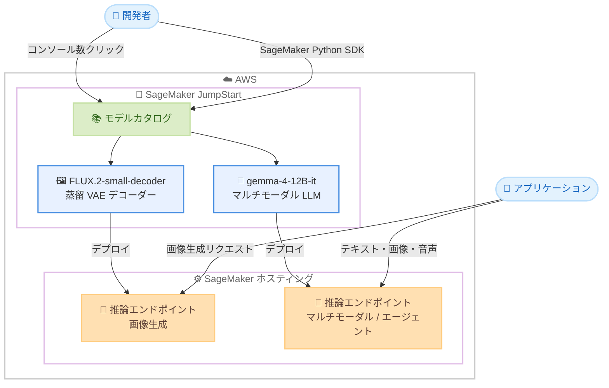

# Amazon SageMaker JumpStart - FLUX.2-small-decoder および gemma-4-12B-it モデルの提供開始

**リリース日**: 2026 年 8 月 10 日
**サービス**: Amazon SageMaker JumpStart
**機能**: FLUX.2-small-decoder (Black Forest Labs) と gemma-4-12B-it (Google) の 2 つの基盤モデルを追加

📊 [このアップデートのインフォグラフィックを見る](https://takech9203.github.io/aws-news-summary/20260810-flux.2-small-decoder-gemma-4-12B-it-on-sagemaker-jumpstart.html)

## 概要

Amazon SageMaker JumpStart で、Black Forest Labs の FLUX.2-small-decoder と Google の gemma-4-12B-it の 2 つのモデルが利用可能になりました。これにより、AWS のお客様が利用できる基盤モデルのポートフォリオがさらに拡充されます。FLUX.2-small-decoder は効率的な画像生成デコーディングを、gemma-4-12B-it は統合マルチモーダル理解を提供し、いずれも AWS インフラストラクチャ上でスケーラブルな AI をデプロイできます。

FLUX.2-small-decoder は、標準の FLUX.2 デコーダーのドロップイン置き換えとして設計された蒸留 VAE デコーダーです。約 1.4 倍高速なデコーディングと約 1.4 分の 1 の VRAM 使用量を実現しながら、品質低下はほぼゼロに抑えられています。gemma-4-12B-it は、テキスト・画像・音声を単一のモデルで処理する統合マルチモーダルモデルで、ネイティブの関数呼び出しとエージェントワークフローをサポートします。

対象ユーザーは、大規模な画像生成パイプラインを運用する事業者や、マルチモーダル AI・エージェント型アプリケーションをエンタープライズ環境で構築する開発者です。SageMaker JumpStart のモデルカタログから数クリック、または SageMaker Python SDK 経由でデプロイできます。

**アップデート前の課題**

- FLUX.2 で高解像度画像を生成する場合、標準デコーダーのデコード処理に時間がかかり、VRAM 消費も大きかった
- マルチモーダル処理では、モダリティごとに個別のエンコーダーを組み合わせる構成が一般的で、アーキテクチャが複雑になりやすかった
- 高性能なマルチモーダルモデルは大きなメモリフットプリントを必要とし、デプロイコストが高くなりがちだった

**アップデート後の改善**

- FLUX.2-small-decoder により、既存の FLUX.2 パイプラインのデコーダーを置き換えるだけで、約 1.4 倍の高速化と VRAM 削減を品質低下ほぼゼロで実現できるようになった
- gemma-4-12B-it により、テキスト・画像・音声を単一の decoder-only Transformer で直接処理する、エンコーダー不要のシンプルな構成が利用可能になった
- gemma-4-12B-it は Google の 26B MoE モデルに迫る性能を半分以下のメモリフットプリントで発揮し、最小 16 GB の RAM で動作するため、デプロイコストを抑えられるようになった

## アーキテクチャ図



SageMaker JumpStart のモデルカタログから 2 つの新モデルを選択し、SageMaker の推論エンドポイントとしてデプロイする流れを示しています。デプロイはコンソールの数クリック操作または SageMaker Python SDK で実行できます。

## サービスアップデートの詳細

### 主要機能

1. **FLUX.2-small-decoder (Black Forest Labs)**
   - 標準の FLUX.2 デコーダーのドロップイン置き換えとして設計された蒸留 VAE デコーダー
   - 約 1.4 倍高速なデコーディングと約 1.4 分の 1 の VRAM 使用量を、品質低下ほぼゼロで実現
   - 処理するピクセル数が多いほど効果が大きくなるため、高解像度になるほど優位性が向上し、大規模なプロダクショングレードの画像生成に適する

2. **gemma-4-12B-it (Google)**
   - テキスト・画像・音声にまたがる統合マルチモーダル理解を提供し、ネイティブの関数呼び出しとエージェントワークフローをサポート
   - すべてのモダリティが単一の decoder-only Transformer に直接入力される、エンコーダー不要のアーキテクチャを採用
   - Google の 26B MoE モデルに迫る性能を半分以下のメモリフットプリントで実現し、最小 16 GB の RAM で動作

3. **SageMaker JumpStart による簡単デプロイ**
   - SageMaker コンソールの JumpStart モデルカタログから数クリックでデプロイ可能
   - SageMaker Python SDK を使用したプログラマティックなデプロイにも対応
   - 自身の AWS アカウント内にデプロイされるため、データがアカウント外に出ない構成で利用可能

## 技術仕様

### モデル比較

| 項目 | FLUX.2-small-decoder | gemma-4-12B-it |
|------|----------------------|----------------|
| 提供元 | Black Forest Labs | Google |
| 種別 | 蒸留 VAE デコーダー (画像生成) | マルチモーダル LLM (指示チューニング済み) |
| 主な用途 | FLUX.2 画像生成のデコード高速化 | テキスト・画像・音声の統合理解、エージェント |
| 性能特性 | 約 1.4 倍高速、VRAM 約 1.4 分の 1 | 26B MoE モデルに迫る性能を半分以下のメモリで実現 |
| メモリ要件 | 標準デコーダーより少ない VRAM | 最小 16 GB の RAM で動作 |
| アーキテクチャ上の特徴 | 標準 FLUX.2 デコーダーのドロップイン置き換え | エンコーダー不要の decoder-only Transformer |

### デプロイ方法

| 方法 | 説明 |
|------|------|
| SageMaker コンソール | JumpStart モデルカタログからモデルを選択し、数クリックでデプロイ |
| SageMaker Python SDK | コードからモデルを指定してエンドポイントを作成 |

## 設定方法

### 前提条件

1. AWS アカウントを保有していること
2. Amazon SageMaker AI (SageMaker Studio など) へのアクセス権限があること
3. SageMaker Python SDK を使用する場合は、`sagemaker` パッケージがインストールされていること
4. デプロイ先の推論インスタンスに対するサービスクォータが確保されていること

### 手順

#### ステップ1: SageMaker Python SDK のインストール

```bash
pip install --upgrade sagemaker
```

SageMaker Python SDK を最新バージョンに更新します。新しく追加されたモデルを扱うため、最新の SDK を使用することを推奨します。

#### ステップ2: JumpStart モデルのデプロイ

```python
from sagemaker.jumpstart.model import JumpStartModel

# モデル ID は SageMaker コンソールの JumpStart カタログで確認
model = JumpStartModel(model_id="<jumpstart-model-id>")
predictor = model.deploy()
```

JumpStart カタログ上のモデル ID を指定して `JumpStartModel` を作成し、`deploy()` で推論エンドポイントを起動しています。モデル ID とデフォルトのインスタンスタイプは、SageMaker コンソールの JumpStart モデルカタログの各モデル詳細ページで確認できます。

#### ステップ3: 推論の実行と後片付け

```python
# 推論リクエストの送信
response = predictor.predict({"inputs": "<プロンプトまたは入力データ>"})
print(response)

# 不要になったらエンドポイントを削除
predictor.delete_endpoint()
```

デプロイしたエンドポイントに推論リクエストを送信し、結果を取得しています。エンドポイントは稼働時間に応じて課金されるため、不要になったら削除してコストの発生を防ぎます。

## メリット

### ビジネス面

- **画像生成コストの削減**: FLUX.2-small-decoder の高速化と VRAM 削減により、同じインフラでより多くの画像を生成でき、大規模画像生成パイプラインのコスト効率が向上する
- **マルチモーダル AI の導入障壁の低下**: gemma-4-12B-it は最小 16 GB の RAM で動作するため、比較的小規模なインスタンスでエンタープライズ向けマルチモーダルアプリケーションを構築できる
- **迅速な検証と市場投入**: JumpStart から数クリックでデプロイできるため、PoC から本番導入までのリードタイムを短縮できる

### 技術面

- **ドロップイン置き換えによる容易な最適化**: 既存の FLUX.2 パイプラインのデコーダー部分を置き換えるだけで性能改善が得られ、パイプラインの再設計が不要
- **シンプルなマルチモーダルアーキテクチャ**: gemma-4-12B-it はエンコーダー不要の単一 decoder-only Transformer 構成のため、モダリティごとのエンコーダー管理が不要
- **エージェントワークフロー対応**: gemma-4-12B-it はネイティブの関数呼び出しをサポートし、ツール連携を伴うエージェント型アプリケーションを構築しやすい

## デメリット・制約事項

### 制限事項

- FLUX.2-small-decoder は FLUX.2 デコーダーの置き換え用モデルであり、単体で画像生成を完結するモデルではない
- 発表では利用可能リージョンが明記されていないため、利用予定のリージョンで JumpStart カタログに表示されるかの確認が必要
- モデルごとにライセンス条件 (エンドユーザーライセンス契約) が異なるため、商用利用時は各モデルの利用規約の確認が必要

### 考慮すべき点

- SageMaker の推論エンドポイントは稼働時間に応じて課金されるため、利用パターンに応じたインスタンスタイプ選定とオートスケーリング設定が重要
- gemma-4-12B-it の性能比較 (26B MoE モデルに迫る性能) は提供元の説明に基づくものであり、実ワークロードでの評価を推奨
- 品質低下がほぼゼロとされる FLUX.2-small-decoder についても、要件の厳しい用途では本番導入前に出力品質の検証を行うことが望ましい

## ユースケース

### ユースケース1: 大規模な商品画像生成パイプラインの高速化

**シナリオ**: EC サイト運営企業が、FLUX.2 を使用して大量の商品バリエーション画像を高解像度で生成しており、デコード処理がスループットのボトルネックになっている。

**実装例**:
```
1. SageMaker JumpStart から FLUX.2-small-decoder をデプロイ
2. 既存の FLUX.2 画像生成パイプラインの標準デコーダーを置き換え
3. 高解像度出力でのスループットと VRAM 使用量を計測し、インスタンス数を最適化
```

**効果**: 約 1.4 倍の高速化により同一インフラでの生成枚数が増加し、VRAM 削減により小さいインスタンスへの集約やバッチサイズ拡大が可能になる。高解像度ほど効果が大きい。

### ユースケース2: 音声・画像対応のカスタマーサポートアシスタント

**シナリオ**: コールセンターを持つ企業が、顧客から送られる音声メッセージや製品写真を理解し、テキストで回答するサポートアシスタントを構築したい。

**実装例**:
```
1. SageMaker JumpStart から gemma-4-12B-it をデプロイ
2. 音声・画像・テキストを単一エンドポイントに入力し、統合的に理解
3. 関数呼び出し機能で社内 FAQ 検索やチケット発行 API と連携
```

**効果**: モダリティごとに別モデルを運用する必要がなく、単一モデルで音声・画像・テキストを処理できるため、アーキテクチャと運用がシンプルになる。

### ユースケース3: コスト効率を重視したエージェント型業務自動化

**シナリオ**: 大規模モデルの推論コストが課題となっている企業が、社内業務のエージェント型自動化 (ドキュメント処理、ツール連携など) を低コストで実現したい。

**実装例**:
```
1. gemma-4-12B-it を 16 GB 以上のメモリを持つ推論インスタンスにデプロイ
2. ネイティブ関数呼び出しで社内システムの API をツールとして定義
3. エージェントワークフローを構築し、処理結果を業務システムに反映
```

**効果**: 26B クラスの MoE モデルに迫る性能を半分以下のメモリフットプリントで利用できるため、推論インスタンスのコストを抑えながらエージェント型自動化を実現できる。

## 料金

SageMaker JumpStart 自体に追加料金はなく、モデルのデプロイ先である SageMaker AI の推論インスタンスの稼働時間に応じた料金が発生します。料金はインスタンスタイプとリージョンによって異なります。詳細は [Amazon SageMaker AI の料金ページ](https://aws.amazon.com/sagemaker-ai/pricing/) を参照してください。

## 利用可能リージョン

公式発表では利用可能リージョンは明記されていません。SageMaker コンソールの JumpStart モデルカタログで、利用予定リージョンでの各モデルの提供状況を確認してください。

## 関連サービス・機能

- **Amazon SageMaker JumpStart**: 事前学習済みモデルのカタログとワンクリックデプロイ機能を提供する SageMaker AI の機能
- **Amazon SageMaker AI 推論エンドポイント**: デプロイしたモデルをホストし、リアルタイム推論を提供するマネージドインフラストラクチャ
- **Amazon Bedrock**: サーバーレスで基盤モデルを利用する選択肢。インフラ管理不要の API 利用が適する場合は Bedrock、モデルのカスタマイズやインフラ制御が必要な場合は SageMaker JumpStart が適する
- **SageMaker Python SDK**: JumpStart モデルのプログラマティックなデプロイと推論に使用する SDK

## 参考リンク

- 📊 [インフォグラフィック](https://takech9203.github.io/aws-news-summary/20260810-flux.2-small-decoder-gemma-4-12B-it-on-sagemaker-jumpstart.html)
- [公式発表 (What's New)](https://aws.amazon.com/about-aws/whats-new/2026/01/flux.2-small-decoder-gemma-4-12B-it-on-sagemaker-jumpstart/)
- [Amazon SageMaker JumpStart ドキュメント](https://docs.aws.amazon.com/sagemaker/latest/dg/studio-jumpstart.html)
- [Amazon SageMaker AI 料金ページ](https://aws.amazon.com/sagemaker-ai/pricing/)

## まとめ

SageMaker JumpStart に、画像生成のデコードを高速化する FLUX.2-small-decoder と、テキスト・画像・音声を単一モデルで扱う gemma-4-12B-it が追加され、画像生成パイプラインの最適化とマルチモーダル・エージェント型アプリケーション構築の選択肢が広がりました。FLUX.2 を利用中の場合はデコーダーの置き換えによる高速化を、マルチモーダル AI を検討中の場合は gemma-4-12B-it の JumpStart からのデプロイ検証を推奨します。
