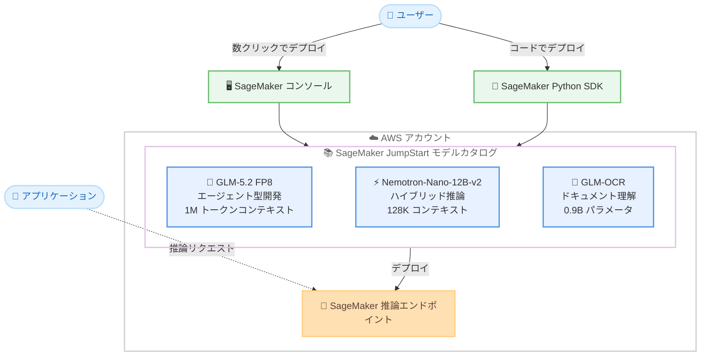

# Amazon SageMaker JumpStart - GLM-5.2 FP8、NVIDIA-Nemotron-Nano-12B-v2、GLM-OCR モデルの提供開始

**リリース日**: 2026 年 8 月 10 日
**サービス**: Amazon SageMaker JumpStart
**機能**: GLM-5.2 FP8、NVIDIA-Nemotron-Nano-12B-v2、GLM-OCR モデルの提供開始

📊 [このアップデートのインフォグラフィックを見る](https://takech9203.github.io/aws-news-summary/20260810-glm-5.2-fp8-nemotron-nano-12b-v2-glm-ocr-on-sagemaker-jumpstart.html)

## 概要

Amazon SageMaker JumpStart で、新たに 3 つの基盤モデルが利用可能になりました。Z.ai の GLM-5.2 FP8、NVIDIA の Nemotron-Nano-12B-v2、そして Z.ai の GLM-OCR です。これらのモデルは、長期タスクに対応するエージェント型エンジニアリング、効率的なハイブリッド推論、高度なドキュメント理解という、それぞれ異なる領域をカバーします。

GLM-5.2 FP8 は、要件定義からデプロイまでのエンドツーエンドのソフトウェア開発を単一タスクで処理できるエージェント型エンジニアリング向けモデルで、実用的な 100 万トークンのコンテキストウィンドウを備えています。NVIDIA-Nemotron-Nano-12B-v2 は、Mamba-2 と Transformer のハイブリッドアーキテクチャを採用した 12B パラメータのモデルで、推論タスクと非推論タスクの両方を高スループットで処理します。GLM-OCR は 0.9B パラメータの軽量マルチモーダルモデルで、スキャンされた PDF や手書き文字、数式を含む学術論文などを構造化された形式で出力します。

ユーザーは SageMaker コンソールの JumpStart モデルカタログから数クリックでデプロイするか、SageMaker Python SDK を使用して自身の AWS アカウント内にデプロイできます。

**アップデート前の課題**

これらのモデルを AWS 上で利用するには、以前は以下のような作業が必要でした。

- モデルアーティファクトを自分で取得し、推論コンテナやサービングスタックを構築する必要があった
- 100 万トークン級の長大コンテキストを扱うエージェント型開発ワークロード向けのオープンモデルの選択肢が限られていた
- 手書き文字や数式、複数言語が混在するドキュメントの OCR 処理に、複数のサービスやモデルを組み合わせる必要があった

**アップデート後の改善**

今回のアップデートにより、以下が可能になりました。

- SageMaker JumpStart のモデルカタログから数クリック、または SageMaker Python SDK で 3 モデルをすぐにデプロイできるようになった
- GLM-5.2 FP8 により、プロジェクトレベルのエンジニアリングコンテキストと開発ワークフロー全体を単一タスクで扱えるようになった
- NVIDIA-Nemotron-Nano-12B-v2 により、同規模の主要オープンモデルと同等以上の精度を最大 6 倍のスループットで実現できるようになった
- GLM-OCR により、リアルタイムサービスやエッジデバイスに適したレイテンシーでドキュメント理解を実行できるようになった

## アーキテクチャ図



SageMaker JumpStart のモデルカタログから 3 つの新モデルを選択し、コンソールまたは Python SDK 経由で自身の AWS アカウント内の推論エンドポイントにデプロイする流れを示しています。

## サービスアップデートの詳細

### 主要機能

1. **GLM-5.2 FP8 (Z.ai)**
   - 長期タスクとエージェント型エンジニアリングのために構築されたモデル
   - 要件定義からデプロイまでのエンドツーエンドのソフトウェア開発に対応
   - 実用的な 100 万トークンのコンテキストウィンドウを提供
   - 前身の GLM-5.1 から大幅に改善され、プロジェクトレベルのエンジニアリングコンテキストと開発ワークフロー全体を単一タスクで処理可能
   - FP8 量子化により効率的な推論を実現

2. **NVIDIA-Nemotron-Nano-12B-v2 (NVIDIA)**
   - 推論タスクと非推論タスクの両方を高い推論スループットで処理
   - Mamba-2 と Transformer のハイブリッドアーキテクチャを採用し、128K のコンテキスト長をサポート
   - 最終回答の前に推論トレースを生成する設計
   - 12B パラメータの設計で、主要なオープンモデルと同等以上の性能を最大 6 倍のスループットで実現

3. **GLM-OCR (Z.ai)**
   - 0.9B パラメータのドキュメント理解向けマルチモーダルモデル
   - スキャンされた PDF、手書き文字、数式を含む学術論文、複数カラムの表、コードドキュメント、多言語テキストに対応
   - 構造化された Markdown、JSON、LaTeX 形式で出力
   - リアルタイムサービスやエッジデバイスに適したレイテンシーを実現し、大量ドキュメント処理や請求書からの情報抽出に好適

## 技術仕様

### モデル比較

| 項目 | GLM-5.2 FP8 | NVIDIA-Nemotron-Nano-12B-v2 | GLM-OCR |
|------|-------------|------------------------------|---------|
| 提供元 | Z.ai | NVIDIA | Z.ai |
| パラメータ数 | 非公開 (FP8 量子化) | 12B | 0.9B |
| コンテキスト長 | 1M トークン | 128K トークン | ドキュメント入力向け |
| アーキテクチャ | GLM 系 | Mamba-2 + Transformer ハイブリッド | マルチモーダル |
| 主な用途 | エージェント型エンジニアリング、長期タスク | ハイブリッド推論、高スループット推論 | ドキュメント理解、OCR |
| 出力形式 | テキスト、コード | 推論トレース + 最終回答 | Markdown、JSON、LaTeX |

### デプロイ方法

| 方法 | 詳細 |
|------|------|
| SageMaker コンソール | JumpStart モデルカタログから数クリックでデプロイ |
| SageMaker Python SDK | コードによるプログラマティックなデプロイ |

## 設定方法

### 前提条件

1. AWS アカウントを保有していること
2. Amazon SageMaker AI (SageMaker Studio または SageMaker Python SDK) を利用できる IAM 権限があること
3. デプロイ先リージョンで対象モデルに必要な GPU インスタンスのサービスクォータが確保されていること

### 手順

#### ステップ 1: SageMaker Studio で JumpStart モデルカタログを開く

SageMaker コンソールから SageMaker Studio を起動し、左側のナビゲーションから「JumpStart」を選択します。検索バーで「GLM-5.2」「Nemotron-Nano」「GLM-OCR」などのモデル名を検索します。

#### ステップ 2: モデルを選択してデプロイ

モデル詳細ページで「Deploy」を選択し、インスタンスタイプやエンドポイント名を確認してデプロイを実行します。数クリックで推論エンドポイントが作成されます。

#### ステップ 3: SageMaker Python SDK でデプロイする場合

```python
from sagemaker.jumpstart.model import JumpStartModel

# JumpStart モデル ID を指定してモデルを作成
# (実際のモデル ID は JumpStart モデルカタログで確認してください)
model = JumpStartModel(model_id="<model-id>")

# 推論エンドポイントにデプロイ
predictor = model.deploy()

# 推論の実行
response = predictor.predict({
    "inputs": "ここにプロンプトを入力"
})
print(response)
```

SageMaker Python SDK の `JumpStartModel` クラスにモデル ID を指定してインスタンス化し、`deploy()` メソッドで自身の AWS アカウント内に推論エンドポイントを作成しています。その後、`predict()` メソッドで推論リクエストを送信します。

## メリット

### ビジネス面

- **導入までの時間短縮**: モデルアーティファクトの取得やサービング環境の構築が不要になり、数クリックで最新のオープンモデルを本番利用できる
- **コスト効率**: NVIDIA-Nemotron-Nano-12B-v2 の最大 6 倍のスループットや GLM-OCR の 0.9B という軽量設計により、推論コストを抑えられる
- **ユースケースの拡大**: ソフトウェア開発の自動化から請求書処理まで、幅広い業務への AI 適用が容易になる

### 技術面

- **超長コンテキスト対応**: GLM-5.2 FP8 の 1M トークンコンテキストにより、リポジトリ全体などプロジェクトレベルの情報を単一タスクで扱える
- **ハイブリッドアーキテクチャ**: Mamba-2 と Transformer を組み合わせた Nemotron-Nano-12B-v2 により、精度とスループットを両立できる
- **構造化出力**: GLM-OCR は Markdown、JSON、LaTeX で出力するため、後続の処理パイプラインへの組み込みが容易
- **セキュアなデプロイ**: モデルは自身の AWS アカウント内のエンドポイントにデプロイされるため、データを外部に送信せずに推論を実行できる

## デメリット・制約事項

### 制限事項

- 公式発表では利用可能リージョンが明記されていないため、利用前に各リージョンの JumpStart モデルカタログで提供状況を確認する必要がある
- 大規模モデル (特に GLM-5.2 FP8) のデプロイには高性能な GPU インスタンスが必要となり、サービスクォータの引き上げが必要になる場合がある

### 考慮すべき点

- サードパーティ製モデルであるため、各モデルのライセンス条件 (EULA) を確認した上で利用する必要がある
- 推論エンドポイントは稼働時間に応じて課金されるため、利用しない時間帯の停止やオートスケーリングの設計を検討すべきである
- 1M トークンのコンテキストを活用する場合、入力トークン量に応じて推論レイテンシーとメモリ消費が増大する点に注意が必要である

## ユースケース

### ユースケース 1: エージェント型ソフトウェア開発の自動化

**シナリオ**: 開発チームが、要件定義からコード実装、テスト、デプロイまでの一連の開発ワークフローを AI エージェントで自動化したい。

**実装例**:
```
1. GLM-5.2 FP8 を SageMaker エンドポイントにデプロイ
2. リポジトリ全体のコードと要件ドキュメントを 1M トークンの
   コンテキストに投入
3. エージェントフレームワークからエンドポイントを呼び出し、
   実装からデプロイまでを単一タスクとして実行
```

**効果**: プロジェクトレベルのコンテキストを分割せずに扱えるため、整合性の高いコード生成と開発サイクルの大幅な短縮が期待できる。

### ユースケース 2: 高スループットな推論サービスの構築

**シナリオ**: カスタマーサポートの問い合わせ分類と回答生成を行うサービスで、推論品質を維持しつつ大量のリクエストを低コストで処理したい。

**実装例**:
```
1. NVIDIA-Nemotron-Nano-12B-v2 を SageMaker エンドポイントに
   デプロイ
2. 推論トレースが必要な複雑な問い合わせと、単純な分類タスクを
   同一モデルで処理
3. オートスケーリングを設定し、ピーク時のスループットを確保
```

**効果**: 最大 6 倍のスループットにより、同等の精度を維持しながら必要なインスタンス数を削減し、推論コストを大幅に抑制できる。

### ユースケース 3: 請求書・帳票の大量処理パイプライン

**シナリオ**: 経理部門が、フォーマットの異なる大量の請求書や手書き帳票からデータを抽出し、基幹システムに取り込みたい。

**実装例**:
```
1. GLM-OCR を SageMaker エンドポイントにデプロイ
2. S3 に格納されたスキャン PDF を Lambda / Step Functions で
   バッチ処理
3. JSON 形式の構造化出力を基幹システムの取り込みフォーマットに
   変換
```

**効果**: 多言語や手書き文字を含む多様なドキュメントを 1 つの軽量モデルで処理でき、手作業によるデータ入力を削減できる。

## 料金

SageMaker JumpStart のモデル利用自体に追加料金はなく、モデルをデプロイした推論エンドポイントのインスタンス稼働時間に応じた Amazon SageMaker AI の標準料金が発生します。料金はインスタンスタイプとリージョンによって異なるため、詳細は [Amazon SageMaker の料金ページ](https://aws.amazon.com/sagemaker/pricing/) を参照してください。

## 利用可能リージョン

公式発表では利用可能リージョンが明記されていません。各リージョンの SageMaker JumpStart モデルカタログで、対象モデルの提供状況を確認してください。

## 関連サービス・機能

- **Amazon SageMaker AI**: JumpStart モデルのデプロイ先となる推論エンドポイントを提供するマネージド機械学習サービス
- **Amazon Bedrock**: サーバーレスで基盤モデルを利用する選択肢。エンドポイント管理が不要な場合の代替手段
- **Amazon Textract**: マネージドなドキュメント分析サービス。GLM-OCR とはカスタマイズ性とマネージド性のトレードオフで使い分けが可能
- **AWS Step Functions / AWS Lambda**: GLM-OCR を用いた大量ドキュメント処理パイプラインのオーケストレーションに活用可能

## 参考リンク

- 📊 [インフォグラフィック](https://takech9203.github.io/aws-news-summary/20260810-glm-5.2-fp8-nemotron-nano-12b-v2-glm-ocr-on-sagemaker-jumpstart.html)
- [公式発表 (What's New)](https://aws.amazon.com/about-aws/whats-new/2026/01/glm-5.2-fp8-nemotron-nano-12b-v2-glm-ocr-on-sagemaker-jumpstart/)
- [Amazon SageMaker JumpStart ドキュメント](https://docs.aws.amazon.com/sagemaker/latest/dg/studio-jumpstart.html)
- [Amazon SageMaker 料金ページ](https://aws.amazon.com/sagemaker/pricing/)

## まとめ

Amazon SageMaker JumpStart に、エージェント型開発向けの GLM-5.2 FP8、高スループット推論向けの NVIDIA-Nemotron-Nano-12B-v2、ドキュメント理解向けの GLM-OCR という特性の異なる 3 モデルが追加されました。長大コンテキストを活用した開発自動化や、コスト効率の高い推論、帳票処理の自動化を検討しているユーザーは、JumpStart モデルカタログから手軽に評価を開始することを推奨します。
