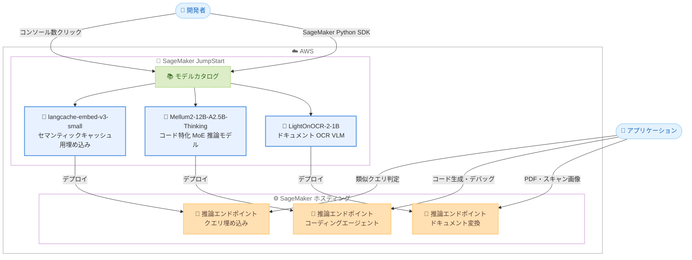

# Amazon SageMaker JumpStart - langcache-embed-v3-small、Mellum2-12B-A2.5B-Thinking、LightOnOCR-2-1B モデルの提供開始

**リリース日**: 2026 年 8 月 10 日
**サービス**: Amazon SageMaker JumpStart
**機能**: langcache-embed-v3-small (Redis)、Mellum2-12B-A2.5B-Thinking (JetBrains)、LightOnOCR-2-1B (LightOn) の 3 つの基盤モデルを追加

📊 [このアップデートのインフォグラフィックを見る](https://takech9203.github.io/aws-news-summary/20260810-langcache-embed-v3-small-mellum2-12B-A2.5B-thinking-lightOnOCR-2-1B-on-sagemaker-jumpstart.html)

## 概要

Amazon SageMaker JumpStart で、Redis の langcache-embed-v3-small、JetBrains の Mellum2-12B-A2.5B-Thinking、LightOn の LightOnOCR-2-1B の 3 つのモデルが利用可能になりました。これらのモデルは、セマンティックキャッシュの最適化、コード特化の推論、エンドツーエンドのドキュメント OCR という異なる領域をカバーし、AWS のお客様が利用できる基盤モデルのポートフォリオがさらに拡充されます。

langcache-embed-v3-small は LLM アプリケーションのセマンティックキャッシュ向けに構築された埋め込みモデルで、言い回しが異なっても意味的に等価なクエリを識別できる密ベクトル空間にテキストをマッピングします。Mellum2-12B-A2.5B-Thinking はコード生成・デバッグ・多段階推論・エージェント型コーディングワークフローに特化した Mixture-of-Experts モデルで、回答前に明示的な思考過程を出力します。LightOnOCR-2-1B は PDF・スキャン画像・写真を自然な順序のテキストへ直接変換する 1B パラメータの視覚言語モデルです。

対象ユーザーは、大量の推論リクエストを処理する LLM アプリケーションの運用者、コーディングエージェントや開発支援ツールを構築する開発者、多言語ドキュメントのデジタル化パイプラインを構築するデータエンジニアです。SageMaker JumpStart のモデルカタログから数クリック、または SageMaker Python SDK 経由でデプロイできます。

**アップデート前の課題**

- 大量の推論を処理する LLM アプリケーションでは、言い回しが異なるだけの同義のクエリにも毎回 LLM を呼び出す必要があり、レイテンシーとコストが増大していた
- コード生成やデバッグに強い推論特化モデルを、データをアカウント外に出さないプライベートな環境でホストする選択肢が限られていた
- 高精度な OCR には大規模なモデルや複数コンポーネントを組み合わせたパイプラインが必要で、処理速度とコストが課題になりやすかった

**アップデート後の改善**

- langcache-embed-v3-small により、意味的に等価なクエリをキャッシュヒットとして扱い、冗長な LLM 呼び出しを削減して応答を高速化できるようになった
- Mellum2-12B-A2.5B-Thinking により、131,072 トークンのコンテキストと明示的な思考過程を備えたコード特化モデルを、自身の AWS アカウント内にプライベートにデプロイできるようになった
- LightOnOCR-2-1B により、競合モデルの約 9 分の 1 のサイズで高速に動作しながら OlmOCR-Bench で最高水準の結果を主張する OCR モデルを利用できるようになった

## アーキテクチャ図



SageMaker JumpStart のモデルカタログから 3 つの新モデルを選択し、それぞれ SageMaker の推論エンドポイントとしてデプロイする流れを示しています。デプロイはコンソールの数クリック操作または SageMaker Python SDK で実行できます。

## サービスアップデートの詳細

### 主要機能

1. **langcache-embed-v3-small (Redis)**
   - LLM アプリケーションのセマンティックキャッシュ向けに構築された埋め込みモデル
   - 言い回しが異なっても意味的に等価なクエリを識別できるよう設計された密ベクトル空間にテキストをマッピング
   - キャッシュヒットにより冗長な LLM 呼び出しを削減し、大量推論ワークロードの応答を高速化

2. **Mellum2-12B-A2.5B-Thinking (JetBrains)**
   - コード生成、デバッグ、多段階推論、エージェント型コーディングワークフローに特化したモデル
   - Mixture-of-Experts アーキテクチャを採用し、64 のエキスパートのうちトークンごとに 8 つを活性化。総パラメータ 12B のうちフォワードパスごとに 2.5B のみがアクティブ
   - 131,072 トークンのコンテキスト長をサポートし、回答前に明示的な思考過程 (chain-of-thought) を出力。ルーティング、RAG、サブエージェント、プライベートデプロイに適する

3. **LightOnOCR-2-1B (LightOn)**
   - PDF・スキャン・画像を対象とした多言語ドキュメントからテキストへの変換を行う 1B パラメータの視覚言語モデル
   - ページ画像をクリーンで自然な順序のテキストへ直接変換するエンドツーエンド構成
   - OlmOCR-Bench で最高水準の結果を主張しつつ、競合モデルの約 9 分の 1 のサイズで高速に動作

## 技術仕様

### モデル比較

| 項目 | langcache-embed-v3-small | Mellum2-12B-A2.5B-Thinking | LightOnOCR-2-1B |
|------|--------------------------|-----------------------------|-----------------|
| 提供元 | Redis | JetBrains | LightOn |
| 種別 | 埋め込みモデル | コード特化 MoE 推論モデル | 視覚言語モデル (OCR) |
| 主な用途 | セマンティックキャッシュ | コード生成・デバッグ・エージェント型コーディング | 多言語ドキュメントのテキスト変換 |
| アーキテクチャ上の特徴 | 意味的等価性の識別に最適化された密ベクトル空間 | 64 エキスパート中 8 つを活性化、12B 中 2.5B がアクティブ | 1B パラメータのエンドツーエンド VLM |
| 性能特性 | キャッシュヒットで冗長な LLM 呼び出しを削減 | 131,072 トークンコンテキスト、明示的な思考過程を出力 | 競合の約 9 分の 1 のサイズで OlmOCR-Bench 最高水準を主張 |

### デプロイ方法

| 方法 | 説明 |
|------|------|
| SageMaker コンソール | JumpStart モデルカタログからモデルを選択し、数クリックでデプロイ |
| SageMaker Python SDK | コードからモデルを指定してエンドポイントを作成 |

## 設定方法

### 前提条件

1. AWS アカウントを保有していること
2. Amazon SageMaker AI (SageMaker Studio など) へのアクセス権限があること
3. SageMaker Python SDK を使用する場合は、`sagemaker` パッケージがインストールされていること
4. デプロイ先の推論インスタンスに対するサービスクォータが確保されていること

### 手順

#### ステップ1: SageMaker Python SDK のインストール

```bash
pip install --upgrade sagemaker
```

SageMaker Python SDK を最新バージョンに更新します。新しく追加されたモデルを扱うため、最新の SDK を使用することを推奨します。

#### ステップ2: JumpStart モデルのデプロイ

```python
from sagemaker.jumpstart.model import JumpStartModel

# モデル ID は SageMaker コンソールの JumpStart カタログで確認
model = JumpStartModel(model_id="<jumpstart-model-id>")
predictor = model.deploy()
```

JumpStart カタログ上のモデル ID を指定して `JumpStartModel` を作成し、`deploy()` で推論エンドポイントを起動しています。モデル ID とデフォルトのインスタンスタイプは、SageMaker コンソールの JumpStart モデルカタログの各モデル詳細ページで確認できます。

#### ステップ3: 推論の実行と後片付け

```python
# 推論リクエストの送信
response = predictor.predict({"inputs": "<プロンプトまたは入力データ>"})
print(response)

# 不要になったらエンドポイントを削除
predictor.delete_endpoint()
```

デプロイしたエンドポイントに推論リクエストを送信し、結果を取得しています。エンドポイントは稼働時間に応じて課金されるため、不要になったら削除してコストの発生を防ぎます。

## メリット

### ビジネス面

- **LLM 運用コストの削減**: langcache-embed-v3-small によるセマンティックキャッシュで冗長な LLM 呼び出しを削減し、大量推論ワークロードの API コストとレイテンシーを抑えられる
- **開発生産性の向上**: Mellum2-12B-A2.5B-Thinking をコーディングエージェントや開発支援ツールに組み込むことで、コード生成・デバッグ作業を効率化できる
- **ドキュメント処理コストの最適化**: LightOnOCR-2-1B は 1B パラメータと小型のため、比較的小さい推論インスタンスで大量のドキュメント変換を高速に処理できる

### 技術面

- **プライベートなモデルホスティング**: 3 つのモデルはいずれも自身の AWS アカウント内の SageMaker エンドポイントにデプロイされるため、データをアカウント外に出さない構成で利用できる
- **効率的な MoE 推論**: Mellum2-12B-A2.5B-Thinking はフォワードパスごとに 2.5B パラメータのみをアクティブ化するため、12B クラスの能力を効率的な計算量で利用できる
- **シンプルな OCR パイプライン**: LightOnOCR-2-1B はページ画像からテキストへの変換をエンドツーエンドで行うため、レイアウト解析などの複数コンポーネントを組み合わせる必要がない

## デメリット・制約事項

### 制限事項

- 発表では利用可能リージョンが明記されていないため、利用予定のリージョンで JumpStart カタログに表示されるかの確認が必要
- モデルごとにライセンス条件 (エンドユーザーライセンス契約) が異なるため、商用利用時は各モデルの利用規約の確認が必要
- langcache-embed-v3-small は埋め込みモデルであり、キャッシュ機構 (ベクトル検索やキャッシュストア) は別途構築する必要がある

### 考慮すべき点

- SageMaker の推論エンドポイントは稼働時間に応じて課金されるため、利用パターンに応じたインスタンスタイプ選定とオートスケーリング設定が重要
- LightOnOCR-2-1B の性能比較 (OlmOCR-Bench で最高水準、約 9 分の 1 のサイズ) は提供元の説明に基づくものであり、実ワークロードでの評価を推奨
- Mellum2-12B-A2.5B-Thinking は思考過程を出力するため、出力トークン数が増加しやすい点を考慮したレイテンシー・コスト設計が必要

## ユースケース

### ユースケース1: 高トラフィック LLM アプリケーションのセマンティックキャッシュ

**シナリオ**: 社内 FAQ チャットボットを運用する企業で、言い回しが異なるだけの同義の質問が大量に寄せられており、LLM 呼び出しコストとレイテンシーが課題になっている。

**実装例**:
```
1. SageMaker JumpStart から langcache-embed-v3-small をデプロイ
2. ユーザークエリを埋め込みベクトルに変換し、ベクトルストアで過去の回答と類似度検索
3. 類似度がしきい値以上ならキャッシュ済み回答を返却し、未満の場合のみ LLM を呼び出して結果をキャッシュ
```

**効果**: 意味的に等価なクエリをキャッシュヒットとして処理できるため、冗長な LLM 呼び出しが削減され、応答の高速化とコスト削減を両立できる。

### ユースケース2: プライベート環境でのコーディングエージェント構築

**シナリオ**: ソースコードを外部サービスに送信できないセキュリティ要件を持つ企業が、コード生成・デバッグ・リファクタリングを支援するエージェントを社内向けに構築したい。

**実装例**:
```
1. SageMaker JumpStart から Mellum2-12B-A2.5B-Thinking をデプロイ
2. 131,072 トークンのコンテキストにリポジトリの関連ファイルを投入
3. 思考過程付きの応答をエージェントワークフローに組み込み、多段階のコード修正を実行
```

**効果**: データを自身の AWS アカウント外に出さずにコード特化モデルを利用でき、MoE アーキテクチャにより 12B クラスの能力を効率的な推論コストで活用できる。

### ユースケース3: 多言語ドキュメントの大規模デジタル化

**シナリオ**: 多言語の契約書や帳票をスキャンした PDF が大量に蓄積されており、RAG や検索システムに投入するためのテキスト化パイプラインを低コストで構築したい。

**実装例**:
```
1. SageMaker JumpStart から LightOnOCR-2-1B をデプロイ
2. PDF をページ画像に変換し、推論エンドポイントに送信
3. 自然な順序で出力されたテキストを S3 に保存し、後段の検索・RAG パイプラインに連携
```

**効果**: 1B パラメータの小型モデルで高速にテキスト変換できるため、大規模なドキュメントデジタル化でも推論インスタンスのコストを抑えられる。

## 料金

SageMaker JumpStart 自体に追加料金はなく、モデルのデプロイ先である SageMaker AI の推論インスタンスの稼働時間に応じた料金が発生します。料金はインスタンスタイプとリージョンによって異なります。詳細は [Amazon SageMaker AI の料金ページ](https://aws.amazon.com/sagemaker-ai/pricing/) を参照してください。

## 利用可能リージョン

公式発表では利用可能リージョンは明記されていません。SageMaker コンソールの JumpStart モデルカタログで、利用予定リージョンでの各モデルの提供状況を確認してください。

## 関連サービス・機能

- **Amazon SageMaker JumpStart**: 事前学習済みモデルのカタログとワンクリックデプロイ機能を提供する SageMaker AI の機能
- **Amazon SageMaker AI 推論エンドポイント**: デプロイしたモデルをホストし、リアルタイム推論を提供するマネージドインフラストラクチャ
- **Amazon Bedrock**: サーバーレスで基盤モデルを利用する選択肢。インフラ管理不要の API 利用が適する場合は Bedrock、モデルのカスタマイズやインフラ制御が必要な場合は SageMaker JumpStart が適する
- **Amazon OpenSearch Service**: langcache-embed-v3-small で生成した埋め込みベクトルの類似度検索基盤として利用できるベクトル検索対応サービス
- **SageMaker Python SDK**: JumpStart モデルのプログラマティックなデプロイと推論に使用する SDK

## 参考リンク

- 📊 [インフォグラフィック](https://takech9203.github.io/aws-news-summary/20260810-langcache-embed-v3-small-mellum2-12B-A2.5B-thinking-lightOnOCR-2-1B-on-sagemaker-jumpstart.html)
- [公式発表 (What's New)](https://aws.amazon.com/about-aws/whats-new/2026/01/langcache-embed-v3-small-mellum2-12B-A2.5B-thinking-lightOnOCR-2-1B-on-sagemaker-jumpstart/)
- [Amazon SageMaker JumpStart ドキュメント](https://docs.aws.amazon.com/sagemaker/latest/dg/studio-jumpstart.html)
- [Amazon SageMaker AI 料金ページ](https://aws.amazon.com/sagemaker-ai/pricing/)

## まとめ

SageMaker JumpStart に、セマンティックキャッシュ向け埋め込みの langcache-embed-v3-small、コード特化 MoE 推論モデルの Mellum2-12B-A2.5B-Thinking、小型高速 OCR の LightOnOCR-2-1B が追加され、LLM 運用コストの最適化、プライベートなコーディングエージェント構築、大規模ドキュメント処理という 3 つの領域で新しい選択肢が提供されました。LLM の呼び出しコストや OCR パイプラインの効率化に課題を持つ場合は、JumpStart カタログからのデプロイ検証を推奨します。
