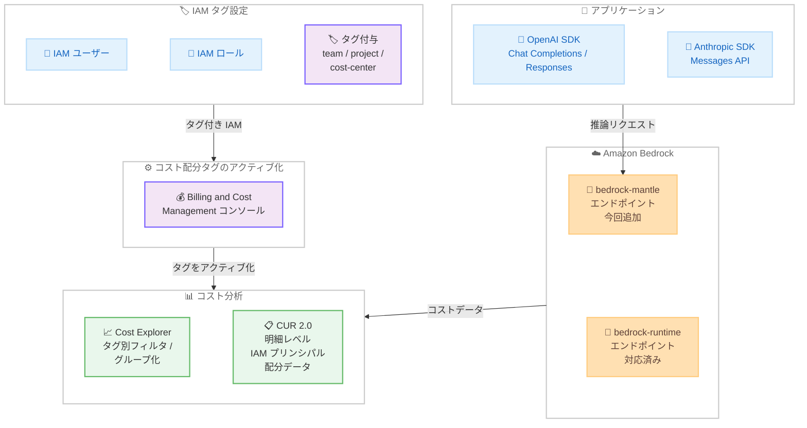

# Amazon Bedrock - bedrock-mantle エンドポイントへの IAM プリンシパル別コスト配分の拡張

**リリース日**: 2026 年 8 月 11 日
**サービス**: Amazon Bedrock
**機能**: bedrock-mantle エンドポイントにおける IAM プリンシパル別コスト配分

📊 [このアップデートのインフォグラフィックを見る](https://takech9203.github.io/aws-news-summary/20260811-amazon-bedrock-expands-iam-principal-cost-allocation-bedrock-mantle.html)

## 概要

Amazon Bedrock が、bedrock-mantle エンドポイント経由のモデル推論リクエストに対しても、IAM プリンシパル (IAM ユーザーおよび IAM ロール) 単位でのコスト配分をサポートしました。これは 2026 年 4 月に bedrock-runtime エンドポイント向けに提供された機能の拡張であり、ユーザー、チーム、プロジェクト、アプリケーション単位での推論コストの帰属が bedrock-mantle エンドポイントでも可能になります。

bedrock-mantle エンドポイントは、OpenAI Responses API、OpenAI Chat Completions API、Anthropic Messages API をサポートする互換性レイヤーであり、既存の OpenAI や Anthropic ベースのアプリケーションを最小限のコード変更で Amazon Bedrock 上で実行できます。今回のアップデートにより、IAM ユーザーやロールにチーム、プロジェクト、コストセンターなどの属性をタグとして付与し、コスト配分タグとしてアクティブ化することで、bedrock-mantle の推論コストを AWS Cost Explorer でタグ別に分析したり、AWS Cost and Usage Report 2.0 (CUR 2.0) の明細レベルで確認したりできるようになりました。

主な対象ユーザーは、OpenAI/Anthropic 互換 API 経由で Bedrock を利用するワークロードのコスト管理を行う FinOps チーム、複数のチームやプロジェクトで生成 AI を利用する組織のクラウド管理者、およびチャージバック/ショーバック運用を推進するプラットフォームチームです。

**アップデート前の課題**

- IAM プリンシパル別のコスト配分は bedrock-runtime エンドポイントのみの対応であり、bedrock-mantle エンドポイント経由の推論コストはユーザーやチーム単位で帰属させることができなかった
- OpenAI/Anthropic 互換 API を利用するワークロードのコスト配分には、CloudWatch メトリクスやログ分析を組み合わせた独自のソリューションが必要だった
- bedrock-runtime と bedrock-mantle の両方を利用する組織では、コスト配分の粒度がエンドポイントごとに異なり、統一したコスト管理が困難だった

**アップデート後の改善**

- bedrock-mantle エンドポイント経由の推論コストも、IAM ユーザー・ロールに付与したタグに基づいてチーム、プロジェクト、コストセンター単位で配分できるようになった
- Cost Explorer でのタグベースのフィルタリング・グループ化、および CUR 2.0 の明細レベルでの IAM プリンシパル配分データの分析が bedrock-mantle でも利用可能になった
- bedrock-runtime と bedrock-mantle の両エンドポイントで一貫したコスト配分の仕組みが実現され、組織全体の生成 AI コスト管理を統一できるようになった

## アーキテクチャ図



タグを付与した IAM プリンシパルで bedrock-mantle エンドポイントに推論リクエストを実行すると、そのコストが Cost Explorer と CUR 2.0 でタグ別に分析可能になるフローを示しています。bedrock-runtime に加えて bedrock-mantle が今回新たに対応しました。

## サービスアップデートの詳細

### 主要機能

1. **bedrock-mantle エンドポイントの IAM プリンシパル別コスト配分**
   - bedrock-mantle エンドポイント経由のモデル推論コストを、リクエストを実行した IAM ユーザー・ロールのタグに基づいて配分
   - OpenAI Responses API、OpenAI Chat Completions API、Anthropic Messages API 経由の推論が対象
   - bedrock-runtime エンドポイント向けに先行提供されていた機能の拡張であり、同じタグ設定をそのまま活用可能

2. **Cost Explorer でのタグベース分析**
   - アクティブ化したコスト配分タグで bedrock-mantle の推論コストをフィルタリング・グループ化
   - チーム、プロジェクト、コストセンター別のコスト推移を視覚的に確認
   - 追加ツール不要で即座に分析を開始可能

3. **CUR 2.0 での明細レベル分析**
   - CUR 2.0 データエクスポートで「Include caller identity (IAM principal) allocation data」オプションを選択することで、IAM プリンシパルの配分データを明細に含めることが可能
   - 明細レベルの粒度でコスト帰属が行えるため、詳細なチャージバック/ショーバック運用に対応

## 技術仕様

### コスト配分の仕組み

| 項目 | 詳細 |
|------|------|
| 対象プリンシパル | IAM ユーザー、IAM ロール |
| 対象エンドポイント | bedrock-mantle (今回追加)、bedrock-runtime (対応済み) |
| 対象 API | OpenAI Responses API、OpenAI Chat Completions API、Anthropic Messages API |
| タグの種類 | AWS コスト配分タグ (ユーザー定義タグ) |
| 対応レポート | AWS Cost Explorer、AWS Cost and Usage Report 2.0 (CUR 2.0) |
| データ粒度 | Cost Explorer: タグベースの集約、CUR 2.0: 明細レベル |

### タグ付与例

| タグキー | タグ値の例 | 用途 |
|----------|------------|------|
| team | alpha, beta, data-science | チーム別コスト配分 |
| project | chatbot-v2, rag-pipeline | プロジェクト別コスト配分 |
| cost-center | CC-1001, CC-2002 | コストセンター別配分 |
| environment | production, staging, development | 環境別コスト配分 |

### API 変更履歴

今回のアップデートに直接関連する API 変更は確認されていません。コスト配分は既存の IAM タグ付け API と Billing and Cost Management の機能を通じて設定します。

## 設定方法

### 前提条件

1. Amazon Bedrock の bedrock-mantle エンドポイントが利用可能なリージョンでワークロードを実行していること
2. IAM ユーザー・ロールにタグを付与する権限 (`iam:TagUser`、`iam:TagRole`) を保有していること
3. Billing and Cost Management コンソールでコスト配分タグを管理する権限を保有していること

### 手順

#### ステップ 1: IAM ユーザー・ロールにタグを付与

```bash
# bedrock-mantle 経由で推論を実行する IAM ロールにタグを付与
aws iam tag-role \
    --role-name mantle-app-role \
    --tags Key=team,Value=data-science Key=project,Value=openai-migration Key=cost-center,Value=CC-1001

# IAM ユーザーにタグを付与
aws iam tag-user \
    --user-name mantle-developer \
    --tags Key=team,Value=alpha Key=project,Value=chatbot-v2
```

bedrock-mantle エンドポイント経由でモデル推論を実行する IAM ユーザーやロールに、コスト配分に使用するタグを付与します。チーム名、プロジェクト名、コストセンターなど、コスト分析で使用したい属性をタグとして設定します。

#### ステップ 2: コスト配分タグのアクティブ化

Billing and Cost Management コンソールで、ステップ 1 で付与したタグをコスト配分タグとしてアクティブ化します。

1. AWS マネジメントコンソールで Billing and Cost Management を開く
2. 左メニューから「Cost allocation tags」を選択
3. 「User-defined cost allocation tags」タブで、付与したタグキー (team、project、cost-center など) を選択
4. 「Activate」をクリックしてアクティブ化

既に bedrock-runtime 向けにタグをアクティブ化済みの場合、追加の設定は不要です。タグをアクティブ化してからコストデータに反映されるまで最大 24 時間かかる場合があります。

#### ステップ 3: Cost Explorer でのコスト分析

Cost Explorer を開き、アクティブ化したコスト配分タグで bedrock-mantle の推論コストを分析します。

1. Cost Explorer を開く
2. 「Filter」でサービスを「Amazon Bedrock」に設定
3. 「Group by」でアクティブ化したタグキー (例: team) を選択
4. チームやプロジェクト別のコスト推移を確認

#### ステップ 4: CUR 2.0 データエクスポートの設定

明細レベルの分析が必要な場合は、CUR 2.0 データエクスポートを作成します。

1. Billing and Cost Management コンソールで「Data Exports」に移動
2. 新しい CUR 2.0 エクスポートを作成
3. 「Include caller identity (IAM principal) allocation data」を選択
4. 出力先の S3 バケットを指定

このオプションを有効にすることで、明細レベルで IAM プリンシパルのコスト配分データが含まれ、Amazon Athena や Amazon QuickSight での詳細分析が可能になります。

## メリット

### ビジネス面

- **互換 API ワークロードのコスト帰属**: OpenAI/Anthropic 互換 API 経由の推論コストもチーム・プロジェクト単位で正確に帰属させ、チャージバックやショーバックの運用対象に含められる
- **移行ワークロードの FinOps 統合**: OpenAI から Bedrock へ移行したアプリケーションのコストを、既存の FinOps プロセスと同じ枠組みで管理できる
- **コスト意識の醸成**: bedrock-mantle 利用チームのコストを可視化することで、各チームのコスト意識を高め、推論リクエストの最適化を促進できる

### 技術面

- **エンドポイント間で一貫した仕組み**: bedrock-runtime と同じタグ設定・分析フローをそのまま利用できるため、追加の学習コストや設定作業が最小限で済む
- **追加ツール不要**: 既存の IAM タグ機能と Cost Explorer / CUR 2.0 を活用するため、サードパーティツールや独自のコスト追跡ソリューションが不要
- **CloudWatch メトリクスとの補完**: 2026 年 6 月に提供された bedrock-mantle の CloudWatch メトリクスと組み合わせることで、使用量とコストの両面からワークロードを可視化できる

## デメリット・制約事項

### 制限事項

- コスト配分タグのアクティブ化からデータ反映まで最大 24 時間のタイムラグが生じる
- IAM タグの変更は変更後のコストデータに対してのみ反映される (過去データへの遡及適用は不可)
- bedrock-mantle エンドポイントが利用可能なリージョンに限定される

### 考慮すべき点

- IAM ユーザー・ロールのタグ運用ルールを組織全体で統一する必要がある (タグキーの命名規則、必須タグの定義など)
- 共有ロールを複数のプロジェクトで使用している場合は、プロジェクト単位のコスト配分が正確に行えないため、ロールの分離が必要
- CUR 2.0 データのエクスポート先 S3 バケットのストレージコストが追加で発生する

## ユースケース

### ユースケース 1: OpenAI からの移行ワークロードのチーム別コスト管理

**シナリオ**: OpenAI SDK を使用していた複数チームのアプリケーションを bedrock-mantle エンドポイント経由で Bedrock に移行した。移行後もチームごとの推論コストを正確に把握し、チャージバックを継続したい。

**実装例**:
```bash
# 各チームの移行アプリケーション用ロールにタグを付与
aws iam tag-role --role-name mantle-search-team \
    --tags Key=team,Value=search Key=cost-center,Value=CC-100

aws iam tag-role --role-name mantle-support-team \
    --tags Key=team,Value=customer-support Key=cost-center,Value=CC-200
```

**効果**: 移行前と同様にチーム別のコスト配分を維持でき、Bedrock 移行によるコスト変化もチーム単位で正確に評価できる。

### ユースケース 2: bedrock-runtime と bedrock-mantle の統一コスト分析

**シナリオ**: ネイティブ API を使用するワークロードは bedrock-runtime、OpenAI/Anthropic SDK ベースのワークロードは bedrock-mantle を使用しており、両者を横断したプロジェクト別コスト分析を行いたい。

**実装例**:
```bash
# 同一プロジェクトの両エンドポイント用ロールに共通タグを付与
aws iam tag-role --role-name runtime-rag-role \
    --tags Key=project,Value=rag-pipeline

aws iam tag-role --role-name mantle-rag-role \
    --tags Key=project,Value=rag-pipeline
```

**効果**: Cost Explorer で project タグによるグループ化を行うことで、エンドポイントの違いを意識せずプロジェクト全体の推論コストを一元的に把握できる。

### ユースケース 3: CUR 2.0 と Athena による明細レベルのコスト分析

**シナリオ**: FinOps チームが bedrock-mantle の推論コストを IAM プリンシパル単位で明細レベルまで掘り下げ、月次のコストレポートを自動生成したい。

**実装例**:
```sql
-- Athena で CUR 2.0 データから IAM プリンシパル別コストを集計
SELECT
    line_item_usage_account_id,
    resource_tags,
    SUM(line_item_unblended_cost) AS total_cost
FROM cur2_data
WHERE product_servicecode = 'AmazonBedrock'
GROUP BY line_item_usage_account_id, resource_tags
ORDER BY total_cost DESC;
```

**効果**: 明細レベルの配分データに基づく正確な月次レポートを自動生成でき、コストの異常検知や予算管理の精度が向上する。

## 料金

今回のコスト配分機能自体に追加料金は発生しません。IAM タグの付与、コスト配分タグのアクティブ化、Cost Explorer での分析は無料で利用できます。CUR 2.0 データエクスポートについては、出力先の S3 バケットのストレージコストが発生します。

### 料金例

| 項目 | 料金 |
|------|------|
| IAM タグ付与 | 無料 |
| コスト配分タグアクティブ化 | 無料 |
| Cost Explorer でのタグベース分析 | 無料 |
| CUR 2.0 データエクスポート | S3 ストレージコストのみ |

Bedrock のモデル推論コスト自体は [Amazon Bedrock の料金ページ](https://aws.amazon.com/bedrock/pricing/)を参照してください。

## 利用可能リージョン

bedrock-mantle エンドポイントが利用可能なすべての AWS リージョンで利用できます。

## 関連サービス・機能

- **Amazon Bedrock bedrock-runtime エンドポイント**: Bedrock ネイティブ API 向けの推論エンドポイント。IAM プリンシパル別コスト配分に 2026 年 4 月から対応済み
- **AWS Cost Explorer**: タグベースのフィルタリング・グループ化で Bedrock コストを視覚的に分析するツール
- **AWS Cost and Usage Report 2.0 (CUR 2.0)**: 明細レベルの IAM プリンシパル配分データを含むコストレポート。Athena や QuickSight と連携した詳細分析に使用
- **AWS Identity and Access Management (IAM)**: ユーザー・ロールへのタグ付与とコスト配分の基盤となるサービス
- **Amazon CloudWatch**: bedrock-mantle エンドポイントの使用量メトリクス (AWS/BedrockMantle 名前空間) を提供し、コスト配分と補完的に活用可能

## 参考リンク

- 📊 [インフォグラフィック](https://takech9203.github.io/aws-news-summary/20260811-amazon-bedrock-expands-iam-principal-cost-allocation-bedrock-mantle.html)
- [公式発表 (What's New)](https://aws.amazon.com/about-aws/whats-new/2026/08/amazon-bedrock-expands-iam-principal-cost-allocation-bedrock-mantle/)
- [Amazon Bedrock ドキュメント](https://docs.aws.amazon.com/bedrock/latest/userguide/)
- [AWS Cost and Usage Report 2.0 ドキュメント](https://docs.aws.amazon.com/cur/latest/userguide/)
- [コスト配分タグの使用](https://docs.aws.amazon.com/awsaccountbilling/latest/aboutv2/cost-alloc-tags.html)
- [Amazon Bedrock 料金ページ](https://aws.amazon.com/bedrock/pricing/)

## まとめ

bedrock-mantle エンドポイントへの IAM プリンシパル別コスト配分の拡張により、OpenAI/Anthropic 互換 API を利用するワークロードも bedrock-runtime と同じ枠組みでコスト帰属が可能になりました。既に bedrock-runtime 向けにタグ戦略を運用している組織では、同じタグ設定がそのまま bedrock-mantle にも適用されるため、追加の作業はほぼ不要です。bedrock-mantle を利用中の組織は、IAM プリンシパルへのタグ付与とコスト配分タグのアクティブ化を行い、Cost Explorer や CUR 2.0 での推論コストの可視化を開始することを推奨します。
