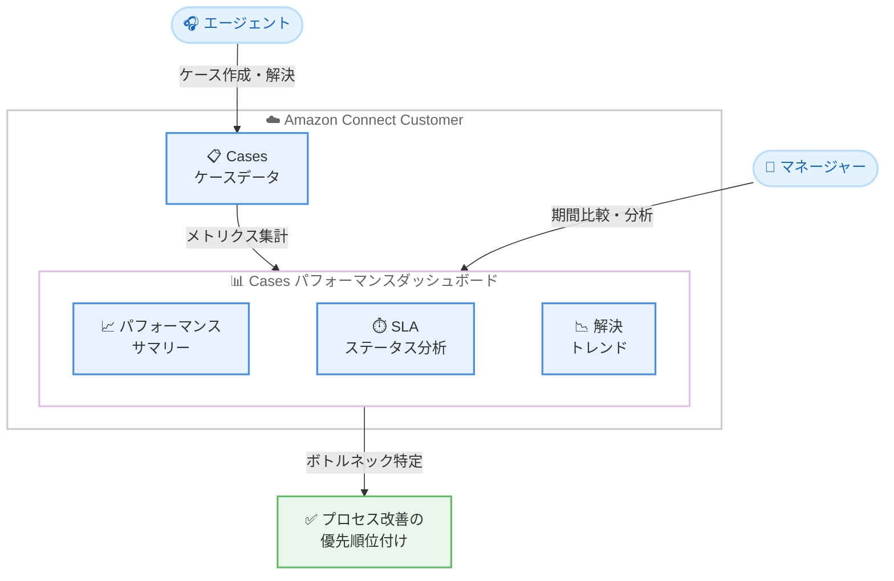

# Amazon Connect Customer - Cases パフォーマンスダッシュボード

**リリース日**: 2026 年 8 月 11 日
**サービス**: Amazon Connect Customer (Cases)
**機能**: Cases performance dashboard (ケースパフォーマンスダッシュボード)

📊 [このアップデートのインフォグラフィックを見る](https://takech9203.github.io/aws-news-summary/20260811-amazon-connect-cases-dashboard.html)

## 概要

Amazon Connect Customer は、Cases 向けのパフォーマンスダッシュボードを提供開始しました。このダッシュボードにより、マネージャーはケース量、解決トレンド、SLA (サービスレベルアグリーメント) 目標に対するパフォーマンスを一元的にモニタリングできます。

作成されたケース数、平均解決時間、初回コンタクト解決率、SLA 達成率などのメトリクスについて、現在の期間と過去の期間のパフォーマンスを比較できます。また、ケーステンプレート、割り当てユーザー、割り当てキューなどのディメンションでトレンドを分析することも可能です。例えば、請求チームが返金ケースにおいて前期間よりも多くの SLA 目標を逃していることを特定し、原因を調査してプロセス改善の優先順位付けを行う、といった活用ができます。

**アップデート前の課題**

- ケース運用のメトリクスを一元的に確認できるダッシュボードがなく、ケース量や解決率、SLA 遵守状況の把握に手間がかかった
- 現在の期間と過去の期間のパフォーマンス比較を手動で行う必要があった
- ケーステンプレートや担当者、キューごとのボトルネック特定が難しく、プロセス改善の優先順位付けに時間がかかった

**アップデート後の改善**

- ケース量、解決率、SLA 遵守状況を単一のダッシュボードでモニタリングできるようになった
- 「Time range」と「Compare to」設定により、前週や前月などのベンチマーク期間との比較が容易になった
- ケーステンプレート、ステータス、割り当てキュー、エージェントごとのドリルダウン分析により、改善が必要な領域を迅速に特定できるようになった

## アーキテクチャ図



エージェントのケース対応データが Cases パフォーマンスダッシュボードに集計され、マネージャーは期間比較やドリルダウン分析を通じてプロセス改善の優先順位付けを行えます。

## サービスアップデートの詳細

### 主要機能

1. **Cases パフォーマンスサマリー**
   - 選択した期間の主要なケースメトリクスをベンチマーク期間と比較して表示
   - 表示メトリクス: 作成されたケース数、解決されたケースアクション数、再オープンされたケースアクション数、平均ケース解決時間、初回コンタクト解決率
   - 各メトリクスは現在の値と前期間の値を並べて表示

2. **期間比較 (Time range / Compare to)**
   - Time range: 日中 (直近 8 時間)、日次、週次、月次のパフォーマンスを選択可能
   - Compare to: 前週、前月などの前期間との比較を設定可能
   - 過去 3 か月までのデータを閲覧可能

3. **SLA 分析ウィジェット**
   - SLAs by status チャート: SLA ステータス (Active、Overdue、Met、Not met) ごとの SLA 数を表示し、対応が必要な期限超過 SLA を特定
   - SLAs by name テーブル: SLA ルール名ごとに作成された SLA 数と達成率を表示
   - Case templates by SLA チャート: ケーステンプレートごとの SLA 作成数をステータス別の積み上げ棒グラフで表示

4. **ケーステンプレート別分析**
   - Cases by template テーブル: ケーステンプレートごとに作成数、解決数、平均解決時間、ケースあたりの平均コンタクト数、初回コンタクト解決率を表示
   - 任意の列でのソート、フィルター追加、カスタムしきい値によるハイライトに対応

5. **ケース解決トレンドチャート**
   - 15 分、日次、週次、月次の間隔でトレンドを可視化 (利用可能な間隔は Time range の選択に依存)
   - 解決されたケースアクション数 (棒グラフ) と初回コンタクト解決率 (折れ線グラフ) を時系列で表示

## 技術仕様

### ダッシュボードの構成要素

| ウィジェット | 内容 |
|------|------|
| Cases performance summary | 主要メトリクスの現在値と前期間値の比較 |
| SLAs by status チャート | SLA ステータス別の SLA 数 |
| Cases by template テーブル | ケーステンプレート別のケースメトリクス |
| SLAs by name テーブル | SLA ルール名別の作成数と達成率 |
| Cases resolution trend チャート | 解決数と初回コンタクト解決率の時系列トレンド |
| Case templates by SLA チャート | テンプレート別 SLA のステータス内訳 |

### 必要なセキュリティプロファイル権限

マネージャーがダッシュボードにアクセスするには、以下の権限が必要です。

| 権限 | 用途 |
|------|------|
| Access metrics - Access または Dashboard - Access | ダッシュボードへのアクセス |
| Cases - Case Fields - View | ダッシュボードのグルーピングとフィルターで使用されるケースフィールド値の表示 |
| Cases - Case Templates - View | ダッシュボードウィジェットでのケーステンプレート名の表示 |
| Saved reports - Create, View, Publish (オプション) | カスタム保存ダッシュボードの作成と公開 |

**注意**: Case Fields - View と Case Templates - View の両方の権限がないと、ダッシュボードに Cases メトリクスが表示されません。

## 設定方法

### 前提条件

1. Amazon Connect Customer インスタンスで Cases を利用していること
2. マネージャーのセキュリティプロファイルに必要な権限が付与されていること
3. 対応リージョンでインスタンスを運用していること

### 手順

#### ステップ 1: セキュリティプロファイル権限の付与

Amazon Connect Customer 管理画面でマネージャーのセキュリティプロファイルを編集し、以下の権限を付与します。

- Access metrics - Access または Dashboard - Access
- Cases - Case Fields - View
- Cases - Case Templates - View

#### ステップ 2: ダッシュボードへのアクセス

管理画面の「Analytics and Optimization」>「Dashboards and Reports」から Cases パフォーマンスダッシュボードにアクセスします。

#### ステップ 3: 期間とベンチマークの設定

「Time range」で分析対象期間を選択し、「Compare to」で比較するベンチマーク期間を設定します。例えば、週次のケース作成数を比較する場合は以下のように設定します。

- Time range: Week
- Time: This week
- Compare to: Prior time period (Week, Prior week)

## メリット

### ビジネス面

- **チームパフォーマンスの可視化**: ケース量、解決率、SLA 遵守状況を一元的に把握でき、チームの状況をリアルタイムに近い形で確認できる
- **データドリブンなプロセス改善**: どのケーステンプレートで SLA 未達が多いかを特定し、根拠に基づいてプロセス改善の優先順位付けができる
- **期間比較による傾向把握**: 前週・前月比較により、パフォーマンスの改善や悪化の傾向を早期に検知できる

### 技術面

- **追加開発が不要**: 標準機能としてダッシュボードが提供されるため、外部 BI ツールでのカスタムレポート構築が不要
- **柔軟なドリルダウン**: ケーステンプレート、ステータス、割り当てキュー、エージェントごとの分析が可能
- **カスタムしきい値**: テーブルウィジェットでしきい値を設定し、注意が必要な値をハイライト表示できる

## デメリット・制約事項

### 制限事項

- **データ保持期間**: ダッシュボードで閲覧できるデータは過去 3 か月まで
- **タグベースアクセス制御 (TBAC) 非対応**: 必要な権限があれば、セキュリティプロファイルのアクセス制御タグ設定に関わらずすべてのケースのメトリクスを閲覧できる
- **階層ベースアクセス制御 (HBAC) 非対応**: エージェント階層によるデータの絞り込みはできない

### 考慮すべき点

- 閲覧できるケースデータを制限するには、Case Fields と Case Templates のセキュリティプロファイル権限を使用する必要がある
- Case Fields - View と Case Templates - View のいずれかが欠けていると Cases メトリクスが表示されないため、権限設定の確認が必要

## ユースケース

### ユースケース 1: 週次のケース作成数比較

**シナリオ**: サポートマネージャーが今週のケース作成数を前週と比較し、問い合わせ量の変化を把握したい。

**実装例**:
```
Time range: Week
Time: This week
Compare to: Prior time period (Week, Prior week)
```

**効果**: ケース量の増減を早期に把握し、人員配置やエスカレーション体制の調整に活用できる。

### ユースケース 2: SLA 未達の多いケーステンプレートの特定

**シナリオ**: 請求チームの返金ケースで SLA 未達が増えている可能性があり、原因を調査したい。

**実装例**:
```
1. Case templates by SLA チャートで、テンプレート別の SLA ステータス内訳を確認
2. Overdue や Not met の割合が高いテンプレート (例: 返金ケース) を特定
3. フィルターで該当テンプレートに絞り込み、SLAs by name テーブルで未達の SLA ルールを確認
```

**効果**: SLA 未達の多いケースタイプを特定し、プロセス改善の優先順位付けができる。

### ユースケース 3: 月次のケース解決パフォーマンス評価

**シナリオ**: 先月のケース解決パフォーマンスを前月と比較し、改善施策の効果を評価したい。

**実装例**:
```
Time range: Month
Time: Last month
Compare to: Prior time period (Month, Prior month)

Cases resolution trend チャートで週次間隔のトレンドを確認し、
平均解決時間と初回コンタクト解決率の推移を評価
```

**効果**: 改善施策の効果を定量的に評価し、次のアクションを検討できる。

## 料金

What's New では本ダッシュボードに関する追加料金の記載はありません。Cases の利用料金については、Amazon Connect Customer の料金ページを確認してください。

## 利用可能リージョン

Cases は以下の AWS リージョンで利用可能です。

- 米国東部 (バージニア北部)
- 米国西部 (オレゴン)
- カナダ (中部)
- 欧州 (フランクフルト)
- 欧州 (ロンドン)
- アジアパシフィック (ソウル)
- アジアパシフィック (シンガポール)
- アジアパシフィック (シドニー)
- アジアパシフィック (東京)
- アフリカ (ケープタウン)

## 関連サービス・機能

- **Amazon Connect Cases**: エージェントが顧客の問題をケースとして追跡・管理する機能。本ダッシュボードの分析対象
- **Amazon Connect ダッシュボード**: Connect Customer が提供する各種パフォーマンスダッシュボード群。AI Agent パフォーマンスダッシュボードやフロー・会話ボットパフォーマンスダッシュボードなどが含まれる
- **セキュリティプロファイル**: ダッシュボードやケースデータへのアクセスを制御する権限管理機能

## 参考リンク

- 📊 [インフォグラフィック](https://takech9203.github.io/aws-news-summary/20260811-amazon-connect-cases-dashboard.html)
- [公式発表 (What's New)](https://aws.amazon.com/about-aws/whats-new/2026/08/amazon-connect-cases-dashboard/)
- [ドキュメント (Cases performance dashboard)](https://docs.aws.amazon.com/connect/latest/adminguide/cases-performance-dashboard.html)
- [Amazon Connect Cases 製品ページ](https://aws.amazon.com/connect/cases/)

## まとめ

Cases パフォーマンスダッシュボードにより、コンタクトセンターのマネージャーはケース運用の状況を一元的に可視化し、期間比較やテンプレート別分析を通じてデータドリブンなプロセス改善を実現できます。Cases を利用中の場合は、マネージャーのセキュリティプロファイルに必要な権限を付与し、SLA 遵守状況のモニタリングから活用を開始することを推奨します。
