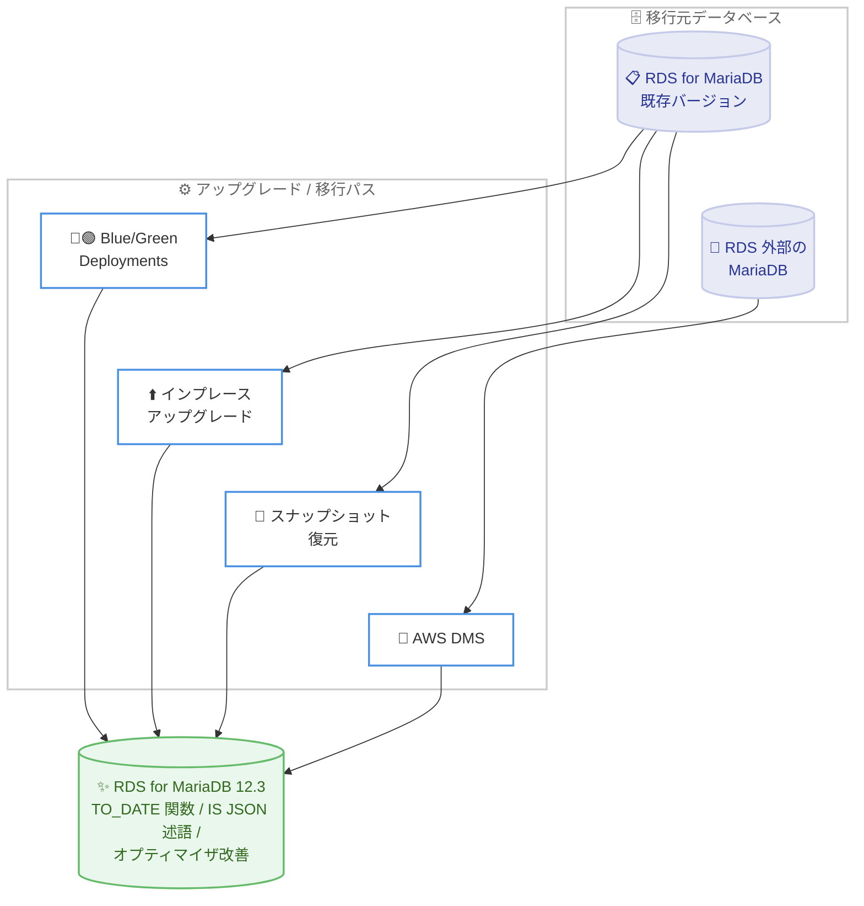

# Amazon RDS for MariaDB - MariaDB 12.3 サポート

**リリース日**: 2026 年 8 月 11 日
**サービス**: Amazon RDS for MariaDB
**機能**: MariaDB メジャーバージョン 12.3 (マイナーバージョン 12.3.2) のサポート

📊 [このアップデートのインフォグラフィックを見る](https://takech9203.github.io/aws-news-summary/20260811-amazon-rds-mariadb-1232-available.html)

## 概要

Amazon RDS for MariaDB が、MariaDB コミュニティの最新の長期サポート (LTS) リリースであるメジャーバージョン 12.3 (マイナーバージョン 12.3.2) をサポートしました。RDS のマネージド環境で、MariaDB コミュニティが提供する最新の機能強化とパフォーマンス改善を利用できるようになります。

MariaDB 12.3 には、Oracle 互換の TO_DATE() 関数、JSON ドキュメントをデータベース内でネイティブに検証できる IS JSON 述語、クエリオプティマイザの改善などが含まれます。特に Oracle からの移行を検討しているユーザーや、JSON データを扱うアプリケーションを運用しているユーザーにとって価値のあるアップデートです。

既存の RDS for MariaDB インスタンスからは、Amazon RDS Blue/Green Deployments、インプレースアップグレード、スナップショットからの復元により 12.3 へ移行できます。また、RDS 外部の MariaDB データベースからの移行には AWS Database Migration Service (AWS DMS) を利用できます。

**アップデート前の課題**

このアップデート以前は、以下の課題がありました。

- RDS for MariaDB では MariaDB 12.3 の新機能 (Oracle 互換の TO_DATE() 関数や IS JSON 述語など) を利用できなかった
- Oracle から MariaDB へアプリケーションを移行する際、日付変換関数などの非互換部分についてコード変更が必要だった
- JSON ドキュメントの検証をデータベース内で行えず、アプリケーションコード側で実装する必要があった

**アップデート後の改善**

今回のアップデートにより、以下が可能になりました。

- RDS のマネージド環境で MariaDB コミュニティの最新 LTS リリースである 12.3 を利用できるようになった
- Oracle 互換の TO_DATE() 関数により、Oracle から MariaDB への移行時に必要なコード変更を削減できるようになった
- IS JSON 述語により、JSON ドキュメントの検証をアプリケーションコードではなくデータベース内でネイティブに実行できるようになった
- クエリオプティマイザの改善により、アプリケーションを変更することなくクエリパフォーマンスが向上するようになった

## アーキテクチャ図



既存の RDS for MariaDB インスタンスは Blue/Green Deployments、インプレースアップグレード、スナップショット復元のいずれかで、RDS 外部の MariaDB は AWS DMS で MariaDB 12.3 へ移行できます。

## サービスアップデートの詳細

### 主要機能

1. **Oracle 互換の TO_DATE() 関数**
   - Oracle データベースで広く使用されている TO_DATE() 関数と互換性のある日付変換が可能
   - Oracle から MariaDB へアプリケーションを移行する際に必要なコード変更を削減
   - 移行プロジェクトの工数とリスクの低減に貢献

2. **IS JSON 述語**
   - JSON ドキュメントの妥当性検証をデータベース内でネイティブに実行可能
   - これまでアプリケーションコードで行っていた JSON 検証ロジックをデータベース側に集約できる
   - CHECK 制約や WHERE 句での利用により、不正な JSON データの混入を防止

3. **クエリオプティマイザの改善**
   - 並べ替え可能な LEFT JOIN ステートメントの処理が改善
   - RANGE パーティションに対する順序付きスキャンの処理が改善
   - アプリケーションの変更なしでクエリパフォーマンスが向上

4. **複数のアップグレード / 移行パス**
   - Amazon RDS Blue/Green Deployments: 本番環境と同期したステージング環境で検証してから切り替え可能
   - インプレースアップグレード: 既存インスタンスを直接アップグレード
   - スナップショット復元: 既存のスナップショットから 12.3 のインスタンスとして復元
   - AWS DMS: RDS 外部の MariaDB データベースからの移行に利用可能

## 技術仕様

### バージョン情報

| 項目 | 詳細 |
|------|------|
| メジャーバージョン | MariaDB 12.3 |
| マイナーバージョン | 12.3.2 |
| リリース種別 | MariaDB コミュニティの最新 LTS リリース |
| 主な新機能 | Oracle 互換 TO_DATE() 関数、IS JSON 述語、オプティマイザ改善 |
| アップグレード方法 | Blue/Green Deployments、インプレースアップグレード、スナップショット復元 |
| 外部からの移行 | AWS Database Migration Service |

### 新機能の SQL 例

```sql
-- Oracle 互換の TO_DATE() 関数
SELECT TO_DATE('2026-08-11', 'YYYY-MM-DD');

-- IS JSON 述語による JSON ドキュメントの検証
SELECT id, doc
FROM documents
WHERE doc IS JSON;

-- CHECK 制約での利用例
CREATE TABLE events (
    id INT PRIMARY KEY,
    payload TEXT CHECK (payload IS JSON)
);
```

## 設定方法

### 前提条件

1. AWS アカウントと Amazon RDS へのアクセス権限があること
2. 既存インスタンスをアップグレードする場合は、事前にスナップショットを取得しておくこと
3. アプリケーションが MariaDB 12.3 と互換性があることをステージング環境で検証すること

### 手順

#### ステップ 1: 新規インスタンスを MariaDB 12.3 で作成する場合

```bash
aws rds create-db-instance \
    --db-instance-identifier my-mariadb-123 \
    --db-instance-class db.m6g.large \
    --engine mariadb \
    --engine-version 12.3.2 \
    --master-username admin \
    --manage-master-user-password \
    --allocated-storage 100
```

エンジンバージョンに 12.3.2 を指定して、新規の RDS for MariaDB インスタンスを作成します。マスターユーザーのパスワードは AWS Secrets Manager で管理します。

#### ステップ 2: Blue/Green Deployments でアップグレードする場合

```bash
aws rds create-blue-green-deployment \
    --blue-green-deployment-name mariadb-upgrade-123 \
    --source arn:aws:rds:ap-northeast-1:123456789012:db:my-mariadb \
    --target-engine-version 12.3.2
```

既存インスタンスを Blue 環境として、MariaDB 12.3.2 の Green 環境 (ステージング環境) を作成します。Green 環境は Blue 環境とレプリケーションで同期されるため、本番データで動作検証ができます。

#### ステップ 3: 検証後に切り替え

```bash
aws rds switchover-blue-green-deployment \
    --blue-green-deployment-identifier <deployment-id>
```

Green 環境での検証が完了したら、スイッチオーバーを実行して Green 環境を本番に昇格させます。切り替えは通常 1 分以内に完了し、ダウンタイムを最小化できます。

## メリット

### ビジネス面

- **Oracle 移行コストの削減**: TO_DATE() 関数の互換性により、Oracle からの移行時のコード変更工数を削減できる
- **最新 LTS による長期安定運用**: コミュニティの長期サポートリリースを利用することで、長期間安定したバージョンで運用計画を立てられる
- **追加コストなしの性能向上**: オプティマイザ改善によるパフォーマンス向上を、アプリケーション改修なしで享受できる

### 技術面

- **データ品質の向上**: IS JSON 述語により、データベースレイヤーで JSON の妥当性を保証できる
- **アプリケーションの簡素化**: JSON 検証ロジックをアプリケーションコードから排除し、実装を簡素化できる
- **安全なアップグレードパス**: Blue/Green Deployments により、本番データで検証してから低ダウンタイムで切り替えできる

## デメリット・制約事項

### 制限事項

- メジャーバージョンアップグレードのため、アプリケーションの互換性検証が必要
- インプレースアップグレードではアップグレード中にダウンタイムが発生する
- 旧バージョン固有の動作に依存するアプリケーションは、事前に動作確認が必要

### 考慮すべき点

- 本番環境への適用前に、Blue/Green Deployments やスナップショット復元を利用したステージング環境での検証を推奨
- パラメータグループはメジャーバージョンごとに作成が必要なため、カスタムパラメータを使用している場合は 12.3 用のパラメータグループを事前に準備する
- 各バージョンの RDS 標準サポート終了時期を確認し、計画的なアップグレードサイクルを維持する

## ユースケース

### ユースケース 1: Oracle から MariaDB への移行

**シナリオ**: ライセンスコスト削減のため、Oracle データベースを RDS for MariaDB へ移行したい。既存アプリケーションには TO_DATE() を使用した SQL が多数存在する。

**実装例**:
```sql
-- Oracle 用に書かれた既存 SQL がそのまま動作
SELECT order_id, customer_name
FROM orders
WHERE order_date >= TO_DATE('2026-01-01', 'YYYY-MM-DD');
```

**効果**: 日付変換関数の書き換えが不要になり、移行時のコード変更工数とテスト工数を削減できる。

### ユースケース 2: JSON データの品質管理

**シナリオ**: IoT デバイスやウェブアプリケーションから受信した JSON データをテーブルに保存しているが、不正な形式のデータが混入し、後続処理でエラーが発生している。

**実装例**:
```sql
-- テーブル定義で JSON の妥当性を強制
CREATE TABLE device_events (
    event_id BIGINT AUTO_INCREMENT PRIMARY KEY,
    device_id VARCHAR(64) NOT NULL,
    payload TEXT CHECK (payload IS JSON)
);

-- 既存データから不正な JSON を検出
SELECT event_id FROM device_events WHERE payload IS NOT JSON;
```

**効果**: データベースレイヤーで不正な JSON の混入を防止し、アプリケーション側の検証コードと後続処理のエラーハンドリングを削減できる。

### ユースケース 3: パーティションテーブルの分析クエリ高速化

**シナリオ**: RANGE パーティションで分割された大規模な履歴テーブルに対して、複数テーブルを LEFT JOIN する分析クエリを日次で実行しており、実行時間の短縮が課題となっている。

**実装例**:
```sql
-- オプティマイザ改善により LEFT JOIN の並べ替えと
-- RANGE パーティションの順序付きスキャンが最適化される
SELECT s.sale_date, p.product_name, SUM(s.amount)
FROM sales s
LEFT JOIN products p ON s.product_id = p.product_id
LEFT JOIN regions r ON s.region_id = r.region_id
WHERE s.sale_date BETWEEN '2026-01-01' AND '2026-06-30'
GROUP BY s.sale_date, p.product_name
ORDER BY s.sale_date;
```

**効果**: MariaDB 12.3 へのアップグレードのみで、クエリの書き換えなしに分析クエリのパフォーマンスが向上する。

## 料金

MariaDB 12.3 の利用による追加料金はありません。Amazon RDS for MariaDB の標準料金体系 (インスタンスタイプ、ストレージ、データ転送量に基づく従量課金) が適用されます。

Blue/Green Deployments を利用する場合は、Green 環境の稼働中はステージング環境分のインスタンスとストレージの料金が発生する点に注意してください。

料金の詳細は [Amazon RDS for MariaDB の料金ページ](https://aws.amazon.com/rds/mariadb/pricing/) を参照してください。

## 利用可能リージョン

リージョンごとの提供状況は [Amazon RDS for MariaDB の料金ページ](https://aws.amazon.com/rds/mariadb/pricing/) で確認できます。

## 関連サービス・機能

- **Amazon RDS Blue/Green Deployments**: 本番環境と同期したステージング環境を作成し、低ダウンタイムでメジャーバージョンアップグレードを実行できる
- **AWS Database Migration Service (AWS DMS)**: RDS 外部の MariaDB データベースから RDS for MariaDB 12.3 への移行に利用できる
- **AWS Secrets Manager**: RDS のマスターユーザーパスワードの管理と自動ローテーションに利用できる

## 参考リンク

- 📊 [インフォグラフィック](https://takech9203.github.io/aws-news-summary/20260811-amazon-rds-mariadb-1232-available.html)
- [公式発表 (What's New)](https://aws.amazon.com/about-aws/whats-new/2026/08/amazon-rds-mariadb-1232-available/)
- [Amazon RDS for MariaDB ユーザーガイド](https://docs.aws.amazon.com/AmazonRDS/latest/UserGuide/CHAP_MariaDB.html)
- [MariaDB メジャーバージョンのアップグレード](https://docs.aws.amazon.com/AmazonRDS/latest/UserGuide/USER_UpgradeDBInstance.MariaDB.html)
- [Amazon RDS Blue/Green Deployments](https://docs.aws.amazon.com/AmazonRDS/latest/UserGuide/blue-green-deployments.html)
- [AWS Database Migration Service](https://aws.amazon.com/dms/)
- [Amazon RDS for MariaDB 料金ページ](https://aws.amazon.com/rds/mariadb/pricing/)

## まとめ

Amazon RDS for MariaDB が最新 LTS リリースの MariaDB 12.3 に対応し、Oracle 互換の TO_DATE() 関数、IS JSON 述語、クエリオプティマイザの改善を利用できるようになりました。Oracle からの移行を検討しているユーザーや JSON データを扱うワークロードには特に価値が高いアップデートです。まずは Blue/Green Deployments やスナップショット復元を利用したステージング環境で互換性を検証し、計画的なアップグレードを進めることを推奨します。
