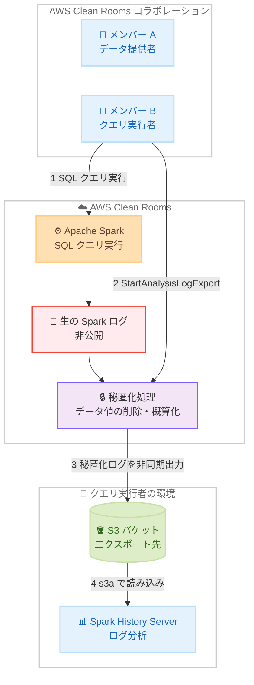

# AWS Clean Rooms - SQL 分析向けプライバシー強化分析ログのエクスポート

**リリース日**: 2026 年 8 月 11 日
**サービス**: AWS Clean Rooms
**機能**: SQL 分析向けプライバシー強化分析ログ (privacy-enhanced analysis logs) のエクスポート

📊 [このアップデートのインフォグラフィックを見る](https://takech9203.github.io/aws-news-summary/20260811-aws-clean-rooms-export-analysis-log-sql.html)

## 概要

AWS Clean Rooms が、SQL 分析に対するプライバシー強化分析ログのエクスポートをサポートしました。AWS Clean Rooms のコラボレーションで実行された SQL クエリについて、Spark の実行詳細を含む分析ログを自分の Amazon S3 バケットにエクスポートできるようになり、クエリの最適化とトラブルシューティングが大幅に容易になります。

AWS Clean Rooms は SQL クエリを Apache Spark 上で実行しますが、クエリは複数のコラボレーションメンバーが提供したデータにまたがって実行されるため、生の Spark ログには他のメンバーのテーブル名、ストレージの場所、データ値などの情報が含まれる可能性があります。そのため、AWS Clean Rooms は生ログを提供せず、顧客データとメンバーのメタデータを秘匿化 (redact) したログのコピーを生成してエクスポートします。データ値は削除され、件数やサイズは概算値として出力されるため、コラボレーション内のデータの詳細を明かすことなく実行分析が可能です。

エクスポートされたログは Spark イベントログ形式の構造化 JSON レコードであり、Spark History Server などの標準的なツールで分析できます。たとえば、パブリッシャーと協業するサードパーティの計測プロバイダーが、クエリの実行速度低下の原因となっている異常なデータスキューを特定し、解決までの時間を短縮してコストを最適化する、といった活用が可能です。

**アップデート前の課題**

- コラボレーションで実行した SQL クエリが失敗したり遅くなったりしても、Spark の実行詳細 (ステージ、タスク分散、メモリ使用量、時間の内訳) を確認する手段がなかった
- 生の Spark ログは他のメンバーのデータに関する情報を漏らす可能性があるため、AWS Clean Rooms ではログ自体が提供されていなかった
- クエリのパフォーマンス問題の原因特定が難しく、トラブルシューティングや最適化に時間がかかっていた

**アップデート後の改善**

- 顧客データとメンバーメタデータを秘匿化したプライバシー強化分析ログを、自分が所有する S3 バケットにエクスポートできるようになった
- Spark History Server など Spark イベントログを読み取れる任意のツールで、ジョブ、ステージ、タスク、タイミング、クエリプランを分析できるようになった
- データスキューやメモリ不足などの問題を特定でき、クエリの最適化とコスト削減、解決までの時間短縮が可能になった

## アーキテクチャ図



コラボレーションで実行された SQL クエリの Spark ログは秘匿化処理を経て、クエリ実行者 (または支払者) の S3 バケットに非同期でエクスポートされます。生ログは公開されず、秘匿化されたコピーのみが提供されます。

## サービスアップデートの詳細

### 主要機能

1. **プライバシー強化分析ログの S3 エクスポート**
   - コラボレーションで実行された SQL クエリの Spark イベントログを、秘匿化した上で自分の S3 バケットにエクスポート
   - データ値は削除され、件数やサイズは概算値として出力されるため、他メンバーのデータの詳細は明かされない
   - どのステージが失敗したか、タスクへの作業分散、メモリ使用量、時間の内訳などの実行詳細を確認可能

2. **メンバー能力によるアクセス制御**
   - コラボレーションオーナーは、コラボレーション作成時にログエクスポート能力 (`CAN_EXPORT_QUERY_ANALYSIS_LOG`) をメンバーに付与できる
   - 既存のコラボレーションでは、変更リクエスト (change request) を送信し、全メンバーの承認を得ることで能力を付与できる
   - 能力を持っていても、エクスポートできるのは自分が実行したクエリまたは自分が支払ったクエリのログのみ

3. **非同期エクスポートとステータス管理**
   - エクスポートは非同期で実行され、開始時にエクスポート ID とステータス `IN_PROGRESS` が返される
   - エクスポート開始前に、宛先バケットへの書き込み可否を確認するゼロバイトの `validationSuccess` オブジェクトが書き込まれ、書き込めない場合は即座に検証エラーとなる
   - コンソールの「Export history」テーブルまたは `GetAnalysisLogExport` API でエクスポートの状態とエラーを確認可能

4. **標準的な Spark ツールとの互換性**
   - エクスポートされるログは Spark 自体が書き出すイベントログ形式 (構造化 JSON) で、ジョブ、ステージ、タスク、タイミング、クエリプランを含む
   - Spark History Server (バージョン 3.5.0 以降) など、Spark イベントログを読み取れる任意のツールで分析可能
   - パスにエクスポート ID が含まれるため、同じクエリを複数回エクスポートしても以前のログは上書きされない

## 技術仕様

### エクスポートの前提条件と仕様

| 項目 | 詳細 |
|------|------|
| 必要なメンバー能力 | `CAN_EXPORT_QUERY_ANALYSIS_LOG` (全メンバーの承認が必要) |
| エクスポート可能なユーザー | クエリの実行者または支払者 |
| 対象クエリのステータス | `SUCCESS`、`FAILED`、`CANCELLED`、`TIMED_OUT` (終了状態のみ) |
| IAM ロール | 不要 (自分の ID で書き込むため、自分の権限の範囲内でのみ書き込み可能) |
| ログ形式 | 秘匿化された Spark イベントログ (構造化 JSON、rolling event log レイアウト) |
| 出力先パス構造 | `s3://bucket/prefix/collaboration={id}/analysis={query-id}/{export-id}/` |
| 分析ツール | Spark History Server 3.5.0 以降など (S3 直接読み込みには `s3a://` スキームが必要) |
| 同時エクスポート | 同一クエリ・同一 S3 宛先に対して同時に 1 つまで |

### 新しい API オペレーション

このアップデートに伴い、以下の API オペレーションが利用可能になっています (AWS Clean Rooms ユーザーガイドに記載)。

| API | 説明 |
|-----|------|
| `StartAnalysisLogExport` | メンバーシップ、保護されたクエリ、出力先を指定してログエクスポートを開始 |
| `GetAnalysisLogExport` | エクスポートのステータスとエラー情報を取得 |
| `ListAnalysisLogExports` | メンバーシップのエクスポート一覧を取得 (クエリ ID やステータスでフィルタリング可能) |

## 設定方法

### 前提条件

1. AWS Clean Rooms のコラボレーションに参加しており、メンバーシップに `CAN_EXPORT_QUERY_ANALYSIS_LOG` 能力が付与されていること (全メンバーの変更リクエスト承認が必要)
2. エクスポート対象のクエリの実行者または支払者であること
3. コラボレーションと同じ AWS リージョンに、書き込み権限を持つ S3 バケットが存在すること (SSE-KMS のカスタマーマネージドキーを使用するバケットの場合は、そのキーの使用権限も必要)

### 手順

#### ステップ1: ログエクスポートの開始

```bash
aws cleanrooms start-analysis-log-export \
  --membership-identifier membership-id \
  --analysis-id protected-query-id \
  --analysis-type PROTECTED_QUERY \
  --result-configuration '{
    "outputConfiguration": {
      "s3": {
        "bucket": "amzn-s3-demo-bucket",
        "keyPrefix": "query-logs/"
      }
    }
  }'
```

終了状態に達した保護されたクエリを指定して、ログエクスポートを開始します。レスポンスには `analysisLogExportId` とステータス `IN_PROGRESS` を含む `analysisLogExport` オブジェクトが返されます。キープレフィックスは末尾にスラッシュを付けることで、検証用の `validationSuccess` オブジェクトがプレフィックス内に作成されます。

#### ステップ2: エクスポートステータスの確認

```bash
aws cleanrooms get-analysis-log-export \
  --membership-identifier membership-id \
  --analysis-log-export-identifier analysis-log-export-id
```

エクスポートのステータスを取得し、`SUCCESS` または `FAILED` になるまでポーリングします。エクスポートが失敗した場合、レスポンスの `error` フィールドにエラーコードとメッセージが含まれます。

#### ステップ3: Spark History Server でログを分析

```properties
spark.history.fs.logDirectory s3a://amzn-s3-demo-bucket/query-logs/collaboration=f47ac10b-58cc-4372-a567-0e02b2c3d479/analysis=6ba7b810-9dad-11d1-80b4-00c04fd430c8/a1b2c3d4-e5f6-7890-abcd-ef1234567890/eventlog_v2_6ba7b810-9dad-11d1-80b4-00c04fd430c8/
```

Spark History Server (バージョン 3.5.0 以降) のログディレクトリに、エクスポートされた `eventlog_v2_` ディレクトリを指定します。S3 から直接読み込むには S3A コネクタが必要なため、`s3a://` スキームを使用します。Spark History Server の実行環境には、バケットへの読み取りアクセス権限が必要です。

## メリット

### ビジネス面

- **解決までの時間短縮**: クエリの失敗や性能低下の原因を実行詳細から特定でき、パートナーとのコラボレーション分析における問題解決が加速する
- **コスト最適化**: データスキューや非効率な実行プランを特定してクエリを改善することで、コンピューティングコストを削減できる
- **プライバシー保護の維持**: データ値の削除と概算化により、コラボレーションのプライバシー保護を損なうことなく運用性を向上できる

### 技術面

- **Spark 標準形式での提供**: Spark イベントログ形式のため、Spark History Server をはじめとする既存の Spark エコシステムのツールをそのまま活用できる
- **IAM ロール不要のシンプルな権限モデル**: エクスポートは自分の ID で書き込まれるため、追加の IAM ロール作成が不要で、自分の権限の範囲を超えた書き込みが発生しない
- **事前検証による早期エラー検出**: エクスポート開始前に宛先バケットへの書き込み検証が行われ、権限不足の場合はバックグラウンドで失敗する前に即座にエラーが返される

## デメリット・制約事項

### 制限事項

- ログをエクスポートできるのは 2026 年 8 月 11 日以降に実行された SQL クエリのみ (それ以前のクエリはログが生成されていないためエクスポート不可)
- PySpark ジョブはログエクスポートの対象外
- 差分プライバシーを使用するクエリはログエクスポートの対象外
- 検証に失敗したクエリや、`STARTED` ステータスに達する前にキャンセルされたクエリはエクスポート不可
- エクスポート先の S3 バケットはコラボレーションと同じ AWS リージョンに存在する必要があり、クロスリージョンエクスポートは非対応
- ログエクスポートに AWS KMS キーを指定することはできず、エクスポートされたログはバケットのデフォルト暗号化設定で暗号化される

### 考慮すべき点

- エクスポートされたログは秘匿化されており、件数やサイズは概算値のため、AWS Clean Rooms 外で実行した Spark ジョブのログとは一致しない (解釈の前に「Understanding redacted logs」ドキュメントの確認を推奨)
- エクスポート先バケットのセキュリティ確保は利用者の責任であり、パブリックアクセスのブロックや、必要に応じたサーバーアクセスログの有効化が推奨される
- メモリ不足でクエリが終了した場合、突然停止したホスト上のログは回収されないため、一部のログ出力が欠落する可能性がある
- 同時進行できるエクスポート数には上限 (クォータ) があり、超過した場合は進行中のエクスポート完了を待って再試行する必要がある

## ユースケース

### ユースケース1: 広告計測プロバイダーによるクエリ性能の最適化

**シナリオ**: サードパーティの計測プロバイダーがパブリッシャーとのコラボレーションで広告効果測定クエリを実行しているが、特定のクエリが通常より大幅に遅くなっている。

**実装例**:
```bash
# 遅いクエリのログをエクスポート
aws cleanrooms start-analysis-log-export \
  --membership-identifier membership-id \
  --analysis-id slow-query-id \
  --analysis-type PROTECTED_QUERY \
  --result-configuration '{"outputConfiguration": {"s3": {"bucket": "measurement-logs", "keyPrefix": "perf-analysis/"}}}'
# Spark History Server でステージごとのタスク分散を確認
```

**効果**: 異常なデータスキューが原因でタスクの負荷が偏っていることを特定し、JOIN 条件やパーティションヒントの見直しにより解決までの時間を短縮し、実行コストを最適化できる。

### ユースケース2: 失敗したクエリの根本原因分析

**シナリオ**: コラボレーションで実行した集計クエリが `FAILED` ステータスで終了しており、原因を特定して修正する必要がある。

**実装例**:
```bash
# 失敗したクエリのログをエクスポートし、ステータスを確認
aws cleanrooms start-analysis-log-export \
  --membership-identifier membership-id \
  --analysis-id failed-query-id \
  --analysis-type PROTECTED_QUERY \
  --result-configuration '{"outputConfiguration": {"s3": {"bucket": "troubleshooting-logs", "keyPrefix": "failed-queries/"}}}'

aws cleanrooms get-analysis-log-export \
  --membership-identifier membership-id \
  --analysis-log-export-identifier export-id
```

**効果**: どのステージで失敗したか、メモリ使用量がどの程度だったかを確認でき、推測に頼らずクエリの修正やワーカー構成の見直しといった具体的な対策を講じられる。

### ユースケース3: 定常的なクエリ実行の監査とチューニング

**シナリオ**: 定期実行している SQL 分析のログを継続的にエクスポートし、実行時間やリソース使用傾向を把握してプロアクティブにチューニングしたい。

**実装例**:
```bash
# メンバーシップの成功したエクスポート一覧を取得
aws cleanrooms list-analysis-log-exports \
  --membership-identifier membership-id \
  --status SUCCESS
# 各エクスポートのログを Spark History Server や独自ツールで時系列分析
```

**効果**: クエリプランの変化や実行時間の傾向を継続的に把握でき、データ量の増加に伴う性能劣化を早期に検出してワーカータイプの変更やクエリ改善を計画的に実施できる。

## 料金

今回の発表および公式ドキュメントには、ログエクスポート機能自体の追加料金に関する記載はありません。エクスポートされたログの保存には、標準の Amazon S3 ストレージ料金が適用されます。AWS Clean Rooms の料金体系の詳細は [AWS Clean Rooms 料金ページ](https://aws.amazon.com/clean-rooms/pricing/) を参照してください。

## 利用可能リージョン

AWS Clean Rooms が利用可能なすべての AWS リージョンで利用できます。対応リージョンの詳細は [AWS リージョン別サービス表](https://docs.aws.amazon.com/general/latest/gr/clean-rooms.html#clean-rooms_region) を参照してください。

なお、エクスポート先の S3 バケットはコラボレーションと同じリージョンに存在する必要があります。

## 関連サービス・機能

- **Amazon S3**: 秘匿化された分析ログのエクスポート先。バケットのデフォルト暗号化設定でログが暗号化される
- **Apache Spark / Spark History Server**: AWS Clean Rooms の SQL 実行エンジンと、エクスポートされたイベントログの標準的な分析ツール (バージョン 3.5.0 以降を推奨)
- **AWS Clean Rooms Differential Privacy**: 差分プライバシーを使用するクエリはログエクスポートの対象外となる関連機能
- **AWS KMS**: エクスポート先バケットが SSE-KMS のカスタマーマネージドキーを使用する場合、`kms:GenerateDataKey` と `kms:Decrypt` の権限が必要

## 参考リンク

- 📊 [インフォグラフィック](https://takech9203.github.io/aws-news-summary/20260811-aws-clean-rooms-export-analysis-log-sql.html)
- [公式発表 (What's New)](https://aws.amazon.com/about-aws/whats-new/2026/08/aws-clean-rooms-export-analysis-log-sql)
- [ドキュメント: Exporting query analysis logs](https://docs.aws.amazon.com/clean-rooms/latest/userguide/export-analysis-logs.html)
- [ドキュメント: Understanding redacted logs](https://docs.aws.amazon.com/clean-rooms/latest/userguide/export-analysis-logs-contents.html)
- [AWS Clean Rooms 製品ページ](https://aws.amazon.com/clean-rooms/)
- [料金ページ](https://aws.amazon.com/clean-rooms/pricing/)

## まとめ

AWS Clean Rooms のプライバシー強化分析ログエクスポートにより、これまでブラックボックスだったコラボレーション内の SQL クエリ実行詳細を、プライバシーを保護したまま分析できるようになりました。クエリの性能問題や失敗の原因調査に課題を感じていた場合は、コラボレーションメンバーへの `CAN_EXPORT_QUERY_ANALYSIS_LOG` 能力の付与を検討し、Spark History Server を用いたログ分析の運用フローを整備することを推奨します。なお、2026 年 8 月 11 日より前に実行されたクエリのログはエクスポートできないため、過去のクエリを分析したい場合は再実行が必要な点に注意してください。
