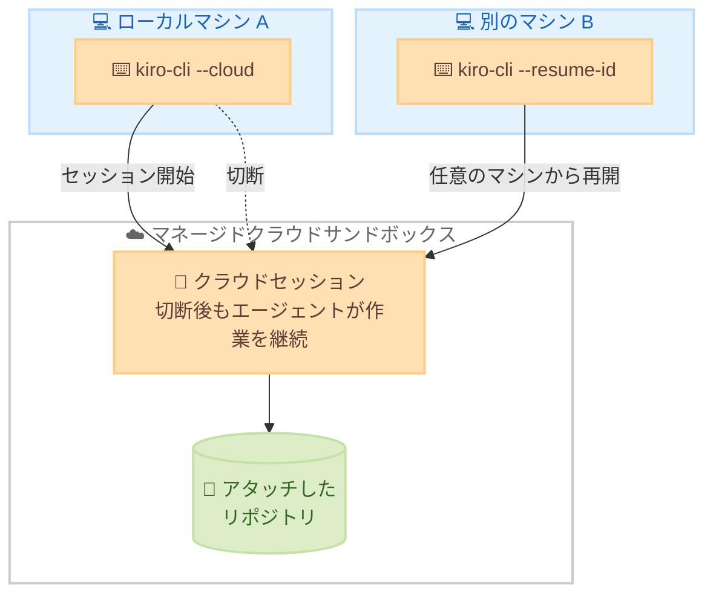

# Kiro - クラウドセッション (プレビュー) と Agent Focus Mode の強化

**リリース日**: 2026 年 8 月 11 日
**サービス**: Kiro (AWS が提供する AI 搭載 IDE)
**機能**: クラウドセッション (プレビュー)、スラッシュコマンドメニューの部分一致検索、Agent Focus Mode の UI 強化

📊 [このアップデートのインフォグラフィックを見る](https://takech9203.github.io/aws-news-summary/20260811-kiro-changelog-2026-08-11.html)

## 概要

2026 年 8 月 11 日、Kiro CLI 2.17.0 と Kiro IDE 1.0.293 が同日にリリースされ、両プロダクトに**クラウドセッション (プレビュー)** が導入されました。クラウドセッションを使用すると、ローカルマシンではなくマネージドなクラウドサンドボックス内でエージェントセッションを実行できます。セッションから切断してもエージェントはクラウド上で作業を継続し、後から任意のマシンで再開できるため、長時間タスクの実行やマシンをまたいだ開発フローが大きく改善されます。

CLI 2.17.0 ではこれに加えて、スラッシュコマンドメニューの部分一致検索 (例: `/pact` で `/compact` がヒット) や、高速入力時の TUI の応答性改善が含まれます。IDE 1.0.293 では Agent Focus Mode が強化され、セッションレールのアイコン表示への折りたたみ、チャット横で直接回答できるアテンションカード、タイトルバーからのセッション間の戻る / 進むナビゲーションが追加されました。

対象ユーザーは、Kiro CLI や Kiro IDE でエージェント駆動開発を行うすべての開発者です。特に、複数セッションを並行して扱う開発者や、外出先・複数マシンで作業を継続したい開発者にとって価値の大きいアップデートです。

**アップデート前の課題**

- エージェントセッションはローカルマシン上でのみ実行され、マシンを閉じるとエージェントの作業も停止していた
- 別のマシンから進行中のセッションを再開する手段がなかった
- スラッシュコマンドメニューは前方一致のみで、コマンド名の途中の文字列では検索できなかった
- Agent Focus Mode でセッションが入力を求めた際、対象セッションに切り替えないと回答できなかった
- Windows ではエージェントのターミナルが `cmd.exe` で実行されることがあり、エージェントが書く PowerShell 形式のコマンドが初回実行で失敗することがあった

**アップデート後の改善**

- `kiro-cli --cloud` でマネージドクラウドサンドボックス上にセッションを開始し、切断後もエージェントが作業を継続できるようになった
- `--resume-id` により任意のマシンからセッションを再開できるようになった
- クラウドセッションとローカルセッションがセッションピッカーに統合表示されるようになった
- スラッシュコマンドメニューが部分一致に対応し、前方一致が優先的に上位表示されるようになった
- Agent Focus Mode のアテンションカードにより、セッションを切り替えずにエージェントの質問へ回答できるようになった
- Windows のエージェントターミナルが PowerShell に固定され、コマンドが初回から正しく実行されるようになった

## アーキテクチャ図



クラウドセッションのワークフローを示しています。マシン A で開始したセッションはクラウドサンドボックス上で実行され続け、切断後も作業を継続し、別のマシン B から `--resume-id` で再開できます。

## サービスアップデートの詳細

### Kiro CLI 2.17.0: クラウドセッション (プレビュー) とコマンドメニュー改善

1. **クラウドセッション (プレビュー)**
   - `kiro-cli --cloud` または `kiro-cli chat --cloud` で、ローカルマシンの代わりにマネージドクラウドサンドボックス内でセッションを実行
   - `--repo` フラグまたは `/repo` ピッカーでリポジトリをアタッチ
   - 切断してもエージェントはクラウド上で作業を継続し、`--resume-id` で任意のマシンから再開可能
   - クラウドセッションとローカルセッションはセッションピッカーに統合表示

2. **スラッシュコマンドの部分一致検索**
   - コマンドメニューが部分文字列でマッチするようになった (例: `/pact` で `/compact` がヒット)
   - 前方一致のコマンドが優先的に上位に表示される

3. **TUI の改善と修正**
   - 高速入力時も TUI のタイピングが滑らかに応答
   - サブエージェントモニターのリストが `Ctrl+D` (下) / `Ctrl+U` (上) でラップアラウンドナビゲーションに対応
   - tmux や Zellij 環境で、スペックおよびワークフローのフリーテキスト入力のテキストカーソルが復元
   - 使用できないエージェントを指定した場合、「見つからない」ではなく理由を説明するように改善
   - プロンプトバーのファイルチップと貼り付けチップが、全テーマで判読しやすい高コントラストスタイルに変更

### Kiro IDE 1.0.293: Agent Focus Mode のクラウドセッションと UI 強化

1. **Agent Focus Mode でのクラウドセッション (プレビュー)**
   - ローカルセッションと並行して、クラウドで実行されるセッションを開始可能
   - セッションが対象とするリポジトリを選択し、チャットの下に常時表示
   - クラウドセッションもローカルセッションと同じエージェントセレクター・モデルセレクターを使用

2. **折りたたみ可能なセッションレール**
   - セッションレールをアイコンのみの表示に折りたたんでチャット領域を拡大
   - 折りたたみ後も各セッションへワンクリックでアクセス可能

3. **アテンションカード**
   - セッションが入力を求めると、チャットの横に質問とエージェントの選択肢がボタンとして表示されるカードが出現
   - セッションを切り替えることなくその場で回答可能
   - アテンションパネルが勝手に開くことはなく、現在表示中のセッションに対しては前面に出ない

4. **戻る / 進むナビゲーション**
   - タイトルバーからセッションと設定の間を `Cmd/Ctrl+[` と `Cmd/Ctrl+]` で行き来可能

5. **その他の改善と修正**
   - Windows のエージェントターミナルが PowerShell に固定され、エージェントが書く PowerShell 形式のコマンドが `cmd.exe` で失敗せず初回から実行される (ユーザー自身のターミナル、デフォルトプロファイル、ターミナル設定には影響なし)
   - コマンドに対する Always Allow 設定が正しく記憶されるように修正
   - macOS のアップデーターが各アップデートを 2 回ダウンロードする問題を修正

## 技術仕様

### クラウドセッション関連コマンド (CLI)

| コマンド / フラグ | 説明 |
|------|------|
| `kiro-cli --cloud` | クラウドサンドボックス上でセッションを開始 |
| `kiro-cli chat --cloud` | チャットセッションをクラウドで開始 |
| `--repo` | セッションにリポジトリをアタッチ |
| `/repo` | セッション内でリポジトリを選択するピッカー |
| `--resume-id` | 任意のマシンからクラウドセッションを再開 |

### Agent Focus Mode ショートカット (IDE)

| ショートカット | 説明 |
|------|------|
| `Cmd/Ctrl+[` | 前のセッション / 設定に戻る |
| `Cmd/Ctrl+]` | 次のセッション / 設定に進む |
| `Ctrl+D` / `Ctrl+U` | サブエージェントモニターのリストを下 / 上に移動 (CLI、ラップアラウンド対応) |

## 設定方法

### 前提条件

1. Kiro CLI 2.17.0 以降、または Kiro IDE 1.0.293 以降にアップデートしていること
2. Kiro アカウントでサインインしていること
3. クラウドセッションで作業するリポジトリへのアクセス権があること

### 手順

#### ステップ 1: クラウドセッションを開始する

```bash
kiro-cli --cloud
```

ローカルマシンではなく、マネージドクラウドサンドボックス内でセッションを開始します。`kiro-cli chat --cloud` でも同様にチャットセッションをクラウドで開始できます。

#### ステップ 2: リポジトリをアタッチする

```bash
kiro-cli --cloud --repo <リポジトリ>
```

`--repo` フラグでセッションが作業対象とするリポジトリをアタッチします。セッション開始後に `/repo` ピッカーから選択することも可能です。

#### ステップ 3: 切断して別のマシンから再開する

```bash
kiro-cli --resume-id <セッション ID>
```

セッションから切断してもエージェントはクラウド上で作業を継続します。上記コマンドにより、任意のマシンから同じセッションを再開できます。クラウドセッションとローカルセッションはセッションピッカーに統合表示されます。

#### ステップ 4: IDE の Agent Focus Mode でクラウドセッションを使用する

Kiro IDE の Agent Focus Mode で新しいセッションを開始する際に、クラウド実行を選択します。作業対象のリポジトリを選択すると、チャットの下に常時表示されます。エージェントとモデルの選択はローカルセッションと同じセレクターを使用します。

## メリット

### ビジネス面

- **開発の継続性向上**: マシンを閉じてもエージェントがクラウドで作業を継続するため、長時間タスクの完了を待つ必要がなく、開発者の時間を有効活用できる
- **場所を選ばない開発**: オフィス、自宅、外出先など、任意のマシンからセッションを再開でき、ハイブリッドワーク環境での生産性が向上する
- **マルチセッション運用の効率化**: アテンションカードにより複数セッションの質問に素早く対応でき、並行作業のスループットが向上する

### 技術面

- **マネージドサンドボックス**: ローカル環境のリソースを消費せず、隔離されたクラウド環境でエージェントを実行できる
- **セッションの一元管理**: クラウドとローカルのセッションが単一のピッカーに統合され、管理が容易
- **一貫した操作体験**: クラウドセッションもローカルと同じエージェント / モデルセレクターを使用するため、学習コストが発生しない
- **Windows での信頼性向上**: エージェントターミナルの PowerShell 固定により、コマンド実行の失敗と再試行が減少する

## デメリット・制約事項

### 制限事項

- クラウドセッションは現時点で**プレビュー**機能であり、仕様が変更される可能性がある
- クラウドセッションの実行にはネットワーク接続と Kiro アカウントへのサインインが必要
- IDE の Agent Focus Mode 自体が実験的機能 (experimental) として提供されている

### 考慮すべき点

- クラウドサンドボックスにリポジトリをアタッチするため、組織のソースコード持ち出しポリシーやセキュリティ要件との整合性を事前に確認する必要がある
- プレビュー期間中の利用条件やクレジット消費については公式ドキュメントで最新情報を確認することを推奨

## ユースケース

### ユースケース 1: 長時間タスクをクラウドに任せて退勤する

**シナリオ**: 大規模リファクタリングやテストスイート全体の修正など、完了までに時間がかかるタスクをエージェントに依頼したいが、ローカルマシンを起動したままにしたくない。

**実装例**:
```bash
kiro-cli chat --cloud --repo my-org/my-service
# タスクを依頼した後、そのまま切断してマシンを閉じる
```

**効果**: エージェントはクラウドサンドボックスで作業を継続し、翌朝任意のマシンから `--resume-id` で結果を確認できる。

### ユースケース 2: 複数マシンをまたいだ開発の継続

**シナリオ**: オフィスのデスクトップで開始した作業を、帰宅後に自宅のラップトップで続けたい。

**実装例**:
```bash
# オフィスのデスクトップで開始
kiro-cli --cloud --repo my-org/my-app

# 自宅のラップトップで再開
kiro-cli --resume-id <セッション ID>
```

**効果**: セッションの状態とエージェントの作業がクラウドに保持されるため、環境の再構築なしにシームレスに作業を継続できる。

### ユースケース 3: Agent Focus Mode での並行セッション運用

**シナリオ**: IDE の Agent Focus Mode で複数のセッションを並行実行し、各セッションからの確認事項に素早く対応したい。

**実装例**:
```
1. セッションレールをアイコン表示に折りたたんでチャット領域を最大化
2. 各セッションで異なるタスクを実行 (ローカルとクラウドの併用)
3. 入力が必要になるとアテンションカードが表示されるため、その場でボタンから回答
4. Cmd/Ctrl+[ と Cmd/Ctrl+] でセッション間を素早く移動
```

**効果**: セッションの切り替え回数が減り、複数のエージェントタスクを効率的に監督できる。

## 利用可能リージョン

Kiro はグローバルに提供されており、リージョンの制約はありません。

## 関連サービス・機能

- **Kiro CLI**: ターミナルから利用できるエージェント型コーディングアシスタント。今回クラウドセッション (プレビュー) が追加された
- **Kiro Agent Focus Mode**: 複数のエージェントセッションを一元管理する IDE の実験的機能。今回クラウドセッション対応と UI 強化が行われた
- **Kiro サブエージェント**: セッション内で並行実行されるエージェント。今回モニターのナビゲーションが改善された

## 参考リンク

- 📊 [インフォグラフィック](https://takech9203.github.io/aws-news-summary/20260811-kiro-changelog-2026-08-11.html)
- [Kiro Changelog](https://kiro.dev/changelog/)
- [Kiro CLI 2.17.0 Changelog](https://kiro.dev/changelog/cli/2-17)
- [Kiro IDE 1.0.293 Changelog](https://kiro.dev/changelog/ide/1-0-293)
- [Cloud Sessions ドキュメント](https://kiro.dev/docs/cloud-sessions)
- [Agent Focus Mode ドキュメント](https://kiro.dev/docs/experimental/focus-mode)

## まとめ

Kiro CLI 2.17.0 と IDE 1.0.293 で導入されたクラウドセッション (プレビュー) は、エージェント駆動開発を「ローカルマシンに縛られた作業」から「クラウドで継続する作業」へと進化させる重要なアップデートです。切断後もエージェントが動き続け、任意のマシンから再開できるため、長時間タスクの委任やマシンをまたいだ開発が現実的になります。まずは `kiro-cli --cloud` でプレビューを試し、Agent Focus Mode のアテンションカードや折りたたみレールと組み合わせた並行セッション運用を検討することを推奨します。
