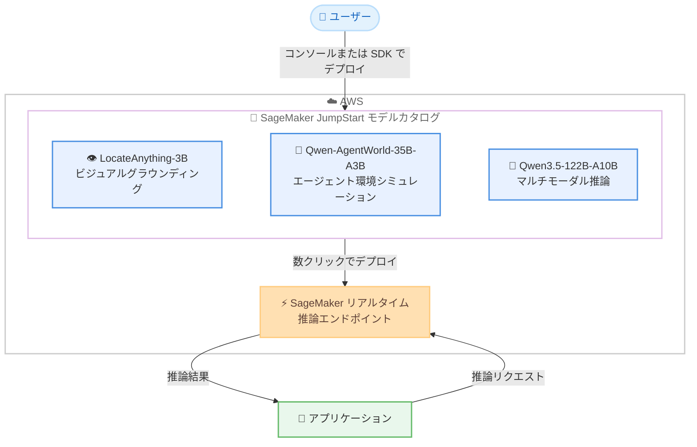

# Amazon SageMaker JumpStart - LocateAnything-3B、Qwen-AgentWorld-35B-A3B、Qwen3.5-122B-A10B モデルの提供開始

**リリース日**: 2026 年 8 月 11 日
**サービス**: Amazon SageMaker JumpStart
**機能**: LocateAnything-3B、Qwen-AgentWorld-35B-A3B、Qwen3.5-122B-A10B の 3 モデルの追加

📊 [このアップデートのインフォグラフィックを見る](https://takech9203.github.io/aws-news-summary/20260811-locateAnything-3B-qwen-agentworld-35B-A3B-qwen3.5-122B-A10B-on-sagemaker-jumpstart.html)

## 概要

NVIDIA の LocateAnything-3B、Qwen の Qwen-AgentWorld-35B-A3B、および Qwen の Qwen3.5-122B-A10B の 3 つのモデルが Amazon SageMaker JumpStart で利用可能になりました。これにより、AWS のお客様が利用できる基盤モデルのポートフォリオがさらに拡大します。

これら 3 つのモデルは、ビジュアルグラウンディング (視覚的な物体位置特定)、エージェント環境シミュレーション、大規模マルチモーダル推論という異なる専門領域をカバーしており、それぞれ異なるエンタープライズ AI の課題に対応します。SageMaker JumpStart を利用することで、数クリックでこれらのモデルをデプロイし、AWS インフラストラクチャ上で高性能かつスケーラブルな AI ソリューションを構築できます。

**アップデート前の課題**

このアップデート以前に存在していた課題や制限は以下のとおりです。

- 自然言語指示による高精度な物体位置特定 (ビジュアルグラウンディング) に特化したモデルを利用するには、独自にモデルを調達し、推論環境を構築する必要があった
- AI エージェントの行動に対する環境の応答をシミュレートする「言語世界モデル」を AWS のマネージド環境で手軽にデプロイする手段がなかった
- 大規模なマルチモーダル推論モデルは計算コストが高く、本番環境で効率的に運用することが難しかった

**アップデート後の改善**

今回のアップデートにより、以下が可能になりました。

- SageMaker JumpStart のモデルカタログから、数クリックまたは SageMaker Python SDK で 3 つの専門モデルをデプロイできるようになった
- ビジュアルグラウンディング、エージェント環境シミュレーション、マルチモーダル推論という異なるユースケースに、用途に応じた専門モデルを選択できるようになった
- MoE (Mixture-of-Experts) アーキテクチャの採用により、大規模モデルでも活性化パラメータを抑えた効率的な推論が可能になった

## アーキテクチャ図



SageMaker JumpStart のモデルカタログから 3 つの専門モデルを選択し、SageMaker の推論エンドポイントとしてデプロイする流れを示しています。デプロイ後はアプリケーションからエンドポイント経由で推論を実行できます。

## サービスアップデートの詳細

### 主要機能

1. **LocateAnything-3B (NVIDIA)**
   - 自然言語の指示から高速かつ高品質なビジュアルグラウンディングと物体位置特定を行うことに最適化されたモデル
   - Parallel Box Decoding (PBD) フレームワークを採用し、バウンディングボックスとポイントをアトミックな単位として単一ステップでデコードすることで、幾何学的な整合性を保ちながら高い並列性を実現
   - エンタープライズインテリジェンスとフィジカル AI の両方のアプリケーションにおいて、多様なドメインでの高精度な物体位置特定、高密度検出、ポイントベースの位置特定が可能

2. **Qwen-AgentWorld-35B-A3B (Qwen)**
   - ツール呼び出し、検索、ターミナル、ソフトウェアエンジニアリング、Android、Web、OS 操作という 7 つのインタラクションドメインにわたるエージェント環境のシミュレーションに優れたモデル
   - 7 つのドメインすべてを単一モデルでカバーする初の「言語世界モデル」であり、エージェントの行動とインタラクション履歴から、長い思考連鎖 (Chain-of-Thought) 推論によって次の環境状態を予測
   - 1,000 万件を超える実世界のインタラクショントラジェクトリでトレーニング済み

3. **Qwen3.5-122B-A10B (Qwen)**
   - 本番環境に適した効率性を備えた高性能マルチモーダル推論モデル
   - 総パラメータ数 122B のうち、トークンあたりの活性化パラメータは 10B のみで、Gated Delta Networks とスパース MoE (256 エキスパート) を統合したハイブリッドアーキテクチャを採用
   - 推論、コーディング、エージェント、視覚理解において高い性能を発揮し、ネイティブ 262K のコンテキストウィンドウを最小限のレイテンシーオーバーヘッドで実現

## 技術仕様

### 各モデルの比較

| 項目 | LocateAnything-3B | Qwen-AgentWorld-35B-A3B | Qwen3.5-122B-A10B |
|------|-------------------|--------------------------|--------------------|
| 提供元 | NVIDIA | Qwen | Qwen |
| 主な用途 | ビジュアルグラウンディング、物体位置特定 | エージェント環境シミュレーション | マルチモーダル推論 |
| アーキテクチャの特徴 | Parallel Box Decoding フレームワーク | 7 ドメイン対応の言語世界モデル | Gated Delta Networks + スパース MoE |
| パラメータ規模 | 3B | 総 35B / 活性化 3B | 総 122B / 活性化 10B |
| コンテキストウィンドウ | 非公開 | 非公開 | ネイティブ 262K |
| 特記事項 | 高密度検出、ポイントベース位置特定に対応 | 1,000 万件超の実世界トラジェクトリで学習 | 256 エキスパートの MoE 構成 |

### デプロイ方法

| 方法 | 詳細 |
|------|------|
| SageMaker コンソール | SageMaker JumpStart のモデルカタログからモデルを選択し、数クリックでデプロイ |
| SageMaker Python SDK | プログラムからモデルを指定して AWS アカウントにデプロイ |

## 設定方法

### 前提条件

1. AWS アカウントと Amazon SageMaker AI を利用できる IAM 権限があること
2. SageMaker Studio または SageMaker Python SDK を利用できる環境があること
3. デプロイ先リージョンで、モデルの推論に必要なインスタンスタイプのサービスクォータが確保されていること

### 手順

#### ステップ1: SageMaker JumpStart モデルカタログでモデルを検索

SageMaker コンソールから SageMaker JumpStart のモデルカタログを開き、「LocateAnything-3B」「Qwen-AgentWorld-35B-A3B」「Qwen3.5-122B-A10B」を検索します。モデルの詳細ページで、モデルの説明、ライセンス、推奨インスタンスタイプを確認できます。

#### ステップ2: SageMaker Python SDK でモデルをデプロイ

```python
from sagemaker.jumpstart.model import JumpStartModel

# JumpStart のモデル ID を指定してモデルを作成
# 実際のモデル ID はモデルカタログの詳細ページで確認する
model = JumpStartModel(model_id="<モデル ID>")

# 推論エンドポイントにデプロイ
predictor = model.deploy()
```

SageMaker Python SDK の `JumpStartModel` クラスにモデル ID を指定し、`deploy()` を呼び出すことで、モデルが SageMaker のリアルタイム推論エンドポイントとしてデプロイされます。

#### ステップ3: 推論の実行

```python
# 推論リクエストを送信
response = predictor.predict({
    "inputs": "<プロンプトまたは入力データ>"
})
print(response)
```

デプロイしたエンドポイントに対して `predict()` で推論リクエストを送信します。入力形式はモデルごとに異なるため、各モデルのドキュメントで確認してください。

## メリット

### ビジネス面

- **導入までの時間短縮**: モデルの調達や推論環境の構築が不要となり、数クリックで専門性の高いモデルを本番環境にデプロイできる
- **ユースケースに応じたモデル選択**: 物体位置特定、エージェントシミュレーション、マルチモーダル推論という異なる課題に対して、それぞれ最適化されたモデルを選択できる
- **AWS 環境内での完結**: モデルのデプロイと推論が AWS アカウント内で完結するため、既存の AWS ベースのセキュリティ・ガバナンス体制をそのまま適用できる

### 技術面

- **効率的な推論**: Qwen3.5-122B-A10B は MoE アーキテクチャにより総パラメータ 122B に対して活性化パラメータを 10B に抑え、大規模モデルの性能と推論効率を両立
- **高い並列性による高速な物体検出**: LocateAnything-3B の Parallel Box Decoding により、バウンディングボックスを単一ステップでデコードし、幾何学的整合性と高速性を両立
- **エージェント開発の加速**: Qwen-AgentWorld-35B-A3B により、実環境を用意せずにエージェントの行動に対する環境応答をシミュレートでき、エージェントのテストや強化学習に活用できる

## デメリット・制約事項

### 制限事項

- 各モデルが利用可能なリージョンは、SageMaker JumpStart のモデルカタログで個別に確認する必要がある
- モデルごとにライセンス条件が異なるため、商用利用の際は各モデルのライセンスを確認する必要がある
- 推論には GPU インスタンスが必要であり、リージョンによっては対象インスタンスタイプのクォータ引き上げ申請が必要になる場合がある

### 考慮すべき点

- Qwen3.5-122B-A10B は活性化パラメータが 10B とはいえ総パラメータは 122B であり、モデルのホスティングには相応のメモリを持つインスタンスが必要となる
- リアルタイム推論エンドポイントは起動している間、インスタンス料金が継続的に発生するため、利用パターンに応じてエンドポイントの停止やオートスケーリングを検討する
- ビジュアルグラウンディングやエージェントシミュレーションなどの特化タスクでは、自社ユースケースでの精度評価を事前に実施することが推奨される

## ユースケース

### ユースケース1: 製造業における画像内の部品位置特定

**シナリオ**: 製造ラインのカメラ画像から、自然言語の指示 (例: 「基板上のコンデンサをすべて検出」) で対象部品の位置を特定し、検査やロボット制御に活用したい。

**実装例**:
```python
# LocateAnything-3B のエンドポイントに画像と自然言語指示を送信
response = predictor.predict({
    "image": "<base64 エンコードした画像>",
    "inputs": "基板上のコンデンサをすべて検出してください"
})
# レスポンスからバウンディングボックス座標を取得
```

**効果**: 高密度検出とポイントベースの位置特定により、フィジカル AI アプリケーションで高精度な物体位置特定を実現し、検査工程の自動化を推進できる。

### ユースケース2: AI エージェントのオフライン評価とトレーニング

**シナリオ**: Web 操作やターミナル操作を行う AI エージェントを開発しており、実環境を用意せずにエージェントの行動に対する環境の応答をシミュレートして、評価やトレーニングを高速化したい。

**実装例**:
```python
# Qwen-AgentWorld-35B-A3B に行動とインタラクション履歴を入力
response = predictor.predict({
    "inputs": {
        "history": "<これまでのインタラクション履歴>",
        "action": "<エージェントが実行する次のアクション>"
    }
})
# 予測された次の環境状態を取得してエージェントの評価に利用
```

**効果**: 7 つのインタラクションドメインを単一モデルでシミュレートできるため、実環境の構築コストを削減しながら、エージェントの評価・改善サイクルを高速化できる。

### ユースケース3: 長文ドキュメントと画像を扱うマルチモーダルアシスタント

**シナリオ**: 大量の技術文書や図面を含む社内ナレッジに対して、推論・コーディング・視覚理解を組み合わせた高度な質問応答を低レイテンシーで提供したい。

**実装例**:
```python
# Qwen3.5-122B-A10B に長文コンテキストと画像を含むリクエストを送信
response = predictor.predict({
    "inputs": "<最大 262K トークンのコンテキストを含むプロンプト>",
    "images": ["<図面や画像データ>"]
})
```

**効果**: ネイティブ 262K のコンテキストウィンドウと MoE による効率的な推論により、大規模なドキュメントを扱うマルチモーダルアシスタントを本番環境に適したコストとレイテンシーで運用できる。

## 料金

SageMaker JumpStart 自体の利用に追加料金はなく、モデルのデプロイに使用する SageMaker AI の推論インスタンスの稼働時間に応じた料金が発生します。料金はデプロイするインスタンスタイプとリージョンによって異なります。詳細は [Amazon SageMaker AI の料金ページ](https://aws.amazon.com/sagemaker-ai/pricing/) を参照してください。

## 利用可能リージョン

公式発表では利用可能リージョンの明記はありません。各モデルの利用可能リージョンは、SageMaker コンソールの SageMaker JumpStart モデルカタログで確認してください。

## 関連サービス・機能

- **Amazon SageMaker AI**: JumpStart でデプロイしたモデルは SageMaker の推論エンドポイントとしてホストされ、オートスケーリングやモニタリングなどの機能を利用できる
- **Amazon Bedrock**: サーバーレスで基盤モデルを利用したい場合の選択肢。JumpStart はモデルのカスタマイズやインフラ制御が必要な場合に適する
- **SageMaker Python SDK**: プログラムによるモデルのデプロイと推論の実行に使用する

## 参考リンク

- 📊 [インフォグラフィック](https://takech9203.github.io/aws-news-summary/20260811-locateAnything-3B-qwen-agentworld-35B-A3B-qwen3.5-122B-A10B-on-sagemaker-jumpstart.html)
- [公式発表 (What's New)](https://aws.amazon.com/about-aws/whats-new/2026/01/locateAnything-3B-qwen-agentworld-35B-A3B-qwen3.5-122B-A10B-on-sagemaker-jumpstart/)
- [Amazon SageMaker JumpStart ドキュメント](https://docs.aws.amazon.com/sagemaker/latest/dg/studio-jumpstart.html)
- [Amazon SageMaker AI 料金ページ](https://aws.amazon.com/sagemaker-ai/pricing/)

## まとめ

ビジュアルグラウンディング、エージェント環境シミュレーション、マルチモーダル推論という異なる専門領域をカバーする 3 つのモデルが SageMaker JumpStart に追加され、用途に応じたモデル選択の幅が大きく広がりました。物体検出を伴うフィジカル AI、AI エージェントの評価・トレーニング、長文マルチモーダル処理のユースケースを検討している場合は、SageMaker JumpStart のモデルカタログから各モデルの詳細を確認し、検証を開始することを推奨します。
