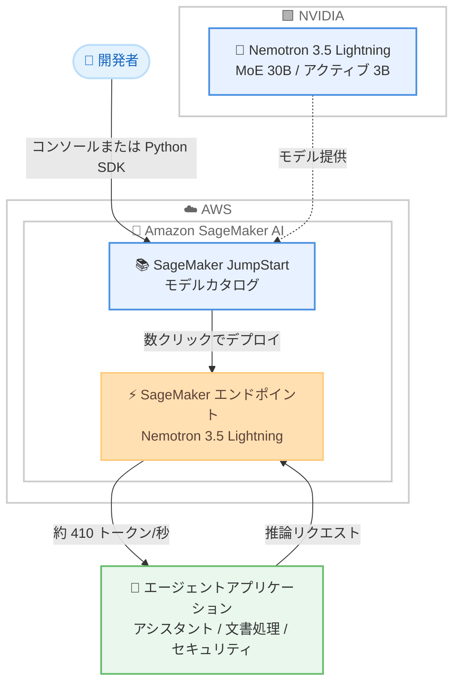

# Amazon SageMaker JumpStart - NVIDIA Nemotron 3.5 Lightning モデルの提供開始

**リリース日**: 2026 年 8 月 11 日
**サービス**: Amazon SageMaker JumpStart
**機能**: NVIDIA Nemotron 3.5 Lightning モデルのサポート

📊 [このアップデートのインフォグラフィックを見る](https://takech9203.github.io/aws-news-summary/20260811-nvidia-nemotron-3.5-lightning-on-sagemaker-jumpstart.html)

## 概要

NVIDIA の Nemotron 3.5 Lightning モデルが Amazon SageMaker JumpStart で利用可能になりました。Nemotron 3.5 Lightning は、常時稼働型のエージェントワークロードと高速なタスク実行に特化した、同クラスで最速のオープンモデルとされています。SageMaker コンソールのモデルカタログまたは SageMaker Python SDK から数クリックでデプロイできます。

本モデルはハイブリッド Mixture-of-Experts (MoE) アーキテクチャを採用し、総パラメータ数 30B に対してフォワードパスごとにアクティブになるのは 3B のみです。これにより、同規模のモデルと比較して最大 4 倍のスループット (約 410 トークン/秒) と 30% 高速なタスク完了を実現します。また、DFlash 投機的デコーディングにより最大 100 万トークンのコンテキストウィンドウをサポートします。

パーソナルアシスタント、金融文書処理、サイバーセキュリティのトリアージ、通信事業者のオペレーションなど、永続的なエージェントや高スループットのエンタープライズ自動化を必要とするユーザーが主な対象です。

**アップデート前の課題**

- 高スループットが求められるエージェントワークロードでは、大規模モデルの推論コストとレイテンシがボトルネックになっていた
- オープンモデルを SageMaker 上で利用する場合、モデルの取得、コンテナ設定、エンドポイント構築を個別に行う必要があった
- 長大なコンテキストを扱うエージェント処理では、対応モデルの選択肢が限られていた

**アップデート後の改善**

- SageMaker JumpStart のモデルカタログから Nemotron 3.5 Lightning を数クリックでデプロイできるようになった
- MoE アーキテクチャにより、30B クラスの能力を 3B 相当のアクティブパラメータで実行し、高スループットかつ高速なタスク完了が可能になった
- 最大 100 万トークンのコンテキストウィンドウにより、長時間稼働するエージェントや大量ドキュメントの処理が容易になった
- オープンデータセットで学習された完全オープンなモデルのため、企業独自のツール、ワークフロー、ポリシーに合わせたポストトレーニングが可能になった

## アーキテクチャ図



開発者は SageMaker JumpStart のモデルカタログから Nemotron 3.5 Lightning を選択し、SageMaker エンドポイントとしてデプロイします。エージェントアプリケーションはこのエンドポイントに推論リクエストを送信します。

## サービスアップデートの詳細

### 主要機能

1. **ハイブリッド MoE アーキテクチャによる高効率推論**
   - 総パラメータ数 30B、フォワードパスごとのアクティブパラメータは 3B のみ
   - 同規模のモデルと比較して最大 4 倍のスループット (約 410 トークン/秒)
   - タスク完了速度は 30% 高速化
   - Nemotron 3 Ultra からの蒸留により高い品質を維持

2. **最大 100 万トークンのコンテキストウィンドウ**
   - DFlash 投機的デコーディングにより実現
   - 長時間稼働する永続エージェントや大規模ドキュメント処理に対応

3. **完全オープンなモデル**
   - オープンデータセットで学習された、完全にオープンなモデル
   - 企業独自のツール、ワークフロー、ポリシーに合わせたポストトレーニングが可能
   - エッジ、オンプレミス、クラウドのいずれの環境でも完全な所有権を持って展開可能
   - 主要なエージェントハーネスと直接連携

4. **SageMaker JumpStart による簡単デプロイ**
   - SageMaker コンソールのモデルカタログから数クリックでデプロイ
   - SageMaker Python SDK によるプログラマティックなデプロイにも対応

## 技術仕様

### モデル仕様

| 項目 | 詳細 |
|------|------|
| モデル名 | NVIDIA Nemotron 3.5 Lightning |
| アーキテクチャ | ハイブリッド Mixture-of-Experts (MoE) |
| 総パラメータ数 | 30B |
| アクティブパラメータ数 | 3B (フォワードパスごと) |
| スループット | 約 410 トークン/秒 (同規模モデル比で最大 4 倍) |
| タスク完了速度 | 同規模モデル比で 30% 高速 |
| コンテキストウィンドウ | 最大 100 万トークン (DFlash 投機的デコーディング利用) |
| 由来 | Nemotron 3 Ultra からの蒸留 |
| ライセンス特性 | オープンデータセットで学習された完全オープンモデル |

## 設定方法

### 前提条件

1. AWS アカウントと SageMaker AI を利用できる IAM 権限
2. SageMaker Studio または SageMaker Python SDK の実行環境
3. デプロイ先エンドポイント用の推論インスタンスのサービスクォータ

### 手順

#### ステップ 1: SageMaker JumpStart でモデルを検索

SageMaker コンソールから SageMaker Studio を開き、JumpStart のモデルカタログで「Nemotron 3.5 Lightning」を検索します。

#### ステップ 2: モデルをデプロイ

モデルの詳細ページで [Deploy] を選択し、エンドポイント名とインスタンスタイプを指定してデプロイします。SageMaker Python SDK を使用する場合の例は以下のとおりです。

```python
from sagemaker.jumpstart.model import JumpStartModel

# JumpStart のモデル ID を指定してモデルオブジェクトを作成
# 実際のモデル ID は JumpStart モデルカタログで確認してください
model = JumpStartModel(model_id="<nemotron-3-5-lightning-model-id>")

# SageMaker エンドポイントとしてデプロイ
predictor = model.deploy()
```

このコードは、JumpStart のモデルカタログからモデルを取得し、SageMaker リアルタイム推論エンドポイントとしてデプロイします。

#### ステップ 3: 推論を実行

```python
# デプロイしたエンドポイントに推論リクエストを送信
payload = {
    "messages": [
        {"role": "user", "content": "受信したセキュリティアラートを重要度別に分類してください。"}
    ],
    "max_tokens": 512
}
response = predictor.predict(payload)
print(response)
```

デプロイ済みエンドポイントに対してチャット形式のリクエストを送信し、モデルの応答を取得します。

## メリット

### ビジネス面

- **運用コストの最適化**: アクティブパラメータが 3B のみの MoE 構成により、30B クラスの能力をより少ない計算リソースで利用でき、推論コストを抑制できる
- **エージェント自動化の高速化**: タスク完了が 30% 高速化されることで、金融文書処理やセキュリティトリアージなどの業務自動化のスループットが向上する
- **ベンダーロックインの回避**: 完全オープンなモデルのため、エッジ、オンプレミス、クラウドのいずれにも展開でき、モデル資産の所有権を維持できる

### 技術面

- **高スループット推論**: 約 410 トークン/秒のスループットにより、多数の同時エージェントセッションを処理できる
- **長大コンテキスト対応**: 最大 100 万トークンのコンテキストウィンドウにより、会話履歴やドキュメント全体を保持したまま処理できる
- **カスタマイズ性**: オープンデータセットで学習されているため、独自ツールやポリシーに合わせたポストトレーニングが可能
- **デプロイの簡素化**: JumpStart により、コンテナ設定やモデル取得の手間なく数クリックでエンドポイントを構築できる

## デメリット・制約事項

### 制限事項

- 発表では利用可能リージョンが明示されていないため、利用前に SageMaker JumpStart のモデルカタログで対象リージョンを確認する必要がある
- 100 万トークンのコンテキストウィンドウの利用には DFlash 投機的デコーディングが前提となる
- デプロイには GPU 推論インスタンスが必要であり、対象インスタンスのクォータ確保が必要になる場合がある

### 考慮すべき点

- スループットやタスク完了速度の数値はベンダー公表値であり、実際の性能はワークロード、プロンプト長、インスタンスタイプに依存するため、本番導入前にベンチマークを実施することを推奨
- リアルタイムエンドポイントは稼働時間に応じて課金されるため、利用パターンに応じたインスタンスサイズやオートスケーリングの設計が必要
- Amazon Bedrock ではなく SageMaker AI 上でのホスティングとなるため、エンドポイントの運用管理 (モニタリング、スケーリング、更新) はユーザー側の責務となる

## ユースケース

### ユースケース 1: 常時稼働型パーソナルアシスタント

**シナリオ**: 社内ナレッジやスケジュールと連携し、従業員の問い合わせに常時応答するアシスタントを運用する。

**実装例**:
```
SageMaker JumpStart で Nemotron 3.5 Lightning をデプロイ
→ エージェントハーネスからエンドポイントを呼び出し
→ 100 万トークンのコンテキストで長期の会話履歴を保持
```

**効果**: 高スループットにより多数の従業員からの同時リクエストを低レイテンシで処理でき、長大なコンテキストで文脈を失わない応答が可能になります。

### ユースケース 2: 金融文書の大量処理

**シナリオ**: 契約書や決算資料などの長文ドキュメントを解析し、要約や項目抽出を自動化する。

**実装例**:
```
S3 に格納した文書をバッチで読み込み
→ Nemotron 3.5 Lightning エンドポイントで抽出・要約
→ 結果をデータベースに格納しレビューワークフローへ連携
```

**効果**: 最大 100 万トークンのコンテキストにより長文ドキュメントを分割せずに処理でき、タスク完了の高速化により処理件数を増やせます。

### ユースケース 3: サイバーセキュリティのアラートトリアージ

**シナリオ**: SIEM から発生する大量のセキュリティアラートを分類し、優先度付けと初動対応の提案を自動化する。

**実装例**:
```
SIEM のアラートをキューイング
→ エージェントが Nemotron 3.5 Lightning でアラートを解析・分類
→ 高優先度のみアナリストへエスカレーション
```

**効果**: 約 410 トークン/秒の高スループットにより大量アラートをリアルタイムに近い速度で処理し、アナリストの負荷を軽減します。

## 料金

発表では本モデル固有の料金情報は示されていません。SageMaker JumpStart のモデルデプロイでは、エンドポイントで使用する推論インスタンスの稼働時間に応じた SageMaker AI の料金が発生します。詳細は SageMaker AI の料金ページを確認してください。

## 利用可能リージョン

発表では利用可能リージョンが明示されていません。SageMaker JumpStart のモデルカタログで、利用するリージョンにおけるモデルの提供状況を確認してください。

## 関連サービス・機能

- **Amazon SageMaker JumpStart**: 公開モデルや基盤モデルを数クリックでデプロイできるモデルハブ。本モデルの提供基盤
- **Amazon SageMaker AI 推論エンドポイント**: デプロイしたモデルをホストするマネージド推論基盤。オートスケーリングやモニタリングに対応
- **Amazon Bedrock**: フルマネージドな基盤モデル API サービス。エンドポイント管理が不要な選択肢として比較検討の対象
- **Amazon SageMaker Python SDK**: JumpStart モデルのプログラマティックなデプロイと推論に使用

## 参考リンク

- 📊 [インフォグラフィック](https://takech9203.github.io/aws-news-summary/20260811-nvidia-nemotron-3.5-lightning-on-sagemaker-jumpstart.html)
- [公式発表 (What's New)](https://aws.amazon.com/about-aws/whats-new/2026/01/nvidia-nemotron-3.5-lightning-on-sagemaker-jumpstart/)
- [Amazon SageMaker JumpStart ドキュメント](https://docs.aws.amazon.com/sagemaker/latest/dg/studio-jumpstart.html)
- [Amazon SageMaker AI 料金ページ](https://aws.amazon.com/sagemaker/pricing/)

## まとめ

NVIDIA Nemotron 3.5 Lightning が SageMaker JumpStart に追加され、高スループットなエージェントワークロード向けのオープンモデルを数クリックでデプロイできるようになりました。MoE アーキテクチャによる効率的な推論と最大 100 万トークンのコンテキストウィンドウは、永続エージェントや大量文書処理に取り組む企業にとって有力な選択肢です。まずは JumpStart のモデルカタログで利用リージョンを確認し、想定ワークロードでの性能とコストを検証することを推奨します。
