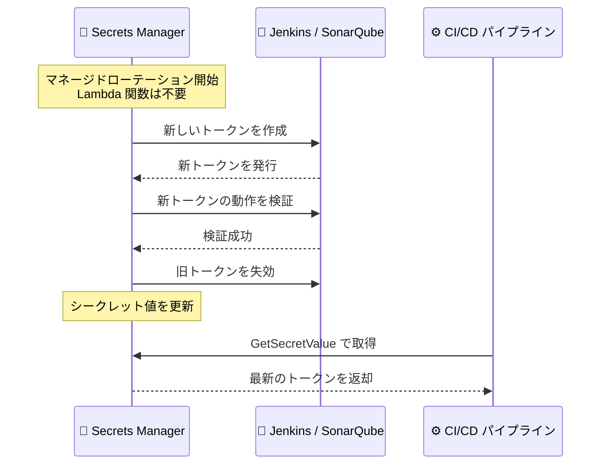

# AWS Secrets Manager - Jenkins と SonarQube のマネージド外部シークレット対応

**リリース日**: 2026 年 8 月 11 日
**サービス**: AWS Secrets Manager
**機能**: マネージド外部シークレット (Managed External Secrets) の Jenkins / SonarQube 対応

📊 [このアップデートのインフォグラフィックを見る](https://takech9203.github.io/aws-news-summary/20260811-secrets-manager-integration-jenkins-sonarqube.html)

## 概要

AWS Secrets Manager のマネージド外部シークレット機能が、Jenkins API トークンと SonarQube トークンのローテーションに対応しました。マネージド外部シークレットは、サードパーティサービスの認証情報を Secrets Manager に保存し、カスタムローテーションコードを一切書かずに AWS コンソールから自動ローテーションできる機能です。

Jenkins のローテーションでは、Secrets Manager が新しいトークンを作成し、新トークンの動作を確認してから旧トークンを失効させるため、CI/CD パイプラインを中断させることなく安全に認証情報を更新できます。SonarQube では、User Token、Global Analysis Token、Project Analysis Token の 3 種類のトークンを SonarQube Web API 経由でローテーションできます。

今回の追加により、既存の対応パートナーである BigID、Confluent Cloud、Datadog、GitLab、MongoDB Atlas、Okta、Paddle、Salesforce、Snowflake に、CI/CD とコード品質管理の主要ツールである Jenkins と SonarQube が加わりました。DevOps ツールチェーンの認証情報管理を AWS 上で一元化したいユーザーにとって重要なアップデートです。

**アップデート前の課題**

このアップデート以前は、Jenkins や SonarQube のトークン管理に以下の課題がありました。

- Jenkins API トークンや SonarQube トークンをローテーションするには、各ツールの API 仕様に合わせたカスタム AWS Lambda 関数を独自に開発・保守する必要があった
- ローテーション処理の実装ミスにより、旧トークンの失効タイミングによっては CI/CD パイプラインが認証エラーで停止するリスクがあった
- トークンの手動更新は運用負荷が高く、更新漏れによる長期間の認証情報使い回しがセキュリティリスクとなっていた

**アップデート後の改善**

今回のアップデートにより、以下が可能になりました。

- Jenkins API トークンと SonarQube トークンを、カスタムコードなしで AWS コンソールから自動ローテーションできるようになった
- 新トークンの動作確認後に旧トークンを失効させる安全なローテーションフローにより、パイプラインを中断せずに認証情報を更新できるようになった
- ローテーション用の Lambda 関数のデプロイと保守が不要になり、運用負荷とコストが削減された

## アーキテクチャ図



Secrets Manager が新トークンの作成・検証を完了してから旧トークンを失効させるため、CI/CD パイプラインは中断なく最新のトークンを利用できます。

## サービスアップデートの詳細

### 主要機能

1. **Jenkins API トークンのマネージドローテーション**
   - Secrets Manager が新しいトークンを作成し、動作確認後に旧トークンを失効させる安全なローテーションフローを提供
   - セルフローテーション: ローテーション対象のトークン自身が、自分の後継トークンの発行を認証する方式
   - 管理者支援ローテーション: 別途用意した管理者トークンが、トークンの生成と失効の操作を実行する方式

2. **SonarQube トークンのマネージドローテーション**
   - SonarQube Web API 経由で 3 種類のトークンをローテーション可能
   - User Token: セルフローテーションに対応
   - Global Analysis Token / Project Analysis Token: 管理者トークンを使用してローテーション

3. **Lambda 不要のマネージドローテーション基盤**
   - カスタムローテーション用の Lambda 関数を作成・保守する必要がなく、アカウント内に Lambda 関数はデプロイされない
   - パートナーごとに事前定義されたシークレット形式により、ローテーションに必要なメタデータを標準化
   - すべてのローテーション操作とシークレット更新は AWS CloudTrail に記録され、完全な監査証跡を確保

## 技術仕様

### 対応トークンとローテーション方式

| 対象 | トークン種別 | ローテーション方式 |
|------|------------|------------------|
| Jenkins | API トークン | セルフローテーションまたは管理者支援ローテーション |
| SonarQube | User Token | セルフローテーション |
| SonarQube | Global Analysis Token | 管理者トークンによるローテーション |
| SonarQube | Project Analysis Token | 管理者トークンによるローテーション |

### マネージド外部シークレットの特徴

| 項目 | 詳細 |
|------|------|
| ローテーション実装 | Lambda 関数不要のマネージド方式 |
| シークレット形式 | パートナーごとに事前定義された形式 |
| 自動ローテーション | コンソールでのシークレット作成時にデフォルトで有効 |
| 監査 | CloudTrail によるローテーション・更新操作の完全なログ記録 |
| 既存対応パートナー | BigID、Confluent Cloud、Datadog、GitLab、MongoDB Atlas、Okta、Paddle、Salesforce、Snowflake |

## 設定方法

### 前提条件

1. AWS Secrets Manager を利用できる AWS アカウント
2. Jenkins または SonarQube の環境と、ローテーション対象のトークンを操作できる権限
3. 管理者支援ローテーションを使用する場合は、トークンの生成・失効が可能な管理者トークン

### 手順

#### ステップ 1: マネージド外部シークレットの作成

AWS コンソールの Secrets Manager で「新しいシークレットを保存」を選択し、シークレットタイプとして外部パートナーのシークレット (Jenkins または SonarQube) を選択します。パートナーごとに事前定義された形式に従って、トークンや接続情報を入力します。

#### ステップ 2: ローテーション方式の選択

Jenkins の場合はセルフローテーションまたは管理者支援ローテーションを選択します。SonarQube の場合はトークン種別に応じて、User Token はセルフローテーション、Global Analysis Token と Project Analysis Token は管理者トークンによるローテーションを設定します。コンソールでの作成時には自動ローテーションがデフォルトで有効になります。

#### ステップ 3: アプリケーションからの利用

```bash
# 最新のトークンを取得するコマンド例
aws secretsmanager get-secret-value \
  --secret-id my-jenkins-api-token \
  --query SecretString \
  --output text
```

このコマンドは、Secrets Manager から最新のシークレット値を取得します。ローテーション後もアプリケーションは同じシークレット ID で常に有効なトークンを取得できます。

## メリット

### ビジネス面

- **運用コストの削減**: カスタムローテーション用 Lambda 関数の開発・保守が不要になり、DevOps チームの運用負荷を削減できる
- **セキュリティ体制の強化**: トークンの定期的な自動ローテーションにより、認証情報の長期使い回しによる漏えいリスクを低減できる
- **コンプライアンス対応**: CloudTrail による完全な監査証跡により、認証情報管理の統制状況を証明しやすくなる

### 技術面

- **パイプラインの無停止ローテーション**: 新トークンの検証後に旧トークンを失効させるフローにより、CI/CD パイプラインの認証エラーを回避できる
- **一元管理**: Jenkins や SonarQube のトークンを他の AWS シークレットと同じ Secrets Manager 上で、きめ細かな IAM 権限管理とともに一元管理できる
- **標準化された形式**: パートナーごとに事前定義されたシークレット形式により、実装のばらつきを排除できる

## デメリット・制約事項

### 制限事項

- 対応するのは Jenkins API トークンと SonarQube の 3 種類のトークンであり、これら以外の認証情報は対象外
- 利用できるリージョンは、マネージド外部シークレット機能がサポートされているリージョンに限定される
- SonarQube の Global Analysis Token と Project Analysis Token のローテーションには、別途管理者トークンの用意が必要

### 考慮すべき点

- Secrets Manager から Jenkins / SonarQube の API エンドポイントへ到達できるネットワーク構成が前提となるため、接続要件を事前に確認する必要がある
- 管理者支援ローテーションを使用する場合、管理者トークン自体の保護とライフサイクル管理も別途考慮する必要がある
- 既存のカスタム Lambda ローテーションから移行する場合は、シークレット形式をパートナー定義の形式に合わせる必要がある

## ユースケース

### ユースケース 1: CI/CD パイプラインの Jenkins トークン自動ローテーション

**シナリオ**: AWS 上のアプリケーションが Jenkins API を呼び出してビルドをトリガーしており、API トークンを手動で更新している。更新漏れや失効タイミングのずれによるパイプライン停止が課題となっている。

**実装例**:
```
1. Jenkins API トークンをマネージド外部シークレットとして登録
2. セルフローテーションを有効化し、ローテーションスケジュールを設定
3. アプリケーションは GetSecretValue で常に最新トークンを取得
```

**効果**: パイプラインを停止させることなくトークンが定期的に自動更新され、手動運用と認証エラーのリスクを排除できます。

### ユースケース 2: SonarQube 解析トークンの組織的な統制

**シナリオ**: 複数プロジェクトで SonarQube のコード品質解析を実施しており、Project Analysis Token がプロジェクトごとに散在して管理されている。

**実装例**:
```
1. 管理者トークンを用意し、各 Project Analysis Token を
   マネージド外部シークレットとして登録
2. 管理者トークンによるローテーションを設定
3. IAM ポリシーでプロジェクトチームごとにアクセス権限を分離
```

**効果**: 解析トークンを Secrets Manager で一元管理し、きめ細かな権限管理と自動ローテーションによりガバナンスを強化できます。

### ユースケース 3: 監査要件が厳しい環境での DevOps ツール認証情報管理

**シナリオ**: 金融業界などコンプライアンス要件が厳しい環境で、DevOps ツールの認証情報のローテーション履歴とアクセス履歴の証跡が求められている。

**実装例**:
```
1. Jenkins / SonarQube トークンをマネージド外部シークレットへ移行
2. CloudTrail でローテーション操作とシークレット取得を記録
3. Amazon EventBridge でローテーションイベントを監視・通知
```

**効果**: すべてのローテーション活動が CloudTrail に記録され、監査対応に必要な証跡を自動的に確保できます。

## 料金

マネージド外部シークレットには、AWS Secrets Manager の標準料金が適用されます。シークレットあたり月額 0.40 USD、API コール 10,000 回あたり 0.05 USD が課金されます。マネージドローテーションではアカウント内に Lambda 関数がデプロイされないため、ローテーション用 Lambda の実行コストは発生しません。最新の料金は料金ページを確認してください。

## 利用可能リージョン

AWS Secrets Manager のマネージド外部シークレットがサポートされているすべての AWS リージョンで利用可能です。

## 関連サービス・機能

- **AWS Lambda**: 従来のカスタムローテーションで必要だった実装方式。マネージド外部シークレットでは不要になる
- **AWS CloudTrail**: ローテーション活動やシークレット更新操作の監査ログを記録
- **AWS IAM**: シークレットへのアクセスをきめ細かく制御する権限管理
- **AWS CodePipeline / AWS CodeBuild**: Jenkins と組み合わせて利用されることが多い AWS の CI/CD サービス

## 参考リンク

- 📊 [インフォグラフィック](https://takech9203.github.io/aws-news-summary/20260811-secrets-manager-integration-jenkins-sonarqube.html)
- [公式発表 (What's New)](https://aws.amazon.com/about-aws/whats-new/2026/08/secrets-manager-integration-jenkins-sonarqube/)
- [ドキュメント: マネージド外部シークレット](https://docs.aws.amazon.com/secretsmanager/latest/userguide/managed-external-secrets.html)
- [料金ページ](https://aws.amazon.com/secrets-manager/pricing/)

## まとめ

AWS Secrets Manager のマネージド外部シークレットが Jenkins と SonarQube に対応し、DevOps ツールチェーンの主要な認証情報を Lambda 関数なしで自動ローテーションできるようになりました。Jenkins や SonarQube のトークンを手動またはカスタムコードで管理している場合は、マネージド外部シークレットへの移行を検討することで、運用負荷の削減とセキュリティ強化を同時に実現できます。
