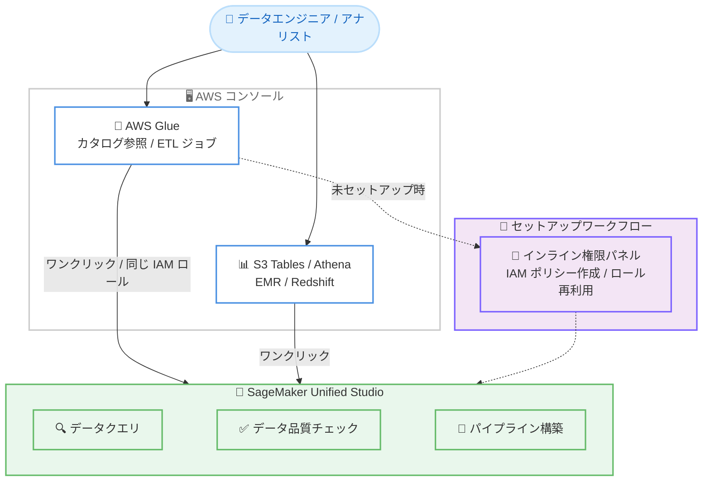

# AWS Glue - AWS コンソールからの SageMaker Unified Studio ワンクリックアクセス

**リリース日**: 2026年8月11日
**サービス**: AWS Glue / Amazon SageMaker Unified Studio
**機能**: AWS Glue コンソールからの SageMaker Unified Studio ワンクリックアクセス

[このアップデートのインフォグラフィックを見る](https://takech9203.github.io/aws-news-summary/20260811-smus-glue-access.html)

## 概要

AWS Glue コンソールから Amazon SageMaker Unified Studio へワンクリックで直接アクセスできるようになった。データエンジニアやアナリストは、Glue コンソールでカタログを参照している状態から、そのまま SageMaker Unified Studio に移動してデータのクエリ実行、データ品質チェック、データパイプラインの構築を開始できる。

今回のリリースにより、SageMaker Unified Studio は S3 Tables、Athena、EMR、Redshift、そして AWS Glue の各コンソールからワンクリックで開けるようになった。Glue でカタログテーブルを参照している場合や ETL ジョブを構築している場合でも、同じ IAM ロールを使用して Unified Studio を開き、カタログデータの操作や SageMaker ノートブックによるクエリを即座に開始できる。

さらに、SageMaker Unified Studio を未セットアップのユーザー向けに、セットアップワークフロー内で必要な IAM ポリシーの作成と設定を行えるインライン権限パネルが新たに提供された。IAM コンソールへの切り替えや複数のブラウザタブの往復が不要になり、既存の IAM ロールの再利用や権限のカスタマイズもその場で行える。

**アップデート前の課題**

- Glue コンソールで作業中に SageMaker Unified Studio を利用するには、別途 URL やコンソールを探して移動する必要があった
- SageMaker Unified Studio の初期セットアップ時に、必要な IAM ポリシーを作成するために IAM コンソールへ切り替える必要があった
- 複数のブラウザタブを行き来しながら権限設定を行う必要があり、セットアップ手順が煩雑だった

**アップデート後の改善**

- Glue コンソールからワンクリックで SageMaker Unified Studio を開き、クエリ実行、データ品質チェック、パイプライン構築を即座に開始できるようになった
- Glue コンソールと同じ IAM ロールを使用して、カタログデータの操作や SageMaker ノートブックでのクエリを実行できるようになった
- インライン権限パネルにより、セットアップワークフロー内で IAM ポリシーの作成・設定が完結し、セットアップ手順が削減された

## アーキテクチャ図



AWS Glue コンソール (および S3 Tables、Athena、EMR、Redshift の各コンソール) からワンクリックで SageMaker Unified Studio に移動できる。未セットアップの場合はインライン権限パネルで IAM ポリシーの作成・設定をその場で完結できる。

## サービスアップデートの詳細

### 主要機能

1. **Glue コンソールからのワンクリックアクセス**
   - AWS Glue コンソールから SageMaker Unified Studio をワンクリックで起動できる
   - カタログテーブルの参照中や ETL ジョブの構築中に、シームレスに Unified Studio へ移動できる
   - 移動後は、データのクエリ実行、データ品質チェック、データパイプラインの構築を即座に開始できる

2. **同一 IAM ロールでの継続作業**
   - Glue コンソールで使用しているものと同じ IAM ロールを使用して Unified Studio で作業できる
   - カタログデータの操作や、SageMaker ノートブックを使用したクエリの実行が可能
   - ロールの切り替えや再認証の手間なく、一貫したアクセス権限で作業を継続できる

3. **インライン権限パネルによるセットアップ簡素化**
   - SageMaker Unified Studio 未セットアップのユーザー向けに、セットアップワークフロー内で必要な IAM ポリシーを作成・設定できるパネルを提供
   - IAM コンソールへの切り替えや複数ブラウザタブの往復が不要
   - 既存の IAM ロールの再利用や、コンテキスト内での権限カスタマイズに対応し、セットアップ手順を削減

4. **主要分析系コンソールからの統一的なアクセス**
   - 今回のリリースにより、S3 Tables、Athena、EMR、Redshift、Glue の各コンソールから Unified Studio をワンクリックで開けるようになった
   - 既存のコンソールユーザーが、より広範なデータ・AI 機能へシームレスにアクセスできる

## 技術仕様

### 連携の概要

| 項目 | 詳細 |
|------|------|
| 対象コンソール | AWS Glue (今回追加)、S3 Tables、Athena、EMR、Redshift |
| 遷移先 | Amazon SageMaker Unified Studio |
| 認証・権限 | Glue コンソールと同じ IAM ロールを使用可能 |
| セットアップ支援 | インライン権限パネルで IAM ポリシーの作成・設定が可能 |
| 既存ロールの再利用 | 対応 (権限のカスタマイズもコンテキスト内で可能) |

## 設定方法

### 前提条件

1. AWS Glue コンソールへのアクセス権限を持つ IAM ロールまたはユーザー
2. SageMaker Unified Studio がサポートされているリージョンでの利用
3. 初回利用時は、インライン権限パネルでの IAM ポリシー設定 (または既存ロールの再利用)

### 手順

#### ステップ1: AWS Glue コンソールを開く

AWS マネジメントコンソールから AWS Glue コンソールにアクセスし、カタログテーブルの参照や ETL ジョブの構築など通常の作業を行う。

#### ステップ2: SageMaker Unified Studio をワンクリックで起動

Glue コンソール内に表示される SageMaker Unified Studio へのリンクをクリックする。Glue コンソールと同じ IAM ロールで Unified Studio が開き、カタログデータの操作や SageMaker ノートブックでのクエリを開始できる。

#### ステップ3: 初回セットアップ (未セットアップの場合のみ)

SageMaker Unified Studio を初めて利用する場合、インライン権限パネルが表示される。パネル内で必要な IAM ポリシーを作成・設定するか、既存の IAM ロールを再利用する。IAM コンソールへの切り替えは不要で、権限のカスタマイズもその場で行える。

## メリット

### ビジネス面

- **生産性の向上**: コンソール間の移動や権限設定にかかる時間が削減され、データ分析やパイプライン構築の作業に集中できる
- **導入障壁の低減**: インライン権限パネルによりセットアップ手順が削減され、SageMaker Unified Studio の導入・展開が容易になる
- **データ・AI 活用の促進**: 既存の Glue ユーザーが、Unified Studio の幅広いデータ・AI 機能へシームレスにアクセスできる

### 技術面

- **一貫した権限管理**: Glue コンソールと同じ IAM ロールを使用するため、権限の一貫性が保たれ、追加のロール設定が不要
- **コンテキストの維持**: カタログ参照や ETL ジョブ構築の作業コンテキストを保ったまま、Unified Studio での作業に移行できる
- **セットアップの簡素化**: IAM コンソールとの往復が不要になり、権限設定のミスや手戻りを削減できる

## デメリット・制約事項

### 制限事項

- SageMaker Unified Studio がサポートされているリージョンでのみ利用可能
- ワンクリックアクセスは Glue、S3 Tables、Athena、EMR、Redshift の各コンソールからの遷移に限られる

### 考慮すべき点

- 同じ IAM ロールを使用するため、Unified Studio で必要な操作に応じたポリシーが該当ロールに付与されているか確認が必要
- 組織で IAM ポリシーの作成を制限している場合、インライン権限パネルでのポリシー作成に管理者の関与が必要になる可能性がある
- チームで SageMaker Unified Studio を本格利用する場合は、ドメインやプロジェクトの設計を事前に検討することが望ましい

## ユースケース

### ユースケース1: カタログ参照からのアドホック分析

**シナリオ**: データエンジニアが Glue Data Catalog でテーブル定義を確認中に、実データの内容をすぐにクエリして確認したい。

**実装例**:
```text
1. Glue コンソールでカタログテーブルを参照
2. ワンクリックで SageMaker Unified Studio を起動
3. 同じ IAM ロールで対象テーブルに対してクエリを実行
```

**効果**: コンソールの切り替えや権限設定なしに、カタログ参照からアドホック分析まで一連の流れで完結できる。

### ユースケース2: ETL ジョブ開発とデータ品質チェックの連携

**シナリオ**: Glue で ETL ジョブを構築中のエンジニアが、変換対象データの品質を事前に確認したい。

**実装例**:
```text
1. Glue コンソールで ETL ジョブを構築
2. ワンクリックで Unified Studio に移動し、データ品質チェックを実行
3. 品質チェックの結果を踏まえて ETL ジョブの変換ロジックを調整
```

**効果**: ETL 開発とデータ品質チェックを行き来しながら、データパイプラインの品質を効率的に高められる。

### ユースケース3: 新規チームメンバーの環境セットアップ

**シナリオ**: 分析チームに参加した新規メンバーが、SageMaker Unified Studio を初めてセットアップする。

**実装例**:
```text
1. Glue コンソールから Unified Studio へのリンクをクリック
2. インライン権限パネルで必要な IAM ポリシーを作成、
   または既存の IAM ロールを再利用
3. セットアップ完了後、即座にノートブックでのクエリを開始
```

**効果**: IAM コンソールへの切り替えなしにセットアップが完結し、オンボーディングにかかる時間を短縮できる。

## 料金

このワンクリックアクセス機能自体に追加料金は発生しない。SageMaker Unified Studio で実行するクエリ、ノートブック、データ品質チェック、パイプラインなどの利用には、それぞれの基盤サービスの料金が適用される。詳細は各サービスの料金ページを参照。

## 利用可能リージョン

Amazon SageMaker Unified Studio がサポートされているすべての AWS リージョンで利用可能。

## 関連サービス・機能

- **Amazon SageMaker Unified Studio**: データ、分析、AI のための統合開発環境。今回のアップデートの遷移先となるサービス
- **AWS Glue Data Catalog**: テーブル定義を管理するメタデータカタログ。Unified Studio からカタログデータの操作やクエリが可能
- **Amazon Athena / Amazon Redshift / Amazon EMR / Amazon S3 Tables**: 同様にコンソールから Unified Studio へのワンクリックアクセスに対応している分析系サービス
- **AWS IAM**: インライン権限パネルで作成・設定するポリシーとロールの基盤となるサービス

## 参考リンク

- [インフォグラフィック](https://takech9203.github.io/aws-news-summary/20260811-smus-glue-access.html)
- [公式発表 (What's New)](https://aws.amazon.com/about-aws/whats-new/2026/08/smus-glue-access)
- [AWS Glue 製品ページ](https://aws.amazon.com/glue/)
- [Amazon SageMaker Unified Studio ドキュメント](https://docs.aws.amazon.com/sagemaker-unified-studio/latest/userguide/what-is-sagemaker-unified-studio.html)

## まとめ

AWS Glue コンソールから SageMaker Unified Studio へのワンクリックアクセスにより、カタログ参照や ETL 開発からデータクエリ、品質チェック、パイプライン構築までの流れがシームレスになった。インライン権限パネルの追加でセットアップの障壁も大きく下がったため、Glue を利用中で Unified Studio を未導入のチームは、この機会に導入を検討することを推奨する。
