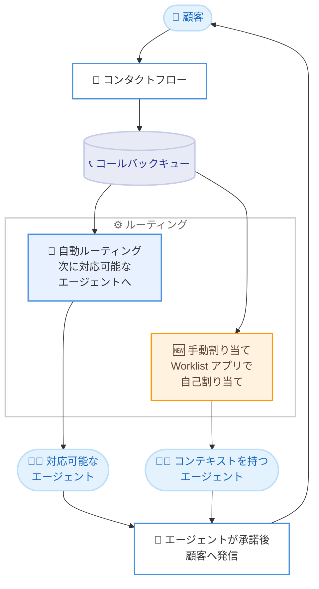

# Amazon Connect Customer - キュー内エージェントファーストコールバックの手動割り当て

**リリース日**: 2026 年 8 月 12 日
**サービス**: Amazon Connect Customer
**機能**: キュー内エージェントファーストコールバックの手動割り当て (Worklist アプリ)

📊 [このアップデートのインフォグラフィックを見る](https://takech9203.github.io/aws-news-summary/20260812-amazon-connect-agent-callbacks.html)

## 概要

Amazon Connect Customer は、エージェントがキュー内のエージェントファーストコールバックを Worklist アプリで表示し、自分自身に手動で割り当てられる機能を発表しました。これまで Worklist アプリで手動割り当てが可能だったのは E メール、タスク、チャットでしたが、今回のアップデートによりキュー内コールバックもその対象に加わりました。

この機能により、エージェントは事前のコンテキストを持っている顧客対応や、緊急のフォローアップが必要なコールバックを自ら選択して対応できます。たとえば、顧客の問題をすでに把握しているエージェントがそのコールバックを自分で引き受けることで、別のエージェントへの引き継ぎが不要になり、問題解決までの時間を短縮できます。

コンタクトセンターの管理者、スーパーバイザー、およびエージェントの生産性向上を目指す組織にとって、ルーティングの柔軟性を高める重要なアップデートです。

**アップデート前の課題**

このアップデート以前には、以下の課題が存在していました。

- キュー内のエージェントファーストコールバックは、次に対応可能になったエージェントへ自動的にルーティングされるのみで、特定のエージェントが自ら選択して対応することができなかった
- 以前の対応で顧客のコンテキストを持つエージェントがいても、コールバックが別のエージェントに割り当てられると、状況の再確認や引き継ぎが必要だった
- Worklist アプリでの手動割り当ては E メール、タスク、チャットに限定されており、コールバックは対象外だった

**アップデート後の改善**

今回のアップデートにより、以下が可能になりました。

- エージェントが Worklist アプリ上で、キュー内のエージェントファーストコールバックを E メール、タスク、チャットと並べて一覧表示できるようになった
- 事前のコンテキストを持つエージェントや、緊急対応が必要と判断したエージェントが、コールバックを自分自身に割り当てられるようになった
- 引き継ぎの削減により、顧客の問題解決までの時間が短縮された

## アーキテクチャ図



キュー内のエージェントファーストコールバックは、従来の自動ルーティングに加えて、Worklist アプリを通じた手動での自己割り当てが可能になりました。いずれの場合も、エージェントがコールバックを承諾した後に Amazon Connect Customer が顧客へ発信します。

## サービスアップデートの詳細

### 主要機能

1. **Worklist アプリでのコールバック表示**
   - キュー内のエージェントファーストコールバックを、E メール、タスク、チャットと同じ Worklist アプリ上で一覧表示できる
   - デフォルトでは過去 2 週間に作成されたコンタクトが表示され、Time Range フィルターにより過去 90 日以内の任意の期間を指定して表示できる
   - エージェントの権限に応じて、利用できるフィルターオプションが変化する

2. **コールバックの自己割り当て**
   - エージェントは、事前のコンテキストを持つコールバックや緊急対応が必要なコールバックを選択し、自分自身に割り当てられる
   - 引き継ぎが不要になるため、顧客の問題解決までの時間が短縮される

3. **セキュリティプロファイルによる権限制御**
   - **Allow 'Assign to me' for any contact**: 優先エージェントの設定にかかわらず、すべての対象コンタクトを表示して自己割り当てできる
   - **Allow 'Assign to me' for my contact**: 自分が優先エージェントに含まれるコンタクトのみ表示して自己割り当てできる

4. **ルーティングプロファイルによる対象範囲の指定**
   - 手動割り当ての対象とするキューとチャネルをルーティングプロファイルで指定できる
   - 管理者は自動ルーティングと手動割り当ての範囲を柔軟に設計できる

## 技術仕様

### エージェントファーストコールバックの動作

| 項目 | 詳細 |
|------|------|
| ダイヤルモード | エージェントファースト (デフォルト)。エージェントが CCP でコールバックを承諾した後に顧客へ発信 |
| キュー保持期間 | 対応可能なエージェントがいない場合、コールバックは作成から最大 7 日間キューに保持される |
| リトライ動作 | 顧客が応答しない場合、設定した最大リトライ回数まで再発信。ボイスメールに接続された場合は接続済みとして扱われる |
| Worklist の表示期間 | デフォルトで過去 2 週間。Time Range フィルターで過去 90 日以内の期間を指定可能 |
| キューサイズ制限 | キュー内コールバックはキューサイズ制限にカウントされる |

### 必要な権限

| 権限 | 表示対象 |
|------|----------|
| Allow 'Assign to me' for any contact | 優先エージェント未設定のコンタクトを含む、すべての対象コンタクト |
| Allow 'Assign to me' for my contact | 自分が優先エージェント (単独または複数のうちの 1 人) に設定されたコンタクトのみ |

## 設定方法

### 前提条件

1. Amazon Connect Customer インスタンスを利用していること
2. キュー内コールバック (エージェントファースト) のフローが設定済みであること
3. セキュリティプロファイルおよびルーティングプロファイルを変更できる管理者権限があること

### 手順

#### ステップ 1: セキュリティプロファイルの更新

Amazon Connect Customer の管理画面で、対象エージェントのセキュリティプロファイルに以下のいずれかの権限を付与します。

- **Allow 'Assign to me' for any contact**: すべての対象コンタクトの自己割り当てを許可
- **Allow 'Assign to me' for my contact**: 自分が優先エージェントのコンタクトのみ自己割り当てを許可

#### ステップ 2: ルーティングプロファイルの更新

ルーティングプロファイルの設定で、手動割り当ての対象とするキューとチャネルを新しいセクションで指定します。コールバック用のキューを対象に含めることで、エージェントが Worklist アプリからコールバックを自己割り当てできるようになります。

#### ステップ 3: Worklist アプリでの利用

セキュリティプロファイルとルーティングプロファイルの設定が完了すると、エージェントのワークスペースに Worklist アプリが表示されます。エージェントは一覧からキュー内コールバックを確認し、[Assign to me] 操作で自分に割り当てて対応を開始します。

## メリット

### ビジネス面

- **顧客体験の向上**: 顧客の状況を把握しているエージェントが直接対応することで、説明の繰り返しが不要になり、顧客満足度が向上する
- **解決時間の短縮**: エージェント間の引き継ぎが減少し、コールバック対応から問題解決までの時間が短縮される
- **緊急対応の柔軟性**: 緊急のフォローアップが必要な案件をエージェントが優先的に選択して対応できる

### 技術面

- **オムニチャネルの一元管理**: コールバック、E メール、タスク、チャットを単一の Worklist アプリで管理でき、エージェントの操作が統一される
- **きめ細かな権限制御**: セキュリティプロファイルの 2 種類の権限により、自己割り当ての範囲を組織のポリシーに合わせて制御できる
- **既存フローとの互換性**: 既存のキュー内コールバックのフロー設定を変更することなく、手動割り当てを追加できる

## デメリット・制約事項

### 制限事項

- Worklist アプリは Amazon Connect Customer のエージェントワークスペースで利用する機能であり、適切なセキュリティプロファイル権限とルーティングプロファイル設定が必要
- 対象はエージェントファーストモードのキュー内コールバックであり、ダイヤルモードの選択は Amazon Connect Customer インスタンスで利用可能
- キュー内コールバックは作成から最大 7 日間でキューから自動的に削除される

### 考慮すべき点

- エージェントによる選択的な自己割り当てを広く許可すると、対応しやすい案件が優先されるチェリーピッキングが発生する可能性があるため、権限設定と運用ルールの整備が必要
- 手動割り当てと自動ルーティングが併用されるため、キューの優先度設計やサービスレベルへの影響をスーパーバイザーがモニタリングすることが望ましい

## ユースケース

### ユースケース 1: 継続対応が必要な技術サポート

**シナリオ**: 顧客との通話中に調査が必要になり、調査完了後のコールバックを約束した。担当エージェントは問題の詳細をすでに把握している。

**実装例**:
```
1. セキュリティプロファイルで Allow 'Assign to me' for my contact を付与
2. フローで担当エージェントを優先エージェントに設定
3. エージェントは Worklist アプリで該当コールバックを確認し自己割り当て
```

**効果**: 顧客は同じエージェントから折り返しを受けられ、状況説明の繰り返しなしにスムーズに問題解決へ進める。

### ユースケース 2: 緊急案件の優先対応

**シナリオ**: 高優先度の顧客からのコールバック要求がキューに滞留しており、対応可能になったベテランエージェントが優先的に処理したい。

**実装例**:
```
1. セキュリティプロファイルで Allow 'Assign to me' for any contact を付与
2. ルーティングプロファイルでコールバックキューを手動割り当て対象に設定
3. エージェントは Worklist アプリのフィルターで対象キューを絞り込み、
   緊急案件を自己割り当て
```

**効果**: 自動ルーティングの順番を待たずに緊急案件へ対応でき、重要顧客への応答時間を短縮できる。

### ユースケース 3: オムニチャネルの統合ワークリスト運用

**シナリオ**: E メール、チャット、タスク、コールバックが混在するコンタクトセンターで、エージェントが自身のスキルとコンテキストに応じて作業を選択する運用を行いたい。

**実装例**:
```
1. ルーティングプロファイルで手動割り当て対象のキューとチャネルを定義
2. エージェントは Worklist アプリで全チャネルの作業を一覧表示
3. Time Range フィルターで過去 90 日以内の対象期間を指定して確認
```

**効果**: チャネルごとに異なるツールを行き来する必要がなくなり、エージェントの生産性と作業選択の最適化が実現する。

## 料金

この機能の利用に伴う追加料金は発表されていません。Amazon Connect Customer の標準料金 (音声通話の従量課金など) が適用されます。詳細は [Amazon Connect の料金ページ](https://aws.amazon.com/connect/pricing/) を参照してください。

## 利用可能リージョン

Amazon Connect Customer が利用可能なすべての AWS リージョンで利用できます。

## 関連サービス・機能

- **Worklist アプリ**: エージェントワークスペース内で E メール、タスク、チャット、コールバックの手動割り当てを行うアプリ。今回のアップデートでコールバックが対象に追加された
- **キュー内コールバック**: 顧客が通話を待たずにキュー内の順番を維持し、エージェントから折り返しを受けられる機能。エージェントファーストとカスタマーファーストの 2 つのダイヤルモードがある
- **セキュリティプロファイル / ルーティングプロファイル**: 自己割り当ての権限と対象キュー・チャネルを制御する Amazon Connect Customer の設定

## 参考リンク

- 📊 [インフォグラフィック](https://takech9203.github.io/aws-news-summary/20260812-amazon-connect-agent-callbacks.html)
- [公式発表 (What's New)](https://aws.amazon.com/about-aws/whats-new/2026/08/amazon-connect-agent-callbacks/)
- [ドキュメント: Worklist アプリへのアクセス](https://docs.aws.amazon.com/connect/latest/adminguide/worklist-app.html)
- [ドキュメント: キュー内コールバックの設定](https://docs.aws.amazon.com/connect/latest/adminguide/setup-queued-cb.html)
- [Amazon Connect 製品ページ](https://aws.amazon.com/connect/)
- [料金ページ](https://aws.amazon.com/connect/pricing/)

## まとめ

Amazon Connect Customer の Worklist アプリでキュー内エージェントファーストコールバックの手動割り当てが可能になり、コンテキストを持つエージェントによる直接対応や緊急案件の優先処理が実現しました。エージェントの引き継ぎ削減と顧客の問題解決時間の短縮につながる実用的なアップデートです。キュー内コールバックを利用中の組織は、セキュリティプロファイルとルーティングプロファイルの設定を見直し、この機能の導入を検討することを推奨します。
