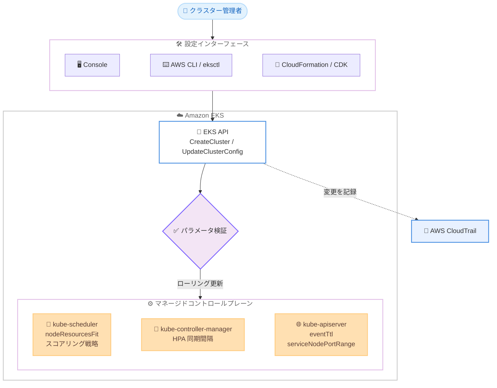

# Amazon EKS - Kubernetes コントロールプレーンの高度な設定パラメータのサポート

**リリース日**: 2026 年 8 月 12 日
**サービス**: Amazon Elastic Kubernetes Service (Amazon EKS)
**機能**: Advanced Kubernetes control plane configuration (高度な Kubernetes コントロールプレーン設定)

📊 [このアップデートのインフォグラフィックを見る](https://takech9203.github.io/aws-news-summary/20260812-amazon-eks-control-plane-configuration-parameters.html)

## 概要

Amazon EKS が、Kubernetes コントロールプレーンコンポーネント (スケジューラー、コントローラーマネージャー、API サーバー) の設定パラメータのカスタマイズをサポートしました。これまで EKS はこれらのコンポーネントをアップストリーム Kubernetes のデフォルト設定で運用しており、ユーザーが変更することはできませんでしたが、今回のアップデートにより、ワークロードの特性に合わせてコントロールプレーンの動作を調整できるようになりました。

設定できるパラメータには、スケジューラーのノードリソース適合戦略 (`MostAllocated` / `LeastAllocated`)、Horizontal Pod Autoscaler (HPA) の同期間隔、Kubernetes イベントの保持期間、Service の NodePort 範囲が含まれます。例えば `MostAllocated` 戦略を設定すると、すでに使用率の高いノードに Pod を集約配置するため、同じワークロードをより少ないノードで実行でき、コンピューティングコストの削減につながります。

設定は既存の `CreateCluster` / `UpdateClusterConfig` API の新しいパラメータとして提供され、AWS Management Console、AWS CLI、eksctl、AWS SDK、AWS CloudFormation、AWS CDK から利用できます。コンテナプラットフォームを運用するインフラチームや、大規模バッチ、AI ワークロード、CI/CD パイプラインなどイベント生成量の多いクラスターを運用するユーザーに特に有用なアップデートです。

**アップデート前の課題**

- 以前は EKS のコントロールプレーンコンポーネントは固定のデフォルト設定で動作しており、ユーザーが調整できなかった
- スケジューラーはデフォルトの `LeastAllocated` 戦略で Pod をノード間に分散配置するため、ノード集約によるコスト最適化ができなかった
- イベント保持期間 (60 分) を短縮できず、高チャーンなワークロードではクラスターデータベース (etcd) の肥大化や API サーバーの負荷増大を招いていた
- 移行元のアプリケーションが NodePort のデフォルト範囲 (30000-32767) 外の固定ポートを前提としている場合、アプリケーション改修やプロキシの追加が必要だった

**アップデート後の改善**

- スケジューラーのスコアリング戦略を `MostAllocated` に変更し、Pod を少数のノードに集約してコンピューティングコストを削減できるようになった
- HPA の同期間隔を短縮 (最短 10 秒) し、需要変化に対するオートスケーリングの応答性を高められるようになった
- イベント保持期間を最短 10 分まで短縮し、etcd のストレージ圧迫を軽減し、イベント関連クエリの API サーバー応答を改善できるようになった
- NodePort 範囲を 10260 から 32767 の間で調整でき、既存の firewall ポリシーや移行対象アプリケーションのポート要件に合わせられるようになった

## アーキテクチャ図



クラスター管理者が Console、CLI、IaC ツールから EKS API 経由でコントロールプレーンパラメータを設定すると、EKS が値を検証したうえでコントロールプレーンにローリング更新で適用し、変更内容を CloudTrail に記録する流れを示しています。

## サービスアップデートの詳細

### 主要機能

1. **スケジューラーのノードリソース適合戦略 (`kubeSchedulerConfig`)**
   - `nodeResourcesFit.scoringStrategy.type` で `LeastAllocated` (デフォルト) または `MostAllocated` を選択可能
   - `MostAllocated` はリソース割り当て率の高いノードを優先し、Pod を少数のノードに集約。統合 (consolidation) に対応したノードプールと組み合わせることで、低使用率ノードの削除を促進
   - `resources` 配列で `cpu`、`memory`、`nvidia.com/gpu`、`aws.amazon.com/neuron`、`aws.amazon.com/neuroncore` に 1 から 100 の相対的な重みを設定可能。GPU が希少リソースのクラスターで GPU を重視したスコアリングが可能
   - アップストリームの `RequestedToCapacityRatio` 戦略はサポート対象外

2. **HPA 同期間隔 (`kubeControllerManagerConfig`)**
   - `horizontalPodAutoscalerControllerConfig.horizontalPodAutoscalerSyncPeriod` を 10 秒から 15 秒の範囲で設定可能 (デフォルト: 15 秒)
   - 間隔を短縮すると、負荷増加後より早くスケーリング判断が行われ、オートスケーリングの応答性が向上
   - このパラメータの設定には Amazon EKS Provisioned Control Plane が必須

3. **イベント保持期間 (`kubeApiServerConfig`)**
   - `eventTtl` を 10 分から 60 分の範囲で設定可能 (デフォルト: 60 分)
   - 短縮により etcd のストレージ圧迫を軽減し、イベントの多いクエリに対する API サーバーの応答時間を改善
   - 変更は新規イベントにのみ適用され、既存イベントは作成時の保持期間で失効

4. **Service NodePort 範囲 (`kubeApiServerConfig`)**
   - `serviceNodePortRange` の `minPort` / `maxPort` を 10260 から 32767 の範囲で設定可能 (デフォルト: 30000-32767)
   - 組織のネットワーク / ファイアウォールポリシーとの整合や、固定ポートを前提とするアプリケーションの EKS 移行を容易化
   - 下限 10260 は kubelet ヘルスポート (10248) や kube-proxy ヘルスチェックポート (10256) との競合を回避し、上限 32767 は Linux エフェメラルポート範囲 (32768 以降) との競合を回避

## 技術仕様

### サポートされるパラメータ一覧

| コンポーネント | パラメータ | サポート値 | デフォルト | Provisioned Control Plane 必須 |
|------|------|------|------|------|
| kube-scheduler | `nodeResourcesFit.scoringStrategy` | `LeastAllocated`, `MostAllocated` | `LeastAllocated` (cpu: 1, memory: 1) | 不要 |
| kube-controller-manager | `horizontalPodAutoscalerSyncPeriod` | `10s` から `15s` | `15s` | 必要 |
| kube-apiserver | `eventTtl` | `10m` から `60m` | `60m` | 不要 |
| kube-apiserver | `serviceNodePortRange` | `minPort` / `maxPort`: 10260 から 32767 | `minPort: 30000`, `maxPort: 32767` | 不要 |

デフォルト値とサポート値は Kubernetes バージョンによって変わる可能性があるため、`DescribeClusterVersions` API を信頼できる情報源として使用することが推奨されています。

### API変更履歴

| 日付 | サービス | 変更内容 |
|------|----------|----------|
| 2026/08/11 | [eks](https://awsapichanges.com/archive/changes/88995d-eks.html) | 17 updated api methods - Kubernetes コントロールプレーンコンポーネントの設定を選択的に調整する機能の追加。`CreateCluster` / `UpdateClusterConfig` などに `KubeSchedulerConfig`、`KubeControllerManagerConfig`、`KubeApiServerConfig` 型と `ControlPlaneComponentConfigUpdate` 更新タイプが追加 |

### 設定例 (UpdateClusterConfig)

```json
{
  "nodeResourcesFit": {
    "scoringStrategy": {
      "type": "MostAllocated",
      "resources": [
        { "name": "nvidia.com/gpu", "weight": 100 },
        { "name": "cpu", "weight": 1 },
        { "name": "memory", "weight": 1 }
      ]
    }
  }
}
```

## 設定方法

### 前提条件

1. Kubernetes バージョン 1.31 以降を実行する Amazon EKS クラスター (新規・既存どちらも対象)
2. AWS CLI のインストールと設定
3. EKS クラスターの記述・更新権限を持つ IAM プリンシパル
4. `horizontalPodAutoscalerSyncPeriod` を設定する場合は Amazon EKS Provisioned Control Plane の利用

### 手順

#### ステップ1: 対象バージョンのデフォルト値とサポート値を確認する

```bash
aws eks describe-cluster-versions --cluster-versions 1.35 \
  --query 'clusterVersions[0].controlPlaneComponentConfig'
```

`DescribeClusterVersions` API で、指定した Kubernetes バージョンにおける各コントロールプレーンパラメータのデフォルト値 (`defaultValue`) と制約 (`constraints`) を取得しています。バージョンごとに値が異なる可能性があるため、自動化や複数バージョン管理ではこの出力を情報源とします。

#### ステップ2: スケジューラーのスコアリング戦略を変更する

```bash
aws eks update-cluster-config \
  --name my-eks-cluster \
  --kube-scheduler-config '{
    "nodeResourcesFit": {
      "scoringStrategy": {
        "type": "MostAllocated"
      }
    }
  }'
```

`update-cluster-config` の新しい `--kube-scheduler-config` パラメータで、スコアリング戦略を `MostAllocated` に変更しています。同様に `--kube-api-server-config` や `--kube-controller-manager-config` を同一コマンド内で併用して複数コンポーネントを一括更新できます。更新はマージ方式のため、指定しなかったフィールドは現在の値を維持します。

#### ステップ3: 更新の完了を待機し、設定を確認する

```bash
# ローリング更新の完了を待機
aws eks wait cluster-active --name my-eks-cluster

# 適用された設定を確認
aws eks describe-cluster --name my-eks-cluster \
  --query 'cluster.kubeSchedulerConfig'
```

設定変更はコントロールプレーンのローリング更新として数分かけて適用されるため、`wait cluster-active` で完了を待機しています。`describe-cluster` はカスタマイズしていないパラメータのデフォルト値も含め、コントロールプレーンで実行中の完全な設定を返します。更新状況の詳細は `aws eks describe-update` でも追跡できます。

## メリット

### ビジネス面

- **コンピューティングコストの削減**: `MostAllocated` 戦略により Pod を少数のノードに集約し、同じワークロードをより少ないノード数で実行できるため、コンピューティング費用を削減できる
- **移行工数の削減**: NodePort 範囲を移行対象アプリケーションの固定ポートに合わせることで、アプリケーション改修やプロキシ追加なしで EKS へ移行できる
- **追加料金なし**: コントロールプレーンパラメータの設定自体に追加料金は発生しない

### 技術面

- **マネージドの利点を維持した調整**: セルフマネージド Kubernetes に移行することなく、EKS の可用性・性能特性を維持したままコントロールプレーンの動作を調整できる
- **オートスケーリングの応答性向上**: HPA 同期間隔の短縮により、需要スパイクへのスケールアウトがより迅速になる
- **etcd と API サーバーの負荷軽減**: イベント保持期間の短縮により、高チャーンワークロードでのクラスターデータベース肥大化と list 操作の負荷を抑制できる
- **安全な運用**: EKS が各パラメータを検証済みレンジ内に制約し、変更は CloudTrail に記録されるため、監査性が確保される

## デメリット・制約事項

### 制限事項

- パラメータはクラスター全体に適用され、Namespace やワークロード単位でのスコープ指定はできない
- `horizontalPodAutoscalerSyncPeriod` の設定には Provisioned Control Plane が必須で、デフォルト以外の値のままでは Standard モードに戻せない (デフォルトの `15s` に戻してから変更する必要がある)
- スケジューラーのスコアリング戦略はアップストリームの `RequestedToCapacityRatio` をサポートしない
- 専用のリセット操作はなく、デフォルトに戻すにはデフォルト値を明示的に設定する必要がある
- 起動時点では ACK (AWS Controllers for Kubernetes) と Terraform は未対応 (対応予定)
- Kubernetes バージョン 1.31 以降のクラスターでのみ利用可能

### 考慮すべき点

- `MostAllocated` は障害の影響範囲 (blast radius) を集中させる。ノード障害やアベイラビリティーゾーン障害の際に、より多くの Pod が同時に影響を受ける可能性がある
- スコアリング戦略の変更は今後のスケジューリング判断にのみ影響し、実行中の Pod は移動されない。再配置には Pod の退避や再起動が必要
- HPA 同期間隔の短縮は、コントロールプレーンが期限内に処理できる HPA オブジェクト数を約 3 分の 1 減少させる。EKS はオブジェクト数の検証を行わず、超過時はアラートなしにオートスケーリングが遅延するため、事前に `kubectl get hpa --all-namespaces` で数を確認する必要がある
- イベント保持期間の短縮はデバッグ可能なイベント履歴の窓を狭める。外部システムでイベントを永続化していることを確認してから変更する
- 設定変更はローリング更新で適用されるため、反映まで数分を要する
- 本番適用前に非本番クラスターでの動作検証が推奨されている

## ユースケース

### ユースケース1: ノード集約によるコンピューティングコストの最適化

**シナリオ**: Karpenter や EKS Auto Mode の consolidation を利用しているクラスターで、Pod がノード間に分散しすぎており、低使用率のノードが多数残ってしまいコストが最適化できていない。

**実装例**:
```bash
aws eks update-cluster-config \
  --name production-cluster \
  --kube-scheduler-config '{"nodeResourcesFit":{"scoringStrategy":{"type":"MostAllocated"}}}'
```

**効果**: 新規 Pod が使用率の高いノードへ優先的に配置され、低使用率ノードには新しいワークロードが配置されなくなるため、consolidation によるノード削除が進み、コンピューティングコストを削減できる。

### ユースケース2: GPU クラスターにおけるアクセラレータ優先のスケジューリング

**シナリオ**: AI / ML ワークロードを実行するクラスターで GPU が最も希少なリソースであり、GPU リクエストを持つ Pod を GPU ノードに効率的に集約したい。

**実装例**:
```bash
aws eks update-cluster-config \
  --name gpu-cluster \
  --kube-scheduler-config '{
    "nodeResourcesFit": {
      "scoringStrategy": {
        "type": "MostAllocated",
        "resources": [
          {"name": "nvidia.com/gpu", "weight": 100},
          {"name": "cpu", "weight": 1},
          {"name": "memory", "weight": 1}
        ]
      }
    }
  }'
```

**効果**: GPU をリクエストする Pod が、すでに部分的に使用されている GPU ノードへ集約され、GPU の断片化を抑えて高価なアクセラレータリソースの使用率を最大化できる。

### ユースケース3: 高チャーンワークロードにおける etcd ストレージの最適化

**シナリオ**: 大規模バッチジョブ、CI/CD パイプライン、頻繁な CronJob を実行するクラスターで大量の Kubernetes イベントが生成され、クラスターデータベースのストレージが上限に近づいている。イベントは外部の監視システムに永続化済み。

**実装例**:
```bash
aws eks update-cluster-config \
  --name batch-cluster \
  --kube-api-server-config '{"eventTtl":"10m"}'
```

**効果**: 短命な診断データが早期に削除され、etcd のストレージ圧迫が軽減されるとともに、イベントの多いクエリに対する API サーバーの応答時間が改善される。

## 料金

コントロールプレーンパラメータの設定自体に追加料金はありません。

ただし、`horizontalPodAutoscalerSyncPeriod` の設定には Amazon EKS Provisioned Control Plane が必要で、選択したスケーリングティアの時間単位料金が発生します。詳細は [Amazon EKS 料金ページ](https://aws.amazon.com/eks/pricing/) を参照してください。

## 利用可能リージョン

Amazon EKS が利用可能なすべての AWS 商用リージョン、AWS GovCloud (US) リージョン、および中国リージョンで利用できます。

Kubernetes バージョン 1.31 以降を実行する新規および既存のクラスターでサポートされます。

## 関連サービス・機能

- **Amazon EKS Provisioned Control Plane**: コントロールプレーン容量を事前割り当てするモード。HPA 同期間隔の短縮に必須で、追加の API 負荷を吸収できるサイジングが提供される
- **Karpenter / EKS Auto Mode**: ノードのプロビジョニングと consolidation を担う。`MostAllocated` 戦略と組み合わせることでノード集約によるコスト削減効果が高まる (ただしスケジューラー設定はノード管理の動作自体を変更しない点に注意)
- **AWS CloudTrail**: コントロールプレーン設定の変更履歴を記録し、監査を可能にする
- **AWS CloudFormation / AWS CDK / eksctl**: 起動時点からコントロールプレーン設定の IaC 管理に対応

## 参考リンク

- 📊 [インフォグラフィック](https://takech9203.github.io/aws-news-summary/20260812-amazon-eks-control-plane-configuration-parameters.html)
- [公式発表 (What's New)](https://aws.amazon.com/about-aws/whats-new/2026/08/amazon-eks-control-plane-configuration-parameters)
- [ドキュメント: Advanced Kubernetes control plane configuration](https://docs.aws.amazon.com/eks/latest/userguide/control-plane-configuration.html)
- [ドキュメント: Configure advanced Kubernetes control plane parameters](https://docs.aws.amazon.com/eks/latest/userguide/control-plane-configuration-getting-started.html)
- [API 変更履歴 (awsapichanges.com)](https://awsapichanges.com/archive/changes/88995d-eks.html)
- [料金ページ](https://aws.amazon.com/eks/pricing/)

## まとめ

Amazon EKS のマネージドコントロールプレーンで、スケジューラーのスコアリング戦略、HPA 同期間隔、イベント保持期間、NodePort 範囲を調整できるようになり、マネージドサービスの利便性を保ちながらワークロード特性に合わせた最適化が可能になりました。特に `MostAllocated` 戦略と Karpenter などの consolidation の組み合わせはノード数削減による直接的なコスト削減が期待できます。いずれもクラスター全体に影響する高度な設定のため、まず非本番クラスターで動作を検証し、`DescribeClusterVersions` で対象バージョンのサポート値を確認したうえで適用することを推奨します。
