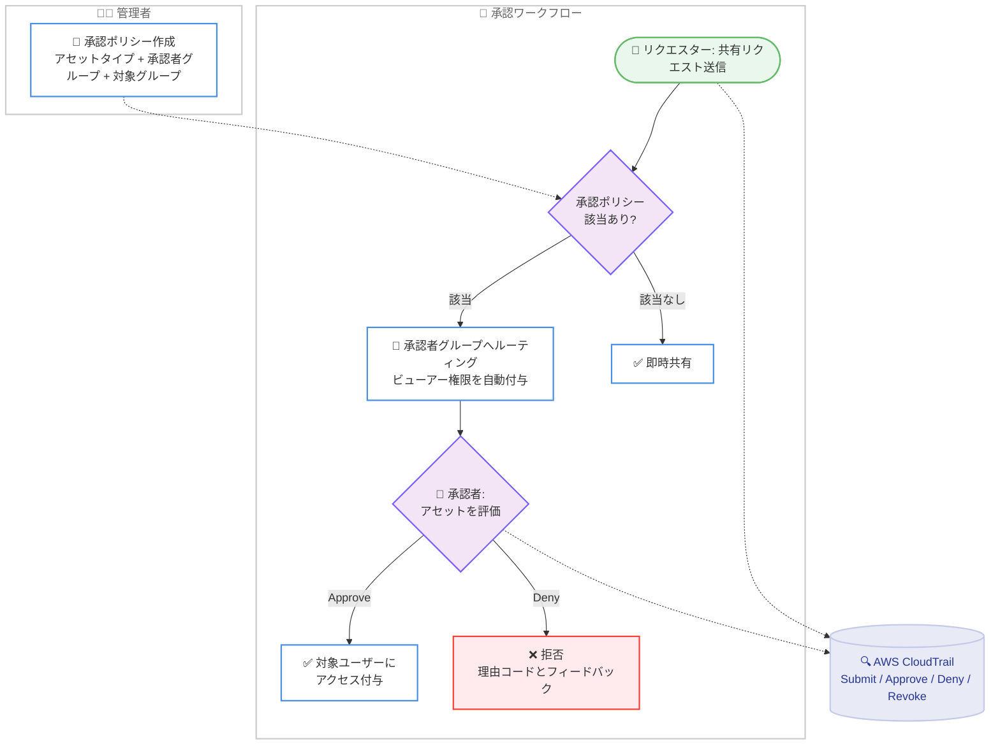

# Amazon Quick - 共有に対する承認ポリシーのサポート

**リリース日**: 2026年8月12日
**サービス**: Amazon Quick
**機能**: 承認ポリシー (Approval Policies) による共有ガバナンス

📊 [このアップデートのインフォグラフィックを見る](https://takech9203.github.io/aws-news-summary/20260812-amazon-quick-approval-policies-sharing.html)

## 概要

Amazon Quick が承認ポリシー (Approval Policies) をサポートし、組織内でのアセット共有方法に対するガバナンス制御を管理者に提供するようになりました。承認ポリシーを使用すると、共有リクエストに対して指定された承認者グループによるレビューと承認を必須化でき、アクセス権が付与される前に信頼できるレビュアーが共有の妥当性を検証できます。これにより、機密性の高いアセットの共有が意図的、コンプライアンス準拠、かつ監査可能であることを組織として担保できます。

管理者は、ナレッジベース、スペース、カスタムチャットエージェントといった特定のアセットタイプにスコープを絞った承認ポリシーを作成できます。ポリシーの対象となるアセットの共有リクエストをユーザーが送信すると、リクエストは割り当てられた承認者グループにルーティングされます。承認者はリクエストを承認または拒否する前にアセットを直接評価でき、すべてのワークフローイベントは AWS CloudTrail に記録されるため、完全な監査証跡が確保されます。カスタムチャットエージェントについては、エージェントとその依存関係 (ナレッジベース、コネクタ、スペース) をパッケージとして 1 つのリクエストでまとめてレビュー・承認できます。

本機能は Professional および Enterprise プランで利用可能で、Amazon Quick のエージェンティック機能がサポートされているすべての AWS リージョンで提供されます。

**アップデート前の課題**

- 共有アクションは即時に反映され、機密アセットへのアクセス付与前に第三者がレビューする仕組みがなかった
- 機密性の高いナレッジベースやカスタムチャットエージェントが、管理者の確認なしに組織内へ共有されるリスクがあった
- 共有の意思決定プロセスを監査可能な形で記録・証明する標準的な手段がなかった

**アップデート後の改善**

- 指定した承認者グループによるレビューと承認を経てからアクセスが付与されるワークフローを必須化できるようになった
- アセットタイプ (ナレッジベース、スペース、カスタムチャットエージェント) と対象ユーザーグループにスコープを絞ったポリシー設計が可能になった
- Submit、Approve、Deny、Revoke のすべてのワークフローイベントが AWS CloudTrail に記録され、完全な監査が可能になった
- カスタムチャットエージェントでは、依存関係パッケージ全体を単一リクエストでレビュー・承認できるようになった

## アーキテクチャ図



管理者が作成した承認ポリシーに該当する共有リクエストは承認者グループへルーティングされ、承認されるまで対象ユーザーにアクセスは付与されません。すべてのイベントは AWS CloudTrail に記録されます。

## サービスアップデートの詳細

### 主要機能

1. **アセットタイプ単位の承認ポリシー**
   - ナレッジベース、スペース、カスタムチャットエージェントの 3 種類のアセットタイプを対象にポリシーを作成可能
   - ポリシーはオプトイン方式で、管理者がポリシーを作成・有効化しない限り承認は不要
   - ポリシー名、説明、対象アセットタイプ、承認者グループ、適用対象のユーザーグループを指定して作成
   - 承認者グループには IAM Identity Center、IAM フェデレーション、Active Directory の既存アイデンティティグループを使用可能

2. **承認ワークフロー (リクエスター / 承認者)**
   - 新規ユーザーの追加やアクセス権のアップグレード (例: Viewer から Owner) は承認が必要、ダウングレードや削除は即時反映
   - リクエスト送信時に、ノート (必須)、重要度 (任意)、承認期限 (必須) を指定
   - 承認者はリクエストをクレーム (担当割り当て) した上で Approve / Deny を実行
   - 承認者にはアセットタイプに応じたレビュー用アクセスが付与される。エージェントは実行アクセス (作成者コンテキストで実行され、承認者は基盤データソースへ直接アクセスしない)、スペースとナレッジベースは読み取りアクセス
   - 拒否時はリクエスターに理由コードと書面フィードバックが返され、修正して再送信可能

3. **カスタムチャットエージェントのパッケージ共有**
   - エージェントとその依存関係 (ナレッジベース、コネクタ、スペース) を単一のパッケージ共有リクエストとして送信可能
   - オールオアナッシング方式の承認で、承認時はエージェントとすべての依存関係へのアクセスが付与され、拒否時はいずれのコンポーネントへのアクセスも付与されない
   - 承認者は判断前にアセットページで依存関係の完全なリストを確認可能

4. **AWS CloudTrail による完全な監査**
   - Submit、Approve、Deny、Revoke のすべての承認イベントを CloudTrail に記録
   - ユーザー、アセット、タイムスタンプ、ノートを含む監査証跡を取得可能

## 技術仕様

### 承認ワークフローの仕様

| 項目 | 詳細 |
|------|------|
| 対象アセットタイプ | ナレッジベース、スペース、カスタムチャットエージェント |
| 対象アクション | 共有 (新規追加、アクセス権アップグレード) |
| 承認不要のアクション | アクセス権のダウングレード、アクセス削除 (即時反映) |
| 承認者グループのソース | IAM Identity Center、IAM フェデレーション、Active Directory |
| リクエストの状態 | Pending、Closed - Approved、Closed - Denied |
| リクエスト管理 UI | My stuff の My Tasks ウィジェット (Submitted By Me / Assigned To Me) |
| 監査 | AWS CloudTrail (Submit / Approve / Deny / Revoke) |
| 対応エディション | Quick Enterprise エディション (Professional / Enterprise ユーザーサブスクリプション) |

### API変更履歴

| 日付 | サービス | 変更内容 |
|------|----------|----------|
| 2026/08/12 | [Amazon QuickSight](https://awsapichanges.com/archive/changes/144a68-quicksight.html) | 16 new 4 updated api methods - 承認ワークフロー (CreateApprovalPolicy、DescribeApprovalPolicy、UpdateApprovalPolicy、DeleteApprovalPolicy、ListApprovalPolicies)、Microsoft Purview DLP、制限管理の API を追加 |

同日の API 更新には、本機能に対応する承認ポリシーの CRUD API (作成、参照、更新、削除、一覧) が含まれており、プログラムからのポリシー管理が可能です。

## 設定方法

### 前提条件

1. Amazon Quick Enterprise エディションを利用していること (Professional / Enterprise ユーザーサブスクリプション)
2. 管理者権限で Quick のアカウント管理コンソールにアクセスできること
3. 承認者グループとして使用する IAM Identity Center、IAM フェデレーション、または Active Directory のアイデンティティグループが存在すること

### 手順

#### ステップ1: 承認ポリシー管理画面への移動

```text
1. 管理者として Quick にサインイン
2. アカウント名を選択し、[Manage Account] を選択
3. 左ナビゲーションペインで [Approval Policies] を選択
```

アカウント管理コンソールの承認ポリシーセクションに移動します。ここでポリシーの作成・編集・削除を行います。

#### ステップ2: 承認ポリシーの作成

```text
1. [Create Policy] を選択
2. ポリシー名と説明 (任意) を入力
3. ポリシーを適用するアセットタイプを選択
4. 1 つ以上の承認者グループを選択
5. [Assign Policy] で、共有時に承認ワークフローを必須とするユーザーグループを選択
6. [Create Policy] を選択
```

ポリシー作成後、対象ユーザーグループのメンバーが該当アセットタイプを共有する際に承認ワークフローが適用されます。

#### ステップ3: 共有リクエストの送信 (リクエスター)

```text
1. 共有したいアセットを選択し [Share] を選択
2. ユーザーまたはグループを追加、あるいは既存のロールを変更
3. 承認リクエストフォームでノート (必須)、重要度 (任意)、承認期限 (必須) を入力
4. [Send Request] を選択
```

リクエスト送信後、承認者グループにレビュー用のビューアーレベルアクセスが付与され、リクエストは Pending 状態になります。対象ユーザーは承認されるまでアクセスできません。

#### ステップ4: リクエストのレビュー (承認者)

```text
1. [My stuff] から [My Tasks] を選択
2. [All] または [Assigned To Me] でリクエストを確認
3. [Claim Request] でリクエストを担当に割り当て
4. アセットをレビューし、[Approve] または [Deny] を選択
```

承認するとターゲットユーザーにアクセスが付与され、拒否するとリクエスターに理由コードとフィードバックが返されます。

## メリット

### ビジネス面

- **コンプライアンス強化**: 機密アセットの共有前に人によるレビューを必須化することで、組織のガバナンス要件や規制要件への準拠を支援
- **監査対応の効率化**: すべての承認イベントが CloudTrail に記録されるため、監査時に共有の意思決定プロセスを証明可能
- **意図しない情報漏洩の防止**: 承認者による事前チェックにより、機密ナレッジベースやエージェントへの不用意なアクセス付与を防止

### 技術面

- **柔軟なスコープ設計**: アセットタイプと対象ユーザーグループの組み合わせで、必要な範囲だけに承認を適用可能
- **既存アイデンティティ基盤との統合**: IAM Identity Center、IAM フェデレーション、Active Directory の既存グループをそのまま承認者グループに利用可能
- **依存関係を含む一括承認**: カスタムチャットエージェントの依存関係パッケージ全体を単一リクエストで処理でき、承認漏れによる動作不全を防止
- **API による自動化**: CreateApprovalPolicy などの API でポリシー管理をコード化 (IaC) 可能

## デメリット・制約事項

### 制限事項

- 現時点で承認ワークフローが対応するのは共有アクションのみ
- 対象アセットタイプはナレッジベース、スペース、カスタムチャットエージェントの 3 種類
- Quick Enterprise エディションでのみ利用可能
- アクセス権のダウングレードと削除は承認なしで即時反映される (承認対象は追加とアップグレードのみ)

### 考慮すべき点

- リクエスト送信時に承認者グループへ自動付与されるビューアーレベルアクセスは、承認/拒否後も自動では削除されず、アセット所有者が手動で削除する必要がある
- ポリシーを削除しても処理中の Pending リクエストは完了まで継続する (新規リクエストは承認不要になる)
- 承認プロセスの導入により共有のリードタイムが発生するため、承認者グループの体制とレスポンス目標を事前に整備しておく必要がある

## ユースケース

### ユースケース1: 機密ナレッジベースの共有統制

**シナリオ**: 金融機関で、顧客情報や社内規程を含むナレッジベースへのアクセス付与を、情報セキュリティ部門のレビュー後にのみ許可したい。

**実装例**:
```text
ポリシー名: sensitive-kb-sharing-policy
アセットタイプ: ナレッジベース
承認者グループ: infosec-reviewers (IAM Identity Center グループ)
適用対象: all-employees グループ
```

**効果**: ナレッジベースの共有リクエストがすべて情報セキュリティ部門にルーティングされ、内容確認後にのみアクセスが付与される。CloudTrail の記録により監査要件にも対応。

### ユースケース2: カスタムチャットエージェントの部門展開

**シナリオ**: 開発部門が作成したカスタムチャットエージェントを営業部門へ展開する際、エージェントが参照するナレッジベースやコネクタを含めて一括でレビューしたい。

**実装例**:
```text
ポリシー名: agent-package-sharing-policy
アセットタイプ: カスタムチャットエージェント
承認者グループ: ai-governance-team
共有方法: パッケージ共有リクエスト (エージェント + 依存関係)
```

**効果**: 承認者は依存関係の完全なリストを確認した上でオールオアナッシングで判断でき、承認漏れによるエージェントの動作不全や意図しないデータアクセスを防止できる。

### ユースケース3: プロジェクトスペースのアクセス権昇格管理

**シナリオ**: 全社利用の Quick 環境で、プロジェクトスペースの Owner 権限付与をプロジェクト管理オフィス (PMO) の承認制にしたい。

**実装例**:
```text
ポリシー名: space-owner-escalation-policy
アセットタイプ: スペース
承認者グループ: pmo-approvers
運用: Viewer から Owner へのアップグレードリクエストに重要度と承認期限を設定
```

**効果**: 権限昇格が PMO のレビューを経由するため、スペースの管理権限が無秩序に拡散することを防止。ダウングレードや削除は即時反映のため、権限縮小の運用は阻害されない。

## 料金

承認ポリシー機能自体に追加料金はありません。Amazon Quick の Professional および Enterprise プランのサブスクリプション料金内で利用できます。料金の詳細は [Amazon Quick の料金ページ](https://aws.amazon.com/quick/pricing/) を参照してください。

## 利用可能リージョン

Amazon Quick のエージェンティック機能がサポートされているすべての AWS リージョンで利用可能です。2026 年 8 月時点では以下の 8 リージョンでエージェンティック機能が提供されています。

- 米国東部 (バージニア北部)
- 米国西部 (オレゴン)
- 欧州 (フランクフルト)
- 欧州 (アイルランド)
- 欧州 (ロンドン)
- アジアパシフィック (シドニー)
- アジアパシフィック (東京)
- AWS GovCloud (米国西部)

最新のリージョン情報は [AWS リージョン表](https://aws.amazon.com/about-aws/global-infrastructure/regional-product-services/) を参照してください。

## 関連サービス・機能

- **AWS CloudTrail**: 承認ワークフローのすべてのイベント (Submit / Approve / Deny / Revoke) を記録し、監査証跡を提供
- **IAM Identity Center / IAM フェデレーション / Active Directory**: 承認者グループおよび適用対象グループのアイデンティティソースとして利用
- **Amazon Quick DLP (Microsoft Purview 連携)**: 同日発表されたデータ損失防止機能。承認ポリシーと組み合わせることで、共有ガバナンスとコンテンツガバナンスの両面を強化
- **Amazon Quick カスタム権限 (Deny by Default)**: 同日発表された新 AI 機能のデフォルト拒否設定。承認ポリシーとあわせて多層的なガバナンスを構成可能

## 参考リンク

- 📊 [インフォグラフィック](https://takech9203.github.io/aws-news-summary/20260812-amazon-quick-approval-policies-sharing.html)
- [公式発表 (What's New)](https://aws.amazon.com/whats-new/2026/08/amazon-quick-approval-policies-sharing/)
- [ドキュメント: Approval workflows - Amazon Quick User Guide](https://docs.aws.amazon.com/quick/latest/userguide/approval-workflows.html)
- [Amazon Quick 製品ページ](https://aws.amazon.com/quick/)
- [API 変更履歴 (awsapichanges.com)](https://awsapichanges.com/archive/changes/144a68-quicksight.html)

## まとめ

Amazon Quick の承認ポリシーにより、ナレッジベース、スペース、カスタムチャットエージェントの共有に対して承認者グループによる事前レビューを必須化でき、CloudTrail による完全な監査証跡と組み合わせて組織のガバナンス要件に対応できます。機密データを扱う Quick 環境を運用している場合は、同日発表の Microsoft Purview DLP 連携や Deny by Default とあわせて、まず機密性の高いアセットタイプから承認ポリシーの適用を検討することを推奨します。
